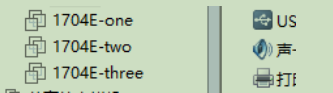
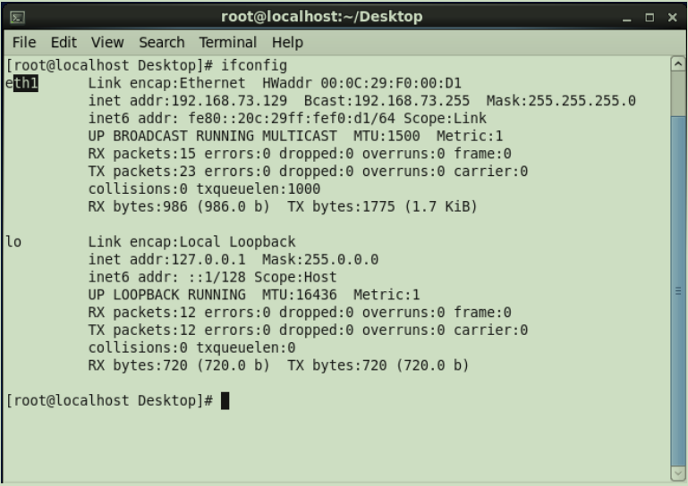
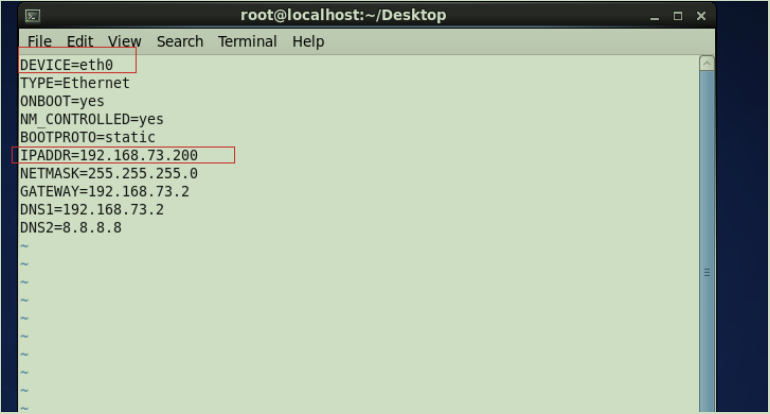
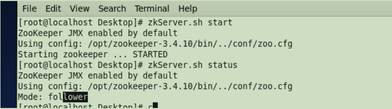
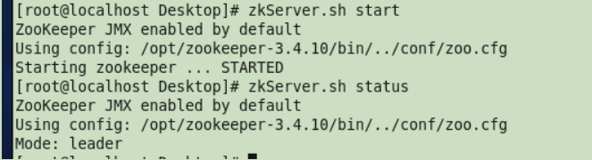
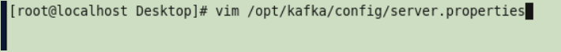
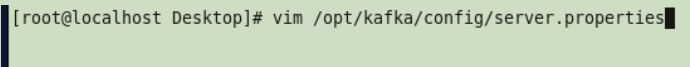

# 第十单元 Kafka集群部署

# 【授课重点】

1. 环境准备(集群规划、jar包下载、虚拟机准备、安装jdk、安装zookeeper）
2. Kafka集群部署
3. Kafka命令行操作
4. Kafka 配置信息

# 【考核要求】

1. 掌握Kafka集群的搭建和部署
2. 掌握Kafka集群的使用

# 【教学内容】

## 10.1 课程导入

 Kafka提供了类似于JMS的特性，但是在设计实现上完全不同，此外它并不是JMS规范的实现。kafka对消息保存时根据Topic进行归类，发送消息者成为Producer，消息接受者成为Consumer，此外kafka集群有多个kafka实例组成，每个实例(server)成为broker。无论是kafka集群，还是producer和consumer都依赖于zookeeper来保证系统可用性集群保存一些meta信息。本节课主要讲解如何搭建kafka的集群运行环境。

## 10.2 克隆虚拟机

从1704E中克隆出三个虚拟机

   

ip如下：

one 192.168.73.200 

two 192.168.73.201 

three 192.168.73.202 


修改eth1为eth0

  

编辑网络配置

  

 


删除配置

  


重启虚拟机

reboot


修改结果如下：

  


## 10.3 zookeeper集群

**第一步：**zookeeper**的配置文件** **zoo.cfg** **每个文件都加入如下内容**

   

server.1=192.168.73.200:2888:3888 

server.2=192.168.73.201:2888:3888 

server.3=192.168.73.202:2888:3888 

**第二步： 为每个**zookeeper**创建**data**目录下面 （已经创建过）**

```shell
# example sakes. 
在zoo.cfg的配置文件中：
dataDir=/opt/zookeeper-3.4.10/data
```

**第三步：指定的**myid**文件 内容就是对应的**server.1 .**后边的名字** **1 2 3**

```shell
指定的myid文件 内容就是对应的server.1 .后边的名字 1 2 3 
[root@localhost Desktop]# cd /opt/zookeeper-3.4.10/data/ 
[root@localhost data]# echo "1">myid 
文件中的内容就是 1或者2或者3---> 
echo "1">/opt/zookeeper-3.4.10/data/myid 
echo "2">/opt/zookeeper-3.4.10/data/myid 
echo "3">/opt/zookeeper-3.4.10/data/myid
```

   

启动台电脑的zookeeper 看状态

 

   


## 10.4 kafka集群

**第一台机器：** 

编辑kafka的配置文件

  

```shell
 num.partitions=3
 zookeeper.connect=192.168.73.200:2181,192.168.73.201:2181,192.168.73.202:2181
 host.name=192.168.73.200 
 listeners=PLAINTEXT://192.168.73.200:9092 #修改为本机ip
```

**第二台机器：** 

编辑kafka的配置文件 

  

```shell
broker.id=1
num.partitions=3
zookeeper.connect=192.168.73.200:2181,192.168.73.201:2181,192.168.73.202:2181
host.name=192.168.73.201 
listeners=PLAINTEXT://192.168.73.201:9092 #修改为本机ip
```

 **第三台机器：** 

编辑kafka的配置文件

  

```shell
broker.id=2
num.partitions=3
zookeeper.connect=192.168.73.200:2181,192.168.73.201:2181,192.168.73.202:2181
host.name=192.168.73.202 
listeners=PLAINTEXT://192.168.73.202:9092 #修改为本机ip
```


删除kafka的数据文件

```shell
rm -rf /tmp/kafka-logs
```


## 10.5 kafka集群演示

第一步，启动三台电脑上的zookeeper 

```shell
[root@localhost kafka] zkServer.sh start  
```

第二步，启动三台电脑上的kafka 

```shell
/opt/kafka/bin/kafka-server-start.sh /opt/kafka/config/server.properties
```

第三步：集群创建主题：

```shell
/opt/kafka/bin/kafka-topics.sh -create --bootstrap-server 

192.168.73.200:9092,192.168.73.201:9092,192.168.73.202:9092 -replication-factor 

3 --partitions 3 --topic chjy 
```

第四步：集群查看主题：

```shell
/opt/kafka/bin/kafka-topics.sh -list --bootstrap-server 192.168.73.200:9092 
```

第五步：集群生产者：

```shell
/opt/kafka/bin/kafka-console-producer.sh --broker-list 

192.168.73.200:9092,192.168.73.201:9092,192.168.73.202:9092 --topic chjy 
```

发送数据 

第六步：集群消费者： 

```shell
/opt/kafka/bin/kafka-console-consumer.sh --bootstrap-server 

192.168.73.200:9092,192.168.73.201:9092,192.168.73.202:9092 --topic chjy 
```

在另外两台电脑上运行消费者，看是否接受到了消息


# 课堂练习

## 1.完成课堂的zookeeper集群和kafka集群搭建(50分钟)

## 2.创建一个主题，创建多个生产者和多个消费者，进行发送消息和接收消息的测试(30分钟)

