# 第11单元 KafkaAPI实战

# 【授课重点】

1. Kafka生产者 Java API

2. Kafka消费者 Java API

3. Kafka 生产过程分析

4.  Broker 保存消息
5.  消费过程分析

# 【考核要求】

1. Kafka生产者 Java API

2. Kafka消费者 Java API

3. Kafka 生产过程分析

4. Broker 保存消息
5. 消费过程分析

# 【教学内容】

## 11.1 课程导入

企业中关于kafka的应用场景是怎样的呢?

我们用java代码是如何操作kafka来生产消息,和接收消息的呢?那么我们就利用spring来整合下kafka!!!

## 11.2 Kafka生产者 Java API

Srping整合kafka之生成者

导入依赖:

```xml
		<dependency>
            <groupId>org.springframework.kafka</groupId>
            <artifactId>spring-kafka</artifactId>
            <version>2.2.0.RELEASE</version>
        </dependency>
        <dependency>
            <groupId>org.apache.kafka</groupId>
            <artifactId>kafka_2.10</artifactId>
            <version>0.8.2.1</version>
            <exclusions>
                <exclusion>
                    <artifactId>jmxri</artifactId>
                    <groupId>com.sun.jmx</groupId>
                </exclusion>
                <exclusion>
                    <artifactId>jms</artifactId>
                    <groupId>javax.jms</groupId>
                </exclusion>
                <exclusion>
                    <artifactId>jmxtools</artifactId>
                    <groupId>com.sun.jdmk</groupId>
                </exclusion>
            </exclusions>
        </dependency>
        <dependency>
            <groupId>org.springframework</groupId>
            <artifactId>spring-test</artifactId>
            <version>5.1.7.RELEASE</version>
        </dependency>
        <dependency>
            <groupId>junit</groupId>
            <artifactId>junit</artifactId>
            <version>4.12</version>
            <scope>compile</scope>
        </dependency>
        <dependency>
            <groupId>log4j</groupId>
            <artifactId>log4j</artifactId>
            <version>1.2.17</version>
        </dependency>
```

创建生产者配置文件:

```xml
<!--参数配置 -->
	<bean id="producerProperties" class="java.util.HashMap">
		<constructor-arg>
			<map>
				<!-- kafka服务地址，可能是集群 value="localhost:9092,localhost:9093,localhost:9094"-->
				<entry key="bootstrap.servers" value="192.168.25.133:9092" />
				
				<!-- 有可能导致broker接收到重复的消息-->
				<entry key="retries" value="0" />
				<!-- 每次批量发送消息的数量 -->
				<entry key="batch.size" value="1638" />
				<!-- 默认0ms，在异步IO线程被触发后（任何一个topic，partition满都可以触发） -->
				<entry key="linger.ms" value="1" />
				
				<!--producer可以用来缓存数据的内存大小。如果数据产生速度大于向broker发送的速度，producer会阻塞或者抛出异常 -->
				<entry key="buffer.memory" value="33554432 " />
				
				<entry key="key.serializer"
					value="org.apache.kafka.common.serialization.StringSerializer" />
					
				<entry key="value.serializer"
					value="org.apache.kafka.common.serialization.StringSerializer" />
			</map>
		</constructor-arg>
	</bean>

	<!-- 创建kafkatemplate需要使用的producerfactory bean -->
	<bean id="producerFactory"
		class="org.springframework.kafka.core.DefaultKafkaProducerFactory">
		<constructor-arg>
			<ref bean="producerProperties" />
		</constructor-arg>
	</bean>

	<!-- 创建kafkatemplate bean，使用的时候，只需要注入这个bean，即可使用template的send消息方法 -->
	<bean id="KafkaTemplate"
		class="org.springframework.kafka.core.KafkaTemplate">
		<constructor-arg ref="producerFactory" />
		<!--设置对应topic -->
		<property name="defaultTopic" value="1704D" />
	</bean>
```

编写生产者测试类:

```java
@RunWith(SpringJUnit4ClassRunner.class)
@ContextConfiguration(locations="classpath:spring-producer.xml")
public class TestProducer {

    @Autowired
    KafkaTemplate kafkaTemplate;
    @Test
    public void testSend(){
        kafkaTemplate.send("1704D", "你好,我是spring发来的消息");
    }
}
```


## 11.3 Kafka消费者 Java API

Srping整合kafka之消费者

创建消费者配置文件:

```xml
<bean id="consumerProperties" class="java.util.HashMap">
		<constructor-arg>
			<map>
				<!--Kafka服务地址 -->
				<entry key="bootstrap.servers" value="192.168.25.133:9092" />
				<!--Consumer的组ID，相同group.id的consumer属于同一个组。 -->
				<entry key="group.id" value="test-consumer-group" />
				<!--如果此值设置为true，consumer会周期性的把当前消费的offset值保存到zookeeper。当consumer失败重启之后将会使用此值作为新开始消费的值。 -->
				<entry key="enable.auto.commit" value="true" />
				<!--网络请求的socket超时时间。实际超时时间由max.fetch.wait + socket.timeout.ms 确定 -->
				<entry key="session.timeout.ms" value="15000 " />
				
				<entry key="key.deserializer"
					value="org.apache.kafka.common.serialization.StringDeserializer" />
					
				<entry key="value.deserializer"
					value="org.apache.kafka.common.serialization.StringDeserializer" />
			</map>
		</constructor-arg>
	</bean>


	<!-- 创建consumerFactory bean -->
	<bean id="consumerFactory"
		class="org.springframework.kafka.core.DefaultKafkaConsumerFactory">
		<constructor-arg>
			<ref bean="consumerProperties" />
		</constructor-arg>
	</bean>
	
	
	<bean id="messageListenerContainer"
		class="org.springframework.kafka.listener.KafkaMessageListenerContainer"
		init-method="doStart">
		<constructor-arg ref="consumerFactory" />
		<constructor-arg ref="containerProperties" />
	</bean>
	
	

    <!-- 记得修改主题 -->
	<bean id="containerProperties"
		class="org.springframework.kafka.listener.ContainerProperties">
		<!-- 构造函数 就是 主题的参数值 -->
		<constructor-arg value="1704D" />
		<property name="messageListener" ref="messageListernerConsumerService" />
	</bean>


	
	<!--指定具体监听类的bean -->
	<bean id="messageListernerConsumerService" class="com.bawei.demo01.CmsKafkaListener" />
```

创建消费者所需监听器,用来监听相关主题Topics

```java
public class CmsKafkaListener implements MessageListener<String,String> {


    public void onMessage(ConsumerRecord<String, String> data) {
        String value = data.value();
        System.out.println(value);
    }
}
```

创建消费者测试类:

```java
public class TestConsumer {


    public static void main(String[] args) {
        ClassPathXmlApplicationContext ac = new ClassPathXmlApplicationContext("classpath:spring-consumer.xml");
    }
}
```

启动zk:

/opt/kafka/bin/zookeeper-server-start.sh  /opt/kafka/config/zookeeper.properties 

启动kafka:

/opt/kafka/bin/kafka-server-start.sh /opt/kafka/config/server.properties 

创建主题:

/opt/kafka/bin/kafka-topics.sh --create --zookeeper localhost:2181 --replication-factor 1 --partitions 1 --topic 1704D

查看主题:

 /opt/kafka/bin/kafka-topics.sh --list --zookeeper localhost:2181

发送一些消息:

 /opt/kafka/bin/kafka-console-producer.sh --broker-list localhost:9092 --topic 1704D

> > >-->等待输入发送的消息
> > >
> > >启动消费者:
> > >
> > >/opt/kafka/bin/kafka-console-consumer.sh --bootstrap-server 192.168.25.133:9092 --topic 1704D --from-beginning  从第一条开始接受
> > >/opt/kafka/bin/kafka-console-consumer.sh --bootstrap-server 192.168.25.133:9092 --topic 1704D从现在生产者发送开始接受。
> >
> > #### 分别启动java代码进行测试
> >
> > ---
> >
> > 

## 11.4 Kafka 生产过程分析

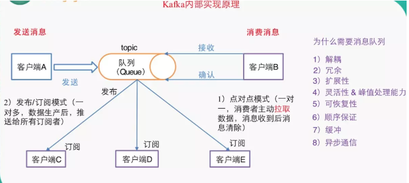 

（1）点对点模式（一对一，消费者主动拉取数据，消息收到后消息清除）
点对点模型通常是一个基于拉取或者轮询的消息传送模型，这种模型从队列中请求信息，而不是将消息推送到客户端。这个模型的特点是发送到队列的消息被一个且只有一个接收者接收处理，即使有多个消息监听者也是如此。
（2）发布/订阅模式（一对多，数据生产后，推送给所有订阅者）
发布订阅模型则是一个基于推送的消息传送模型。发布订阅模型可以有多种不同的订阅者，临时订阅者只在主动监听主题时才接收消息，而持久订阅者则监听主题的所有消息，即使当前订阅者不可用，处于离线状态。

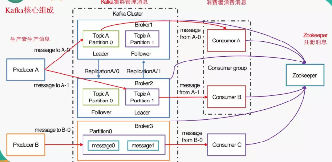 

1）Producer ：消息生产者，就是向kafka broker发消息的客户端。
2）Consumer ：消息消费者，向kafka broker取消息的客户端
3）Topic ：可以理解为一个队列。
4） Consumer Group （CG）：这是kafka用来实现一个topic消息的广播（发给所有的consumer）和单播（发给任意一个consumer）的手段。一个topic可以有多个CG。topic的消息会复制（不是真的复制，是概念上的）到所有的CG，但每个partion只会把消息发给该CG中的一个consumer。如果需要实现广播，只要每个consumer有一个独立的CG就可以了。要实现单播只要所有的consumer在同一个CG。用CG还可以将consumer进行自由的分组而不需要多次发送消息到不同的topic。
5）Broker ：一台kafka服务器就是一个broker。一个集群由多个broker组成。一个broker可以容纳多个topic。
6）Partition：为了实现扩展性，一个非常大的topic可以分布到多个broker（即服务器）上，一个topic可以分为多个partition，每个partition是一个有序的队列。partition中的每条消息都会被分配一个有序的id（offset）。kafka只保证按一个partition中的顺序将消息发给consumer，不保证一个topic的整体（多个partition间）的顺序。
7）Offset：kafka的存储文件都是按照offset.kafka来命名，用offset做名字的好处是方便查找。例如你想找位于2049的位置，只要找到2048.kafka的文件即可。当然the first offset就是00000000000.kafka

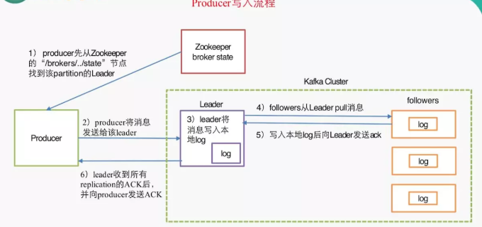 

1）producer先从zookeeper的 "/brokers/.../state"节点找到该partition的leader
2）producer将消息发送给该leader
3）leader将消息写入本地log
4）followers从leader pull消息，写入本地log后向leader发送ACK
5）leader收到所有ISR中的replication的ACK后，增加HW（high watermark，最后commit 的offset）并向producer发送ACK

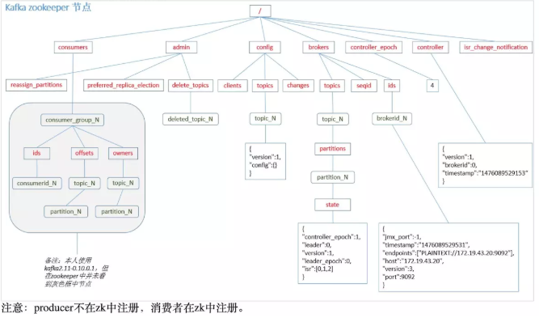 


## 11.5 Broker 保存消息

### 11.5.1 **Kafka文件存储基本结构**

l 在Kafka文件存储中，同一个topic下有多个不同partition，每个partition为一个目录，partiton命名规则为topic名称+有序序号，第一个partiton序号从0开始，序号最大值为partitions数量减1。

l 每个partion(目录)相当于一个巨型文件被平均分配到多个大小相等segment(段)数据文件中。**但每个段segment file消息数量不一定相等**，这种特性方便old segment file快速被删除。默认保留7天的数据。

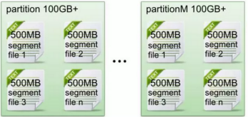 

l 每个partiton只需要支持顺序读写就行了，segment文件生命周期由服务端配置参数决定。（什么时候创建，什么时候删除）

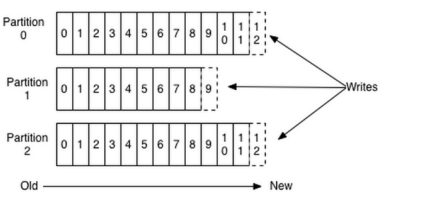 

数据有序的讨论？

​	一个partition的数据是否是有序的？	间隔性有序，不连续

​	针对一个topic里面的数据，只能做到partition内部有序，不能做到全局有序。

​	特别加入消费者的场景后，如何保证消费者消费的数据全局有序的？伪命题。

 

只有一种情况下才能保证全局有序？就是只有一个partition。

### 11.5.2 KafkaPartitionSegment

 Segment file组成：由2大部分组成，分别为index file和data file，此2个文件一一对应，成对出现，后缀".index"和“.log”分别表示为segment索引文件、数据文件。

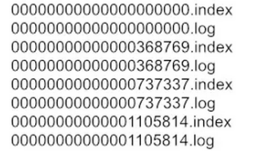 

 Segment文件命名规则：partion全局的第一个segment从0开始，后续每个segment文件名为上一个segment文件最后一条消息的offset值。数值最大为64位long大小，19位数字字符长度，没有数字用0填充。

索引文件存储大量元数据，数据文件存储大量消息，索引文件中元数据指向对应数据文件中message的物理偏移地址。

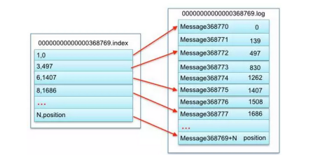 

3，497：当前log文件中的第几条信息，存放在磁盘上的那个地方

上述图中索引文件存储大量元数据，数据文件存储大量消息，索引文件中元数据指向对应数据文件中message的物理偏移地址。

其中以索引文件中元数据3,497为例，依次在数据文件中表示第3个message(在全局partiton表示第368772个message)、以及该消息的物理偏移地址为497。

 segment data file由许多message组成， qq物理结构如下：

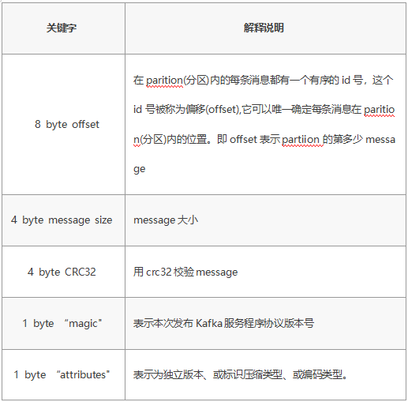  

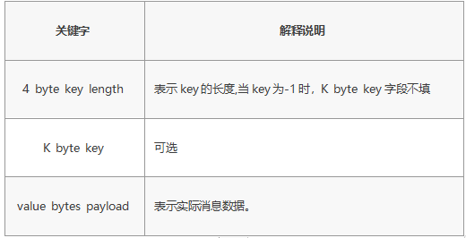 

### 11.5.3 **Kafka 查找message**

读取offset=368776的message，需要通过下面2个步骤查找。

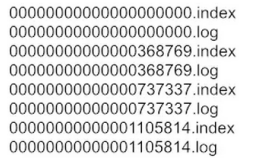 

### 11.5.4 查找segment file

00000000000000000000.index表示最开始的文件，起始偏移量(offset)为0

00000000000000368769.index的消息量起始偏移量为368770 = 368769 + 1

00000000000000737337.index的起始偏移量为737338=737337 + 1

其他后续文件依次类推。

以起始偏移量命名并排序这些文件，只要根据offset **二分查找**文件列表，就可以快速定位到具体文件。当offset=368776时定位到00000000000000368769.index和对应log文件。

#### 通过segment file查找message	

当offset=368776时，依次定位到00000000000000368769.index的元数据物理位置和00000000000000368769.log的物理偏移地址

然后再通过00000000000000368769.log顺序查找直到offset=368776为止。


## 11.6 消费过程分析

本质上kafka只支持Topic；

每个group中可以有多个consumer，每个consumer属于一个consumer group；

通常情况下，一个group中会包含多个consumer，这样不仅可以提高topic中消息的并发消费能力，而且还能提高"故障容错"性，如果group中的某个consumer失效那么其消费的partitions将会有其他consumer自动接管。

对于Topic中的一条特定的消息，只会被订阅此Topic的每个group中的其中一个consumer消费，此消息不会发送给一个group的多个consumer；

那么一个group中所有的consumer将会交错的消费整个Topic，每个group中consumer消息消费互相独立，我们可以认为一个group是一个"订阅"者。

 在kafka中,一个partition中的消息只会被group中的一个consumer消费**(同一时刻)**；

一个Topic中的每个partions，只会被一个"订阅者"中的一个consumer消费，不过一个consumer可以同时消费多个partitions中的消息。

 kafka的设计原理决定,对于一个topic，同一个group中不能有多于partitions个数的consumer同时消费，否则将意味着某些consumer将无法得到消息。

**kafka只能保证一个partition中的消息被某个consumer消费时是顺序的；事实上，从Topic角度来说,当有多个partitions时,消息仍不是全局有序的。**

# 课堂练习

## 1.完成spring整合kafka,并且实现发送消息接收消息(30分钟)