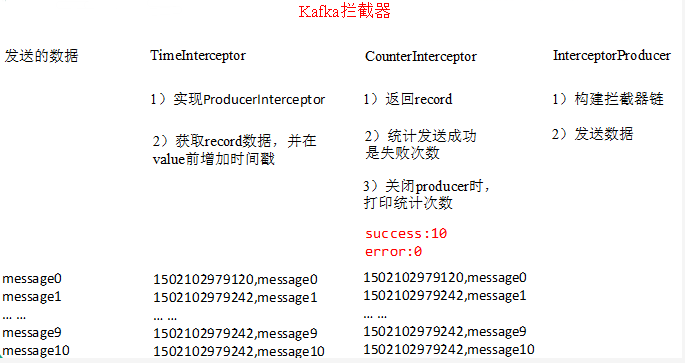
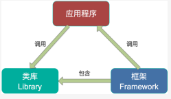
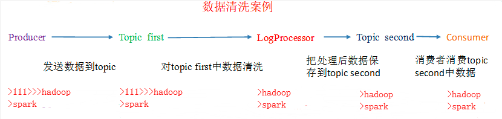

# 第十二单元 Kafka producer拦截器与Kafka Streams

# 【授课重点】

1. 拦截器原理
2. 拦截器案例
3. 了解Kafka Streams
4. Kafka Stream 数据清洗案例

# 【考核要求】

1. 掌握Kafka生产者发送数据的过程
2. 掌握Kafka消费者获取数据的过程

# 【教学内容】

## 12.1 课程导入

kafka在Java代码中，生产者Producer使用Producer拦截器发送数据

## **12.2 拦截器原理**

Producer拦截器(interceptor)是在Kafka 0.10版本被引入的，主要用于实现clients端的定制化控制逻辑。

对于producer而言，interceptor使得用户在消息发送前以及producer回调逻辑前有机会对消息做一些定制化需求，比如修改消息等。同时，producer允许用户指定多个interceptor按序作用于同一条消息从而形成一个拦截链(interceptor   chain)。Intercetpor的实现接口是org.apache.kafka.clients.producer.ProducerInterceptor，其定义的方法包括：

（1）configure(configs)

获取配置信息和初始化数据时调用。

（2）onSend(ProducerRecord)：

该方法封装进KafkaProducer.send方法中，即它运行在用户主线程中。Producer确保在消息被序列化以及计算分区前调用该方法。用户可以在该方法中对消息做任何操作，但最好保证不要修改消息所属的topic和分区，否则会影响目标分区的计算

（3）onAcknowledgement(RecordMetadata, Exception)：

该方法会在消息被应答或消息发送失败时调用，并且通常都是在producer回调逻辑触发之前。onAcknowledgement运行在producer的IO线程中，因此不要在该方法中放入很重的逻辑，否则会拖慢producer的消息发送效率

（4）close：

关闭interceptor，主要用于执行一些资源清理工作

如前所述，interceptor可能被运行在多个线程中，因此在具体实现时用户需要自行确保线程安全。另外倘若指定了多个interceptor，则producer将按照指定顺序调用它们，并仅仅是捕获每个interceptor可能抛出的异常记录到错误日志中而非在向上传递。这在使用过程中要特别留意。

## **12.3** **拦截器案例**

1）需求：

实现一个简单的双interceptor组成的拦截链。第一个interceptor会在消息发送前将时间戳信息加到消息value的最前部；第二个interceptor会在消息发送后更新成功发送消息数或失败发送消息数。

  


2）案例实操

（1）增加时间戳拦截器

```java
import org.apache.kafka.clients.producer.ProducerInterceptor;
import org.apache.kafka.clients.producer.ProducerRecord;
import org.apache.kafka.clients.producer.RecordMetadata;
import java.util.Map;

public class TimeInterceptor implements ProducerInterceptor<String, String> {

    @Override
    public void configure(Map<String, ?> map) {

    }
    @Override
    public ProducerRecord<String, String> onSend(ProducerRecord<String, String> record) {
        // 创建一个新的record，把时间戳写入消息体的最前部
        return new ProducerRecord(record.topic(), record.partition(), record.timestamp(), record.key(),
                System.currentTimeMillis() + "," + record.value().toString());
    }

    @Override
    public void onAcknowledgement(RecordMetadata recordMetadata, Exception e) {
    }

    @Override
    public void close() {
    }
}
```

  （2）统计发送消息成功和发送失败消息数，并在producer关闭时打印这两个计数器

```java
import org.apache.kafka.clients.producer.ProducerInterceptor;
import org.apache.kafka.clients.producer.ProducerRecord;
import org.apache.kafka.clients.producer.RecordMetadata;
import java.util.Map;

public class CounterInterceptor implements ProducerInterceptor<String, String> {
    private int errorCounter = 0;
    private int successCounter = 0;

    @Override
    public void configure(Map<String, ?> configs) {
    }
    @Override
    public ProducerRecord<String, String> onSend(ProducerRecord<String, String> record) {
        return record;
    }
    @Override
    public void onAcknowledgement(RecordMetadata metadata, Exception exception) {
        // 统计成功和失败的次数
        if (exception == null) {
            successCounter++;
        } else {
            errorCounter++;
        }
    }
    @Override
    public void close() {
        // 保存结果
        System.out.println("Successful sent: " + successCounter);
        System.out.println("Failed sent: " + errorCounter);
    }
}
```

（3）producer主程序

```java
import org.apache.kafka.clients.producer.KafkaProducer;
import org.apache.kafka.clients.producer.Producer;
import org.apache.kafka.clients.producer.ProducerConfig;
import org.apache.kafka.clients.producer.ProducerRecord;
import java.util.ArrayList;
import java.util.List;
import java.util.Properties;

public class InterceptorProducer {
    public static void main(String[] args) throws Exception {
        // 1 设置配置信息
        Properties props = new Properties();
        props.put("bootstrap.servers", "node21:9092");
        props.put("acks", "all");
        props.put("retries", 0);
        props.put("batch.size", 16384);
        props.put("linger.ms", 1);
        props.put("buffer.memory", 33554432);
        props.put("key.serializer", "org.apache.kafka.common.serialization.StringSerializer");
        props.put("value.serializer", "org.apache.kafka.common.serialization.StringSerializer");
        // 2 构建拦截链
        List<String> interceptors = new ArrayList<>();
        interceptors.add("com.xyg.kafka.interceptor.TimeInterceptor");
        interceptors.add("com.xyg.kafka.interceptor.CounterInterceptor");
        props.put(ProducerConfig.INTERCEPTOR_CLASSES_CONFIG, interceptors);
        String topic = "firstTopic";
        Producer<String, String> producer = new KafkaProducer<>(props);
        // 3 发送消息
        for (int i = 0; i < 10; i++) {
            ProducerRecord<String, String> record = new ProducerRecord<>(topic, "message" + i);
            producer.send(record);
        }
        // 4 一定要关闭producer，这样才会调用interceptor的close方法
        producer.close();
    }
}
```

3）测试

（1）在kafka上启动消费者，然后运行客户端java程序。

```shell
[root@node21 kafka]$ bin/kafka-console-consumer.sh --zookeeper node21:2181,node22:2181,node23:2181  --from-beginning --topic firstTopic

1533465083631,message0
1533465084092,message3
1533465084092,message6
1533465084093,message9
1533465148033,message1
1533465148043,message4
1533465148044,message7
1533465154264,message0
1533465154650,message3
1533465154651,message6
1533465154651,message9
```

（2）观察java平台控制台输出数据如下：

Successful sent: 10

Failed sent: 0


## **12.4  Kafka Streams介绍**

Kafka Streams是一个客户端库，用于构建任务关键型实时应用程序和微服务，其中输入和/或输出数据存储在Kafka集群中。Kafka Streams结合了在客户端编写和部署标准Java和Scala应用程序的简单性以及Kafka服务器端集群技术的优势，使这些应用程序具有高度可扩展性，弹性，容错性，分布式等等。

**（1）  Kafka Streams特点**

1）功能强大 

高扩展性，弹性，容错 

2）轻量级 

无需专门的集群 

一个库，而不是框架

3）完全集成 

100%的Kafka 0.10.0版本兼容

易于集成到现有的应用程序 

4）实时性

毫秒级延迟 

并非微批处理 

窗口允许乱序数据 

允许迟到数据

**（2）  几种Stream对比**

当前已经有非常多的流式处理系统，最知名且应用最多的开源流式处理系统有Spark Streaming和Apache  Storm。Apache Storm发展多年，应用广泛，提供记录级别的处理能力，当前也支持SQL on Stream。而Spark  Streaming基于Apache  Spark，可以非常方便与图计算，SQL处理等集成，功能强大，对于熟悉其它Spark应用开发的用户而言使用门槛低。另外，目前主流的Hadoop发行版，如Cloudera和Hortonworks，都集成了Apache  Storm和Apache Spark，使得部署更容易。

既然Apache Spark与Apache Storm拥用如此多的优势，那为何还需要Kafka Stream呢？主要有如下原因。

第一，Spark和Storm都是流式处理框架，而Kafka  Stream提供的是一个基于Kafka的流式处理类库。框架要求开发者按照特定的方式去开发逻辑部分，供框架调用。开发者很难了解框架的具体运行方式，从而使得调试成本高，并且使用受限。而Kafka  Stream作为流式处理类库，直接提供具体的类给开发者调用，整个应用的运行方式主要由开发者控制，方便使用和调试。

 

第二，虽然Cloudera与Hortonworks方便了Storm和Spark的部署，但是这些框架的部署仍然相对复杂。而Kafka Stream作为类库，可以非常方便的嵌入应用程序中，它对应用的打包和部署基本没有任何要求。

第三，就流式处理系统而言，基本都支持Kafka作为数据源。例如Storm具有专门的kafka-spout，而Spark也提供专门的spark-streaming-kafka模块。事实上，Kafka基本上是主流的流式处理系统的标准数据源。换言之，大部分流式系统中都已部署了Kafka，此时使用Kafka  Stream的成本非常低。

第四，使用Storm或Spark  Streaming时，需要为框架本身的进程预留资源，如Storm的supervisor和Spark on YARN的node  manager。即使对于应用实例而言，框架本身也会占用部分资源，如Spark  Streaming需要为shuffle和storage预留内存。但是Kafka作为类库不占用系统资源。

第五，由于Kafka本身提供数据持久化，因此Kafka Stream提供滚动部署和滚动升级以及重新计算的能力。

第六，由于Kafka Consumer Rebalance机制，Kafka Stream可以在线动态调整并行度。

## **12.5** Stream数据清洗案例

0）需求：

实时处理单词带有”>>>”前缀的内容。例如输入”111>>>hadoop”，最终处理成“hadoop”

1）需求分析：

    

2）案例实操

（1）创建一个工程，pom文件引入依赖

 

```xml
<!-- https://mvnrepository.com/artifact/org.apache.kafka/kafka-streams -->
<dependency>
    <groupId>org.apache.kafka</groupId>
    <artifactId>kafka-streams</artifactId>
    <version>1.1.0</version>
</dependency>
```

（2）创建主类(TopologyBuilder是过时的)

```java
import java.util.Properties;
import org.apache.kafka.streams.KafkaStreams;
import org.apache.kafka.streams.StreamsConfig;
import org.apache.kafka.streams.processor.Processor;
import org.apache.kafka.streams.processor.ProcessorSupplier;
import org.apache.kafka.streams.processor.TopologyBuilder;

public class StreamApplication {
    public static void main(String[] args) {
        // 定义输入的topic
        String from = "firstTopic";
        // 定义输出的topic
        String to = "secondTopic";
        // 设置参数
        Properties props = new Properties();
        props.put(StreamsConfig.APPLICATION_ID_CONFIG, "logFilter");
        props.put(StreamsConfig.BOOTSTRAP_SERVERS_CONFIG, "node21:9092");
        StreamsConfig config = new StreamsConfig(props);
        // 构建拓扑
        TopologyBuilder builder = new TopologyBuilder();
        builder.addSource("SOURCE", from)
                .addProcessor("PROCESS", new ProcessorSupplier<byte[], byte[]>() {
                    @Override
                    public Processor<byte[], byte[]> get() {
                        // 具体分析处理
                        return new LogProcessor();
                    }
                }, "SOURCE")
                .addSink("SINK", to, "PROCESS");
        // 创建kafka stream
        KafkaStreams streams = new KafkaStreams(builder, config);
        streams.start();
    }
}
```

（3）具体业务处理

```java
import org.apache.kafka.streams.processor.Processor;
import org.apache.kafka.streams.processor.ProcessorContext;

public class LogProcessor implements Processor<byte[], byte[]> {

    private ProcessorContext context;

    @Override
    public void init(ProcessorContext context) {
        this.context = context;
    }

    @Override
    public void process(byte[] key, byte[] value) {
        String input = new String(value);
        // 如果包含“>>>”则只保留该标记后面的内容
        if (input.contains(">>>")) {
            input = input.split(">>>")[1].trim();
            // 输出到下一个topic
            context.forward("logProcessor".getBytes(), input.getBytes());
        }else{
            context.forward("logProcessor".getBytes(), input.getBytes());
        }
    }

    @Override
    public void punctuate(long timestamp) {
    }
    
    @Override
    public void close() {
    }
}
```

（4）运行程序

（5）在node21上启动生产者

```shell
[root@node21 kafka]$ bin/kafka-console-producer.sh --broker-list node21:9092,node22:9092,node23:9092  --topic firstTopic

>111>>>hadoop
>222>>>spark
>spark
```

（6）在node22上启动消费者

```shell
[root@node22 kafka]$ bin/kafka-console-consumer.sh   --bootstrap-server node21:9092,node22:9092,node23:9092  --from-beginning  --topic secondTopic

hadoop
spark
spark
```

  **Stream官方wc案例**

参考文档：http://kafka.apache.org/11/documentation/streams/

```java
import org.apache.kafka.common.serialization.Serdes;
import org.apache.kafka.common.utils.Bytes;
import org.apache.kafka.streams.KafkaStreams;
import org.apache.kafka.streams.StreamsBuilder;
import org.apache.kafka.streams.StreamsConfig;
import org.apache.kafka.streams.kstream.KStream;
import org.apache.kafka.streams.kstream.KTable;
import org.apache.kafka.streams.kstream.Materialized;
import org.apache.kafka.streams.kstream.Produced;
import org.apache.kafka.streams.state.KeyValueStore;
import java.util.Arrays;
import java.util.Properties;

public class WordCountApplication {

    public static void main(final String[] args) throws Exception {
        Properties config = new Properties();
        config.put(StreamsConfig.APPLICATION_ID_CONFIG, "wordcount-application");
        config.put(StreamsConfig.BOOTSTRAP_SERVERS_CONFIG, "node21:9092");
        config.put(StreamsConfig.DEFAULT_KEY_SERDE_CLASS_CONFIG, Serdes.String().getClass());
        config.put(StreamsConfig.DEFAULT_VALUE_SERDE_CLASS_CONFIG, Serdes.String().getClass());

        StreamsBuilder builder = new StreamsBuilder();
        KStream<String, String> textLines = builder.stream("TextLinesTopic");
        KTable<String, Long> wordCounts = textLines
                .flatMapValues(textLine -> Arrays.asList(textLine.toLowerCase().split("\\W+")))
                .groupBy((key, word) -> word)
                .count(Materialized.<String, Long, KeyValueStore<Bytes, byte[]>>as("counts-store"));
        wordCounts.toStream().to("WordsWithCountsTopic", Produced.with(Serdes.String(), Serdes.Long()));

        KafkaStreams streams = new KafkaStreams(builder.build(), config);
        streams.start();
    }

}
```


# 课堂练习

## 1.完成使用生产者发送数据到kafka案例(30分钟)

## 2.完成使用消费者从kafka获取案例(30分钟)

## 3.完成使用kafka发送和接收实体类对象的案例(30分钟)