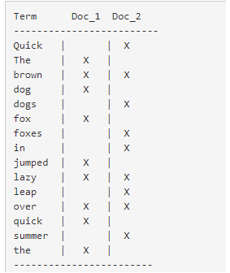
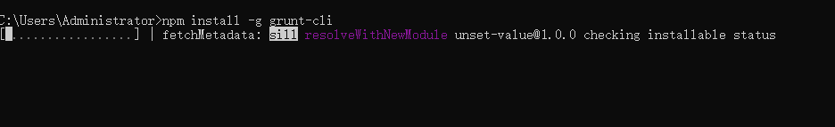
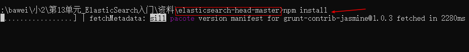

# 第13单元  ElasticSearch入门

# 【授课重点】

1. 课程介绍

2. ElasticSearch的安装

3. 插件安装

4. 分布式安装；

# 【考核要求】

1. 课程介绍

2. ElasticSearch的安装

3. 插件安装

4. 分布式安装；

# 【教学内容】

# 13.1 课程导入

## 13.1.1 为什么要使用全文检索

用户访问我们的首页，一般都会直接搜索来寻找自己想要购买的商品。

而商品的数量非常多，而且分类繁杂。如果能正确的显示出用户想要的商品，并进行合理的过滤，尽快促成交易，是搜索系统要研究的核心。

面对这样复杂的搜索业务和数据量，使用传统数据库搜索就显得力不从心，一般我们都会使用全文检索技术。

常见的全文检索技术有  Lucene、solr 、elasticsearch  等。

## 13.1.2 理解索引结构  倒排索引

下图是索引结构，下边黑色部分是物理结构，上边黄色部分是逻辑结构，逻辑结构也是为了更好的去描述工作原理及去使用物理结构中的索引文件。

 

逻辑结构部分是一个倒排索引表：

1、将要搜索的文档内容分词，所有不重复的词组成分词列表。

2、将搜索的文档最终以Document方式存储起来。

3、每个词和docment都有关联。

如下：

 

现在，如果我们想搜索 `quick brown` ，我们只需要查找包含每个词条的文档：

  

两个文档都匹配，但是第一个文档比第二个匹配度更高。如果我们使用仅计算匹配词条数量的简单 *相似性算法* ，那么，我们可以说，对于我们查询的相关性来讲，第一个文档比第二个文档更佳。

**那么什么是ElasticSearch呢?**

ElasticSearch是一个基于Lucene的搜索服务器。它提供了一个分布式多用户能力的全文搜索引擎，基于RESTful web接口。Elasticsearch是用Java开发的，并作为Apache许可条款下的开放源码发布，是当前流行的企业级搜索引擎。设计用于云计算中，能够达到实时搜索，稳定，可靠，快速，安装使用方便。
​	我们建立一个网站或应用程序，并要添加搜索功能，但是想要完成搜索工作的创建是非常困难的。我们希望搜索解决方案要运行速度快，我们希望能有一个零配置和一个完全免费的搜索模式，我们希望能够简单地使用JSON通过HTTP来索引数据，我们希望我们的搜索服务器始终可用，我们希望能够从一台开始并扩展到数百台，我们要实时搜索，我们要简单的多租户，我们希望建立一个云的解决方案。因此我们利用Elasticsearch来解决所有这些问题及可能出现的更多其它问题。

官方网址：https://www.elastic.co/cn/products/elasticsearch

Github：https://github.com/elastic/elasticsearch

优点：

（1）可以作为一个大型分布式集群（数百台服务器）技术，处理PB级数据，服务大公司；也可以运行在单机上

（2）将全文检索、数据分析以及分布式技术，合并在了一起，才形成了独一无二的ES；

（3）开箱即用的，部署简单

（4）全文检索，同义词处理，相关度排名，复杂数据分析，海量数据的近实时处理

下表是Elasticsearch与MySQL数据库逻辑结构概念的对比

| Elasticsearch  | 关系型数据库Mysql |
| -------------- | ----------------- |
| 索引(index)    | 数据库(databases) |
| 类型(type)     | 表(table)         |
| 文档(document) | 行(row)           |

# 13.2  ElasticSearch windows版安装

下载ElasticSearch  6.6.2版本

https://www.elastic.co/downloads/past-releases/elasticsearch-6.5.2

资源\配套软件中也提供了安装包

无需安装，解压安装包后即可使用

在命令提示符下，进入ElasticSearch安装目录下的bin目录,执行命令

```sh
elasticsearch
```

即可启动。

我们打开浏览器，在地址栏输入http://127.0.0.1:9200/  即可看到输出结果

```json
{
  "name" : "uxxprtP",
  "cluster_name" : "elasticsearch",
  "cluster_uuid" : "busVHkVASnW5x2TAwYKnkw",
  "version" : {
    "number" : "6.5.2",
    "build_flavor" : "default",
    "build_type" : "zip",
    "build_hash" : "9434bed",
    "build_date" : "2018-11-29T23:58:20.891072Z",
    "build_snapshot" : false,
    "lucene_version" : "7.5.0",
    "minimum_wire_compatibility_version" : "5.6.0",
    "minimum_index_compatibility_version" : "5.0.0"
  },
  "tagline" : "You Know, for Search"
}
```


# 13.3  插件安装

## 13.3.1 安装图形化界面head插件

解压elasticsearch-head-master.zip到任意目录

## 13.3.2 安装nodejs程序

Grunt和所有grunt插件都是基于nodejs来运行的

## 13.3.3 grunt安装为全局命令

Grunt是一个基于JavaScript上的一个很强大的前端自动化工具基于NodeJS用于自动化构建、测试、生成文档的项目管理工具。

```
cmd控制台中输入：  npm install -g grunt-cli
```

 

设置允许elasticsearch跨越访问**

```xml
修改elasticsearch-6.6.2\config下的elasticsearch.yml文件：

http.cors.enabled: true        # 开启跨域访问支持，默认为false
http.cors.allow-origin: "*"    # 跨域访问允许的域名地址
```

**cmd命令进入elasticsearch-head-master目录，启动head图形化界面程序：**

```
grunt server
```

如果grunt server不好用：

cmd进入到head目录中执行npm install

 


## 13.3.4 测试查询

```
 http://localhost:9100

```

# 13.4 ElasticSearch Linux版安装

## 13.4.1 安装ES服务

**1.上传elasticsearch-6.6.2.tar.gz 文件 移动到opt目录**

**2.在opt目录中解压 安装包**

```
tar -zxvf elasticsearch-6.6.2.tar.gz 
```

**3.创建elasticsearh的存储数据目录 ，在opt目录下面**

```
mkdir data_elasticsearch
```

**4.切换到data_elasticsearch中，创建一个data目录与logs目录**

```
cd data_elasticsearch/   切换目录
mkdir data   创建数据文件
mkdir logs   创建日志文件
```

​	**最终创建的目录如下:**

```
/opt/data_elasticsearch/data
/opt/data_elasticsearch/logs
```

**5.采用绝对路径的写法修改配置文件， 修改elasticsearch.yml配置文件 指定文件内容文件和日志文件**

 

```
vim /opt/elasticsearch-6.6.2/config/elasticsearch.yml 

修改如下:

path.data: /opt/data_elasticsearch/data    
path.logs: /opt/data_elasticsearch/logs   
```


**6.修改 内存配置**

```
vim /opt/elasticsearch-6.6.2/config/elasticsearch.yml

修改如下:

bootstrap.memory_lock: false
bootstrap.system_call_filter: false
```

**7.修改网路设置**

```
vim /opt/elasticsearch-6.6.2/config/elasticsearch.yml 

修改如下:

network.host: 0.0.0.0
http.port: 9200
```

**8.系统要求配置**
1.编辑 vim /etc/security/limits.conf，追加以下内容；

```

修改如下:

* soft nofile 65536
* hard nofile 65536
```


**9.编辑 vim /etc/sysctl.conf，追加以下内容**

```
vm.max_map_count=262144
```

```
保存退出以后,执行下面这个命令

sysctl -p
```

**10.修改limits.d目录下的配置文件：** 

```
vi /etc/security/limits.d/90-nproc.conf

修改如下:

*          soft    nproc     4096
root       soft    nproc     4096
```

**11.由于elasticsearch不允许root的用户启动，所以要对它的日志，数据文件，安装文件，进行用户的更改。**

```
chown -R gaofei:gaofei data_elasticsearch/
chown -R gaofei:gaofei elasticsearch-6.6.2/
```

**12.重新启动一下**

**13.启动es，再启动之前，先切换到gaofei用户 进行启动操作**

```
su gaofei
```

**14. 采用绝对路径启动**

```
/opt/elasticsearch-6.6.2/bin/elasticsearch
```

**15.后台启动**

```
/opt/elasticsearch-6.6.2/bin/elasticsearch -d   可能启动慢,需要等待一会才能启动成功
```

## 13.4.2 安装head插件

**注意:由于head插件是基于NodeJS进行编写的,所以我们要先安装NodeJS环境**

1.node.js的环境安装

```
上传并解压node-v10.15.3-linux-x64.tar.xz 操作

tar xf node-v10.15.3-linux-x64.tar.xz 

重命名node-v10

mv node-v10.15.3-linux-x64 node-v10

加入node.js环境变量配置 vi /etc/profile

export NODE_HOME=/opt/node-v10
export PATH=$NODE_HOME/bin:$JAVA_HOME/bin:$PATH

生效配置文件

source /etc/profile
```

检测环境变量的配置

node -v

当出现版本信息时候,表示成功

```
v10.15.3
```

检测npm    npm是与node.js环境搭建一起完成

```
npm -v

当出现版本信息时候,表示成功
 
6.4.1
```


2.cnpm 淘宝镜像

为了加快下载速度,我们可以选择安装淘宝镜像

```
npm install -g cnpm --registry=https://registry.npm.taobao.org
```


安装elastisearch-head插件的准备工作

**1.上传elasticsearch-head-master.zip 到opt目录**

**2.解压elasticsearch-head-master.zip**

```
unzip elasticsearch-head-master.zip
```

**3.重名 head-elasticsearch**

```
mv elasticsearch-head-master head-elasticsearch
```

**4.进入到head-elasticsearch  执行一下  安装**

```
cnpm install
```

**5.启动插件**
   在head-elasticsearch根目录中执行：cnpm run start  启动插件

```
cnpm run start
```

**6.要想head-elasticsearch与elasticsearch进行通讯 要注意以下 跨域访问的问题。**
修改elasticsearch.yml配置文件 允许跨域访问

```
http.cors.enabled: true
http.cors.allow-origin: '*'

修改完成后,重启es服务
```

访问head界面:192.168.25.171:9100

# 课堂作业:

## 1.根据教案完成es&head插件的安装(40分钟)