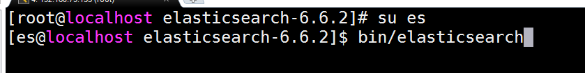
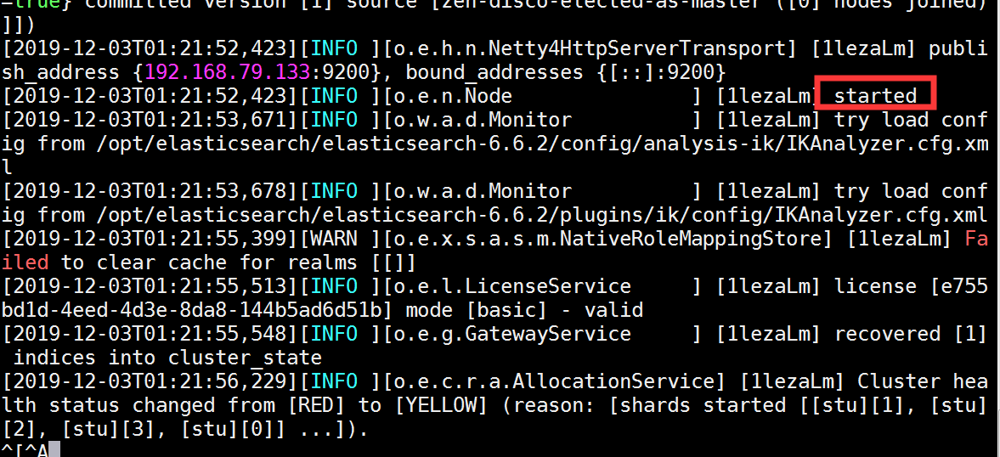
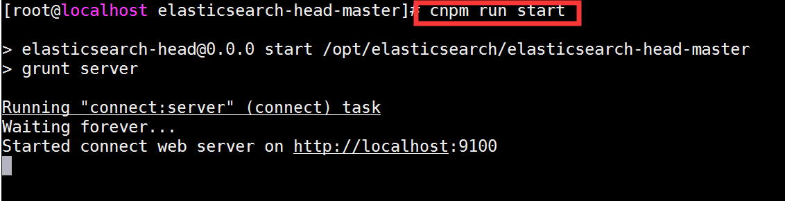
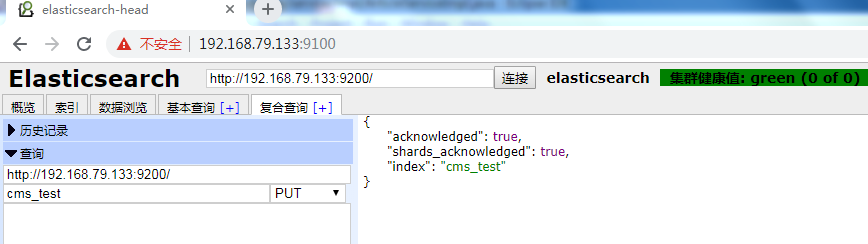
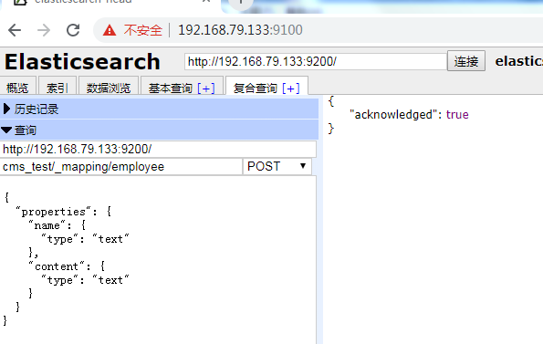
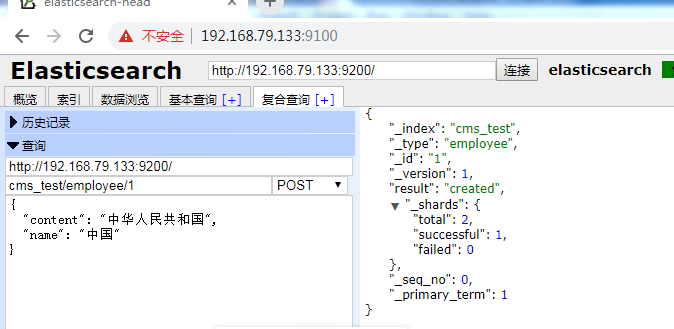
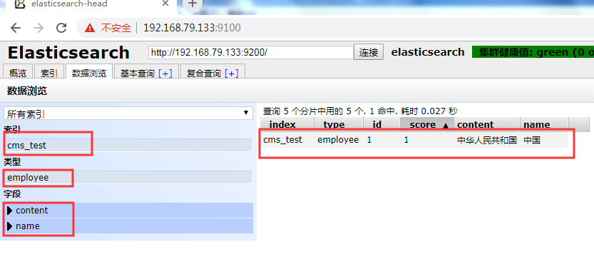
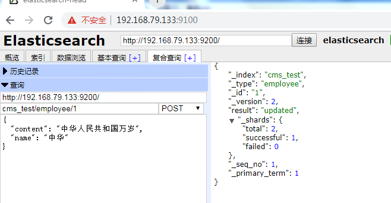
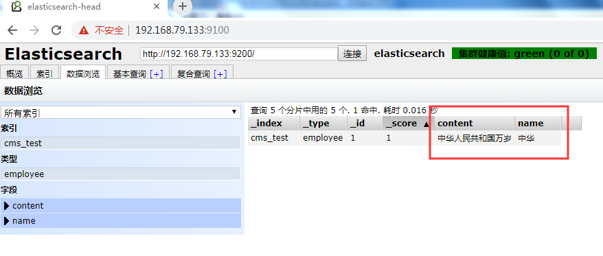
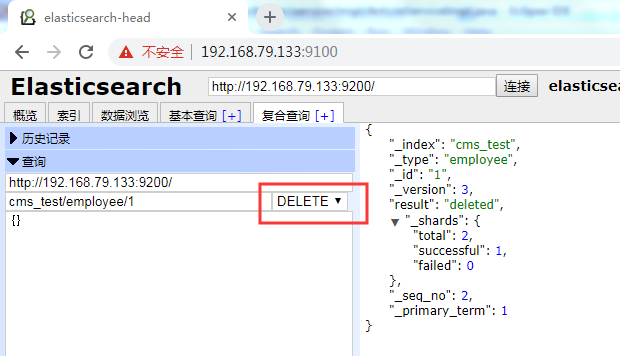

# 第十四单元 ElasticSearch基本用法

# 【授课重点】

1. 索引、文档、类型等概念

2. 创建索引

3. 插入数据

4. 修改数据

5. 删除数据


# 【考核要求】

1. 理解索引、文档、类型等概念
2. 能够创建索引
3. 能够插入、修改、删除数据

# 【教学内容】

## 14.1 课程导入

本章节主要学习如何使用elasticsearch的头插件对elasticsearch进行操作。


## 14.2 索引、文档、类型等概念

###  **Index（索引-数据库）**

索引包含一堆有相似结构的文档数据，比如可以有一个客户索引，商品分类索引，订单索引，索引有一个名称。一个index包含很多document，一个index就代表了一类类似的或者相同的document。比如说建立一个product index，商品索引，里面可能就存放了所有的商品数据，所有的商品document。

### **Type（类型-表）**

每个索引里都可以有一个或多个type，type是index中的一个逻辑数据分类，一个type下的document，都有相同的field，比如博客系统，有一个索引，可以定义用户数据type，博客数据type，评论数据type。

商品index，里面存放了所有的商品数据，商品document

但是商品分很多种类，每个种类的document的field可能不太一样，比如说电器商品，可能还包含一些诸如售后时间范围这样的特殊field；生鲜商品，还包含一些诸如生鲜保质期之类的特殊field

type，日化商品type，电器商品type，生鲜商品type

日化商品type：product_id，product_name，product_desc，category_id，category_name

电器商品type：product_id，product_name，product_desc，category_id，category_name，service_period

生鲜商品type：product_id，product_name，product_desc，category_id，category_name，eat_period

 

每一个type里面，都会包含一堆document


 


 

### **Document（文档-行）**

文档是es中的最小数据单元，一个document可以是一条客户数据，一条商品分类数据，一条订单数据，通常用JSON数据结构表示，每个index下的type中，都可以去存储多个document。

### Field（字段-列）

Field是Elasticsearch的最小单位。一个document里面有多个field，每个field就是一个数据字段。


### **mapping（映射-约束）**

数据如何存放到索引对象上，需要有一个映射配置，包括：数据类型、是否存储、是否分词等。

这样就创建了一个名为blog的Index。Type不用单独创建，在创建Mapping 时指定就可以。Mapping用来定义Document中每个字段的类型，即所使用的 analyzer、是否索引等属性，非常关键等。创建Mapping 的代码示例如下：


### **elasticsearch与数据库的类比**

| 关系型数据库（比如Mysql） | 非关系型数据库（Elasticsearch） |
| ------------------------- | ------------------------------- |
| 数据库Database            | 索引Index                       |
| 表Table                   | 类型Type                        |
| 数据行Row                 | 文档Document                    |
| 数据列Column              | 字段Field                       |
| 约束 Schema               | 映射Mapping                     |


## 14.3 创建索引

启动elasticsearch

 

  

启动elasticsearch头插件

  

查看头插件

  

创建索引

```
http://192.168.73.133:9200/
cms_test                    PUT请求
```

  


创建索引类型 employee  和对应的字段

```
cms_test/_mapping/employee POST 请求


{
  "properties": {
    "name": {
      "type": "text"
    },
    "content": {
      "type": "text"
    }
  }
}

```

  


## 14.4 插入数据

插入数据

```
http://192.168.73.133:9200/
cms_test/employee/1        POST请求  通过改变id的值 进行插入数据

{
  "content": "中华人民共和国",
  "name": "中国"
}
```

 

结果为

 


## 14.5 修改数据

修改数据

```
http://192.168.73.133:9200/
cms_test/employee/1        POST请求  通过改变id的值 进行插入数据

{
  "content": "中华人民共和国万岁",
  "name": "中华"
}
```

 

结果为

 

## 14.6 删除数据

删除数据

```
http://192.168.73.133:9200/
cms_test/employee/1        DELETE请求

{}
```

 

# 课堂练习

## 1.完成创建一个student学生类型的索引，包含姓名，年龄，生日，地址，班级等字段(30分钟)

## 2.对以上创建的索引进行学生数据的crud操作(30分钟)

