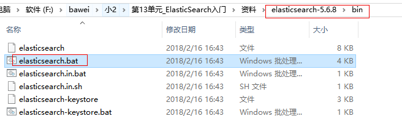
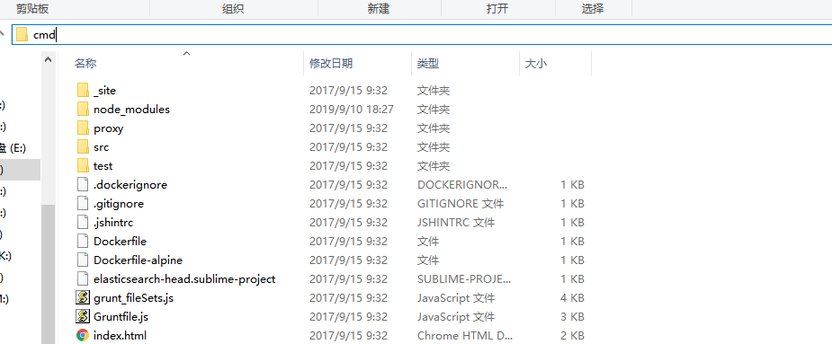
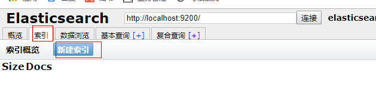
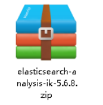
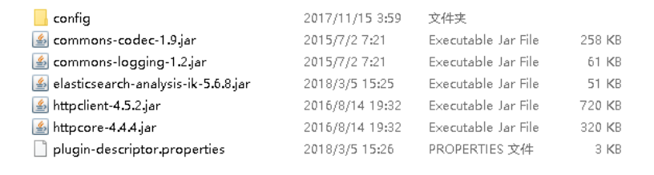
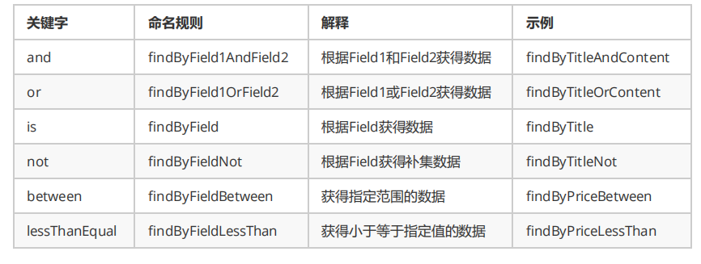

# 第15单元  ElasticSearch与Spring

# 【授课重点】

1. query
2. filter

3. 复合查询

4. Spring集成ElasticSearch

5. 基于Spring集成环境完成CURD操作

# 【考核要求】

1. Spring集成ElasticSearch

2. 基于Spring集成环境完成CURD操作

# 【教学内容】

## 15.1 课程导入

### 15.1.1  索引、文档、类型等概念

**索引** index

一个索引就是一个拥有几分相似特征的文档的集合。比如说，你可以有一个客户数据的索引，另一个产品目录的索 

引，还有一个订单数据的索引。一个索引由一个名字来标识（必须全部是小写字母的），并且当我们要对对应于这 

个索引中的文档进行索引、搜索、更新和删除的时候，都要使用到这个名字。在一个集群中，可以定义任意多的索 

引。

**类型** type

在一个索引中，你可以定义一种或多种类型。一个类型是你的索引的一个逻辑上的分类/分区，其语义完全由你来 

定。通常，会为具有一组共同字段的文档定义一个类型。比如说，我们假设你运营一个博客平台并且将你所有的数 

据存储到一个索引中。在这个索引中，你可以为用户数据定义一个类型，为博客数据定义另一个类型，当然，也可 

以为评论数据定义另一个类型。

**文档** document

一个文档是一个可被索引的基础信息单元。比如，你可以拥有某一个客户的文档，某一个产品的一个文档，当然， 

也可以拥有某个订单的一个文档。文档以JSON（Javascript Object Notation）格式来表示，而JSON是一个到处存 

在的互联网数据交互格式。 

在一个index/type里面，你可以存储任意多的文档。注意，尽管一个文档，物理上存在于一个索引之中，文档必须 

被索引/赋予一个索引的type。 


下表是Elasticsearch与MySQL数据库逻辑结构概念的对比

| Elasticsearch  | 关系型数据库Mysql |
| -------------- | ----------------- |
| 索引(index)    | 数据库(databases) |
| 类型(type)     | 表(table)         |
| 文档(document) | 行(row)           |

### 15.1.2  索引创建

进入es的bin目录下,双击elasticsearch.bat,启动es服务

 


进入head插件目录,在文件夹下的地址栏输入cmd输入grunt server  如图


 


 


浏览器输入:localhost:9100  如图

 

点击新建索引:

 

 

输入ok即可完成索引的创建!

## 15.2 ES之IK分词器

 **IK分词器简介**

当我们创建索引时，没有特定的进行映射的创建，所以会使用默认 

的分词器进行分词，即每个字单独分成一个词。

例如：我是程序员 

分词后的效果为：我、是、程、序、员 

而我们需要的分词效果是：我、是、程序、程序员 

这样的话就需要对中文支持良好的分析器的支持，支持中文分词的分词器有很多，word分词器、庖丁解牛、盘古 

分词、Ansj分词等，但我们常用的还是下面要介绍的IK分词器。

IKAnalyzer是一个开源的，基于java语言开发的轻量级的中文分词工具包。从2006年12月推出1.0版开始， 

IKAnalyzer已经推出 了3个大版本。最初，它是以开源项目Lucene为应用主体的，结合词典分词和文法分析算法的 

中文分词组件。新版本的IKAnalyzer3.0则发展为 面向Java的公用分词组件，独立于Lucene项目，同时提供了对 

Lucene的默认优化实现。 

IK分词器3.0的特性如下： 

1）采用了特有的“正向迭代最细粒度切分算法“，具有60万字/秒的高速处理能力。 2）采用了多子处理器分析模 

式，支持：英文字母（IP地址、Email、URL）、数字（日期，常用中文数量词，罗马数字，科学计数法），中文词 

汇（姓名、地名处理）等分词处理。 3）对中英联合支持不是很好,在这方面的处理比较麻烦.需再做一次查询,同时 

是支持个人词条的优化的词典存储，更小的内存占用。 4）支持用户词典扩展定义。 5）针对Lucene全文检索优化 

的查询分析器IKQueryParser；采用歧义分析算法优化查询关键字的搜索排列组合，能极大的提高Lucene检索的命 

中率。 

**ElasticSearch集成IK分词器** 

1）下载地址：https://github.com/medcl/elasticsearch-analysis-ik/releases 

课程资料也提供了IK分词器的压缩包：

 

2）解压，将解压后的elasticsearch文件夹拷贝到elasticsearch-5.6.8\plugins下，并重命名文件夹为ik 

 

3）重新启动ElasticSearch，即可加载IK分词器


## 15.3 ES&Spring之CRUD


导入Spring Data ElasticSearch坐标

```xml
<dependencies>
		<dependency>
			<groupId>org.elasticsearch</groupId>
			<artifactId>elasticsearch</artifactId>
			<version>5.6.8</version>
		</dependency>
		<dependency>
			<groupId>org.elasticsearch.client</groupId>
			<artifactId>transport</artifactId>
			<version>5.6.8</version>
		</dependency>
		<dependency>
			<groupId>org.apache.logging.log4j</groupId>
			<artifactId>log4j-to-slf4j</artifactId>
			<version>2.9.1</version>
		</dependency>
		<dependency>
			<groupId>org.slf4j</groupId>
			<artifactId>slf4j-api</artifactId>
			<version>1.7.24</version>
		</dependency>
		<dependency>
			<groupId>org.slf4j</groupId>
			<artifactId>slf4j-simple</artifactId>
			<version>1.7.21</version>
		</dependency>
		<dependency>
			<groupId>log4j</groupId>
			<artifactId>log4j</artifactId>
			<version>1.2.12</version>
		</dependency>
		<dependency>
			<groupId>junit</groupId>
			<artifactId>junit</artifactId>
			<version>4.12</version>
		</dependency>
		<dependency>
			<groupId>com.fasterxml.jackson.core</groupId>
			<artifactId>jackson-core</artifactId>
			<version>2.8.1</version>
		</dependency>
		<dependency>
			<groupId>com.fasterxml.jackson.core</groupId>
			<artifactId>jackson-databind</artifactId>
			<version>2.8.1</version>
		</dependency>
		<dependency>
			<groupId>com.fasterxml.jackson.core</groupId>
			<artifactId>jackson-annotations</artifactId>
			<version>2.8.1</version>
		</dependency>
		<dependency>
			<groupId>org.springframework.data</groupId>
			<artifactId>spring-data-elasticsearch</artifactId>
			<version>3.0.5.RELEASE</version>
		</dependency>
		<dependency>
			<groupId>org.springframework</groupId>
			<artifactId>spring-test</artifactId>
			<version>5.0.4.RELEASE</version>
		</dependency>
	</dependencies>
```


编写实体Article 

```java
public class Article {
	private Integer id;
	private String title;
	private String content;

	public Integer getId() {
		return id;
	}

	public void setId(Integer id) {
		this.id = id;
	}

	public String getTitle() {
		return title;
	}

	public void setTitle(String title) {
		this.title = title;
	}

	public String getContent() {
		return content;
	}

	public void setContent(String content) {
		this.content = content;
	}

	@Override
	public String toString() {
		return "Article [id=" + id + ", title=" + title + ", content=" + content + "]";
	}
}
```

编写Dao 


```java
public interface ArticleRepository extends ElasticsearchRepository<Article, Integer> {

}
```

编写Service

```java
public interface ArticleService { 
    public void save(Article article); 
}


@Service
public class ArticleServiceImpl implements ArticleService {
	@Autowired
	private ArticleRepository articleRepository;

	public void save(Article article) {
		articleRepository.save(article);
	}
}
```

配置applicationContext.xml 


```xml
<?xml version="1.0" encoding="UTF-8" ?>
<beans xmlns="http://www.springframework.org/schema/beans"
	xmlns:xsi="http://www.w3.org/2001/XMLSchema-instance"
	xmlns:elasticsearch="http://www.springframework.org/schema/data/elasticsearch"
	xmlns:context="http://www.springframework.org/schema/context"
	xsi:schemaLocation="http://www.springframework.org/schema/beans http://www.springframework.org/schema/beans/spring-beans.xsd
                            http://www.springframework.org/schema/data/elasticsearch http://www.springframework.org/schema/data/elasticsearch/spring-elasticsearch.xsd
                            http://www.springframework.org/schema/context http://www.springframework.org/schema/context/spring-context.xsd">
    
    <!-- 扫描Dao包，自动创建实例 -->
	<elasticsearch:repositories base-package="com.bawei.dao" />
	<!-- 扫描Service包，创建Service的实体 -->
	<context:component-scan base-package="com.bawei.service" /> <!-- 配置elasticSearch的连接 -->
	<elasticsearch:transport-client id="client"
		cluster-nodes="localhost:9300" /> <!-- spring data elasticSearcheDao 必须继承 ElasticsearchTemplate -->
	<bean id="elasticsearchTemplate"
		class="org.springframework.data.elasticsearch.core.ElasticsearchTemplate">
		<constructor-arg name="client" ref="client"></constructor-arg>
	</bean>
    
</beans>
```

配置实体

```java
//@Document 文档对象 （索引信息、文档类型 ）
@Document(indexName="blog3",type="article") 
public class Article {
        //@Id 文档主键 唯一标识
        @Id 
        //@Field 每个文档的字段配置（类型、是否分词、是否存储、分词器 ）
        @Field(store=true, index = false,type = FieldType.Integer) 
        private Integer id;
        @Field(index=true,analyzer="ik_smart",store=true,searchAnalyzer="ik_smart",type = FieldType.text)
        private String title;
        @Field(index=true,analyzer="ik_smart",store=true,searchAnalyzer="ik_smart",type = FieldType.text)
        private String content;
        public Integer getId() {
            return id;
        }
        public void setId(Integer id) {
            this.id = id;
        }
        public String getTitle() {
            return title;
        }
        public void setTitle(String title) {
            this.title = title;
        }
        public String getContent() {
            return content;
        }
        public void setContent(String content) {
            this.content = content;
        }
        @Override public String toString() {
            return "Article [id=" + id + ", title=" + title + ", content=" + content + "]";
        }
    }
```

其中，注解解释如下： 

@Document(indexName="blob3",type="article")： 

indexName：索引的名称（必填项） 

type：索引的类型 

@Id：主键的唯一标识 

@Field(index=true,analyzer="ik_smart",store=true,searchAnalyzer="ik_smart",type = 

FieldType.text) 

index：是否设置分词 

analyzer：存储时使用的分词器 

searchAnalyze：搜索时使用的分词器 

store：是否存储 

type: 数据类型 


```java
@RunWith(SpringJUnit4ClassRunner.class)

@ContextConfiguration(locations="classpath:applicationContext.xml")
public class SpringDataESTest {
    @Autowired
    private ArticleService articleService;
    @Autowired
    private TransportClient client;
    @Autowired
    private ElasticsearchTemplate elasticsearchTemplate;
    /**创建索引和映射*/
    @Test
    public void createIndex(){
        elasticsearchTemplate.createIndex(Article.class);
        elasticsearchTemplate.putMapping(Article.class);
    }
    
    /**测试保存文档*/
    @Test public void saveArticle(){
        Article article = new Article();
        article.setId(100);
        article.setTitle("测试SpringData ElasticSearch");
        article.setContent("Spring Data ElasticSearch 基于 spring data API 简化 elasticSearch操作，将原始操作elasticSearch的客户端API 进行封装 \n" + " Spring Data为Elasticsearch Elasticsearch项目提供集成搜索引擎");
        articleService.save(article);
    }
}
```

### 15.3.1 SpringData ElasticSearch的常用操作

 **增删改查方法测试** :

```java
public interface ArticleService {
    //保存
    public void save(Article article);
    //删除
    public void delete(Article article);
    //查询全部
    public Iterable<Article> findAll();
    //分页查询
    public Page<Article> findAll(Pageable pageable);
}
```

```java
@Service 

public class ArticleServiceImpl implements ArticleService { 

@Autowired 

private ArticleRepository articleRepository; 

    public void save(Article article) { 

    articleRepository.save(article); 

}

public void delete(Article article) { 

	articleRepository.delete(article); 

}

public Iterable<Article> findAll() { 

	Iterable<Article> iter = articleRepository.findAll(); 

	return iter; 

}

public Page<Article> findAll(Pageable pageable) { 

	return articleRepository.findAll(pageable); 

	} 

}
```

**单元测试**

```java
@RunWith(SpringJUnit4ClassRunner.class) 

@ContextConfiguration(locations="classpath:applicationContext.xml") 

public class SpringDataESTest { 

@Autowired 

private ArticleService articleService;@Autowired 

private TransportClient client; 

@Autowired 

private ElasticsearchTemplate elasticsearchTemplate; 

/**创建索引和映射*/ 

@Test 

public void createIndex(){ 

    elasticsearchTemplate.createIndex(Article.class); 

    elasticsearchTemplate.putMapping(Article.class); 

}

/**测试保存文档*/ 

@Test 

public void saveArticle(){ 

    Article article = new Article(); 

    article.setId(100); 

    article.setTitle("测试SpringData ElasticSearch"); 

    article.setContent("Spring Data ElasticSearch 基于 spring data API 简化 

    elasticSearch操作，将原始操作elasticSearch的客户端API 进行封装 \n" + 

    " Spring Data为Elasticsearch Elasticsearch项目提供集成搜索引擎"); 

    articleService.save(article); 

}

/**测试保存*/ 

@Test 

public void save(){ 

    Article article = new Article(); 

    article.setId(1001); 

    article.setTitle("elasticSearch 3.0版本发布"); 

    article.setContent("ElasticSearch是一个基于Lucene的搜索服务器。它提供了一个分布式多用户 能力的全文搜索引擎，基于RESTful web");

    articleService.save(article); 

}

/**测试更新*/ 

@Test 

public void update(){ 

    Article article = new Article(); 

    article.setId(1001); 

    article.setTitle("elasticSearch 3.0版本发布...更新"); 

    article.setContent("ElasticSearch是一个基于Lucene的搜索服务器。它提供了一个分布式多用户能力的全文搜索引擎，基于RESTful web接口"); 

    articleService.save(article); 

}
```

```java
/**测试删除*/ 

@Test 

public void delete(){ 

    Article article = new Article(); 

    article.setId(1001);

    articleService.delete(article); 

}
```

```java
/**批量插入*/ 

@Test 

public void save100(){ 

    for(int i=1;i<=100;i++){ 

        Article article = new Article(); 

        article.setId(i); 

        article.setTitle(i+"elasticSearch 3.0版本发布..，更新"); 

        article.setContent(i+"ElasticSearch是一个基于Lucene的搜索服务器。它提供了一个分布式多用户能力的全文搜索引擎，基于RESTful web接口"); 

        articleService.save(article); 

    } 

}
```

```java
/**排序查询*/ 

@Test 

public void findAllSort(){ 

    Iterable<Article> list = articleService.findAll(); 

    for(Article article:list){ 

   		 System.out.println(article); 

	} 

}
```

```java
/**分页查询*/ 

@Test 

public void findAllPage(){ 

    Pageable pageable = new PageRequest(0, 10); 

    Page<Article> page = articleService.findAll(pageable); 

        for(Article article:page.getContent()){ 

            System.out.println(article); 

        } 

	} 

}
```

**常用查询命名规则**

 

**查询方法测试**

1）dao层实现

```java
public interface ArticleRepository extends ElasticsearchRepository<Article, Integer> { 

    //根据标题查询 

    List<Article> findByTitle(String condition); 

    //根据标题查询(含分页) 

    Page<Article> findByTitle(String condition, Pageable pageable); 

} 
```

2）service层实现

```java
public interface ArticleService { 

    //根据标题查询 

    List<Article> findByTitle(String condition); 

    //根据标题查询(含分页) 

    Page<Article> findByTitle(String condition, Pageable pageable); 

}
```

```java
@Service 

public class ArticleServiceImpl implements ArticleService { 

    @Autowired 

    private ArticleRepository articleRepository; 

    public List<Article> findByTitle(String condition) { 

    	return articleRepository.findByTitle(condition); 

    }

    public Page<Article> findByTitle(String condition, Pageable pageable) { 

    	return articleRepository.findByTitle(condition,pageable); 

    } 

} 
```

3）测试代码

```java
@RunWith(SpringJUnit4ClassRunner.class) 

@ContextConfiguration(locations="classpath:applicationContext.xml") 

public class SpringDataESTest { 

    @Autowired 

    private ArticleService articleService; 

    @Autowired 

    private TransportClient client; 

    @Autowired 

    private ElasticsearchTemplate elasticsearchTemplate; 

    /**条件查询*/ 

    @Test 

    public void findByTitle(){ 

        String condition = "版本"; 

        List<Article> articleList = articleService.findByTitle(condition); 

        for(Article article:articleList){ 

            System.out.println(article); 

        } 

    }

    /**条件分页查询*/ 

    @Test 

    public void findByTitlePage(){String condition = "版本"; 

            Pageable pageable = new PageRequest(0, 5); 

            Page<Article> page = articleService.findByTitle(condition,pageable); 

            for(Article article:page.getContent()){ 

                System.out.println(article); 

            } 

        } 

}
```

# 课堂练习

## 1. 完成spring&es的整合(20分钟)

## 2. 完成对es的Crud操作(40分钟)