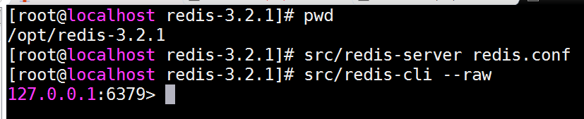

# 第十六单元 CMS系统中Redis应用

# 【授课重点】

1. 设计缓存的数据

2. CMS系统的首页10条热门文章的缓存设计与实现

3. CMS系统的首页10条最新文章的缓存设计与实现

   

# 【考核要求】

1. CMS系统的热门文章的设计与实现
2. CMS系统的最新文章的设计与实现

# 【教学内容】

## 16.1 课程导入

在CMS系统中，如何使用Redis缓存数据？本节主要使用Redis完成，CMS项目首页10条热门文章和10条最新文章的缓存设计和实现。

## 16.2 CMS项目配置Redis

配置pom.xml

```xml
		<!-- redis和spring整合包 -->
		<dependency>
			<groupId>org.springframework.data</groupId>
			<artifactId>spring-data-redis</artifactId>
			<version>1.8.7.RELEASE</version>
		</dependency>
		<!-- 连接redis -->
		<dependency>
			<groupId>redis.clients</groupId>
			<artifactId>jedis</artifactId>
			<version>2.9.0</version>
		</dependency>
```

配置Spring容器

```xml
<?xml version="1.0" encoding="UTF-8"?>
<beans xmlns="http://www.springframework.org/schema/beans"
	xmlns:xsi="http://www.w3.org/2001/XMLSchema-instance"
	xmlns:context="http://www.springframework.org/schema/context"
	xmlns:jdbc="http://www.springframework.org/schema/jdbc"
	xmlns:jee="http://www.springframework.org/schema/jee"
	xmlns:tx="http://www.springframework.org/schema/tx"
	xmlns:aop="http://www.springframework.org/schema/aop"
	xmlns:mvc="http://www.springframework.org/schema/mvc"
	xmlns:util="http://www.springframework.org/schema/util"
	xmlns:jpa="http://www.springframework.org/schema/data/jpa"
	xmlns:elasticsearch="http://www.springframework.org/schema/data/elasticsearch"
	xsi:schemaLocation="
		http://www.springframework.org/schema/beans http://www.springframework.org/schema/beans/spring-beans-4.1.xsd
		http://www.springframework.org/schema/context http://www.springframework.org/schema/context/spring-context-4.1.xsd
		http://www.springframework.org/schema/jdbc http://www.springframework.org/schema/jdbc/spring-jdbc-4.1.xsd
		http://www.springframework.org/schema/jee http://www.springframework.org/schema/jee/spring-jee-4.1.xsd
		http://www.springframework.org/schema/tx http://www.springframework.org/schema/tx/spring-tx-4.1.xsd
		http://www.springframework.org/schema/data/jpa http://www.springframework.org/schema/data/jpa/spring-jpa-1.3.xsd
		http://www.springframework.org/schema/aop http://www.springframework.org/schema/aop/spring-aop-4.1.xsd
		http://www.springframework.org/schema/mvc http://www.springframework.org/schema/mvc/spring-mvc-4.1.xsd
		http://www.springframework.org/schema/util http://www.springframework.org/schema/util/spring-util-4.1.xsd 
		http://www.springframework.org/schema/data/elasticsearch
		https://www.springframework.org/schema/data/elasticsearch/spring-elasticsearch-1.0.xsd">
	
	
	<!-- 配置redis的操作 -->
	<!-- redis连接池 -->
	<bean id="poolConfig" class="redis.clients.jedis.JedisPoolConfig">
		<property name="maxTotal" value="1024" />
		<property name="maxIdle" value="200" />
		<property name="testOnBorrow" value="true" />
	</bean>

	<!-- 连接池配置，类似数据库连接工厂 -->
	<bean id="jedisConnectionFactory"
		class="org.springframework.data.redis.connection.jedis.JedisConnectionFactory">
		<property name="hostName" value="192.168.79.133"></property>
		<property name="port" value="6379"></property>
		<property name="poolConfig" ref="poolConfig" />
	</bean>

	<!--redis操作模版,使用该对象可以操作redis -->
	<bean id="redisTemplate"
		class="org.springframework.data.redis.core.RedisTemplate">
		<property name="connectionFactory"
			ref="jedisConnectionFactory" />

		<!--如果不配置Serializer，那么存储的时候缺省使用String，如果用User类型存储，那么会提示错误User can't cast 
			to String！！ -->
		<property name="keySerializer">
			<bean
				class="org.springframework.data.redis.serializer.StringRedisSerializer" />
		</property>
		<!-- <property name="valueSerializer">
			<bean
				class="org.springframework.data.redis.serializer.JdkSerializationRedisSerializer" />
		</property> -->


		<property name="hashKeySerializer">
			<bean
				class="org.springframework.data.redis.serializer.StringRedisSerializer" />
		</property>
		
		<!-- <property name="hashValueSerializer">
			<bean
				class="org.springframework.data.redis.serializer.JdkSerializationRedisSerializer" />
		</property>  -->
		<!--开启事务 -->
		<!-- <property name="enableTransactionSupport" value="true" /> -->
	</bean>
</beans>
```

启动Redis

   


## **16.3 缓存热门文章**

**展示热门文章**

思路分析：

​		Redis中存放热门文章的数据，源于从Mysql数据库中查询的热门数据，故从Redis中获取数据之前，需要判断Redis中是否有对应的热门数据，如果没有，则从Mysql中查询出并存入Redis中，如果有，则直接获取，并发送给前台。

​		使用RedisTemplate模板对象，判断数据库中是否有数据，获取数据和存入数据。


编写service层代码：

```java
	
	@Resource
	private RedisTemplate<String, Article> redisTemplate;

	//最新文章分页
	@Override
	public PageInfo<Article> hostList(Integer page) {
		ListOperations<String, Article> opsForList = redisTemplate.opsForList();
		
		PageInfo pageInfo = null;
		
		if(redisTemplate.hasKey("hot_list")) {
			//之后访问，都从redis中获取，手动设置分页下标，开始下标和结束下标
			//开始下标	(page - 1) * size
			//结束下标	page * size - 1
			List<Article> list = opsForList.range("hot_list", (page - 1) * 10, page * 10 - 1);
			
			pageInfo = new PageInfo(list);
			//设置总条数
			Long size = opsForList.size("hot_list");
			pageInfo.setTotal(size);
			pageInfo.setPageNum(page);
			
		}else {

			//第一次访问时，从数据库中查询
			List<Article> listHot = articleMapper.listHot();
			//将数据存入redis中
			opsForList.rightPushAll("hot_list", listHot);
			
			//设置页码
			PageHelper.startPage(page, 10);
			//查询分页的数据
			List<Article>  list = articleMapper.listHot();
			
			pageInfo = new PageInfo(list);
		}
		
		
		return pageInfo;
	}
```


**修改热门文章**

思路分析：

​		如果有新的文章被设置为热门，则更新Redis中的数据，直接删除对应的键值对即可。

​		设置热门文章成功时，直接使用RedisTemplate模板对象将键值对删除即可。


编写service层代码：

```java
	//修改热门的状态
	@Override
	public int updateHot(Integer articleId, int status) {
		//设置热门
		int result = articleMapper.updateHot(articleId,status);
		
		if(result > 0) {
			//如果文章设置热门成功，则删除redis中最新文章
			redisTemplate.delete("hot_list");
		}
		
		return result;
	}
```


## **16.4 缓存最新文章**

**展示最新文章**

思路分析：

​		Redis中存放最新文章的数据，源于从Mysql数据库中查询的最新数据，故从Redis中获取数据之前，需要判断Redis中是否有对应的最新数据，如果没有，则从Mysql中查询出并存入Redis中，如果有，则直接获取，并发送给前台。

​		使用RedisTemplate模板对象，判断数据库中是否有数据，获取数据和存入数据。


编写service层代码：

```java

	@Resource
	private RedisTemplate<String, Article> redisTemplate;

	//获取最新文章的数目
	@Override
	public List<Article> last(int sum) {
		ListOperations<String, Article> opsForList = redisTemplate.opsForList();
		
		List<Article> listLast = null;
		
		if(redisTemplate.hasKey("last_list")) {
			//如果存在数据
			//3、以后再访问，直接从redis中获取数据
			listLast = opsForList.range("last_list", 0, -1);
			
		}else {
			//1、首次访问时，从数据库中获取数据
			listLast = articleMapper.listLast(sum);
			
			//2、将数据存入redis中		
			opsForList.rightPushAll("last_list", listLast);
		}
		
		return listLast;
	}
```


**修改最新文章**

思路分析：

​		如果有新的文章被审核通过，则更新Redis中的数据，直接删除对应的键值对即可。

​		审核文章通过成功时，直接使用RedisTemplate模板对象将键值对删除即可。


编写service层代码：

```java
	/**
	 * 审核文章
	 * @param articleId 文章ID
	 * @param status 审核后的状态 
	 * @return
	 */
	@Override
	public int updateStatus(Integer articleId, int status) {
		
		//审核文章
		int result = articleMapper.updateStatus(articleId,status);
		
		if(result > 0) {
			//如果文章审核成功，则删除redis中最新文章
			redisTemplate.delete("last_list");

		}
		
		return result;
	}
```


# 课堂练习

## 1.完成Redis缓存热门文章(30分钟)

## 2.完成Redis缓存最新文章(30分钟)

## 3.完成Redis缓存栏目和分类(40分钟)