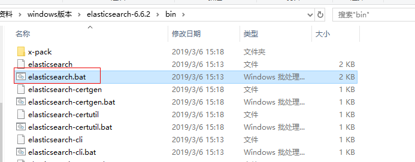
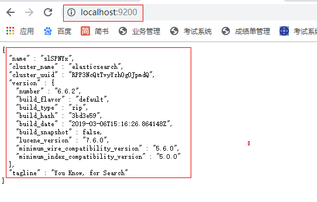
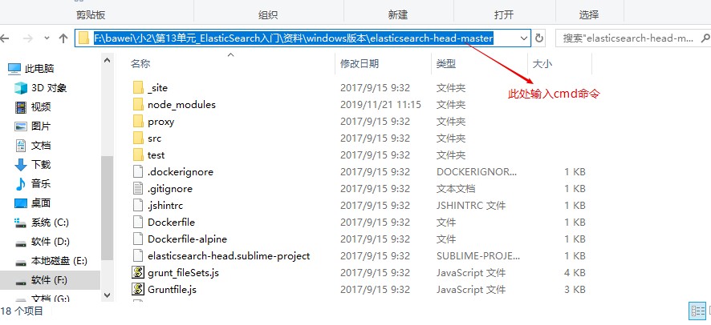
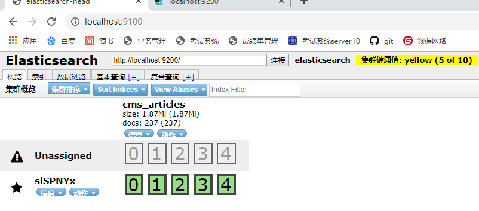
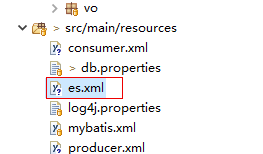
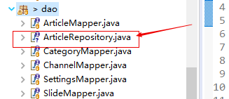
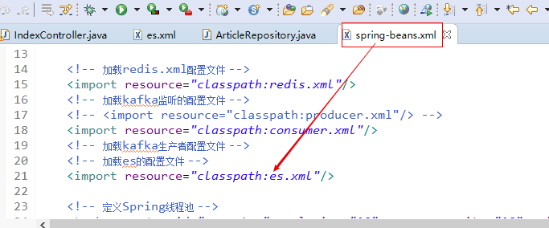
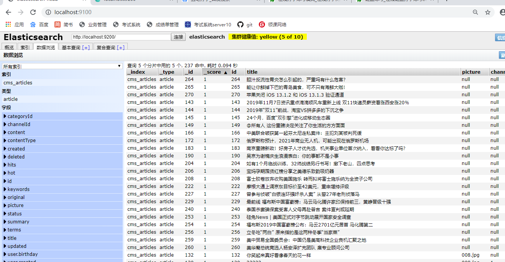
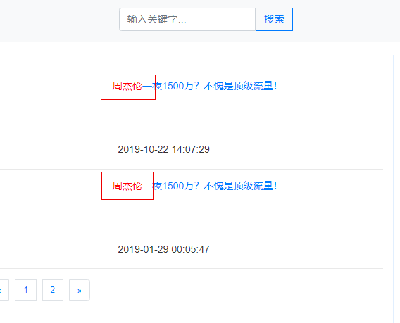

# 第17单元 CMS系统中ElasticSearch应用

# 【授课重点】

1. CMS系统采用ElasticSearch实现全文搜索

2. 高亮显示

# 【考核要求】

1. CMS系统采用ElasticSearch实现全文搜索

2. 高亮显示

# 【教学内容】

## 17.1 课程导入

### 17.1.1 es整合cms系统准备工作

1. 首先我们把之前启动cms系统所必须的程序启动起来

2. 启动redis

    

3. 启动我们将要整合进的ES服务(由于多数同学电脑配置跟不上,因此我们用windows版的es)

    

   启动成功后,我们访问localhost:9200 当浏览器出现如图界面表示启动成功

    

4. 紧接着我们启动head插件

   如图:

    

   下一步:

    

   我们在浏览器访问:

   localhost:9100 即可访问到!

    

## 17.2 CMS中整合ES

### 17.2.1 编写配置文件

es.xml

 

具体代码如下:

```xml
<?xml version="1.0" encoding="UTF-8"?>
<beans xmlns="http://www.springframework.org/schema/beans"
	xmlns:xsi="http://www.w3.org/2001/XMLSchema-instance"
	xmlns:elasticsearch="http://www.springframework.org/schema/data/elasticsearch"
	xmlns:context="http://www.springframework.org/schema/context"
	xsi:schemaLocation="http://www.springframework.org/schema/beans http://www.springframework.org/schema/beans/spring-beans.xsd
                            http://www.springframework.org/schema/data/elasticsearch http://www.springframework.org/schema/data/elasticsearch/spring-elasticsearch.xsd
                            http://www.springframework.org/schema/context http://www.springframework.org/schema/context/spring-context.xsd">
    
    <!-- 扫描Dao包，自动创建实例 -->
	<elasticsearch:repositories base-package="com.gaofei.cms.dao" />
	<!-- 扫描Service包，创建Service的实体 -->
	<!-- <context:component-scan base-package="com.bawei.service" /> --> <!-- 配置elasticSearch的连接 -->
	<!-- es提供了2个端口号:9200和9300
		9200:对浏览器暴露的端口号
		9300:是对java编程需要操作es所暴露的端口号
	 -->
	<elasticsearch:transport-client id="client"
		cluster-nodes="localhost:9300" /> <!-- spring data elasticSearcheDao 必须继承 ElasticsearchTemplate -->
		
	<bean id="elasticsearchTemplate"
		class="org.springframework.data.elasticsearch.core.ElasticsearchTemplate">
		<constructor-arg name="client" ref="client"></constructor-arg>
	</bean>
    
</beans>
```

### 17.2.2 声明实体类注解

代码如下:

```java
//@Document 文档对象 （索引信息、文档类型 ）
@Document(indexName="cms_articles",type="article") 
public class Article  implements Serializable{
    /**
	 * @fieldName: serialVersionUID
	 * @fieldType: long
	 * @Description: TODO
	 */
	private static final long serialVersionUID = 1L;
	@Id
	private Integer id;
//	1.是否索引:是否建立索引
	// 2.分词方式:是用的ik分词器的智能分词方式
	// 3.是否存储到索引库
	// 4.搜索框里的词,是否分词
	@Field(index=true,analyzer="ik_smart",store=true,searchAnalyzer="ik_smart",type = FieldType.text)
    private String title;
	
    private String picture;

    private Integer channelId;

    private Integer categoryId;

    private Integer userId;
    
    private User user;//文章发布人
    
    private List<ArticleVO> voList;//图片集
    
    private String terms;//文章标签
    
    
    private  String original;//文章来源
    private String keywords;//关键词
    
    

    public String getTerms() {
		return terms;
	}

	public void setTerms(String terms) {
		this.terms = terms;
	}

	public String getOriginal() {
		return original;
	}

	public void setOriginal(String original) {
		this.original = original;
	}

	public String getKeywords() {
		return keywords;
	}

	public void setKeywords(String keywords) {
		this.keywords = keywords;
	}

	private Integer hits;

    private Integer hot;

    private Integer status;

    private Integer deleted;

    private Date created;

    private Date updated;
    
    private Integer contentType;
    
  

	public Integer getContentType() {
		return contentType;
	}

	public void setContentType(Integer contentType) {
		this.contentType = contentType;
	}

	public List<ArticleVO> getVoList() {
		return voList;
	}

	public void setVoList(List<ArticleVO> voList) {
		this.voList = voList;
	}

	public Integer getId() {
        return id;
    }

    public void setId(Integer id) {
        this.id = id;
    }

    public String getTitle() {
        return title;
    }

    public void setTitle(String title) {
        this.title = title == null ? null : title.trim();
    }

    public String getPicture() {
        return picture;
    }

    public void setPicture(String picture) {
        this.picture = picture == null ? null : picture.trim();
    }

    public Integer getChannelId() {
        return channelId;
    }

    public void setChannelId(Integer channelId) {
        this.channelId = channelId;
    }

    public Integer getCategoryId() {
        return categoryId;
    }

    public void setCategoryId(Integer categoryId) {
        this.categoryId = categoryId;
    }

    public Integer getUserId() {
        return userId;
    }

    public void setUserId(Integer userId) {
        this.userId = userId;
    }

    public Integer getHits() {
        return hits;
    }

    public void setHits(Integer hits) {
        this.hits = hits;
    }

    public Integer getHot() {
        return hot;
    }

    public void setHot(Integer hot) {
        this.hot = hot;
    }

    public Integer getStatus() {
        return status;
    }

    public void setStatus(Integer status) {
        this.status = status;
    }

    public Integer getDeleted() {
        return deleted;
    }

    public void setDeleted(Integer deleted) {
        this.deleted = deleted;
    }

    public Date getCreated() {
        return created;
    }

    public void setCreated(Date created) {
        this.created = created;
    }

    public Date getUpdated() {
        return updated;
    }

    public void setUpdated(Date updated) {
        this.updated = updated;
    }

	public User getUser() {
		return user;
	}

	public void setUser(User user) {
		this.user = user;
    }
}

public class ArticleWithBLOBs extends Article   implements Serializable{
    /**
	 * @fieldName: serialVersionUID
	 * @fieldType: long
	 * @Description: TODO
	 */
	private static final long serialVersionUID = 1L;
	@Field(index=true,analyzer="ik_smart",store=true,searchAnalyzer="ik_smart",type = FieldType.text)
	private String content;

    private String summary;

    public String getContent() {
        return content;
    }

    public void setContent(String content) {
        this.content = content == null ? null : content.trim();
    }

    public String getSummary() {
        return summary;
    }

    public void setSummary(String summary) {
        this.summary = summary == null ? null : summary.trim();
    }
}
```

### 17.2.3 编写dao层接口

 

```java
//继承完了之后,具备了CRUD的操作
public interface ArticleRepository extends ElasticsearchRepository<ArticleWithBLOBs, Integer> {
	//实现复杂查询
	//按照标题查询,方法名称一定要按照规则写
	List<ArticleWithBLOBs> findByTitle(String key);
    
    //按照标题或者内容查询,方法名称一定要按照规则写
	List<ArticleWithBLOBs> findByTitleOrContent(String title,String content);
    
}
```

### 17.2.3 让spring容器加载es配置

 

## 17.3 编写Controller层代码

```java
/**
	 * es搜索的方法
	 * 
	 */
	@RequestMapping("search")
	public String search(String key, Model model, @RequestParam(defaultValue = "1") Integer page,
			@RequestParam(defaultValue = "2") Integer pageSize) {
		long start = System.currentTimeMillis();

//		List<ArticleWithBLOBs> list = articleRepository.findByTitle(key);
		// 高亮查询想要的结果
		AggregatedPage<?> selectObjects = ESUtils.selectObjects(elasticsearchTemplate, Article.class, page, pageSize,
				new String[] { "title" }, key);
		List<?> list = selectObjects.getContent();

		long end = System.currentTimeMillis();
		System.err.println("搜索耗时:" + (end - start));
		System.err.println(key);
//		System.err.println(list.get(0).getTitle());
		String pages = PageUtil.page(page, (int) selectObjects.getTotalElements(), "/search?key=" + key, pageSize);

		model.addAttribute("pages", pages);
		model.addAttribute("hotArticles", list);
		return "index/index";
	}

```

**关于ESutil参见下面代码:**

```java
// 查询操作
	public static AggregatedPage<?> selectObjects(ElasticsearchTemplate elasticsearchTemplate, Class<?> clazz, Integer page,
			Integer rows, String fieldNames[], String value) {
		AggregatedPage<?> pageInfo = null;
		// 创建Pageable对象
		Pageable pageable = PageRequest.of(page - 1, rows, Sort.by(Sort.Direction.ASC, "id"));
		//查询对象
		SearchQuery query = null;
		//查询条件高亮的构建对象
		QueryBuilder queryBuilder = null;
		
		if (value != null && !"".equals(value)) {
			// 高亮拼接的前缀与后缀
			String preTags = "<font color=\"red\">";
			String postTags = "</font>";

			// 定义创建高亮的构建集合对象
			HighlightBuilder.Field highlightFields[] = new HighlightBuilder.Field[fieldNames.length];

			for (int i = 0; i < fieldNames.length; i++) {
				// 这个代码有问题
				highlightFields[i] = new HighlightBuilder.Field(fieldNames[i]).preTags(preTags).postTags(postTags);
			}

			// 创建queryBuilder对象
			queryBuilder = QueryBuilders.multiMatchQuery(value, fieldNames);
			query = new NativeSearchQueryBuilder().withQuery(queryBuilder).withHighlightFields(highlightFields)
					.withPageable(pageable).build();

			pageInfo = elasticsearchTemplate.queryForPage(query, clazz, new SearchResultMapper() {

				@Override
				public <T> AggregatedPage<T> mapResults(SearchResponse response, Class<T> clazz, Pageable pageable) {

					List<T> content = new ArrayList<T>();
					long total = 0l;

					try {
						// 查询结果
						SearchHits hits = response.getHits();
						if (hits != null) {
							//获取总记录数
							total = hits.getTotalHits();
							// 获取结果数组
							SearchHit[] searchHits = hits.getHits();
							// 判断结果
							if (searchHits != null && searchHits.length > 0) {
								// 遍历结果
								for (int i = 0; i < searchHits.length; i++) {
									// 对象值
									T entity = clazz.newInstance();

									// 获取具体的结果
									SearchHit searchHit = searchHits[i]; 

									// 获取对象的所有的字段
									Field[] fields = clazz.getDeclaredFields();

									// 遍历字段对象
									for (int k = 0; k < fields.length; k++) {
										// 获取字段对象
										Field field = fields[k];
										// 暴力反射
										field.setAccessible(true);
										// 字段名称
										String fieldName = field.getName();
										if (!fieldName.equals("serialVersionUID")&&!fieldName.equals("user")) {
											HighlightField highlightField = searchHit.getHighlightFields()
													.get(fieldName);
											if (highlightField != null) {
												// 高亮 处理 拿到 被<font color='red'> </font>结束所包围的内容部分
												String value = highlightField.getFragments()[0].toString();
												// 注意一下他是否是 string类型
												field.set(entity, value);
											} else {
												//获取某个字段对应的 value值
												Object value = searchHit.getSourceAsMap().get(fieldName);
												System.out.println(value);
												// 获取字段的类型
												Class<?> type = field.getType();
												if (type == Date.class) {
													// bug
													if(value!=null) {
														field.set(entity, new Date(Long.valueOf(value + "")));
													}
												} else {
													field.set(entity, value);
												}
											}
										}
									}

									content.add(entity);
								}
							}
						}
					} catch (Exception e) {
						e.printStackTrace();
					}

					return new AggregatedPageImpl<>(content, pageable, total);
				}
			});

		} else {
			// 没有查询条件的的时候，获取es中的全部数据 分页获取
			query = new NativeSearchQueryBuilder().withPageable(pageable).build();
			pageInfo = elasticsearchTemplate.queryForPage(query, clazz);
		}


		return pageInfo;
	}
```

## 17.4 编写前端代码


```html
	<!-- 搜索框：在专业高级二学完ElasticSearch后实现 -->
		<form action="/search" class="form-inline">
			<div class="input-group">
				<input type="text" name="key" class="form-control"
					placeholder="输入关键字..." aria-label="key"
					aria-describedby="basic-addon1">
				<div class="input-group-prepend">
					<button class="input-group-btn btn btn-outline-primary"
						id="basic-addon1">搜索</button>
				</div>
			</div>
		</form>
```

此时我们就已经利用es实现的搜索

**注意:从es中查询文章的数据,我们还没有.于是我们要写一个测试类从mysql中查询文章数据,然后导入到es索引库**


```java
@RunWith(SpringJUnit4ClassRunner.class)
@ContextConfiguration(locations="classpath:spring-beans.xml")
public class ImportMysqlDB2Es {

	@Autowired
	ArticleMapper articleMapper;
	@Autowired
	ArticleRepository articleRepository;
	//1.解决com.fasterxml.jackson.core.Versioned
	//	1.1到pom里粘贴解决冲突的依赖
	//2.到pom里修改<validator.version>5.1.0.Final</validator.version>
	//3.到pom里修改jetty版本:   9.4.9.v20180320
	@Test
	public void testImport() {
		List<ArticleWithBLOBs> selects = articleMapper.selects(null);
		System.out.println(selects);
		articleRepository.saveAll(selects);
	}
}
```

导入成功,效果如图:

 

最终我们就可以实现搜索的高亮显示!!

如图:

 

# 课堂练习:

## 1.完成上课cms整合es的操作,实现高亮显示(40分钟)