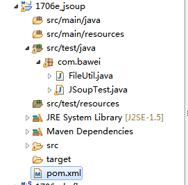
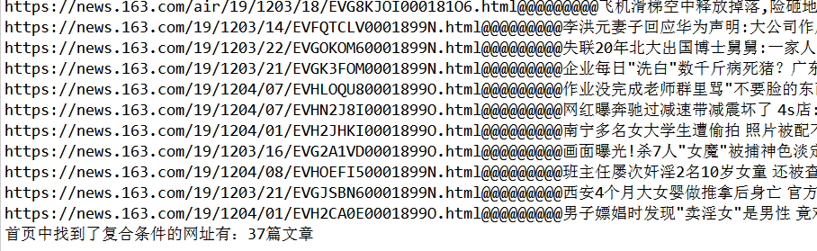
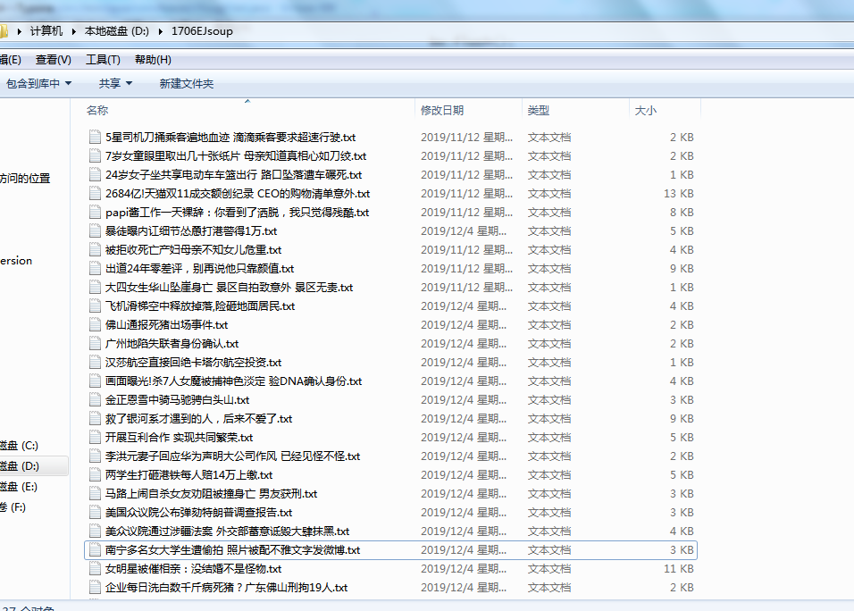

# 第十八单元 CMS系统中Kafka应用

# 【授课重点】

1. Jsoup工具的使用

2. CMS系统中Kafka生产者的使用

3. CMS系统中Kafka消费者的使用


# 【考核要求】

1. Jsoup工具的使用
2. CMS系统中Kafka生产者的使用
3. CMS系统中Kafka消费者的使用

# 【教学内容】

## 18.1 课程导入

在CMS系统中，如何使用Kafka导入数据？本节主要使用Jsoup工具爬取文章，通过Kafka将文章数据导入到数据库中。

## 18.2 Jsoup工具的使用

jsoup 是一款Java 的HTML解析器，可直接解析某个URL地址、HTML文本内容。它提供了一套非常省力的API，可通过DOM，CSS以及类似于jQuery的操作方法来取出和操作数据。

创建maven项目

   

配置pom.xml

```xml
  	<dependencies>
		<dependency>
			<groupId>org.jsoup</groupId>
			<artifactId>jsoup</artifactId>
			<version>1.12.1</version>
		</dependency>
		<dependency>
			<groupId>junit</groupId>
			<artifactId>junit</artifactId>
			<version>4.12</version>
		</dependency>
	</dependencies>
```

创建测试类

```java
package com.bawei;

import java.io.IOException;
import java.util.regex.Pattern;

import org.jsoup.Connection;
import org.jsoup.Jsoup;
import org.jsoup.nodes.Document;
import org.jsoup.nodes.Element;
import org.jsoup.select.Elements;
import org.junit.Test;

public class JSoupTest {
	
	@Test
	public void test163() throws IOException {
		// 记录文章数
		int count = 0;
		// 获取连接对象
		Connection connect = Jsoup.connect("https://news.163.com/");
		// 获取文档对象
		Document document = connect.get();
		// 获取当前文档的所有超链接
		Elements ahrefs = document.select("a[href]");
		// 遍历元素对象
		for (Element href : ahrefs) {
			// 超链接的url地址
			String url = href.attr("href");
			// 定义表达式 https://news.163.com ***** html

//			String regex = "https://news\\\\.163\\\\.com.*html$";
			
			//以https://news.163.com开头，以html结尾
			//https://news\\.163\\.com.*html$
			// 特殊要求  
			if (url != null && url.startsWith("https://news.163.com") && url.endsWith("html")) {
//			if (url != null && Pattern.matches(regex, url)) {
				// 连接的文本内容
				String title = href.text();
				System.out.println(url + "@@@@@@@@@" + title);
				count++;
				
				// 获取文章的文档对象
				Document articleDoc = Jsoup.connect(url).get();
				// 获取文章的内容元素对象
				Element articleContentElement = articleDoc.getElementById("content");
				// 判断元素是否为空
				if (articleContentElement != null) {
					// 获取纯文本内容
					String content = articleContentElement.text();
					
					//去除标题中的特殊符号
					title = title.replace("?", "").replace("\"", "").replace(":", "").replace("/", "").replace("\\", "");
					
					//写入到文件中
					FileUtil.writeFile("D:\\1706EJsoup\\" + title + ".txt", content, "utf8");
				}
			}
		}
		System.out.println("首页中找到了复合条件的网址有：" + count + "篇文章");
	}
}

```

导入工具类

```java
package com.bawei;

import java.io.BufferedWriter;
import java.io.File;
import java.io.FileOutputStream;
import java.io.IOException;
import java.io.OutputStreamWriter;

/**
 * 
 *
 */
public class FileUtil {

	/***
	 * @Title: writeFile * @Description: 按照指定的编码把内容写入指定的文件中 * @param path * @param
	 *         content * @param charset * @throws IOException * @return: void
	 */
	public static void writeFile(String path, String content, String charset) throws IOException {
		// 创建写入的文件
		File file = new File(path);
		// 创建输出流对象
		BufferedWriter bw = new BufferedWriter(new OutputStreamWriter(new FileOutputStream(file), charset));
		bw.write(content);
		bw.flush();
		bw.close();
	}
}

```

运行测试类结果为

  

   


## **18.3 CMS系统中Kafka生产者的使用**

通过工具类读取文件数据，将数据封装成Article对象，并将其装换成json字符串，生产者将json字符串发送到kafka。


配置pom.xml

```xml
		<!-- kafka和spring的整合包 -->
		<dependency>
			<groupId>org.springframework.kafka</groupId>
			<artifactId>spring-kafka</artifactId>
			<version>2.2.0.RELEASE</version>
		</dependency>

		<!-- kafka的依赖包 -->
		<dependency>
			<groupId>org.apache.kafka</groupId>
			<artifactId>kafka_2.10</artifactId>
			<version>0.8.2.1</version>
			<exclusions>
				<exclusion>
					<artifactId>jmxri</artifactId>
					<groupId>com.sun.jmx</groupId>
				</exclusion>
				<exclusion>
					<artifactId>jms</artifactId>
					<groupId>javax.jms</groupId>
				</exclusion>
				<exclusion>
					<artifactId>jmxtools</artifactId>
					<groupId>com.sun.jdmk</groupId>
				</exclusion>
			</exclusions>
		</dependency>

```


配置Spring容器

```xml
<?xml version="1.0" encoding="UTF-8"?>
<beans xmlns="http://www.springframework.org/schema/beans"
	xmlns:xsi="http://www.w3.org/2001/XMLSchema-instance"
	xmlns:aop="http://www.springframework.org/schema/aop"
	xmlns:context="http://www.springframework.org/schema/context"
	xmlns:tx="http://www.springframework.org/schema/tx"
	xsi:schemaLocation="http://www.springframework.org/schema/beans http://www.springframework.org/schema/beans/spring-beans.xsd
		http://www.springframework.org/schema/context http://www.springframework.org/schema/context/spring-context.xsd
		http://www.springframework.org/schema/aop http://www.springframework.org/schema/aop/spring-aop.xsd
		http://www.springframework.org/schema/tx http://www.springframework.org/schema/tx/spring-tx.xsd">


	<!-- 1、注解扫描器 -->
	<!-- todo -->
	<context:component-scan base-package="com.bawei" >
		<!-- 排除要要扫描的controller -->
		<context:exclude-filter type="annotation"
			expression="org.springframework.stereotype.Controller" />

	</context:component-scan>

	<!--2、 指定外部属性文件的位置 -->
	<context:property-placeholder
		location="classpath:db.properties" />

	<!-- 3.使用druid数据源 连接池 -->
	<bean id="dataSource" 
		class="com.alibaba.druid.pool.DruidDataSource">
		<property name="driverClassName" value="${jdbc.driver}">
		</property>
		<property name="url" value="${jdbc.url}">
		</property>
		<property name="username" value="${jdbc.username}">
		</property>
		<property name="password" value="${jdbc.password}">
		</property>
	</bean>


	<!--4、 配置mybatis SqlSessionFactory -->
	<bean id="sqlSessionFactory"
		class="org.mybatis.spring.SqlSessionFactoryBean" scope="singleton" autowire="default">
		<!-- 注入数据源 -->
		<property name="dataSource" ref="dataSource"></property>
		<!-- 关联mybatis配置文件 -->
		<!-- todo -->
		<property name="configLocation" value="classpath:mybatis.xml"></property>
	    <property name="mapperLocations" value="classpath:mybatis/*.xml"></property>
	
	</bean>

	<!--5、 配置jdbc事务管理器 -->
	<bean id="transactionManager"
		class="org.springframework.jdbc.datasource.DataSourceTransactionManager">
		<property name="dataSource" ref="dataSource"></property>
	</bean>


	<!--6、 配置事务 transaction-manager:表示关联的事务管理器是谁 -->
	<tx:advice transaction-manager="transactionManager"
		id="txAdvice">
		<!-- 事务属性配置 -->
		<tx:attributes>
			<!-- 以find.select get开头的方法为只读事务，用来提高数据库的性能 -->
			<tx:method name="find*" read-only="true" />
			<tx:method name="select*" read-only="true" />
			<tx:method name="get*" read-only="true" />
			<tx:method name="load*" read-only="true" />
			<tx:method name="list*" read-only="true" />
			<!-- 其他的方法为默认事务 -->
			<tx:method name="*" propagation="REQUIRED" />
		</tx:attributes>
	</tx:advice>
	<!-- 7、配置aop -->
	<aop:config>
		<!-- 配置切点表达式 -->
		<!-- todo -->
		<aop:pointcut
			expression="execution(* com.bawei.service.impl.*.*(..))" id="pointcut" />
		<!-- 关联事务 -->
		<aop:advisor advice-ref="txAdvice" pointcut-ref="pointcut" />

	</aop:config>

	<!--8 扫描mapper -->

	<bean class="org.mybatis.spring.mapper.MapperScannerConfigurer">
		<!-- basePackage :mapper接口所在的包 -->
		<!-- todo -->
		<property name="basePackage" value="com.bawei.dao"></property>

	</bean>


	<!-- 导入kafka -->
	<import resource="spring-kafka-*.xml"/>

</beans>

```


spring-kafka-producer.xml内容如下

```xml
<?xml version="1.0" encoding="UTF-8"?>
<beans xmlns="http://www.springframework.org/schema/beans"
	xmlns:xsi="http://www.w3.org/2001/XMLSchema-instance"
	xmlns:aop="http://www.springframework.org/schema/aop"
	xmlns:context="http://www.springframework.org/schema/context"
	xmlns:tx="http://www.springframework.org/schema/tx"
	xmlns:p="http://www.springframework.org/schema/p"
	xsi:schemaLocation="http://www.springframework.org/schema/beans http://www.springframework.org/schema/beans/spring-beans.xsd
		http://www.springframework.org/schema/context http://www.springframework.org/schema/context/spring-context-4.3.xsd
		http://www.springframework.org/schema/aop http://www.springframework.org/schema/aop/spring-aop-4.3.xsd
		http://www.springframework.org/schema/tx http://www.springframework.org/schema/tx/spring-tx-4.3.xsd">

	<!-- 定义HashMap集合 Key-Value --> <!--参数配置 -->
	<bean id="producerProperites" class="java.util.HashMap">
		<constructor-arg>
			<map><!-- kafka服务地址，可能是集群 value="localhost:9092,localhost:9093,localhost:9094" -->
			
				<entry key="bootstrap.servers" value="192.168.79.133:9092" />
				
				
				<!-- 有可能导致broker接收到重复的消息 -->
				<entry key="retries" value="0" />
				<!-- 每次批量发送消息的数量 -->
				<entry key="batch.size" value="1638" />
				<!-- 默认0ms，在异步IO线程被触发后（任何一个topic，partition满都可以触发） -->
				<entry key="linger.ms" value="1" />
				<!--producer可以用来缓存数据的内存大小。如果数据产生速度大于向broker发送的速 度，producer会阻塞或者抛出异常 -->
				<entry key="buffer.memory" value="33554432 " />

				<!-- key的序列化方式 -->
				<entry key="key.serializer"
					value="org.apache.kafka.common.serialization.StringSerializer" />
				<!-- value的序列化方式 -->
				<entry key="value.serializer"
					value="org.apache.kafka.common.serialization.StringSerializer" />
			</map>
		</constructor-arg>
	</bean>

	<!-- 生产工厂对象 -->
	<bean id="producerFactory"
		class="org.springframework.kafka.core.DefaultKafkaProducerFactory">
		<constructor-arg ref="producerProperites" />
	</bean>


	<!-- 创建kafka的模板对象 -->
	<bean id="kafkaTemplate"
		class="org.springframework.kafka.core.KafkaTemplate">
		<constructor-arg ref="producerFactory" />
		<!--设置对应topic -->
		<property name="defaultTopic" value="1706E" />
	</bean>

</beans>

```

编写测试类

```java
package com.bawei.service.kafka;

import java.io.IOException;
import java.util.Date;
import java.util.List;

import javax.annotation.Resource;

import org.junit.Test;
import org.junit.runner.RunWith;
import org.springframework.kafka.core.KafkaTemplate;
import org.springframework.test.context.ContextConfiguration;
import org.springframework.test.context.junit4.SpringJUnit4ClassRunner;

import com.bawei.entity.Article;
import com.bawei.entity.Cat;
import com.bawei.entity.Channel;
import com.bawei.service.CatService;
import com.bawei.service.ChannelService;
import com.bawei.test.FileUtils;
import com.bawei.test.RandomUtil;
import com.google.gson.Gson;

@RunWith(SpringJUnit4ClassRunner.class)
@ContextConfiguration("classpath:spring-beans.xml")
public class KafkaProducerTest {

//	(1)使用工具包中流工具方法读取文件，不得乱码。
//	(2)将文件名作为Article对象的title属性值。
//	(3)文本内容作为Article对象的content属性值。
//	(4)在文本内容中截取前140个字作为摘要。
//	(5)“点击量”和“是否热门”、“频道”字段要使用随机值。
//	(6)文章发布日期从2019年1月1日模拟到今天。
//	(7)其它的字段随便模拟。
//	(8)编写Kafka生产者，然后将生成Article对象通过Kafka发送到消费端。
//	(9)编写Kafka消费者，将接到的数据保存到CMS项目数据库。
	
	
	
	@Resource
	private ChannelService channelServie;
	
	@Resource
	private CatService catService;
	
	@Resource
	private KafkaTemplate<String, String> kafkaTemplate;
	
	
	
	@Test
	public void sendTest() throws IOException {
//		(1)使用工具包中流工具方法读取文件，不得乱码。
		List<String> fileList = FileUtils.getFileList("D:\\1706EJsoup");
		
		for (String file_name : fileList) {
			//获取文件内容
			String content = FileUtils.readFileByLine(file_name);
			
			Article article = new Article();
//		(2)将文件名作为Article对象的title属性值。
			//从文件路径中截取出文章名
			String fileName = file_name.substring(file_name.lastIndexOf("\\") + 1, file_name.lastIndexOf("."));
			article.setTitle(fileName);
//		(3)文本内容作为Article对象的content属性值。
			article.setContent(content);
//		(4)在文本内容中截取前140个字作为摘要。
			
			String abs = null;
			if(content.length() <= 140) {
				abs = content;
			}else {
				abs = content.substring(0, 140);
			}
			
//		(5)“点击量”和“是否热门”、“频道”字段要使用随机值。
			//点击量
			article.setHits(RandomUtil.random(0, 100000));
			
			//是否热门 0 1
			article.setHot(RandomUtil.random(0, 1));
			
			//获取所有栏目数据
			List<Channel> allChnls = channelServie.getAllChnls();
			//获取随机下标
			int ch_index = RandomUtil.random(0, allChnls.size() - 1);
			
			//设置随机栏目
			Channel channel = allChnls.get(ch_index);
			article.setChannelId(channel.getId());
			
			
			//根据栏目id查询所属分类
			List<Cat> catList = catService.getListByChnlId(channel.getId());
			
			if(catList != null && catList.size() > 0) {
				//获取随机下标
				int cat_index = RandomUtil.random(0, catList.size() - 1);
			
				//获取分类id
				Cat cat = catList.get(cat_index);
				article.setCategoryId(cat.getId());
			}
			
			
//		(6)文章发布日期从2019年1月1日模拟到今天。
			Date date = RandomUtil.randomDate("2019-01-01", "2019-11-20");
				
			article.setCreated(date);
			
//		(7)其它的字段随便模拟。
//		(8)编写Kafka生产者，然后将生成Article对象通过Kafka发送到消费端。
			
			Gson gson = new Gson();
			String json = gson.toJson(article);
			
			kafkaTemplate.sendDefault("article_"+System.currentTimeMillis(), json);
			
		}
		
		System.out.println("发送完毕");
	}
	
}
```


## **18.4 CMS系统中Kafka消费者的使用**

配置Spring容器，spring-kafka-consumer.xml内容如下

```xml

<?xml version="1.0" encoding="UTF-8"?>
<beans xmlns="http://www.springframework.org/schema/beans"
	xmlns:xsi="http://www.w3.org/2001/XMLSchema-instance"
	xmlns:aop="http://www.springframework.org/schema/aop"
	xmlns:context="http://www.springframework.org/schema/context"
	xmlns:tx="http://www.springframework.org/schema/tx"
	xmlns:p="http://www.springframework.org/schema/p"
	xsi:schemaLocation="http://www.springframework.org/schema/beans http://www.springframework.org/schema/beans/spring-beans.xsd
		http://www.springframework.org/schema/context http://www.springframework.org/schema/context/spring-context-4.3.xsd
		http://www.springframework.org/schema/aop http://www.springframework.org/schema/aop/spring-aop-4.3.xsd
		http://www.springframework.org/schema/tx http://www.springframework.org/schema/tx/spring-tx-4.3.xsd">


	<!-- 配置HashMap Key-Value键值对 -->
	<bean id="consumerProperties" class="java.util.HashMap">
		<constructor-arg>
			<map>
				<!--Kafka服务地址 -->
				<entry key="bootstrap.servers" value="192.168.79.133:9092" />

				<!--Consumer的组ID，相同group.id的consumer属于同一个组。 -->
				<entry key="group.id" value="test-consumer-group" />
				<!--如果此值设置为true，consumer会周期性的把当前消费的offset值保存到 zookeeper。当consumer失败重启之后将会使用此值作为新开始消费的值。 -->
				<entry key="enable.auto.commit" value="true" />
				<!--网络请求的socket超时时间。实际超时时间由max.fetch.wait + socket.timeout.ms 确定 -->
				<entry key="session.timeout.ms" value="15000 " />

				<!-- 反序列化操作 -->
				<entry key="key.deserializer"
					value="org.apache.kafka.common.serialization.StringDeserializer" />
				<entry key="value.deserializer"
					value="org.apache.kafka.common.serialization.StringDeserializer" />
			</map>
		</constructor-arg>
	</bean>
	<!-- 配置消费者的属性工厂 -->
	<bean id="kafkaConsumerFactory"
		class="org.springframework.kafka.core.DefaultKafkaConsumerFactory">
		<constructor-arg ref="consumerProperties" />
	</bean>

	<!-- 配置属性 -->
	<bean id="consumerContainerProperties"
		class="org.springframework.kafka.listener.ContainerProperties">
		<!-- 构造函数 就是 主题的参数值 -->
		<constructor-arg value="1706E" />
		<property name="messageListener" ref="kafkaConsumerListener" />
	</bean>

	<!-- 配置conusmerContainer监听对象 -->
	<bean id="conusmerContainer"
		class="org.springframework.kafka.listener.KafkaMessageListenerContainer">
		<constructor-arg ref="kafkaConsumerFactory" />
		<constructor-arg ref="consumerContainerProperties" />
	</bean>


</beans>

```


创建监听器，编写监听器代码：

```java
package com.bawei.listener;

import javax.annotation.Resource;

import org.apache.kafka.clients.consumer.ConsumerRecord;
import org.springframework.data.elasticsearch.core.ElasticsearchTemplate;
import org.springframework.data.elasticsearch.core.query.IndexQuery;
import org.springframework.kafka.listener.MessageListener;
import org.springframework.stereotype.Component;

import com.bawei.entity.Article;
import com.bawei.service.ArticleService;
import com.google.gson.Gson;

@Component
public class KafkaConsumerListener implements MessageListener<String, String>{

	@Resource
	private ArticleService articleService;
	
	@Resource
	private ElasticsearchTemplate elasticsearchTemplate;
	
	@Override
	public void onMessage(ConsumerRecord<String, String> record) {
		
		//获取数据
		String key = record.key();
		
		if(key != null && key.startsWith("article_")) {
			String json = record.value();
			
			//转换成Article对象
			Gson gson= new Gson();
			Article article = gson.fromJson(json, Article.class);
			
			//存入数据库
			articleService.addFromKafka(article);

		}
	}
}
```

创建测试类，并启动

```java
package com.bawei.service.kafka;

import org.springframework.context.support.ClassPathXmlApplicationContext;

public class kafkaConsumerTest {
	
	public static void main(String[] args) {
		
		new ClassPathXmlApplicationContext("spring-beans.xml");
	}
}

```


# 课堂练习

## 1.使用Jsoup完成新闻文章的爬取(30分钟)

## 2.完成Kafka生产者与CMS的整合(30分钟)

## 3.完成Kafka消费者与CMS的整合(30分钟)