# 第19单元  cms系统再Linux中的部署

# 【授课重点】

1. Linux中搭建JDK环境

2. Linux中搭建Tomcat环境

3. Linux中搭建MySQL环境

4. Maven打包详解

5. 项目部署到Linux系统中

# 【考核要求】

1. Linux中搭建JDK环境

2. Linux中搭建Tomcat环境

3. Linux中搭建MySQL环境

4. Maven打包详解

5. 项目部署到Linux系统中

# 【教学内容】

## 19.1 课程导入

我们的项目开发完毕后,在实际生产环境中,鉴于linux系统的稳定,高效的特点,通常我们把项目部署到linux!!

## 19.2 Linux中搭建JDK环境

**参考:第4单元 linux软件安装教案**

## 19.3 Linux中搭建Tomcat环境

**参考:第4单元 linux软件安装教案**

## 19.4 Linux中搭建MySQL环境

**参考:第4单元 linux软件安装教案**

## 19.5 CMS部署的详细步骤

1. 从windows的mysql中导出数据

2. 将导出的数据导入到linux的mysql数据库

3. 再cms系统中修改mysql的连接ip,密码修改成linux中mysql**的密码** **注意:linux中不支持 \   只支持/,所以把\替换成/ **

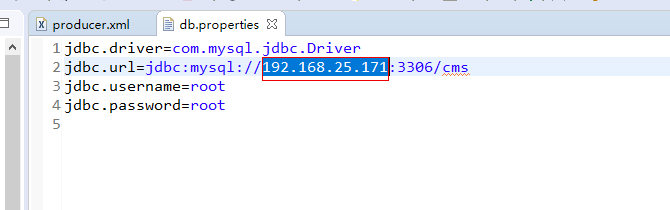 

4. 打包项目:

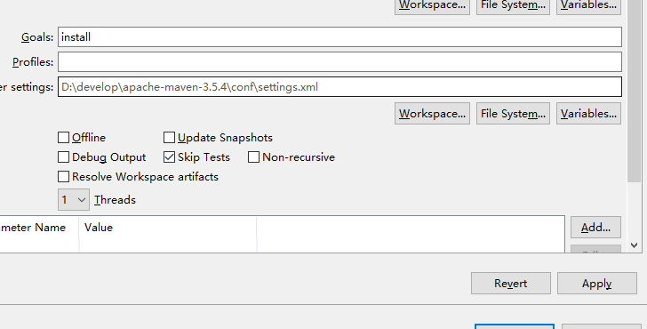 

5. 到控制台如图所示的路径下找war包

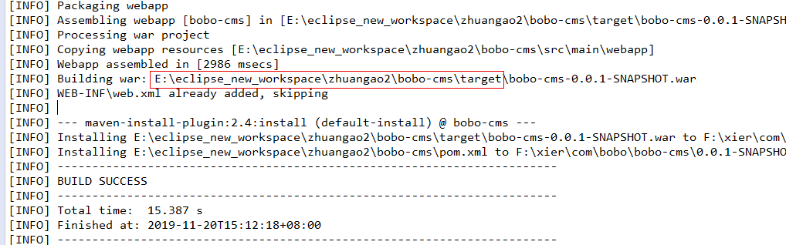 

6. 重命名war包

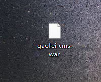  

7. 上传war包

​	7.1 进入tomcat的webapps目录

 

​	7.2上传

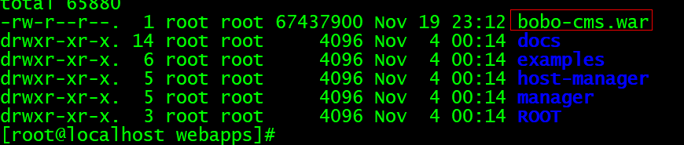 

8. 由于咱们的项目是依赖redis,kafka,es,因此我们要先启动这3个服务

9. 进入到tomcat的conf目录下,编辑**server.xml**  再指定位置加入一句话

```xml
<Context docBase="/usr/local/src/java/apache-tomcat-8.0.21/webapps/bobo-cms" path="/" reloadable="true"/>

```

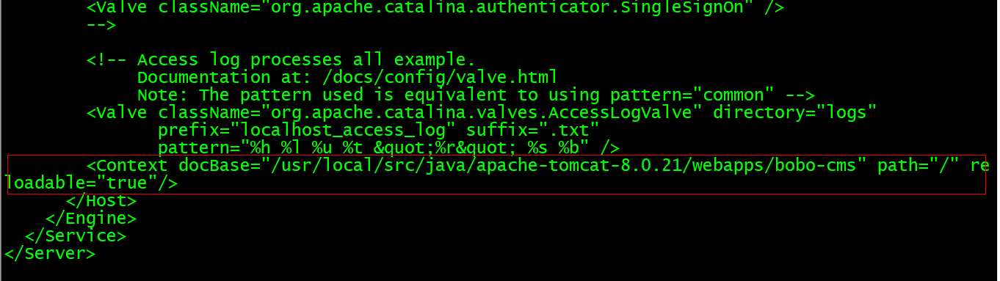 

10. 启动完这3个服务之后,我们进入tomcat的bin目录启动tomcat(注意,tomcat每次启动前,要先关闭tomcat,防止端口号被占用)

​	10.1 先关闭

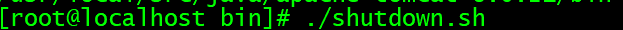 

​	10.2 再开启

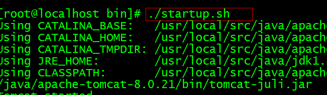 

启动后效果:如图

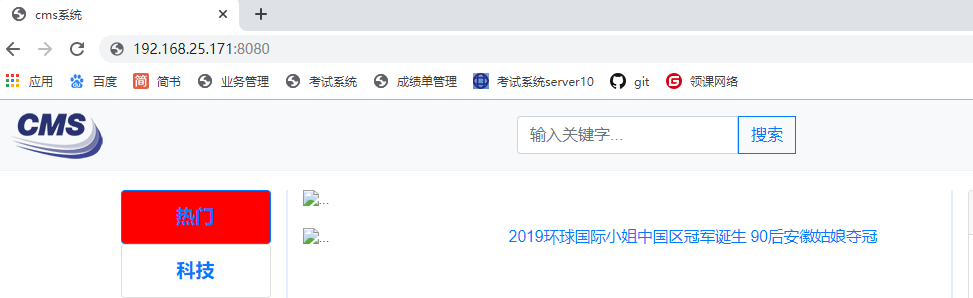 

部署之后,我们发现浏览器地址栏的ip地址非常丑陋,因此,我们可以通过配置windows的hosts文件的方式,来本地映射一个临时地址

1. 邮件如图所示的软件以管理员身份运行

   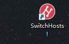 

2. 打开后添加如图配置

   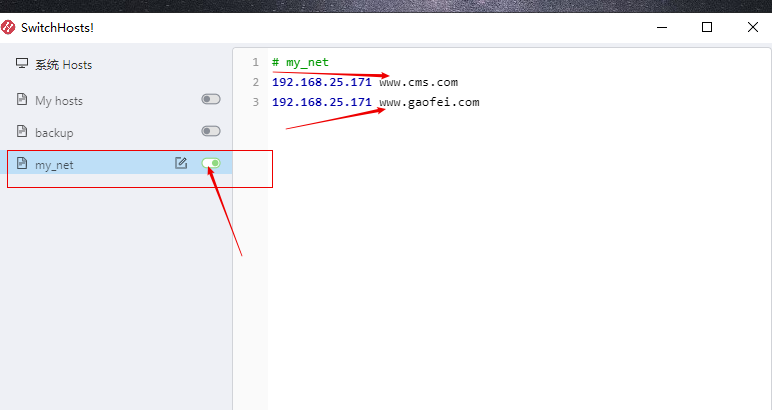 

3. 关闭浏览器,重新启动浏览器,此时我们访问www.cms.com:8080

   效果如图:

   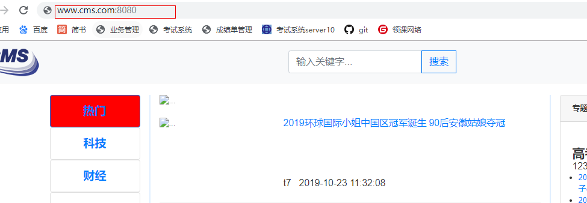 

# 课堂练习:

1. 完成cms项目在linux中的部署(40分钟)