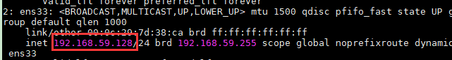
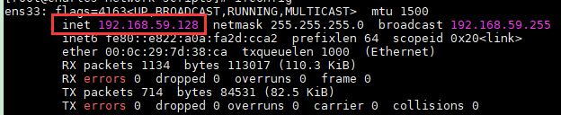
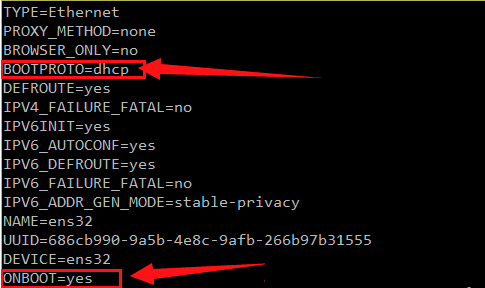
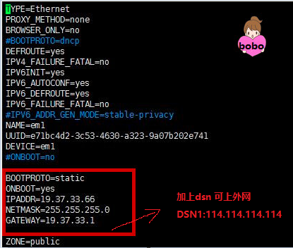

# 第一单元 Linux概述

# 【授课重点】

1. Linux系统的背景知识
2. Linux系统的安装及Linux的系统目录结构
3. Linux系统中的基础命令（比如:cd、Exit、ifconfig、Reboot等）

# 【考核要求】

1. 了解Linux系统
2. linux系统的安装
3. linux系统的目录及含义
4. linux系统的基础命令

# 【教学内容】

## 1.1 课程导入

### 1.1.1 为什么要使用Linux

​	**稳定**

运行一年以上而不曾宕机、不必关机是很平常的事情

**免费/少许费用**

linux是基于GPL（GUN项目）授权下的产物，开源。稳定，不像微软需要不断更新系统，缴纳高额费用

**安全性、漏洞的快虚修补**。
由于linux的免费开源属性，让linux拥有大量的用户，因此获得最新的安全信息共享相对简单些

**多任务、多用户**

linux系统可以多人同时上线工作，资源分配比较公平。而windows的单人多任务想必就不稳定

### 1.1.2 Linux是什么

- ## **Unix介绍**

1. Unix是一个强大的多用户、多任务操作系统。**一般用于服务器架设！**
2. 于1969年在AT&T(美国电话电报公司)的贝尔实验室开发。
3. UNIX的商标权由国际开放标准组织（The Open Group）所拥有。
4. UNIX操作系统是商业版，需要收费，价格比Microsoft Windows正版要贵一些。不过UNIX有免费版的(性能极差)，例如：NetBSD等类似UNIX版本。

 

- ## **Linux介绍**

1. Linux是一套免费的类Unix操作系统
2. Linux是一套免费使用和自由传播的类Unix操作系统,可以任意修改其源代码。【有限度】
3. Linux存在着许多不同的Linux版本，但它们都使用了Linux内核。

  

内核版本(手机)、发行版本(带有壳子的手机)

### 1.1.3 应用场景

由于Linux具备了很多优质特性,如:稳定,安全,高效.  因此常用在企业大型服务器部署,通信网络假设中!

## 1.2 Linux系统的背景知识

- ###### Linux发行版本

 

目前市面上较知名的发行版有：Ubuntu、RedHat、CentOS、Debian、Fedora、SuSE、OpenSUSE、Arch Linux、SolusOS 等。

  

## 1.3 Linux系统的安装

### 1.3.1 vmware-workstation 虚拟机介绍

虚拟机：指通过软件模拟的具有完整硬件系统功能的、运行在一个完全隔离环境中的完整计算机系统(软件)。

 

虚拟机软件:
VMware Workstation（中文名“威睿工作站”）是一款功能强大的桌面虚拟计算机软件，收费的。VMware是全球桌面到数据中心虚拟化解决方案的领导厂商
VirtualBox 是一款开源虚拟机软件。VirtualBox 是由德国 Innotek 公司开发，由Sun Microsystems公司出品的软件，使用Qt编写，在 Sun 被 Oracle 收购后正式更名成 Oracle VM VirtualBox
兼容性差(很多软件装不上)，虚拟化技术不稳定(今天能用明天可能就不好使了)

### 1.3.2 VMWare的安装步骤

参考VM安装文档

 

### 1.3.3 CentOS的安装步骤

参考CentOS安装文档

 

### 1.3.4 CRT工具的使用

当我们需要将大篇幅的内容复制到命令行的时候，发现不好使，可以借助工具！

可以直接解压资料中的CRT即可直接使用!

 

连接成功如图所示:

 

## 1.4 Linux的系统目录结构

 

~：用户主目录 

/：  根目录，一般根目录下只存放目录，不要存放文件。(建议)
	/etc、/bin、/dev、/lib、/sbin应该和根目录放置在一个分区中
/bin:     /usr/bin:  (binaries)存放二进制可执行文件。如常用的命令ls、tar、mv、cat等。
/boot： 放置linux系统启动时用到的一些文件。
	/boot/vmlinuz为linux的内核文件，以及/boot/gurb。建议单独分区，分区大小100M即可
/dev：(devices) 存放linux系统下的设备文件，访问该目录下某个文件，相当于访问某个设备。
	常用的是挂载光驱mount /dev/cdrom /mnt。
/etc：(etcetera) 系统配置文件存放的目录，不建议在此目录下存放可执行文件。
	重要的配置文件有/etc/inittab、/etc/fstab、/etc/init.d、/etc/X11、/etc/sysconfig、/etc/xinetd.d修改配置文件之前记得备份。注：/etc/X11存放与x windows有关的设置。
	Java的环境变量，防火墙配置文件

/home： 系统默认的用户家目录，新增用户账号时，用户的家目录都存放在此目录下，~表示当前用户的家目录，~test表示用户test的家目录。建议单独分区，并设置较大的磁	盘空间，方便用户存放数据
/lib: (library) /usr/lib: /usr/local/lib：系统使用的函数库的目录，程序在执行过程中，需要调用一些额外的参数时需要函数库的协助，比较重要的目录为/lib/modules。
/root： 系统管理员root的家目录，系统第一个启动的分区为/，所以最好将/root和/放置在一个分区下。
/sbin: (super user binaries)  /usr/sbin:   /usr/local/sbin： 放置系统管理员使用的可执行命令。
	如fdisk、shutdown、mount等。与/bin不同的是，这几个目录是给系统管理员root使用的命令，一般用户只能"查看"而不能设置和使用。
/usr：(unix shared resources) 应用程序存放目录，/usr/bin 存放应用程序， /usr/share 存放共享数据，/usr/lib 存放不能直接运行的，却是许多程序运行所必需的一些函数库文	件。/usr/local:存放软件升级包。/usr/share/doc: 系统说明文件存放目录。/usr/share/man: 程序说明文件存放目录，使用 man ls时会查询/usr/share/man/man1/ls.1.gz的内	容建议单独分区，设置较大的磁盘空间。
	Mysql、tocmat、redis安装

/var：(variable) 放置系统执行过程中经常变化的文件，如随时更改的日志文件 /var/log，/var/log/message： 所有的登录文件存放目录，/var/spool/mail： 邮件存放的目录， /var/run: 程序或服务启动
/opt： **给主机额外安装软件所摆放的目录**。以前的 Linux 系统中，习惯放置在 /usr/local 目录下
/tmp：(temporary) 一般用户或正在执行的程序临时存放文件的目录,任何人都可以访问,重要数据不可放置在此目录下
/srv： 服务启动之后需要访问的数据目录，如www服务需要访问的网页数据存放在/srv/www内
/mnt:/media：(mount) 光盘默认挂载点，通常光盘挂载于/mnt/cdrom下，也不一定，可以选择任意位置进行挂载。
/proc： 此目录的数据都在内存中，如系统核心，外部设备，网络状态，由于数据都存放于内存中，所以不占用磁盘空间，比较重要的目录

以上规定了哪个目录是做什么的，但仅仅只是建议，并不是强制性的约束！

## 1.5 网络管理

### 1.5.1 查看centos的网络

#####   开启网卡命令

ifup ens33

##### 关闭网卡命令

 ifdown ens33

##### 获取ip

关于centos7获取IP地址的方法主要有两种，1：动态获取ip；2：设置静态IP地址

ip addr（推荐）

ifconfig

##### 动态获取

修改网卡配置文件 vi /etc/sysconfig/network-scripts/ifcfg-ens33

动态获取IP地址需要修改两处地方即可

（1）bootproto=dhcp

（2）onboot=yes

##### 静态ip

设置静态IP地址与动态iIP差不多，也是要修改网卡配置文件 vi /etc/sysconfig/network-scripts/ifcfg-ens32  (最后一个为网卡名称)

（1）bootproto=static

（2）onboot=yes

（3）在最后加上几行，IP地址、子网掩码、网关、dsn服务器

##### 重启网络服务

systemctl restart network

### 1.5.2 VMware的三种连接方式

vmware为我们提供了三种网络工作模式，它们分别是：**Bridged（桥接模式）**、**NAT（网络地址转换模式）**、**Host-Only（仅主机模式）**

##### 桥接模式

虚拟机使用真实网卡进行通信，配置简单；只要和真实计算机在同一个网段内，就可以直接通信；局域网内如果有其他计算机，也可以进行访问。缺点：会占用网段内的一个IP地址。（类似于一台真正独立的计算机）

##### NAT模式(学习阶段推荐使用)

使用虚拟网卡VMnet8进行通信；只能和本机进行通信；在此基础上，虚拟机可通过主机访问互联网

##### 仅主机模式

使用虚拟网卡VMnet1进行通信；只能和本机进行通信；不能访问互联网。

## 1安装(10分钟)

参考vm安装文档完成vm的安装!

要求:

​	1.vm可以正常创建默认的3个虚拟网卡

## 2.完成CentOS的安装(40分钟)

参考CentOS安装文档完成CentOS的安装

要求:

​	1.centOS可以正常启动

​	2.查看IP地址

​	3.使用命令重启

## **备注:如果课堂中没有单独的课堂练习,需练习课堂案例**