# 第一单元 Linux概述

# 【授课重点】

1. Linux系统的背景知识
2. Linux系统的安装及Linux的系统目录结构
3. Linux系统中的基础命令（比如:cd、Exit、ifconfig、Reboot等）

# 【考核要求】

1. 了解Linux系统
2. linux系统的安装
3. linux系统的目录及含义
4. linux系统的基础命令

# 【教学内容】

## 1.1 课程导入

### 1.1.1 为什么要使用Linux

​	Windows+tomcat-->>>服务器  Window日志系统(追加)。Windows开机时间久就会很卡，非常消耗内存。处理高并发的能力就会低很多。
​	正规项目都会运行在Linux系统上。
​	Linux无论从系统运行的流畅度上，还是从安全(把所有的防火墙都开启着<把所有的端口都指定着，无法访问>)，CPU和内存的消耗极小，并且硬件的扩展特别容易。

### 1.1.2 Linux是什么

- ## **Unix介绍**

1. Unix是一个强大的多用户、多任务操作系统。**一般用于服务器架设！**
2. 于1969年在AT&T(美国电话电报公司)的贝尔实验室开发。
3. UNIX的商标权由国际开放标准组织（The Open Group）所拥有。
4. UNIX操作系统是商业版，需要收费，价格比Microsoft Windows正版要贵一些。不过UNIX有免费版的(性能极差)，例如：NetBSD等类似UNIX版本。

 

- ## **Linux介绍**

1. Linux是一套免费的类Unix操作系统(起初完全copyUnix)
2. Linux是一套免费使用和自由传播的类Unix操作系统,可以任意修改其源代码。【有限度】
3. Linux存在着许多不同的Linux版本，但它们都使用了Linux内核。

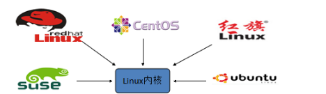  

内核版本(手机)、发行版本(带有壳子的手机)

### 1.1.3 应用场景

由于Linux具备了很多优质特性,如:稳定,安全,高效.  因此常用在企业大型服务器部署,通信网络假设中!

## 1.2 Linux系统的背景知识

- ###### Linux发行版本

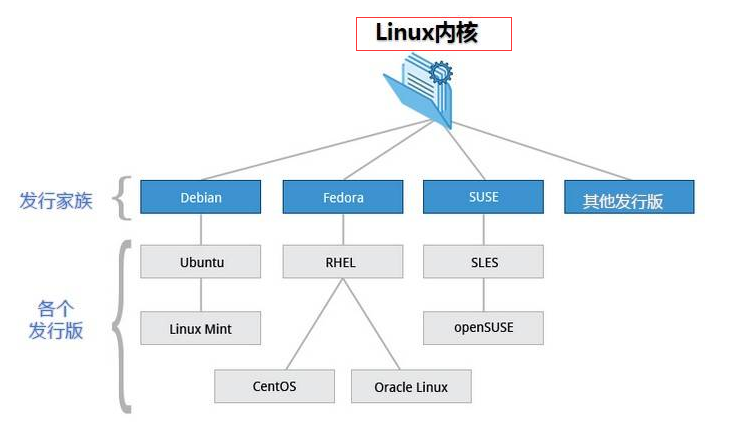 

目前市面上较知名的发行版有：Ubuntu、RedHat、CentOS、Debian、Fedora、SuSE、OpenSUSE、Arch Linux、SolusOS 等。

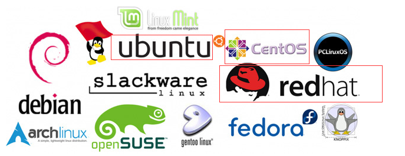  


## 1.3 Linux系统的安装

### 1.3.1 vmware-workstation 虚拟机介绍

虚拟机：指通过软件模拟的具有完整硬件系统功能的、运行在一个完全隔离环境中的完整计算机系统(软件)。

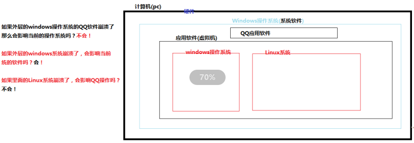 

虚拟机软件:
VMware Workstation（中文名“威睿工作站”）是一款功能强大的桌面虚拟计算机软件，收费的。VMware是全球桌面到数据中心虚拟化解决方案的领导厂商
VirtualBox 是一款开源虚拟机软件。VirtualBox 是由德国 Innotek 公司开发，由Sun Microsystems公司出品的软件，使用Qt编写，在 Sun 被 Oracle 收购后正式更名成 Oracle VM VirtualBox
兼容性差(很多软件装不上)，虚拟化技术不稳定(今天能用明天可能就不好使了)

### 1.3.2 VMWare的安装步骤

参考VM安装文档

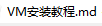 

### 1.3.3 CentOS的安装步骤

参考CentOS安装文档

 

### 1.3.4 CRT工具的使用

当我们需要将大篇幅的内容复制到命令行的时候，发现不好使，可以借助工具！

可以直接解压资料中的CRT即可直接使用!

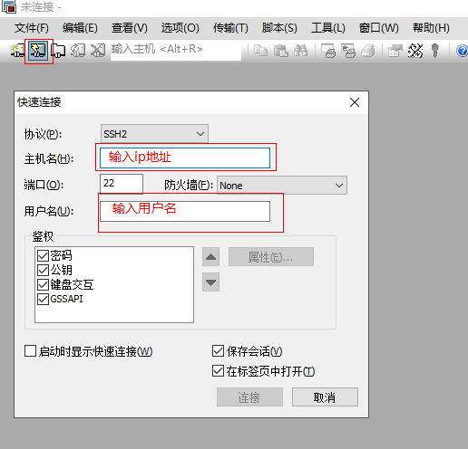 

连接成功如图所示:

 

## 1.4 Linux的系统目录结构

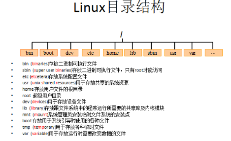 

~：用户主目录 

/：  根目录，一般根目录下只存放目录，不要存放文件。(建议)
	/etc、/bin、/dev、/lib、/sbin应该和根目录放置在一个分区中
/bin:     /usr/bin:  (binaries)存放二进制可执行文件。如常用的命令ls、tar、mv、cat等。
/boot： 放置linux系统启动时用到的一些文件。
	/boot/vmlinuz为linux的内核文件，以及/boot/gurb。建议单独分区，分区大小100M即可
/dev：(devices) 存放linux系统下的设备文件，访问该目录下某个文件，相当于访问某个设备。
	常用的是挂载光驱mount /dev/cdrom /mnt。
/etc：(etcetera) 系统配置文件存放的目录，不建议在此目录下存放可执行文件。
	重要的配置文件有/etc/inittab、/etc/fstab、/etc/init.d、/etc/X11、/etc/sysconfig、/etc/xinetd.d修改配置文件之前记得备份。注：/etc/X11存放与x windows有关的设置。
	Java的环境变量，防火墙配置文件

/home： 系统默认的用户家目录，新增用户账号时，用户的家目录都存放在此目录下，~表示当前用户的家目录，~test表示用户test的家目录。建议单独分区，并设置较大的磁	盘空间，方便用户存放数据
/lib: (library) /usr/lib: /usr/local/lib：系统使用的函数库的目录，程序在执行过程中，需要调用一些额外的参数时需要函数库的协助，比较重要的目录为/lib/modules。
/root： 系统管理员root的家目录，系统第一个启动的分区为/，所以最好将/root和/放置在一个分区下。
/sbin: (super user binaries)  /usr/sbin:   /usr/local/sbin： 放置系统管理员使用的可执行命令。
	如fdisk、shutdown、mount等。与/bin不同的是，这几个目录是给系统管理员root使用的命令，一般用户只能"查看"而不能设置和使用。
/usr：(unix shared resources) 应用程序存放目录，/usr/bin 存放应用程序， /usr/share 存放共享数据，/usr/lib 存放不能直接运行的，却是许多程序运行所必需的一些函数库文	件。/usr/local:存放软件升级包。/usr/share/doc: 系统说明文件存放目录。/usr/share/man: 程序说明文件存放目录，使用 man ls时会查询/usr/share/man/man1/ls.1.gz的内	容建议单独分区，设置较大的磁盘空间。
	Mysql、tocmat、redis安装

/var：(variable) 放置系统执行过程中经常变化的文件，如随时更改的日志文件 /var/log，/var/log/message： 所有的登录文件存放目录，/var/spool/mail： 邮件存放的目录， /var/run: 程序或服务启动
/opt： 给主机额外安装软件所摆放的目录。以前的 Linux 系统中，习惯放置在 /usr/local 目录下
/tmp：(temporary) 一般用户或正在执行的程序临时存放文件的目录,任何人都可以访问,重要数据不可放置在此目录下
/srv： 服务启动之后需要访问的数据目录，如www服务需要访问的网页数据存放在/srv/www内
/mnt:/media：(mount) 光盘默认挂载点，通常光盘挂载于/mnt/cdrom下，也不一定，可以选择任意位置进行挂载。
/proc： 此目录的数据都在内存中，如系统核心，外部设备，网络状态，由于数据都存放于内存中，所以不占用磁盘空间，比较重要的目录

以上规定了哪个目录是做什么的，但仅仅只是建议，并不是强制性的约束！

## 1.5 Linux系统中的基础命令

### 1.5.1 文件和目录管理

- **mkdir**

  用来创建目录。该命令创建由dirname命名的目录。如果在目录名的前面没有加任何路径名，则在 

  当前目录下创建由dirname指定的目录；如果给出了一个已经存在的路径，将会在该目录下创建一个指 

  定的目录。在创建目录时，应保证新建的目录与它所在目录下的文件没有重名 

**课堂案例**: mkdir test 在当前目录 下创建test 目录

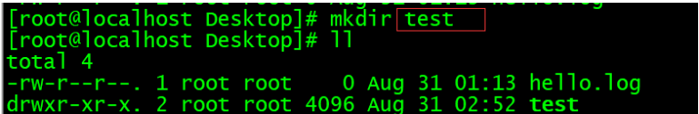 

**课堂案例** mkdir /root/Desktop/test/hellos 在指定的目录创建 hellos 目录

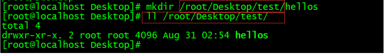 

- **ll** 

  查看指定目录下面的目录列表

ll /root/Desktop/test 

**课堂案例** 查看指定目录下面的目录列表

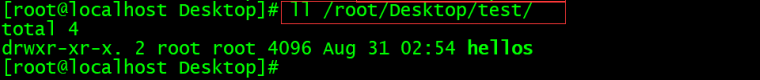 

- **rmdir**

  rmdir命令 用来删除空目录

**课堂案例** 删除hellos目录

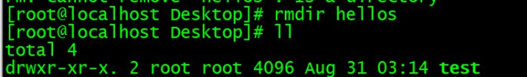 

- **cat**

  cat命令连接文件并打印到标准输出设备上，cat经常用来显示文件的内容

**课堂案例** 查看创建hi.txt文件

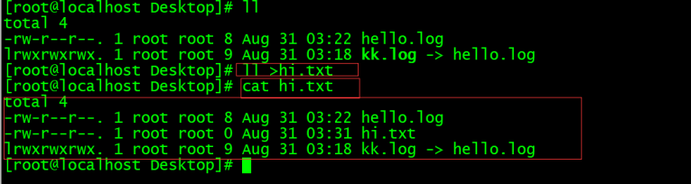 

- **ln**

  ln命令用来为文件创件连接，连接类型分为硬连接和符号连接两种，默认的连接类型是硬连接。如果 

  要创建符号连接必须使用"-s"选项。

**课堂案例** 创建连接

 

​	参数的含义 :

​			源文件：指定连接的源文件。如果使用 -s 选项创建符号连接，则“源文件”可以是文件或者目录。创 

​			建硬连接时，则“源文件”参数只能是文件； 

​			目标文件：指定源文件的目标连接文件。

- **rm**

   rm命令可以删除一个目录中的一个或多个文件或目录，也可以将某个目录及其下属的所有文件及其 

  子目录均删除掉。对于链接文件，只是删除整个链接文件，而原有文件保持不变

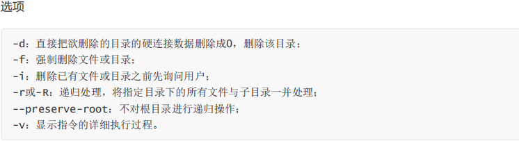 

删除文件 ，确认的方式删除 y 删除 n 取消删除

**课堂案例** 询问的方式删除数据

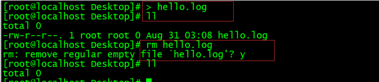 

删除文件 加入 -i选项 确认方式删除 y删除 n 取消删除

**课堂案例** 带参数的询问删除

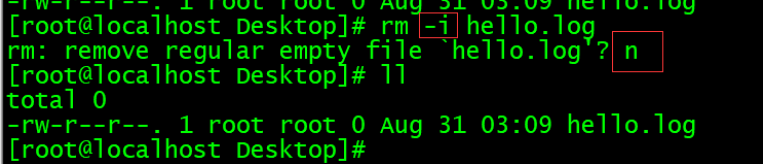 

删除文件 强制删除 没有提示 加入 -f 选项

**课堂案例** 强制删除文件

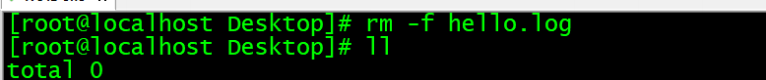 

递归删除文件目录

**课堂案例**  递归删除指定目录

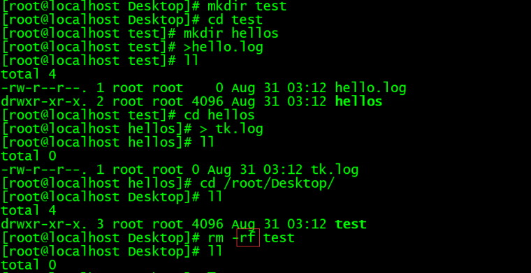 

- **ls**

  ls命令用来显示目标列表，在Linux中是使用率较高的命令。ls命令的输出信息可以进行彩色加亮显 

  示，以分区不同类型的文件。 

  语法: 

   ls（选项）（参数） 

  选项

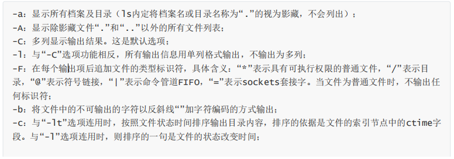 

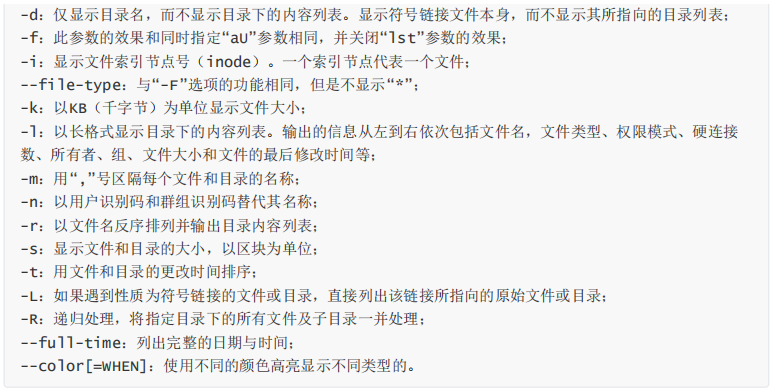 

参数 

目录：指定要显示列表的目录，也可以是具体的文件。

ls :显示当前目录下非影藏文件与目录

**课堂案例** 显示当前目录的列表

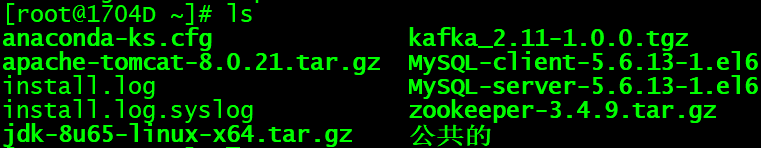 

ls 中 -a选项的含义

**课堂案例**  显示当前目录列表,包括隐藏文件

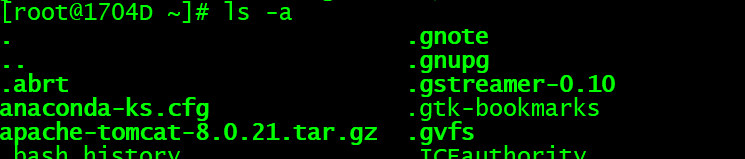 

- **cd**

  cd命令用来切换工作目录至dirname。 其中dirName表示法可为绝对路径或相对路径。若目录名称省 

  略，则变换至使用者的home directory(也就是刚login时所在的目录)。另外， ~ 也表示为home 

  directory的意思， . 则是表示目前所在的目录， .. 则表示目前目录位置的上一层目录。

  采用绝对路径切换到桌面 

**课堂案例** 切换到

 

 每个用户都有自己的主目录 root 管理员

**课堂案例**  切换方式 cd 回车

 

切换方式 cd ~

切换方式 cd /root 即都可以回到相应目录

1. **pwd命令**以绝对路径的方式显示用户当前工作目录。命令将当前目录的全路径名称（从根目录）写入 

   标准输出。全部目录使用 / 分隔。第一个 / 表示根目录，最后一个目录是当前目录。执行pwd命令可立 

   刻得知您目前所在的工作目录的绝对路径名称。

2. **chown**命令改变某个文件或目录的所有者和所属的组,命令可以向某个用户授权，使该用户变成指定文 

   件的所有者或者改变文件所属的组。用户可以是用户或者是用户D，用户组可以是组名或组id。文件名 

   可以使由空格分开的文件列表，在文件名中可以包含通配符。 

   选项:

   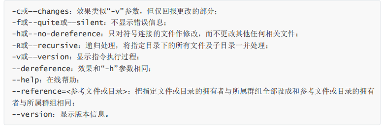 

​	**课堂案例** 修改test目录 以及子目录中的所有文件和目录 都改成 chengongjun属主 chengongjun属组

​	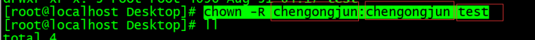 

- **chgrp**    

  **chgrp**命令用来改变文件或目录所属的用户组。该命令用来改变指定文件所属的用户组。其中，组名可 

  以是用户组的id，也可以是用户组的组名 

**课堂案例** 修改test的用户组

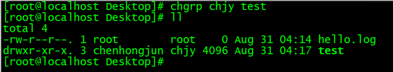 

- **chmod**

  **chmod**命令用来变更文件或目录的权限 

  u User，即文件或目录的拥有者； 

  g Group，即文件或目录的所属群组； 

  o Other，除了文件或目录拥有者或所属群组之外，其他用户皆属于这个范围； 

  a All，即全部的用户，包含拥有者，所属群组以及其他用户； 

  r 读取权限，数字代号为“4”; 

  w 写入权限，数字代号为“2”； 

  x 执行或切换权限，数字代号为“1”； 

  \- 不具任何权限，数字代号为“0”； 

  s 特殊功能说明：变更文件或目录的权限

  **备注：**

  Linux文件属性有两种设置方法，一种是数字，一种是符号。

  Linux文件的基本权限就有九个，分别是owner/group/others三种身份各有自己的read/write/execute权限。

  先复习一下刚刚上面提到的数据：文件的权限字符为：『-rwxrwxrwx』， 这九个权限是三个三个一组的！其中，我们可以使用数字来代表各个权限，各权限的分数对照表如下：

  - r:4
  - w:2
  - x:1

  每种身份(owner/group/others)各自的三个权限(r/w/x)分数是需要累加的，例如当权限为： [-rwxrwx---] 分数则是：

  - owner = rwx = 4+2+1 = 7
  - group = rwx = 4+2+1 = 7
  - others= --- = 0+0+0 = 0

  所以等一下我们设定权限的变更时，该文件的权限数字就是770啦！变更权限的指令chmod的语法是这样的：

  ```
   chmod [-R] xyz 文件或目录
  ```

  选项与参数：

  - xyz : 就是刚刚提到的数字类型的权限属性，为 rwx 属性数值的相加。
  - -R : 进行递归(recursive)的持续变更，亦即连同次目录下的所有文件都会变更

  **课堂案例** 举例来说，如果要将.bashrc这个文件所有的权限都设定启用，那么命令如下：

  ```
  [root@www ~]# ls -al .bashrc
  -rw-r--r--  1 root root 395 Jul  4 11:45 .bashrc
  [root@www ~]# chmod 777 .bashrc
  [root@www ~]# ls -al .bashrc
  -rwxrwxrwx  1 root root 395 Jul  4 11:45 .bashrc
  ```

  那如果要将权限变成 *-rwxr-xr--* 呢？那么权限的分数就成为 [4+2+1][4+0+1][4+0+0]=754。

  #### 符号类型改变文件权限

  还有一个改变权限的方法，从之前的介绍中我们可以发现，基本上就九个权限分别是：

  - (1)user
  - (2)group
  - (3)others

  那么我们就可以使用 **u, g, o** 来代表三种身份的权限！

  此外， **a** 则代表 **all**，即全部的身份。读写的权限可以写成 **r, w, x**，也就是可以使用下表的方式来看：

  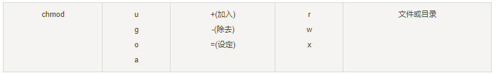 

  如果我们需要将文件权限设置为 **-rwxr-xr--** ，可以使用 **chmod u=rwx,g=rx,o=r 文件名** 来设定:

  **课堂案例**

  ```
  #  touch test1    // 创建 test1 文件
  # ls -al test1    // 查看 test1 默认权限
  -rw-r--r-- 1 root root 0 Nov 15 10:32 test1
  # chmod u=rwx,g=rx,o=r  test1    // 修改 test1 权限
  # ls -al test1
  -rwxr-xr-- 1 root root 0 Nov 15 10:32 test1
  ```

  而如果是要将权限去掉而不改变其他已存在的权限呢？例如要拿掉全部人的可执行权限，则：

  **课堂案例**

  ```
  #  chmod  a-x test1
  # ls -al test1
  -rw-r--r-- 1 root root 0 Nov 15 10:32 test1
  ```

   

- **cp**

  **cp命令**用来将一个或多个源文件或者目录复制到指定的目的文件或目录。它可以将单个源文件复 

  制成一个指定文件名的具体的文件或一个已经存在的目录下。cp命令还支持同时复制多个文件，当一次 

  复制多个文件时，目标文件参数必须是一个已经存在的目录，否则将出现错误。 

  选项

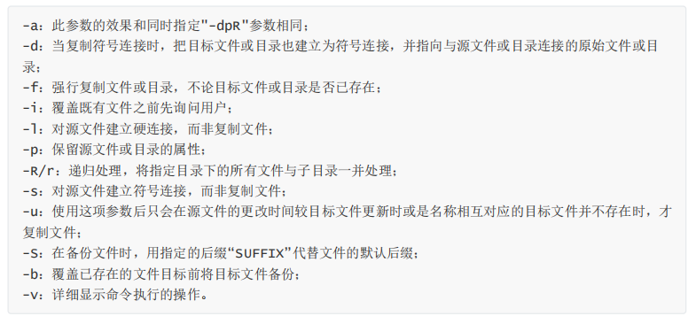 

**课堂案例** 拷贝文件

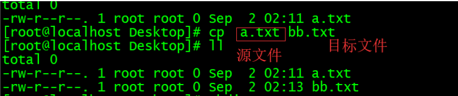 

**课堂案例** 复制目录

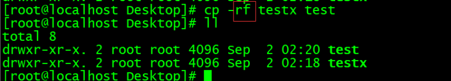 

- **mv**

  **mv**命令用来对文件或目录重新命名，或者将文件从一个目录移到另一个目录中。source表示源文件或 

  目录，target表示目标文件或目录。如果将一个文件移到一个已经存在的目标文件中，则目标文件的内 

  容将被覆盖。 

  作用划分: 

   1.1 移动文件 

   1.2 重命名文件


**课堂案例** 移动文件 绝对路径的写法

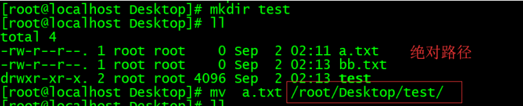 

**课堂案例** 重名文件

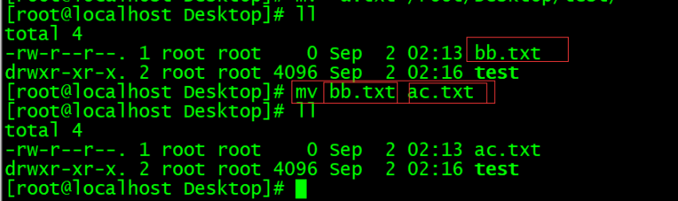 

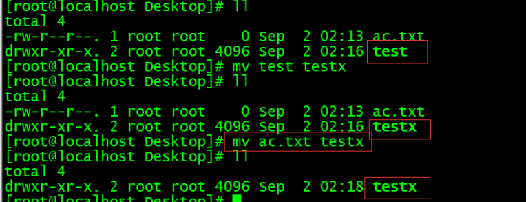 

- **tar**

  **tar命令**可以为linux的文件和目录创建档案 

  常用软件 jdk mysql tomcat redis kafka elasticsearch 

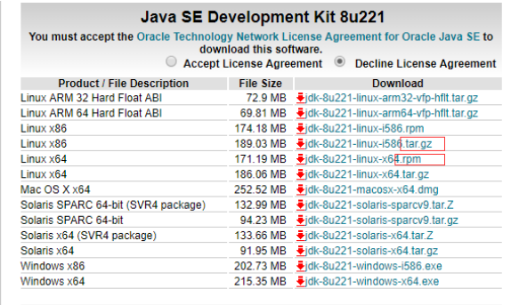 

选项

 

z x v f c 参数选项

**课堂案例** 打包不压缩

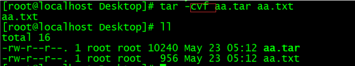 

**课堂案例** 打包压缩 gzip

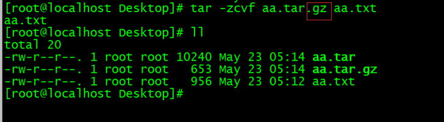 

**课堂案例** bzip

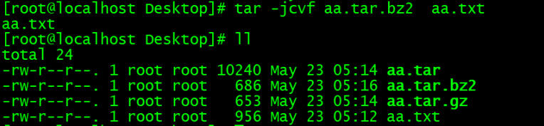 

在选项 f 之后的文件档名是自己取的，我们习惯上都用 .tar 来作为辨识。 如果加 z 选项，则以.tar.gz 

或.tgz来代表gzip压缩过的tar包；如果加 j 选项，则以.tar.bz2来作为tar包名。 


**课堂案例** 查看压缩中文件 -ztvf 参数

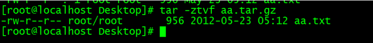 

解压方式：

tar -zxvf gzip .gz结尾的文件

**课堂案例** 解压tomcat的tar.gz文件

 

-C 指定目录

- **touch**

  **touch命令**有两个功能：一是用于把已存在文件的时间标签更新为系统当前的时间（默认方式），它们 

  的数据将原封不动地保留下来；二是用来创建新的空文件。 

**课堂案例** 创建文件:

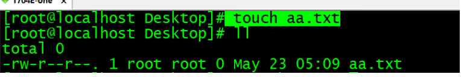 

**课堂案例** 更新文件的系统时间 文件必须存在

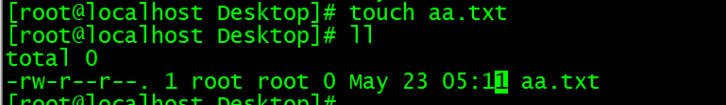 

- **grep**

  **grep**（global search regular expression(RE) and print out the line，全面搜索正则表达式并把行打印 

  出来）是一种强大的文本搜索工具，它能使用正则表达式搜索文本，并把匹配的行打印出来。 

  选项: 

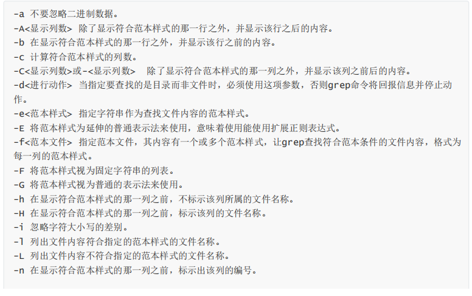 

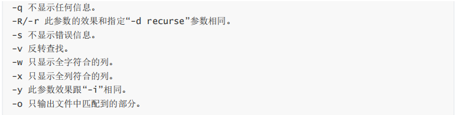 


### 1.5.2 **系统管理**

- **ps**

  **ps命令**用于报告当前系统的进程状态。可以搭配kill指令随时中断、删除不必要的程序 

  选项 

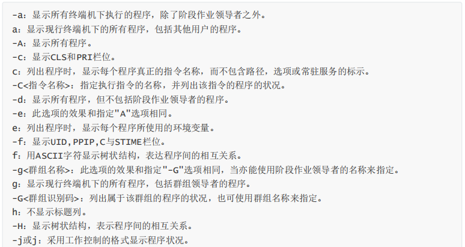 

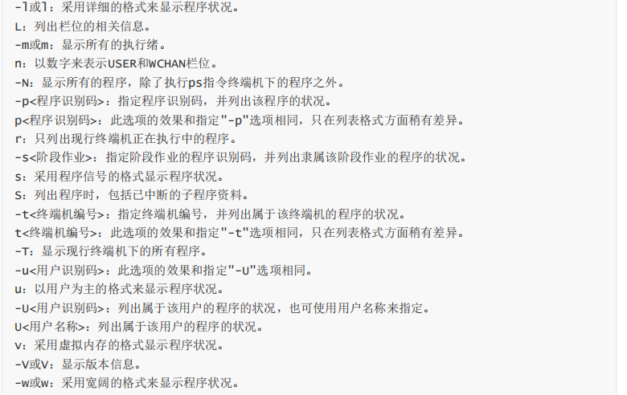 

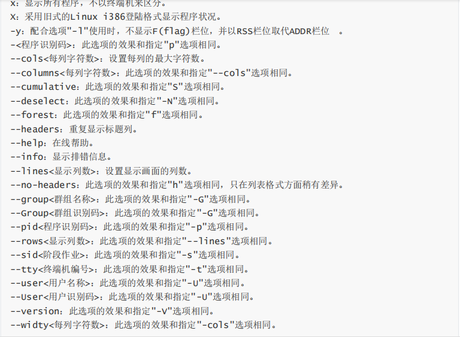 

ps -ef 等同于 ps -Af

**课堂案例**  ps -ef|grep tomcat 过滤tomcat操作

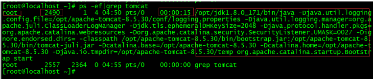 

- **su**

  su命令用于切换当前用户身份到其他用户身份，变更时须输入所要变更的用户帐号与密码 

**课堂案例 ** 切换用户

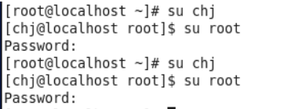 

- **groupadd命令** 

  用于创建一个新的工作组，新工作组的信息将被添加到系统文件中 

  选项

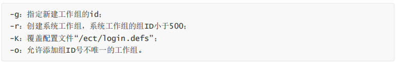 

**课堂案例** cat /etc/group 查看当前系统中的用户组

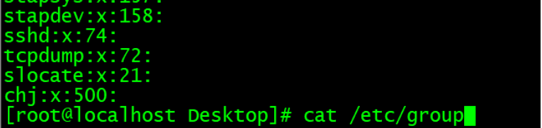 


**课堂案例**  添加组命令 

groupadd chjx 采用自动分配的id 

groupadd -g 508 chjy 采用指定的id 

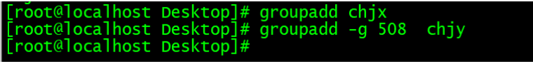 

**课堂案例** 查看组: cat /etc/group

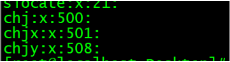 

**用户组的所有信息都存放在/etc/group文件中。**

```
将用户分组是Linux 系统中对用户进行管理及控制访问权限的一种手段。

每个用户都属于某个用户组；一个组中可以有多个用户，一个用户也可以属于不同的组。

当一个用户同时是多个组中的成员时，在/etc/passwd文件中记录的是用户所属的主组，也就是登录时所属的默认组，而其他组称为附加组。

用户要访问属于附加组的文件时，必须首先使用newgrp命令使自己成为所要访问的组中的成员。

用户组的所有信息都存放在/etc/group文件中。此文件的格式也类似于/etc/passwd文件，由冒号(:)隔开若干个字段，这些字段有：

组名:口令:组标识号:组内用户列表
"组名"是用户组的名称，由字母或数字构成。与/etc/passwd中的登录名一样，组名不应重复。
"口令"字段存放的是用户组加密后的口令字。一般Linux 系统的用户组都没有口令，即这个字段一般为空，或者是*。
"组标识号"与用户标识号类似，也是一个整数，被系统内部用来标识组。
"组内用户列表"是属于这个组的所有用户的列表/b]，不同用户之间用逗号(,)分隔。这个用户组可能是用户的主组，也可能是附加组。
/etc/group文件的一个例子如下：

root::0:root
bin::2:root,bin
sys::3:root,uucp
adm::4:root,adm
daemon::5:root,daemon
lp::7:root,lp
users::20:root,sam
```

- **groupmod**

  **groupmod命令**更改群组识别码或名称。需要更改群组的识别码或名称时，可用groupmod指令来完成 

  这项工作 

**课堂案例** 修改组

 

- **groupdel**

  **groupdel命令**用于删除指定的工作组，本命令要修改的系统文件包括/ect/group和/ect/gshadow。若 

  该群组中仍包括某些用户，则必须先删除这些用户后，方能删除群组

**课堂案例** 删除组

 

- **useradd**

  **useradd命令**用于Linux中创建的新的系统用户。useradd可用来建立用户帐号。帐号建好之后，再用 

  passwd设定帐号的密码．而可用userdel删除帐号。使用useradd指令所建立的帐号，实际上是保存 

  在 /etc/passwd 文本文件中 

  选项

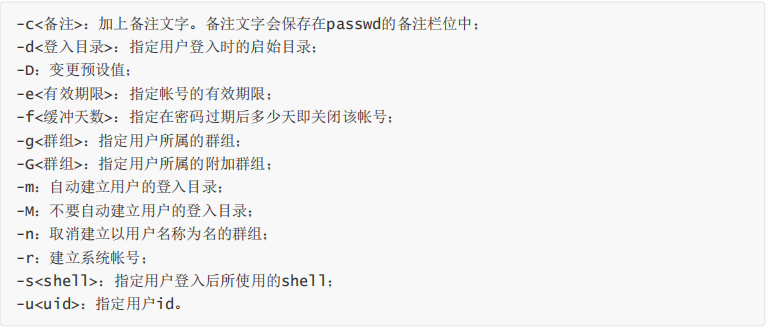 


**课堂案例** 添加 chenhongjun 用户 指定uid是888

 


**课堂案例** cat /etc/passwd

 

 


1）"用户名"是代表用户账号的字符串。通常长度不超过8个字符，并且由大小写字母和/或数字组成。登录名中不能有冒号(:)，因为冒号在这里 

是分隔符。 

为了兼容起见，登录名中最好不要包含点字符(.)，并且不使用连字符(-)和加号(+)打头。 

2）“口令”一些系统中，存放着加密后的用户口令字。 

虽然这个字段存放的只是用户口令的加密串，不是明文，但是由于/etc/passwd文件对所有用户都可 

读，所以这仍是一个安全隐患。因此，现在许多Linux 系统（如SVR4）都使用了shadow技术，把真正 

的加密后的用户口令字存放到/etc/shadow文件中，而在/etc/passwd文件的口令字段中只存放一个特 

殊的字符，例如“x”或者“*”。 

3）“用户标识号”是一个整数，系统内部用它来标识用户。 

一般情况下它与用户名是一一对应的。如果几个用户名对应的用户标识号是一样的，系统内部将把它们 

视为同一个用户，但是它们可以有不同的口令、不同的主目录以及不同的登录Shell等。 

通常用户标识号的取值范围是0～65 535。0是超级用户root的标识号，1～99由系统保留，作为管理账 

号，普通用户的标识号从100开始。在Linux系统中，这个界限是500。 

4）“组标识号”字段记录的是用户所属的用户组。 

它对应着/etc/group文件中的一条记录。 

5)“注释性描述”字段记录着用户的一些个人情况。 

例如用户的真实姓名、电话、地址等，这个字段并没有什么实际的用途。在不同的Linux 系统中，这个 

字段的格式并没有统一。在许多Linux系统中，这个字段存放的是一段任意的注释性描述文字，用做 

fifinger命令的输出。 

6)“主目录”，也就是用户的起始工作目录。 

它是用户在登录到系统之后所处的目录。在大多数系统中，各用户的主目录都被组织在同一个特定的目 

录下，而用户主目录的名称就是该用户的登录名。各用户对自己的主目录有读、写、执行（搜索）权 

限，其他用户对此目录的访问权限则根据具体情况设置。 

7)用户登录后，要启动一个进程，负责将用户的操作传给内核，这个进程是用户登录到系统后运行的命 

令解释器或某个特定的程序，即Shell。 

Shell是用户与Linux系统之间的接口。Linux的Shell有许多种，每种都有不同的特点。常用的有 

sh(Bourne Shell), csh(C Shell), ksh(Korn Shell), tcsh(TENEX/TOPS-20 type C Shell), bash(Bourne 

Again Shell)等。 

系统管理员可以根据系统情况和用户习惯为用户指定某个Shell。如果不指定Shell，那么系统使用sh为 

默认的登录Shell，即这个字段的值为/bin/sh。 

用户的登录Shell也可以指定为某个特定的程序（此程序不是一个命令解释器）。 

利用这一特点，我们可以限制用户只能运行指定的应用程序，在该应用程序运行结束后，用户就自动退 

出了系统。有些Linux 系统要求只有那些在系统中登记了的程序才能出现在这个字段中。 

8)系统中有一类用户称为伪用户（pseudo users）。 

这些用户在/etc/passwd文件中也占有一条记录，但是不能登录，因为它们的登录Shell为空。它们的存 

在主要是方便系统管理，满足相应的系统进程对文件属主的要求。 

创建一个用户就会自动创建一个同名的用户组

- **usermod**

  **usermod命令**用于修改用户的基本信息。usermod命令不允许你改变正在线上的使用者帐号名称。当 

  usermod命令用来改变user id，必须确认这名user没在电脑上执行任何程序 

  选项

 

- **userdel**

  **userdel命令**用于删除给定的用户，以及与用户相关的文件。若不加选项，则仅删除用户帐号，而不删 

  除相关文件。 

  选项

 

- **passwd**

​	**passwd命令**用于设置用户的认证信息，包括用户密码、密码过期时间等。系统管理者则能用它管理系 

​	统用户的密码。只有管理者可以指定用户名称，一般用户只能变更自己的密码。 

​	选项

 

**课堂案例**

 

- **fsck**

​	**fsck命令**被用于检查并且试图修复文件系统中的错误。

### 1.5.3 **网络管理**

- **ifconfig**

  **ifconfifig命令**被用于配置和显示Linux内核中网络接口的网络参数。用ifconfifig命令配置的网卡信息，在 

  网卡重启后机器重启后，配置就不存在。要想将上述的配置信息永远的存的电脑里，那就要修改网卡的 

  配置文件了

**课堂案例** 查看系统的网络ip信息

 

网路 自动获取的网路ip地址，可能会发生改变

### 1.5.4 其他命令

- kill

  **kill命令**用来删除执行中的程序或工作 

  kill -9 进程id号

#  课堂练习

## 1.完成VM的安装(10分钟)

参考vm安装文档完成vm的安装!

要求:

​	1.vm可以正常创建默认的3个虚拟网卡

## 2.完成CentOS的安装(40分钟)

参考CentOS安装文档完成CentOS的安装

要求:

​	1.centOS可以正常启动

​	2.查看IP地址

​	3.使用命令重启

## **备注:如果课堂中没有单独的课堂练习,需练习课堂案例**