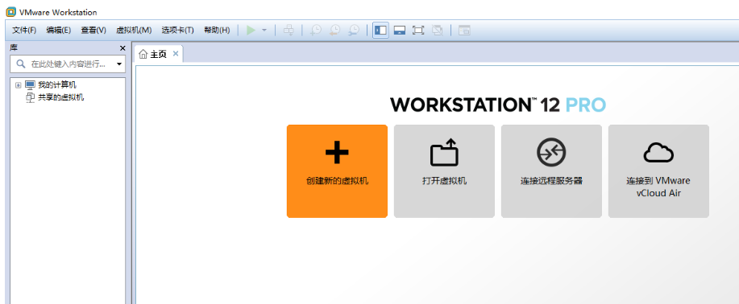
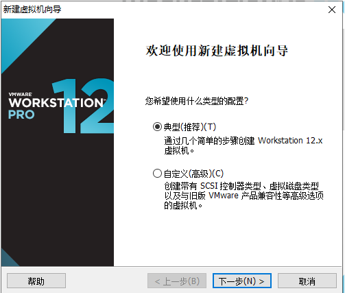
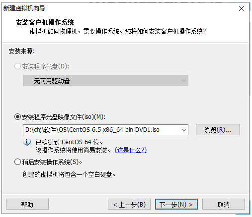
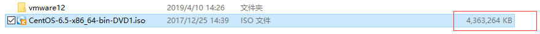
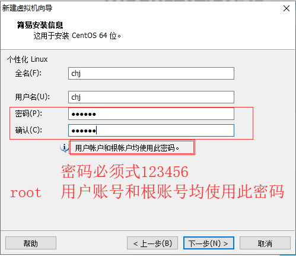
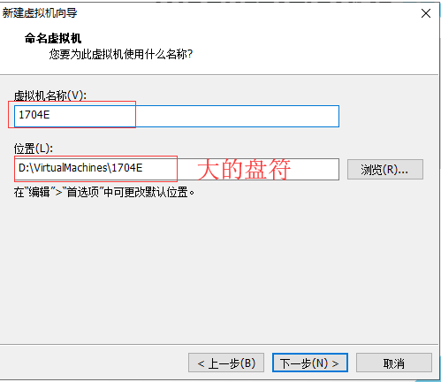
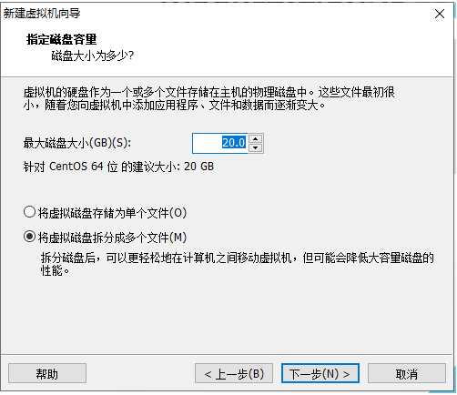
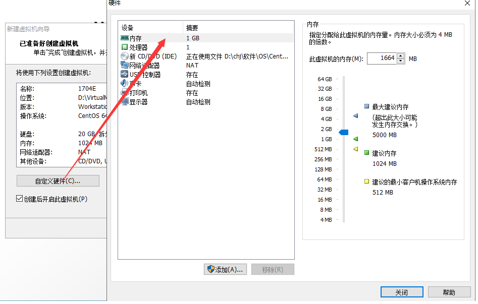
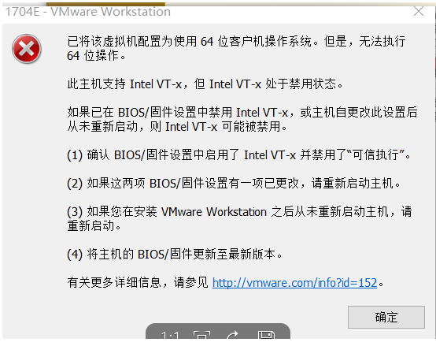

# CentOS安装教程

## 1. 打开虚拟机

 

## 2.点击菜单中文件->新建虚拟机

 

## 3.指定镜像位置

 

## 4.选择的镜像软件

 

## 5.数据账号和密码(统一账号密码)

 

## 6.输入镜像名称

 

## 7.指定镜像占用磁盘大写

 

## 8.给镜像分配内存

 

完成

## 9.bug问题

 

重启电脑,进入boot模式,开启intel虚拟化技术即可!!