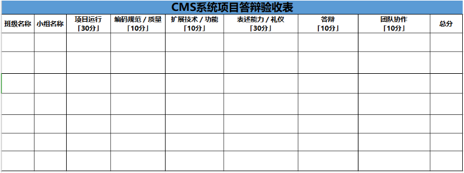

# 第二十单元 项目答辩、历届月考题分析

# 【授课重点】

2. 项目开发技术的总结
2. 项目答辩

# 【考核要求】

1. 掌握项目中Redis、Kafka、Elasticsearch等技术的使用方式。
2. 能够清楚地表述对应业务的实现思路和代码流程。

# 【教学内容】

## 20.1 课程导入

本节主要对所学技术和项目进行总结，以及项目的答辩。

## 20.2 项目开发技术的总结

### 20.2.1 Linux

- 安装
- 基本命令
- 账户管理
- 权限修改
- 文本编辑
- 环境变量
- 项目部署

### 20.2.2 Redis

- 安装
- 配置
- 基本命令
- 五种数据类型的命令
- 和Spring整合

### 20.2.3 Kafka

- 安装
- 配置
- 启动
- 创建话题
- 生产者操作
- 消费者操作
- 生产者和Spring整合
- 消费者和Spring整合

### 20.2.4 Elasticsearch

- 安装
- 配置
- 启动
- 头插件命令
- 和Spring整合
- 索引
- 类型
- 分页
- 模糊
- 高亮显示

## 20.3 结束语

​	  本阶段在原有的CMS项目上，增加了Redis缓存首页数据，Kafka消息队列缓存数据和Elasticsearch的高亮搜索等功能，让我们对CMS项目有了更加深入的了解，对Redis、Kafka、Elasticsearch等技术有了更深层次的认识。今后学习相应的知识，还需要我们再接再厉，努力才会有收获。

# 课堂练习

1. 每人写一篇1000字的项目总结博客。
2. 每人做一份项目ppt，准备项目答辩。
3. 答辩评分标准。

 