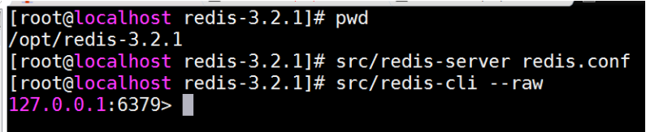
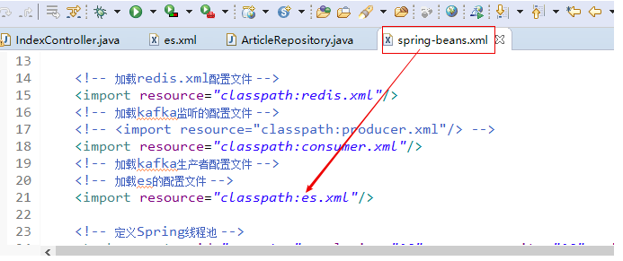

# 第二十单元 项目答辩、历届月考题分析

# 【授课重点】

1. CMS项目和Redis整合
2. CMS项目和Kafka整合
3. CMS项目和Elasticsearch整合


# 【考核要求】

1. CMS项目和Redis整合
2. CMS项目和Kafka整合
3. CMS项目和Elasticsearch整合

# 【教学内容】

## 20.1 课程导入

本节主要将CMS系统和Redis、Kafka、Elasticsearch进行整合复习，以及项目部署到Linux中。

## 20.2 CMS项目和Redis整合

配置pom.xml

```xml
		<!-- redis和spring整合包 -->
		<dependency>
			<groupId>org.springframework.data</groupId>
			<artifactId>spring-data-redis</artifactId>
			<version>1.8.7.RELEASE</version>
		</dependency>
		<!-- 连接redis -->
		<dependency>
			<groupId>redis.clients</groupId>
			<artifactId>jedis</artifactId>
			<version>2.9.0</version>
		</dependency>
```

配置Spring容器，spring-redis.xml

```xml
<?xml version="1.0" encoding="UTF-8"?>
<beans xmlns="http://www.springframework.org/schema/beans"
	xmlns:xsi="http://www.w3.org/2001/XMLSchema-instance"
	xmlns:context="http://www.springframework.org/schema/context"
	xmlns:jdbc="http://www.springframework.org/schema/jdbc"
	xmlns:jee="http://www.springframework.org/schema/jee"
	xmlns:tx="http://www.springframework.org/schema/tx"
	xmlns:aop="http://www.springframework.org/schema/aop"
	xmlns:mvc="http://www.springframework.org/schema/mvc"
	xmlns:util="http://www.springframework.org/schema/util"
	xmlns:jpa="http://www.springframework.org/schema/data/jpa"
	xmlns:elasticsearch="http://www.springframework.org/schema/data/elasticsearch"
	xsi:schemaLocation="
		http://www.springframework.org/schema/beans http://www.springframework.org/schema/beans/spring-beans-4.1.xsd
		http://www.springframework.org/schema/context http://www.springframework.org/schema/context/spring-context-4.1.xsd
		http://www.springframework.org/schema/jdbc http://www.springframework.org/schema/jdbc/spring-jdbc-4.1.xsd
		http://www.springframework.org/schema/jee http://www.springframework.org/schema/jee/spring-jee-4.1.xsd
		http://www.springframework.org/schema/tx http://www.springframework.org/schema/tx/spring-tx-4.1.xsd
		http://www.springframework.org/schema/data/jpa http://www.springframework.org/schema/data/jpa/spring-jpa-1.3.xsd
		http://www.springframework.org/schema/aop http://www.springframework.org/schema/aop/spring-aop-4.1.xsd
		http://www.springframework.org/schema/mvc http://www.springframework.org/schema/mvc/spring-mvc-4.1.xsd
		http://www.springframework.org/schema/util http://www.springframework.org/schema/util/spring-util-4.1.xsd 
		http://www.springframework.org/schema/data/elasticsearch
		https://www.springframework.org/schema/data/elasticsearch/spring-elasticsearch-1.0.xsd">
	
	
	<!-- 配置redis的操作 -->
	<!-- redis连接池 -->
	<bean id="poolConfig" class="redis.clients.jedis.JedisPoolConfig">
		<property name="maxTotal" value="1024" />
		<property name="maxIdle" value="200" />
		<property name="testOnBorrow" value="true" />
	</bean>

	<!-- 连接池配置，类似数据库连接工厂 -->
	<bean id="jedisConnectionFactory"
		class="org.springframework.data.redis.connection.jedis.JedisConnectionFactory">
		<property name="hostName" value="192.168.79.133"></property>
		<property name="port" value="6379"></property>
		<property name="poolConfig" ref="poolConfig" />
	</bean>

	<!--redis操作模版,使用该对象可以操作redis -->
	<bean id="redisTemplate"
		class="org.springframework.data.redis.core.RedisTemplate">
		<property name="connectionFactory"
			ref="jedisConnectionFactory" />

		<!--如果不配置Serializer，那么存储的时候缺省使用String，如果用User类型存储，那么会提示错误User can't cast 
			to String！！ -->
		<property name="keySerializer">
			<bean
				class="org.springframework.data.redis.serializer.StringRedisSerializer" />
		</property>
		<!-- <property name="valueSerializer">
			<bean
				class="org.springframework.data.redis.serializer.JdkSerializationRedisSerializer" />
		</property> -->


		<property name="hashKeySerializer">
			<bean
				class="org.springframework.data.redis.serializer.StringRedisSerializer" />
		</property>
		
		<!-- <property name="hashValueSerializer">
			<bean
				class="org.springframework.data.redis.serializer.JdkSerializationRedisSerializer" />
		</property>  -->
		<!--开启事务 -->
		<!-- <property name="enableTransactionSupport" value="true" /> -->
	</bean>
</beans>
```

启动Redis

   


**热门文章**

编写service层代码：

```java
	
	@Resource
	private RedisTemplate<String, Article> redisTemplate;

	//最新文章分页
	@Override
	public PageInfo<Article> hostList(Integer page) {
		ListOperations<String, Article> opsForList = redisTemplate.opsForList();
		
		PageInfo pageInfo = null;
		
		if(redisTemplate.hasKey("hot_list")) {
			//之后访问，都从redis中获取，手动设置分页下标，开始下标和结束下标
			//开始下标	(page - 1) * size
			//结束下标	page * size - 1
			List<Article> list = opsForList.range("hot_list", (page - 1) * 10, page * 10 - 1);
			
			pageInfo = new PageInfo(list);
			//设置总条数
			Long size = opsForList.size("hot_list");
			pageInfo.setTotal(size);
			pageInfo.setPageNum(page);
			
		}else {

			//第一次访问时，从数据库中查询
			List<Article> listHot = articleMapper.listHot();
			//将数据存入redis中
			opsForList.rightPushAll("hot_list", listHot);
			
			//设置页码
			PageHelper.startPage(page, 10);
			//查询分页的数据
			List<Article>  list = articleMapper.listHot();
			
			pageInfo = new PageInfo(list);
		}
		
		
		return pageInfo;
	}
```

编写service层代码：

```java
	//修改热门的状态
	@Override
	public int updateHot(Integer articleId, int status) {
		//设置热门
		int result = articleMapper.updateHot(articleId,status);
		
		if(result > 0) {
			//如果文章设置热门成功，则删除redis中最新文章
			redisTemplate.delete("hot_list");
		}
		
		return result;
	}
```


**最新文章**

编写service层代码：

```java
	@Resource
	private RedisTemplate<String, Article> redisTemplate;

	//获取最新文章的数目
	@Override
	public List<Article> last(int sum) {
		ListOperations<String, Article> opsForList = redisTemplate.opsForList();
		
		List<Article> listLast = null;
		
		if(redisTemplate.hasKey("last_list")) {
			//如果存在数据
			//3、以后再访问，直接从redis中获取数据
			listLast = opsForList.range("last_list", 0, -1);
			
		}else {
			//1、首次访问时，从数据库中获取数据
			listLast = articleMapper.listLast(sum);
			
			//2、将数据存入redis中		
			opsForList.rightPushAll("last_list", listLast);
		}
		
		return listLast;
	}
```

编写service层代码：

```java
	/**
	 * 审核文章
	 * @param articleId 文章ID
	 * @param status 审核后的状态 
	 * @return
	 */
	@Override
	public int updateStatus(Integer articleId, int status) {
		
		//审核文章
		int result = articleMapper.updateStatus(articleId,status);
		
		if(result > 0) {
			//如果文章审核成功，则删除redis中最新文章
			redisTemplate.delete("last_list");

		}
		
		return result;
	}
```

## 20.3 CMS项目和Elasticsearch整合

编写配置文件具体代码如下:

```xml
<?xml version="1.0" encoding="UTF-8"?>
<beans xmlns="http://www.springframework.org/schema/beans"
	xmlns:xsi="http://www.w3.org/2001/XMLSchema-instance"
	xmlns:elasticsearch="http://www.springframework.org/schema/data/elasticsearch"
	xmlns:context="http://www.springframework.org/schema/context"
	xsi:schemaLocation="http://www.springframework.org/schema/beans http://www.springframework.org/schema/beans/spring-beans.xsd
                            http://www.springframework.org/schema/data/elasticsearch http://www.springframework.org/schema/data/elasticsearch/spring-elasticsearch.xsd
                            http://www.springframework.org/schema/context http://www.springframework.org/schema/context/spring-context.xsd">
    
    <!-- 扫描Dao包，自动创建实例 -->
	<elasticsearch:repositories base-package="com.gaofei.cms.dao" />
	<!-- 扫描Service包，创建Service的实体 -->
	<!-- <context:component-scan base-package="com.bawei.service" /> --> <!-- 配置elasticSearch的连接 -->
	<!-- es提供了2个端口号:9200和9300
		9200:对浏览器暴露的端口号
		9300:是对java编程需要操作es所暴露的端口号
	 -->
	<elasticsearch:transport-client id="client"
		cluster-nodes="localhost:9300" /> <!-- spring data elasticSearcheDao 必须继承 ElasticsearchTemplate -->
		
	<bean id="elasticsearchTemplate"
		class="org.springframework.data.elasticsearch.core.ElasticsearchTemplate">
		<constructor-arg name="client" ref="client"></constructor-arg>
	</bean>
    
</beans>
```

声明实体类注解

```java
//@Document 文档对象 （索引信息、文档类型 ）
@Document(indexName="cms_articles",type="article") 
public class Article  implements Serializable{
    /**
	 * @fieldName: serialVersionUID
	 * @fieldType: long
	 * @Description: TODO
	 */
	private static final long serialVersionUID = 1L;
	@Id
	private Integer id;
//	1.是否索引:是否建立索引
	// 2.分词方式:是用的ik分词器的智能分词方式
	// 3.是否存储到索引库
	// 4.搜索框里的词,是否分词
	@Field(index=true,analyzer="ik_smart",store=true,searchAnalyzer="ik_smart",type = FieldType.text)
    private String title;
	
    private String picture;

    private Integer channelId;

    private Integer categoryId;

    private Integer userId;
    
    private User user;//文章发布人
    
    private List<ArticleVO> voList;//图片集
    
    private String terms;//文章标签
    
    
    private  String original;//文章来源
    private String keywords;//关键词
    
    

    public String getTerms() {
		return terms;
	}

	public void setTerms(String terms) {
		this.terms = terms;
	}

	public String getOriginal() {
		return original;
	}

	public void setOriginal(String original) {
		this.original = original;
	}

	public String getKeywords() {
		return keywords;
	}

	public void setKeywords(String keywords) {
		this.keywords = keywords;
	}

	private Integer hits;

    private Integer hot;

    private Integer status;

    private Integer deleted;

    private Date created;

    private Date updated;
    
    private Integer contentType;
    
  

	public Integer getContentType() {
		return contentType;
	}

	public void setContentType(Integer contentType) {
		this.contentType = contentType;
	}

	public List<ArticleVO> getVoList() {
		return voList;
	}

	public void setVoList(List<ArticleVO> voList) {
		this.voList = voList;
	}

	public Integer getId() {
        return id;
    }

    public void setId(Integer id) {
        this.id = id;
    }

    public String getTitle() {
        return title;
    }

    public void setTitle(String title) {
        this.title = title == null ? null : title.trim();
    }

    public String getPicture() {
        return picture;
    }

    public void setPicture(String picture) {
        this.picture = picture == null ? null : picture.trim();
    }

    public Integer getChannelId() {
        return channelId;
    }

    public void setChannelId(Integer channelId) {
        this.channelId = channelId;
    }

    public Integer getCategoryId() {
        return categoryId;
    }

    public void setCategoryId(Integer categoryId) {
        this.categoryId = categoryId;
    }

    public Integer getUserId() {
        return userId;
    }

    public void setUserId(Integer userId) {
        this.userId = userId;
    }

    public Integer getHits() {
        return hits;
    }

    public void setHits(Integer hits) {
        this.hits = hits;
    }

    public Integer getHot() {
        return hot;
    }

    public void setHot(Integer hot) {
        this.hot = hot;
    }

    public Integer getStatus() {
        return status;
    }

    public void setStatus(Integer status) {
        this.status = status;
    }

    public Integer getDeleted() {
        return deleted;
    }

    public void setDeleted(Integer deleted) {
        this.deleted = deleted;
    }

    public Date getCreated() {
        return created;
    }

    public void setCreated(Date created) {
        this.created = created;
    }

    public Date getUpdated() {
        return updated;
    }

    public void setUpdated(Date updated) {
        this.updated = updated;
    }

	public User getUser() {
		return user;
	}

	public void setUser(User user) {
		this.user = user;
    }
}

public class ArticleWithBLOBs extends Article   implements Serializable{
    /**
	 * @fieldName: serialVersionUID
	 * @fieldType: long
	 * @Description: TODO
	 */
	private static final long serialVersionUID = 1L;
	@Field(index=true,analyzer="ik_smart",store=true,searchAnalyzer="ik_smart",type = FieldType.text)
	private String content;

    private String summary;

    public String getContent() {
        return content;
    }

    public void setContent(String content) {
        this.content = content == null ? null : content.trim();
    }

    public String getSummary() {
        return summary;
    }

    public void setSummary(String summary) {
        this.summary = summary == null ? null : summary.trim();
    }
}
```


编写dao层接口

```java
//继承完了之后,具备了CRUD的操作
public interface ArticleRepository extends ElasticsearchRepository<ArticleWithBLOBs, Integer> {
	//实现复杂查询
	//按照标题查询,方法名称一定要按照规则写
	List<ArticleWithBLOBs> findByTitle(String key);
    
    //按照标题或者内容查询,方法名称一定要按照规则写
	List<ArticleWithBLOBs> findByTitleOrContent(String title,String content);
    
}
```

让spring容器加载es配置

   

编写Controller层代码

```java
/**
	 * es搜索的方法
	 * 
	 */
	@RequestMapping("search")
	public String search(String key, Model model, @RequestParam(defaultValue = "1") Integer page,
			@RequestParam(defaultValue = "2") Integer pageSize) {
		long start = System.currentTimeMillis();

//		List<ArticleWithBLOBs> list = articleRepository.findByTitle(key);
		// 高亮查询想要的结果
		AggregatedPage<?> selectObjects = ESUtils.selectObjects(elasticsearchTemplate, Article.class, page, pageSize,
				new String[] { "title" }, key);
		List<?> list = selectObjects.getContent();

		long end = System.currentTimeMillis();
		System.err.println("搜索耗时:" + (end - start));
		System.err.println(key);
//		System.err.println(list.get(0).getTitle());
		String pages = PageUtil.page(page, (int) selectObjects.getTotalElements(), "/search?key=" + key, pageSize);

		model.addAttribute("pages", pages);
		model.addAttribute("hotArticles", list);
		return "index/index";
	}

```

**关于ESutil参见下面代码:**

```java
// 查询操作
	public static AggregatedPage<?> selectObjects(ElasticsearchTemplate elasticsearchTemplate, Class<?> clazz, Integer page,
			Integer rows, String fieldNames[], String value) {
		AggregatedPage<?> pageInfo = null;
		// 创建Pageable对象
		Pageable pageable = PageRequest.of(page - 1, rows, Sort.by(Sort.Direction.ASC, "id"));
		//查询对象
		SearchQuery query = null;
		//查询条件高亮的构建对象
		QueryBuilder queryBuilder = null;
		
		if (value != null && !"".equals(value)) {
			// 高亮拼接的前缀与后缀
			String preTags = "<font color=\"red\">";
			String postTags = "</font>";

			// 定义创建高亮的构建集合对象
			HighlightBuilder.Field highlightFields[] = new HighlightBuilder.Field[fieldNames.length];

			for (int i = 0; i < fieldNames.length; i++) {
				// 这个代码有问题
				highlightFields[i] = new HighlightBuilder.Field(fieldNames[i]).preTags(preTags).postTags(postTags);
			}

			// 创建queryBuilder对象
			queryBuilder = QueryBuilders.multiMatchQuery(value, fieldNames);
			query = new NativeSearchQueryBuilder().withQuery(queryBuilder).withHighlightFields(highlightFields)
					.withPageable(pageable).build();

			pageInfo = elasticsearchTemplate.queryForPage(query, clazz, new SearchResultMapper() {

				@Override
				public <T> AggregatedPage<T> mapResults(SearchResponse response, Class<T> clazz, Pageable pageable) {

					List<T> content = new ArrayList<T>();
					long total = 0l;

					try {
						// 查询结果
						SearchHits hits = response.getHits();
						if (hits != null) {
							//获取总记录数
							total = hits.getTotalHits();
							// 获取结果数组
							SearchHit[] searchHits = hits.getHits();
							// 判断结果
							if (searchHits != null && searchHits.length > 0) {
								// 遍历结果
								for (int i = 0; i < searchHits.length; i++) {
									// 对象值
									T entity = clazz.newInstance();

									// 获取具体的结果
									SearchHit searchHit = searchHits[i]; 

									// 获取对象的所有的字段
									Field[] fields = clazz.getDeclaredFields();

									// 遍历字段对象
									for (int k = 0; k < fields.length; k++) {
										// 获取字段对象
										Field field = fields[k];
										// 暴力反射
										field.setAccessible(true);
										// 字段名称
										String fieldName = field.getName();
										if (!fieldName.equals("serialVersionUID")&&!fieldName.equals("user")) {
											HighlightField highlightField = searchHit.getHighlightFields()
													.get(fieldName);
											if (highlightField != null) {
												// 高亮 处理 拿到 被<font color='red'> </font>结束所包围的内容部分
												String value = highlightField.getFragments()[0].toString();
												// 注意一下他是否是 string类型
												field.set(entity, value);
											} else {
												//获取某个字段对应的 value值
												Object value = searchHit.getSourceAsMap().get(fieldName);
												System.out.println(value);
												// 获取字段的类型
												Class<?> type = field.getType();
												if (type == Date.class) {
													// bug
													if(value!=null) {
														field.set(entity, new Date(Long.valueOf(value + "")));
													}
												} else {
													field.set(entity, value);
												}
											}
										}
									}

									content.add(entity);
								}
							}
						}
					} catch (Exception e) {
						e.printStackTrace();
					}

					return new AggregatedPageImpl<>(content, pageable, total);
				}
			});

		} else {
			// 没有查询条件的的时候，获取es中的全部数据 分页获取
			query = new NativeSearchQueryBuilder().withPageable(pageable).build();
			pageInfo = elasticsearchTemplate.queryForPage(query, clazz);
		}


		return pageInfo;
	}
```

编写前端代码

```html
	<!-- 搜索框：在专业高级二学完ElasticSearch后实现 -->
		<form action="/search" class="form-inline">
			<div class="input-group">
				<input type="text" name="key" class="form-control"
					placeholder="输入关键字..." aria-label="key"
					aria-describedby="basic-addon1">
				<div class="input-group-prepend">
					<button class="input-group-btn btn btn-outline-primary"
						id="basic-addon1">搜索</button>
				</div>
			</div>
		</form>
```

此时我们就已经利用es实现的搜索

**注意:从es中查询文章的数据,我们还没有.于是我们要写一个测试类从mysql中查询文章数据,然后导入到es索引库**


```java
@RunWith(SpringJUnit4ClassRunner.class)
@ContextConfiguration(locations="classpath:spring-beans.xml")
public class ImportMysqlDB2Es {

	@Autowired
	ArticleMapper articleMapper;
	@Autowired
	ArticleRepository articleRepository;
	//1.解决com.fasterxml.jackson.core.Versioned
	//	1.1到pom里粘贴解决冲突的依赖
	//2.到pom里修改<validator.version>5.1.0.Final</validator.version>
	//3.到pom里修改jetty版本:   9.4.9.v20180320
	@Test
	public void testImport() {
		List<ArticleWithBLOBs> selects = articleMapper.selects(null);
		System.out.println(selects);
		articleRepository.saveAll(selects);
	}
}
```


## **20.4 CMS项目和Kafka整合**

**生产者**

配置pom.xml

```xml
		<!-- kafka和spring的整合包 -->
		<dependency>
			<groupId>org.springframework.kafka</groupId>
			<artifactId>spring-kafka</artifactId>
			<version>2.2.0.RELEASE</version>
		</dependency>

		<!-- kafka的依赖包 -->
		<dependency>
			<groupId>org.apache.kafka</groupId>
			<artifactId>kafka_2.10</artifactId>
			<version>0.8.2.1</version>
			<exclusions>
				<exclusion>
					<artifactId>jmxri</artifactId>
					<groupId>com.sun.jmx</groupId>
				</exclusion>
				<exclusion>
					<artifactId>jms</artifactId>
					<groupId>javax.jms</groupId>
				</exclusion>
				<exclusion>
					<artifactId>jmxtools</artifactId>
					<groupId>com.sun.jdmk</groupId>
				</exclusion>
			</exclusions>
		</dependency>

```


配置Spring容器

```xml
<?xml version="1.0" encoding="UTF-8"?>
<beans xmlns="http://www.springframework.org/schema/beans"
	xmlns:xsi="http://www.w3.org/2001/XMLSchema-instance"
	xmlns:aop="http://www.springframework.org/schema/aop"
	xmlns:context="http://www.springframework.org/schema/context"
	xmlns:tx="http://www.springframework.org/schema/tx"
	xsi:schemaLocation="http://www.springframework.org/schema/beans http://www.springframework.org/schema/beans/spring-beans.xsd
		http://www.springframework.org/schema/context http://www.springframework.org/schema/context/spring-context.xsd
		http://www.springframework.org/schema/aop http://www.springframework.org/schema/aop/spring-aop.xsd
		http://www.springframework.org/schema/tx http://www.springframework.org/schema/tx/spring-tx.xsd">


	<!-- 1、注解扫描器 -->
	<!-- todo -->
	<context:component-scan base-package="com.bawei" >
		<!-- 排除要要扫描的controller -->
		<context:exclude-filter type="annotation"
			expression="org.springframework.stereotype.Controller" />

	</context:component-scan>

	<!--2、 指定外部属性文件的位置 -->
	<context:property-placeholder
		location="classpath:db.properties" />

	<!-- 3.使用druid数据源 连接池 -->
	<bean id="dataSource" 
		class="com.alibaba.druid.pool.DruidDataSource">
		<property name="driverClassName" value="${jdbc.driver}">
		</property>
		<property name="url" value="${jdbc.url}">
		</property>
		<property name="username" value="${jdbc.username}">
		</property>
		<property name="password" value="${jdbc.password}">
		</property>
	</bean>


	<!--4、 配置mybatis SqlSessionFactory -->
	<bean id="sqlSessionFactory"
		class="org.mybatis.spring.SqlSessionFactoryBean" scope="singleton" autowire="default">
		<!-- 注入数据源 -->
		<property name="dataSource" ref="dataSource"></property>
		<!-- 关联mybatis配置文件 -->
		<!-- todo -->
		<property name="configLocation" value="classpath:mybatis.xml"></property>
	    <property name="mapperLocations" value="classpath:mybatis/*.xml"></property>
	
	</bean>

	<!--5、 配置jdbc事务管理器 -->
	<bean id="transactionManager"
		class="org.springframework.jdbc.datasource.DataSourceTransactionManager">
		<property name="dataSource" ref="dataSource"></property>
	</bean>


	<!--6、 配置事务 transaction-manager:表示关联的事务管理器是谁 -->
	<tx:advice transaction-manager="transactionManager"
		id="txAdvice">
		<!-- 事务属性配置 -->
		<tx:attributes>
			<!-- 以find.select get开头的方法为只读事务，用来提高数据库的性能 -->
			<tx:method name="find*" read-only="true" />
			<tx:method name="select*" read-only="true" />
			<tx:method name="get*" read-only="true" />
			<tx:method name="load*" read-only="true" />
			<tx:method name="list*" read-only="true" />
			<!-- 其他的方法为默认事务 -->
			<tx:method name="*" propagation="REQUIRED" />
		</tx:attributes>
	</tx:advice>
	<!-- 7、配置aop -->
	<aop:config>
		<!-- 配置切点表达式 -->
		<!-- todo -->
		<aop:pointcut
			expression="execution(* com.bawei.service.impl.*.*(..))" id="pointcut" />
		<!-- 关联事务 -->
		<aop:advisor advice-ref="txAdvice" pointcut-ref="pointcut" />

	</aop:config>

	<!--8 扫描mapper -->

	<bean class="org.mybatis.spring.mapper.MapperScannerConfigurer">
		<!-- basePackage :mapper接口所在的包 -->
		<!-- todo -->
		<property name="basePackage" value="com.bawei.dao"></property>

	</bean>


	<!-- 导入kafka -->
	<import resource="spring-kafka-*.xml"/>

</beans>

```


spring-kafka-producer.xml内容如下

```xml
<?xml version="1.0" encoding="UTF-8"?>
<beans xmlns="http://www.springframework.org/schema/beans"
	xmlns:xsi="http://www.w3.org/2001/XMLSchema-instance"
	xmlns:aop="http://www.springframework.org/schema/aop"
	xmlns:context="http://www.springframework.org/schema/context"
	xmlns:tx="http://www.springframework.org/schema/tx"
	xmlns:p="http://www.springframework.org/schema/p"
	xsi:schemaLocation="http://www.springframework.org/schema/beans http://www.springframework.org/schema/beans/spring-beans.xsd
		http://www.springframework.org/schema/context http://www.springframework.org/schema/context/spring-context-4.3.xsd
		http://www.springframework.org/schema/aop http://www.springframework.org/schema/aop/spring-aop-4.3.xsd
		http://www.springframework.org/schema/tx http://www.springframework.org/schema/tx/spring-tx-4.3.xsd">

	<!-- 定义HashMap集合 Key-Value --> <!--参数配置 -->
	<bean id="producerProperites" class="java.util.HashMap">
		<constructor-arg>
			<map><!-- kafka服务地址，可能是集群 value="localhost:9092,localhost:9093,localhost:9094" -->
			
				<entry key="bootstrap.servers" value="192.168.79.133:9092" />
				
				
				<!-- 有可能导致broker接收到重复的消息 -->
				<entry key="retries" value="0" />
				<!-- 每次批量发送消息的数量 -->
				<entry key="batch.size" value="1638" />
				<!-- 默认0ms，在异步IO线程被触发后（任何一个topic，partition满都可以触发） -->
				<entry key="linger.ms" value="1" />
				<!--producer可以用来缓存数据的内存大小。如果数据产生速度大于向broker发送的速 度，producer会阻塞或者抛出异常 -->
				<entry key="buffer.memory" value="33554432 " />

				<!-- key的序列化方式 -->
				<entry key="key.serializer"
					value="org.apache.kafka.common.serialization.StringSerializer" />
				<!-- value的序列化方式 -->
				<entry key="value.serializer"
					value="org.apache.kafka.common.serialization.StringSerializer" />
			</map>
		</constructor-arg>
	</bean>

	<!-- 生产工厂对象 -->
	<bean id="producerFactory"
		class="org.springframework.kafka.core.DefaultKafkaProducerFactory">
		<constructor-arg ref="producerProperites" />
	</bean>


	<!-- 创建kafka的模板对象 -->
	<bean id="kafkaTemplate"
		class="org.springframework.kafka.core.KafkaTemplate">
		<constructor-arg ref="producerFactory" />
		<!--设置对应topic -->
		<property name="defaultTopic" value="1706E" />
	</bean>

</beans>

```

编写测试类

```java
package com.bawei.service.kafka;

import java.io.IOException;
import java.util.Date;
import java.util.List;

import javax.annotation.Resource;

import org.junit.Test;
import org.junit.runner.RunWith;
import org.springframework.kafka.core.KafkaTemplate;
import org.springframework.test.context.ContextConfiguration;
import org.springframework.test.context.junit4.SpringJUnit4ClassRunner;

import com.bawei.entity.Article;
import com.bawei.entity.Cat;
import com.bawei.entity.Channel;
import com.bawei.service.CatService;
import com.bawei.service.ChannelService;
import com.bawei.test.FileUtils;
import com.bawei.test.RandomUtil;
import com.google.gson.Gson;

@RunWith(SpringJUnit4ClassRunner.class)
@ContextConfiguration("classpath:spring-beans.xml")
public class KafkaProducerTest {

//	(1)使用工具包中流工具方法读取文件，不得乱码。
//	(2)将文件名作为Article对象的title属性值。
//	(3)文本内容作为Article对象的content属性值。
//	(4)在文本内容中截取前140个字作为摘要。
//	(5)“点击量”和“是否热门”、“频道”字段要使用随机值。
//	(6)文章发布日期从2019年1月1日模拟到今天。
//	(7)其它的字段随便模拟。
//	(8)编写Kafka生产者，然后将生成Article对象通过Kafka发送到消费端。
//	(9)编写Kafka消费者，将接到的数据保存到CMS项目数据库。
	
	
	
	@Resource
	private ChannelService channelServie;
	
	@Resource
	private CatService catService;
	
	@Resource
	private KafkaTemplate<String, String> kafkaTemplate;
	
	
	
	@Test
	public void sendTest() throws IOException {
//		(1)使用工具包中流工具方法读取文件，不得乱码。
		List<String> fileList = FileUtils.getFileList("D:\\1706EJsoup");
		
		for (String file_name : fileList) {
			//获取文件内容
			String content = FileUtils.readFileByLine(file_name);
			
			Article article = new Article();
//		(2)将文件名作为Article对象的title属性值。
			//从文件路径中截取出文章名
			String fileName = file_name.substring(file_name.lastIndexOf("\\") + 1, file_name.lastIndexOf("."));
			article.setTitle(fileName);
//		(3)文本内容作为Article对象的content属性值。
			article.setContent(content);
//		(4)在文本内容中截取前140个字作为摘要。
			
			String abs = null;
			if(content.length() <= 140) {
				abs = content;
			}else {
				abs = content.substring(0, 140);
			}
			
//		(5)“点击量”和“是否热门”、“频道”字段要使用随机值。
			//点击量
			article.setHits(RandomUtil.random(0, 100000));
			
			//是否热门 0 1
			article.setHot(RandomUtil.random(0, 1));
			
			//获取所有栏目数据
			List<Channel> allChnls = channelServie.getAllChnls();
			//获取随机下标
			int ch_index = RandomUtil.random(0, allChnls.size() - 1);
			
			//设置随机栏目
			Channel channel = allChnls.get(ch_index);
			article.setChannelId(channel.getId());
			
			
			//根据栏目id查询所属分类
			List<Cat> catList = catService.getListByChnlId(channel.getId());
			
			if(catList != null && catList.size() > 0) {
				//获取随机下标
				int cat_index = RandomUtil.random(0, catList.size() - 1);
			
				//获取分类id
				Cat cat = catList.get(cat_index);
				article.setCategoryId(cat.getId());
			}
			
			
//		(6)文章发布日期从2019年1月1日模拟到今天。
			Date date = RandomUtil.randomDate("2019-01-01", "2019-11-20");
				
			article.setCreated(date);
			
//		(7)其它的字段随便模拟。
//		(8)编写Kafka生产者，然后将生成Article对象通过Kafka发送到消费端。
			
			Gson gson = new Gson();
			String json = gson.toJson(article);
			
			kafkaTemplate.sendDefault("article_"+System.currentTimeMillis(), json);
			
		}
		
		System.out.println("发送完毕");
	}
	
}
```


**消费者**

配置Spring容器，spring-kafka-consumer.xml内容如下

```xml

<?xml version="1.0" encoding="UTF-8"?>
<beans xmlns="http://www.springframework.org/schema/beans"
	xmlns:xsi="http://www.w3.org/2001/XMLSchema-instance"
	xmlns:aop="http://www.springframework.org/schema/aop"
	xmlns:context="http://www.springframework.org/schema/context"
	xmlns:tx="http://www.springframework.org/schema/tx"
	xmlns:p="http://www.springframework.org/schema/p"
	xsi:schemaLocation="http://www.springframework.org/schema/beans http://www.springframework.org/schema/beans/spring-beans.xsd
		http://www.springframework.org/schema/context http://www.springframework.org/schema/context/spring-context-4.3.xsd
		http://www.springframework.org/schema/aop http://www.springframework.org/schema/aop/spring-aop-4.3.xsd
		http://www.springframework.org/schema/tx http://www.springframework.org/schema/tx/spring-tx-4.3.xsd">


	<!-- 配置HashMap Key-Value键值对 -->
	<bean id="consumerProperties" class="java.util.HashMap">
		<constructor-arg>
			<map>
				<!--Kafka服务地址 -->
				<entry key="bootstrap.servers" value="192.168.79.133:9092" />

				<!--Consumer的组ID，相同group.id的consumer属于同一个组。 -->
				<entry key="group.id" value="test-consumer-group" />
				<!--如果此值设置为true，consumer会周期性的把当前消费的offset值保存到 zookeeper。当consumer失败重启之后将会使用此值作为新开始消费的值。 -->
				<entry key="enable.auto.commit" value="true" />
				<!--网络请求的socket超时时间。实际超时时间由max.fetch.wait + socket.timeout.ms 确定 -->
				<entry key="session.timeout.ms" value="15000 " />

				<!-- 反序列化操作 -->
				<entry key="key.deserializer"
					value="org.apache.kafka.common.serialization.StringDeserializer" />
				<entry key="value.deserializer"
					value="org.apache.kafka.common.serialization.StringDeserializer" />
			</map>
		</constructor-arg>
	</bean>
	<!-- 配置消费者的属性工厂 -->
	<bean id="kafkaConsumerFactory"
		class="org.springframework.kafka.core.DefaultKafkaConsumerFactory">
		<constructor-arg ref="consumerProperties" />
	</bean>

	<!-- 配置属性 -->
	<bean id="consumerContainerProperties"
		class="org.springframework.kafka.listener.ContainerProperties">
		<!-- 构造函数 就是 主题的参数值 -->
		<constructor-arg value="1706E" />
		<property name="messageListener" ref="kafkaConsumerListener" />
	</bean>

	<!-- 配置conusmerContainer监听对象 -->
	<bean id="conusmerContainer"
		class="org.springframework.kafka.listener.KafkaMessageListenerContainer">
		<constructor-arg ref="kafkaConsumerFactory" />
		<constructor-arg ref="consumerContainerProperties" />
	</bean>


</beans>

```


创建监听器，编写监听器代码：

```java
package com.bawei.listener;

import javax.annotation.Resource;

import org.apache.kafka.clients.consumer.ConsumerRecord;
import org.springframework.data.elasticsearch.core.ElasticsearchTemplate;
import org.springframework.data.elasticsearch.core.query.IndexQuery;
import org.springframework.kafka.listener.MessageListener;
import org.springframework.stereotype.Component;

import com.bawei.entity.Article;
import com.bawei.service.ArticleService;
import com.google.gson.Gson;

@Component
public class KafkaConsumerListener implements MessageListener<String, String>{

	@Resource
	private ArticleService articleService;
	
	@Resource
	private ElasticsearchTemplate elasticsearchTemplate;
	
	@Override
	public void onMessage(ConsumerRecord<String, String> record) {
		
		//获取数据
		String key = record.key();
		
		if(key != null && key.startsWith("article_")) {
			String json = record.value();
			
			//转换成Article对象
			Gson gson= new Gson();
			Article article = gson.fromJson(json, Article.class);
			
			//存入数据库
			articleService.addFromKafka(article);

		}
	}
}
```

创建测试类，并启动

```java
package com.bawei.service.kafka;

import org.springframework.context.support.ClassPathXmlApplicationContext;

public class kafkaConsumerTest {
	
	public static void main(String[] args) {
		
		new ClassPathXmlApplicationContext("spring-beans.xml");
	}
}

```


# 课堂练习

## 1.完成项目和Redis、Elasticsearch、Kafka的整合，以及将项目部署到Linux中。（60分钟）

