# 第二单元 Linux命令

# 【授课重点】

1. 掌握Linux常用的系统命令
2. 掌握Linux系统的文件和文件夹操作命令(比如:Pwd、Ls、Mv、Cp)
3. 掌握Linux系统的系统账号操作命令 (比如:Passwd、Groupadd、Usermod、groupdel)
4. 掌握Linux系统中的文件权限操作命令(比如:Ll、Ls、Chomd)

# 【考核要求】

1. 掌握Linux常用的命令
2. 处理目录的常用命令(比如Date、Clear、Help)
3. Linux 文件内容查看

# 【教学内容】

## 2.1 课程导入

linux命令是对Linux系统进行管理的命令。对于Linux系统来说，无论是中央处理器、内存、磁盘驱动器、键盘、鼠标，还是用户等都是文件，Linux系统管理的命令是它正常运行的核心，与之前的DOS命令类似。本单元我们要掌握linux的系统、文件、目录、用户、权限等操作命令。

## 2.2 Linux常用的系统命令

### fsck命令

fsck命令被用于检查并且试图修复文件系统中的错误。


### shutdown 命令

shutdown -h now 立即关机

shutdown –h 10 ‘This server will shutdown after 10 mins’ 这个命令告诉大家，计算机将在10分钟后关机，并且会显示在登陆用户的当前屏幕中。

shutdown –h now 立马关机

shutdown –h 20:25 系统会在今天20:25关机

shutdown –h +10 十分钟后关机

shutdown –r now 系统立马重启     === reboot

shutdown –r +10 系统十分钟后重启

reboot 就是重启，等同于 shutdown –r now

halt 关闭系统，等同于shutdown –h now 和 poweroff


### reboot 命令 

reboot命令用来重新启动正在运行的Linux操作系统


### poweroff命令

用来关闭计算机操作系统并且切断系统电源


### halt命令

用来关闭正在运行的Linux操作系统。halt命令会先检测系统的runlevel，若runlevel为0或6，则关闭系统，否则即调用shutdown来关闭系统。


## 2.3 Linux系统的文件和文件夹操作命令

### ls命令

ls命令用来显示目标列表，在Linux中是使用率较高的命令。ls命令的输出信息可以进行彩色加亮显 

示，以分区不同类型的文件。 

语法: 

 *ls（选项）（参数）* 

选项 

```
-a：显示所有档案及目录（ls内定将档案名或目录名称为“.”的视为影藏，不会列出）； 

-A：显示除影藏文件“.”和“..”以外的所有文件列表； 

-C：多列显示输出结果。这是默认选项； 

-l：与“-C”选项功能相反，所有输出信息用单列格式输出，不输出为多列； 

-F：在每个输出项后追加文件的类型标识符，具体含义：“*”表示具有可执行权限的普通文件，“/”表示目 

录，“@”表示符号链接，“|”表示命令管道FIFO，“=”表示sockets套接字。当文件为普通文件时，不输出任 

何标识符； 

-b：将文件中的不可输出的字符以反斜线“”加字符编码的方式输出； 

-c：与“-lt”选项连用时，按照文件状态时间排序输出目录内容，排序的依据是文件的索引节点中的ctime字 

段。与“-l”选项连用时，则排序的一句是文件的状态改变时间；-d：仅显示目录名，而不显示目录下的内容列表。显示符号链接文件本身，而不显示其所指向的目录列表； 

-f：此参数的效果和同时指定“aU”参数相同，并关闭“lst”参数的效果； 

-i：显示文件索引节点号（inode）。一个索引节点代表一个文件； 

--file-type：与“-F”选项的功能相同，但是不显示“*”； 

-k：以KB（千字节）为单位显示文件大小； 

-l：以长格式显示目录下的内容列表。输出的信息从左到右依次包括文件名，文件类型、权限模式、硬连接 

数、所有者、组、文件大小和文件的最后修改时间等； 

-m：用“,”号区隔每个文件和目录的名称； 

-n：以用户识别码和群组识别码替代其名称； 

-r：以文件名反序排列并输出目录内容列表； 

-s：显示文件和目录的大小，以区块为单位； 

-t：用文件和目录的更改时间排序； 

-L：如果遇到性质为符号链接的文件或目录，直接列出该链接所指向的原始文件或目录； 

-R：递归处理，将指定目录下的所有文件及子目录一并处理； 

--full-time：列出完整的日期与时间； 

--color[=WHEN]：使用不同的颜色高亮显示不同类型的。 
```

参数 

目录：指定要显示列表的目录，也可以是具体的文件。  


**课堂案例**: ls :显示当前目录下非影藏文件与目录  

  

**课堂案例**: ls 中 -a选项的含义

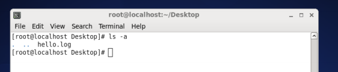  

### cd命令

cd命令用来切换工作目录至dirname。 其中dirName表示法可为绝对路径或相对路径。若目录名称省 

略，则变换至使用者的home directory(也就是刚login时所在的目录)。另外， ~ 也表示为home 

directory的意思， . 则是表示目前所在的目录， .. 则表示目前目录位置的上一层目录。


**课堂案例**: 采用绝对路径切换到桌面 

  

每个用户都有自己的主目录  root 管理员

 /root 目录 

**课堂案例**: 切换方式 cd 回车

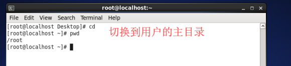  

**课堂案例**: 切换方式 cd ~ 

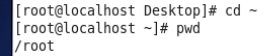  

**课堂案例**: 切换方式 cd /root 

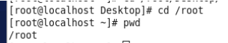  

 chj 普通用户 /home 

 cd 回车 

 cd ~ 

 cd /home/chj 

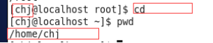  


### pwd命令

pwd命令以绝对路径的方式显示用户当前工作目录。命令将当前目录的全路径名称（从根目录）写入 

标准输出。全部目录使用 / 分隔。第一个 / 表示根目录，最后一个目录是当前目录。执行pwd命令可立 

刻得知您目前所在的工作目录的绝对路径名称。

**课堂案例**: 查看当前所在路径

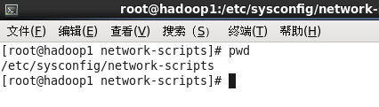  

###  **mkdir** **命令** 

用来创建目录。该命令创建由dirname命名的目录。如果在目录名的前面没有加任何路径名，则在 

当前目录下创建由dirname指定的目录；如果给出了一个已经存在的路径，将会在该目录下创建一个指 

定的目录。在创建目录时，应保证新建的目录与它所在目录下的文件没有重名 mkdir test 在当前目录 下创建test 目录 

 在指定的目录创建 hellos 目录 

```
mkdir /root/Desktop/test/hellos
```

**课堂案例**: 创建test目录

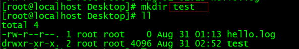  

**课堂案例**:  ll /root/Desktop/test 查看指定目录下面的目录列表

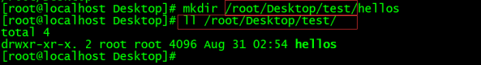  


### **rmdir** 命令 

rmdir命令用来删除空目录

**课堂案例**: 删除空目录hellos

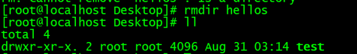  


### touch命令

touch命令有两个功能：一是用于把已存在文件的时间标签更新为系统当前的时间（默认方式），它们 

的数据将原封不动地保留下来；二是用来创建新的空文件。 

1. 创建文件 

   **课堂案例**: 创建aa.txt文件

   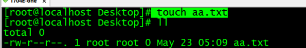  

2. 更新文件的系统时间 文件必须存在

   **课堂案例**: 创建aa.txt文件

     


### cat命令

cat命令连接文件并打印到标准输出设备上，cat经常用来显示文件的内容 

cat 参数

**课堂案例**: 查看hi.txt文件

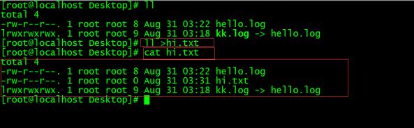  


### mv命令

作用划分: 

 1.1 移动文件 

 1.2 重命名文件 

mv命令用来对文件或目录重新命名，或者将文件从一个目录移到另一个目录中。source表示源文件或 

目录，target表示目标文件或目录。如果将一个文件移到一个已经存在的目标文件中，则目标文件的内 

容将被覆盖。 

移动文件 绝对路径的写法 


**课堂案例**: 移动a.txt到/root/Desktop/test/

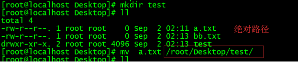  

重名文件

**课堂案例**: 将bb.txt文件重命名为ac.txt

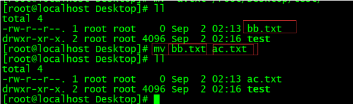  


**课堂案例**: 将test目录重命名为testx

  


### cp命令

 cp命令用来将一个或多个源文件或者目录复制到指定的目的文件或目录。它可以将单个源文件复 

制成一个指定文件名的具体的文件或一个已经存在的目录下。cp命令还支持同时复制多个文件，当一次 

复制多个文件时，目标文件参数必须是一个已经存在的目录，否则将出现错误。 

选项 

```
-a：此参数的效果和同时指定"-dpR"参数相同； 

-d：当复制符号连接时，把目标文件或目录也建立为符号连接，并指向与源文件或目录连接的原始文件或目 

录；

-f：强行复制文件或目录，不论目标文件或目录是否已存在； 

-i：覆盖既有文件之前先询问用户； 

-l：对源文件建立硬连接，而非复制文件； 

-p：保留源文件或目录的属性； 

-R/r：递归处理，将指定目录下的所有文件与子目录一并处理； 

-s：对源文件建立符号连接，而非复制文件； 

-u：使用这项参数后只会在源文件的更改时间较目标文件更新时或是名称相互对应的目标文件并不存在时，才 

复制文件； 

-S：在备份文件时，用指定的后缀“SUFFIX”代替文件的默认后缀； 

-b：覆盖已存在的文件目标前将目标文件备份； 

-v：详细显示命令执行的操作。 

```

**课堂案例**: 复制a.txt到bb.txt

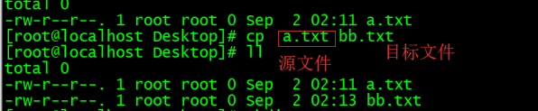  


**课堂案例**: 复制目录

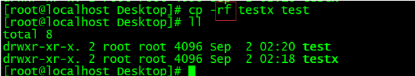  


### **rm** **命令** 

rm命令可以删除一个目录中的一个或多个文件或目录，也可以将某个目录及其下属的所有文件及其 

子目录均删除掉。对于链接文件，只是删除整个链接文件，而原有文件保持不变 

选项 

```
-d：直接把欲删除的目录的硬连接数据删除成0，删除该目录； 

-f：强制删除文件或目录； 

-i：删除已有文件或目录之前先询问用户； 

-r或-R：递归处理，将指定目录下的所有文件与子目录一并处理； 

--preserve-root：不对根目录进行递归操作； 

-v：显示指令的详细执行过程。 
```

删除文件 ，确认的方式删除 y 删除 n 取消删除 

**课堂案例**: 删除hello.log

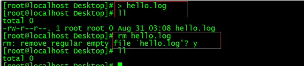  

删除文件 加入 -i选项 确认方式删除 y删除 n 取消删除

**课堂案例**: 使用-i选项

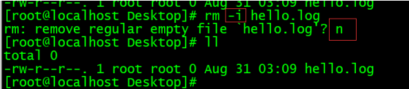  

删除文件 强制删除 没有提示 加入 -f 选项 

**课堂案例**: 使用-f强制删除hello.log

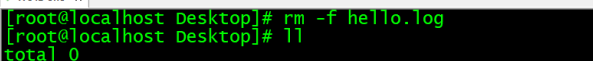  

递归删除文件目录 

**课堂案例**: 递归删除test目录

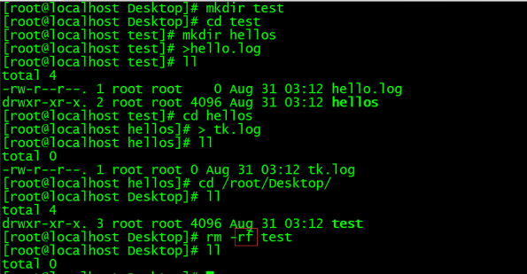  


### ln命令

 ln命令用来为文件创件连接，连接类型分为硬连接和符号连接两种，默认的连接类型是硬连接。如果 

要创建符号连接必须使用"-s"选项。 

**课堂案例**: 创建hello.log的连接文件

  

参数的含义 

源文件：指定连接的源文件。如果使用 -s 选项创建符号连接，则“源文件”可以是文件或者目录。创 

建硬连接时，则“源文件”参数只能是文件； 

目标文件：指定源文件的目标连接文件。


### tar命令

tar命令可以为linux的文件和目录创建档案 

常用软件 jdk mysql tomcat redis kafka elasticsearch 

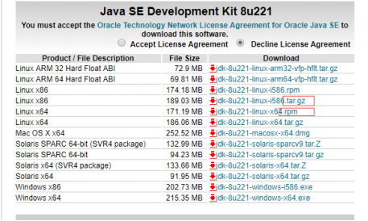  


选项 

```
-A或--catenate：新增文件到以存在的备份文件； 

-B：设置区块大小； 

-c或--create：建立新的备份文件； 

-C <目录>：这个选项用在解压缩，若要在特定目录解压缩，可以使用这个选项。 

-d：记录文件的差别； 

-x或--extract或--get：从备份文件中还原文件； 

-t或--list：列出备份文件的内容； 

-z或--gzip或--ungzip：通过gzip指令处理备份文件； 

-Z或--compress或--uncompress：通过compress指令处理备份文件； 

-f<备份文件>或--file=<备份文件>：指定备份文件； 

-v或--verbose：显示指令执行过程； 

-r：添加文件到已经压缩的文件； 

-u：添加改变了和现有的文件到已经存在的压缩文件； 

-j：支持bzip2解压文件； 

-v：显示操作过程； 

-l：文件系统边界设置； 

-k：保留原有文件不覆盖； 

-m：保留文件不被覆盖； 

-w：确认压缩文件的正确性； 

-p或--same-permissions：用原来的文件权限还原文件； 

-P或--absolute-names：文件名使用绝对名称，不移除文件名称前的“/”号； 

-N <日期格式> 或 --newer=<日期时间>：只将较指定日期更新的文件保存到备份文件里； 

--exclude=<范本样式>：排除符合范本样式的文件。 
```

z x v f c 参数选项 

1. 打包不压缩

   **课堂案例**: 打包aa.txt

   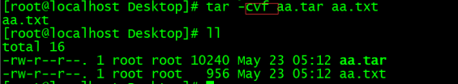  

   

2. 打包压缩

gzip 

**课堂案例**: 使用gzip打包压缩aa.txt

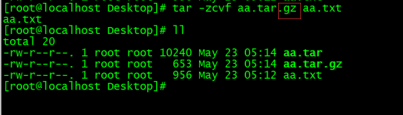  

bzip2 

**课堂案例**: 使用bzip2打包压缩aa.txt

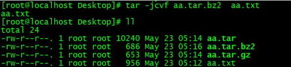  

在选项 f 之后的文件档名是自己取的，我们习惯上都用 .tar 来作为辨识。 如果加 z 选项，则以.tar.gz 

或.tgz来代表gzip压缩过的tar包；如果加 j 选项，则以.tar.bz2来作为tar包名。 

查看压缩中文件 -ztvf 参数 

**课堂案例**: 查看aa.tar.gz的参数

  

解压方式： 

tar -zxvf gzip .gz结尾的文件 

-C 指定目录

**课堂案例**: 将tomcat解压到/opt目录下

  


## 2.4 Linux系统的系统账号操作命令

### useradd命令

useradd命令用于Linux中创建的新的系统用户。useradd可用来建立用户帐号。帐号建好之后，再用 

passwd设定帐号的密码．而可用userdel删除帐号。使用useradd指令所建立的帐号，实际上是保存 

在 /etc/passwd 文本文件中 

选项 

```
-c<备注>：加上备注文字。备注文字会保存在passwd的备注栏位中； 

-d<登入目录>：指定用户登入时的启始目录； 

-D：变更预设值； 

-e<有效期限>：指定帐号的有效期限； 

-f<缓冲天数>：指定在密码过期后多少天即关闭该帐号； 

-g<群组>：指定用户所属的群组； 

-G<群组>：指定用户所属的附加群组； 

-m：自动建立用户的登入目录； 

-M：不要自动建立用户的登入目录； 

-n：取消建立以用户名称为名的群组； 

-r：建立系统帐号； 

-s<shell>：指定用户登入后所使用的shell； 

-u<uid>：指定用户id。 
```

**课堂案例**: 添加 chenhongjun 用户 指定uid是888 

  

**课堂案例**: 查看指令cat /etc/passwd 

  


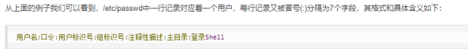  

1）"用户名"是代表用户账号的字符串。通常长度不超过8个字符，并且由大小写字母和/或数字组成。登录名中不能有冒号(:)，因为冒号在这里 

是分隔符。 

为了兼容起见，登录名中最好不要包含点字符(.)，并且不使用连字符(-)和加号(+)打头。 

2）“口令”一些系统中，存放着加密后的用户口令字。 

虽然这个字段存放的只是用户口令的加密串，不是明文，但是由于/etc/passwd文件对所有用户都可 

读，所以这仍是一个安全隐患。因此，现在许多Linux 系统（如SVR4）都使用了shadow技术，把真正 

的加密后的用户口令字存放到/etc/shadow文件中，而在/etc/passwd文件的口令字段中只存放一个特 

殊的字符，例如“x”或者“*”。 

3）“用户标识号”是一个整数，系统内部用它来标识用户。 

一般情况下它与用户名是一一对应的。如果几个用户名对应的用户标识号是一样的，系统内部将把它们 

视为同一个用户，但是它们可以有不同的口令、不同的主目录以及不同的登录Shell等。 

通常用户标识号的取值范围是0～65 535。0是超级用户root的标识号，1～99由系统保留，作为管理账 

号，普通用户的标识号从100开始。在Linux系统中，这个界限是500。 

4）“组标识号”字段记录的是用户所属的用户组。 

它对应着/etc/group文件中的一条记录。 

5)“注释性描述”字段记录着用户的一些个人情况。 

例如用户的真实姓名、电话、地址等，这个字段并没有什么实际的用途。在不同的Linux 系统中，这个 

字段的格式并没有统一。在许多Linux系统中，这个字段存放的是一段任意的注释性描述文字，用做 

fifinger命令的输出。 

6)“主目录”，也就是用户的起始工作目录。 

它是用户在登录到系统之后所处的目录。在大多数系统中，各用户的主目录都被组织在同一个特定的目 

录下，而用户主目录的名称就是该用户的登录名。各用户对自己的主目录有读、写、执行（搜索）权 

限，其他用户对此目录的访问权限则根据具体情况设置。 

7)用户登录后，要启动一个进程，负责将用户的操作传给内核，这个进程是用户登录到系统后运行的命 

令解释器或某个特定的程序，即Shell。 

Shell是用户与Linux系统之间的接口。Linux的Shell有许多种，每种都有不同的特点。常用的有 

sh(Bourne Shell), csh(C Shell), ksh(Korn Shell), tcsh(TENEX/TOPS-20 type C Shell), bash(Bourne 

Again Shell)等。 

系统管理员可以根据系统情况和用户习惯为用户指定某个Shell。如果不指定Shell，那么系统使用sh为 

默认的登录Shell，即这个字段的值为/bin/sh。 

用户的登录Shell也可以指定为某个特定的程序（此程序不是一个命令解释器）。 

利用这一特点，我们可以限制用户只能运行指定的应用程序，在该应用程序运行结束后，用户就自动退 

出了系统。有些Linux 系统要求只有那些在系统中登记了的程序才能出现在这个字段中。 

8)系统中有一类用户称为伪用户（pseudo users）。 

这些用户在/etc/passwd文件中也占有一条记录，但是不能登录，因为它们的登录Shell为空。它们的存 

在主要是方便系统管理，满足相应的系统进程对文件属主的要求。 

创建一个用户就会自动创建一个同名的用户组


### passwd命令

passwd命令用于设置用户的认证信息，包括用户密码、密码过期时间等。系统管理者则能用它管理系 

统用户的密码。只有管理者可以指定用户名称，一般用户只能变更自己的密码。 

选项 

```
-d：删除密码，仅有系统管理者才能使用； 

-f：强制执行； 

-k：设置只有在密码过期失效后，方能更新； 

-l：锁住密码； 

-s：列出密码的相关信息，仅有系统管理者才能使用； 

-u：解开已上锁的帐号。
```

**课堂案例**: 修改chenhongjun账号的密码

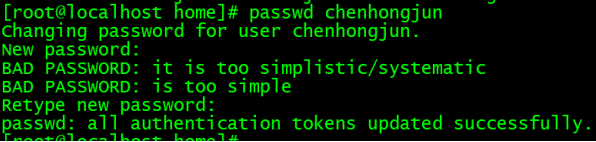  


### usermod命令

usermod命令用于修改用户的基本信息。usermod命令不允许你改变正在线上的使用者帐号名称。当 

usermod命令用来改变user id，必须确认这名user没在电脑上执行任何程序 

选项 

```
-c<备注>：修改用户帐号的备注文字； 

-d<登入目录>：修改用户登入时的目录； 

-e<有效期限>：修改帐号的有效期限； 

-f<缓冲天数>：修改在密码过期后多少天即关闭该帐号； 

-g<群组>：修改用户所属的群组； 

-G<群组>；修改用户所属的附加群组； 

-l<帐号名称>：修改用户帐号名称； 

-L：锁定用户密码，使密码无效； 

-s<shell>：修改用户登入后所使用的shell； 

-u<uid>：修改用户ID； 

-U:解除密码锁定。
```


### **userdel** 命令 

userdel命令用于删除给定的用户，以及与用户相关的文件。若不加选项，则仅删除用户帐号，而不删 

除相关文件。 

选项 

-f：强制删除用户，即使用户当前已登录； 

-r：删除用户的同时，删除与用户相关的所有文件。 

userdel -rf chjx


### su命令

 su命令用于切换当前用户身份到其他用户身份，变更时须输入所要变更的用户帐号与密码 

**课堂案例**: 切换用户

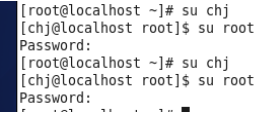  


### who命令

who命令是显示目前登录系统的用户信息

```
-H或--heading：显示各栏位的标题信息列；
-i或-u或--idle：显示闲置时间，若该用户在前一分钟之内有进行任何动作，将标示成"."号，如果该用户已超过24小时没有任何动作，则标示出"old"字符串；
-m：此参数的效果和指定"am i"字符串相同；
-q或--count：只显示登入系统的帐号名称和总人数；
-s：此参数将忽略不予处理，仅负责解决who指令其他版本的兼容性问题；
-w或-T或--mesg或--message或--writable：显示用户的信息状态栏；
--help：在线帮助；
--version：显示版本信息。
```


### groupadd命令

用于创建一个新的工作组，新工作组的信息将被添加到系统文件中 

选项 

```
-g：指定新建工作组的id； 

-r：创建系统工作组，系统工作组的组ID小于500； 

-K：覆盖配置文件“/ect/login.defs”； 

-o：允许添加组ID号不唯一的工作组。 
```

**课堂案例**: cat /etc/group 查看当前系统中的用户组 

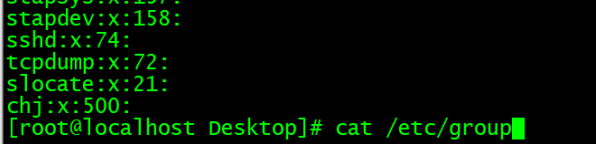  

添加组命令 

**课堂案例**: groupadd chjx 采用自动分配的id 

groupadd -g 508 chjy 采用指定的id 

  

**课堂案例**: 查看组: cat /etc/group

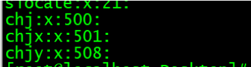  

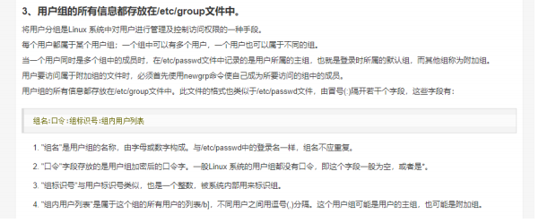  


**课堂案例**:查看指定用户所属组：groups 用户名

得出的结果是：  

用户名：组名

 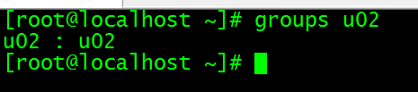 


**课堂案例**:修改用户所属组：usermod -g 组名 用户名

 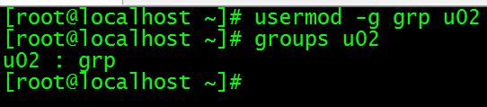  

### groupmod命令

groupmod命令更改群组识别码或名称。需要更改群组的识别码或名称时，可用groupmod指令来完成 

这项工作 

**课堂案例**: 修改组的识别码或名称

  

### groupdel命令

groupdel命令用于删除指定的工作组，本命令要修改的系统文件包括/ect/group和/ect/gshadow。若 

该群组中仍包括某些用户，则必须先删除这些用户后，方能删除群组

**课堂案例**: 删除用户组chjx

  


## 2.5 Linux系统中的文件权限操作命令

### chown命令

chown命令改变某个文件或目录的所有者和所属的组,命令可以向某个用户授权，使该用户变成指定文 

件的所有者或者改变文件所属的组。用户可以是用户或者是用户D，用户组可以是组名或组id。文件名 

可以使由空格分开的文件列表，在文件名中可以包含通配符。 

选项:-c或——changes：效果类似“-v”参数，但仅回报更改的部分； 

```
-f或--quite或——silent：不显示错误信息； 

-h或--no-dereference：只对符号连接的文件作修改，而不更改其他任何相关文件； 

-R或——recursive：递归处理，将指定目录下的所有文件及子目录一并处理； 

-v或——version：显示指令执行过程； 

--dereference：效果和“-h”参数相同； 

--help：在线帮助； 

--reference=<参考文件或目录>：把指定文件或目录的拥有者与所属群组全部设成和参考文件或目录的拥有 

者与所属群组相同； 

--version：显示版本信息。 
```

**课堂案例**: 修改test目录 以及子目录中的所有文件和目录 都改成 chengongjun属主 chengongjun属组

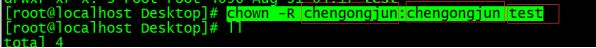  


### chgrp命令

chgrp命令用来改变文件或目录所属的用户组。该命令用来改变指定文件所属的用户组。其中，组名可 

以是用户组的id，也可以是用户组的组名

**课堂案例**: 修改test的用户组为chjy

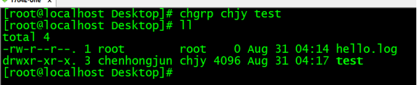  


### chmod命令

chmod命令用来变更文件或目录的权限 

```
u User，即文件或目录的拥有者； 

g Group，即文件或目录的所属群组； 

o Other，除了文件或目录拥有者或所属群组之外，其他用户皆属于这个范围； 

a All，即全部的用户，包含拥有者，所属群组以及其他用户； 

r 读取权限，数字代号为“4”; 

w 写入权限，数字代号为“2”； 

x 执行或切换权限，数字代号为“1”； 

\- 不具任何权限，数字代号为“0”； 

s 特殊功能说明：变更文件或目录的权限
```

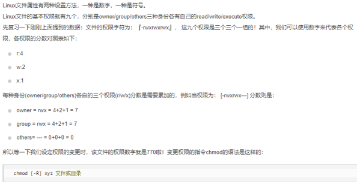  


# 课堂练习

## 1.创建文件并编辑(10分钟)

要求:

​	1.在/opt目录下创建文件夹test(1分钟)

​	2.在/opt/test目录下创建文件abc.txt(1分钟)

​    3.将abc.txt移动到/opt目录下，并重命名为123.txt(2分钟)

​	4.复制abc.txt，并命名为def.txt(1分钟)

​	5.将test文件夹进行gzip格式压缩成test.tar.gz(2分钟)

​	6.删除文件夹test(1分钟)

​    7.将test.tar.gz进行解压(2分钟)

## 2. 修改指定文件的权限(15分钟)

要求:

​	1.新建用户test01(1分钟)

​	2.为用户test01设置密码(1分钟)

​    3.创建用户组grp01(2分钟)

​    4.在/opt目录下创建abc.txt文件(2分钟)

​    5.修改abc.txt文件的所属用户为test01(2分钟)

​    6.修改abc.txt文件的所属用户组为grp01(2分钟)

​    5.使用两种方式修改abc.txt文件的权限为-rwxr-xr--(5分钟)


## 3.关机和重启(10分钟)

要求:

​	1.使用3种不同的命令进行重启(5分钟)

​	2.使用3种不同的命令进行关机(5分钟)

​	

## **备注:如果课堂中没有单独的课堂练习,需练习课堂案例**