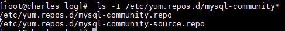
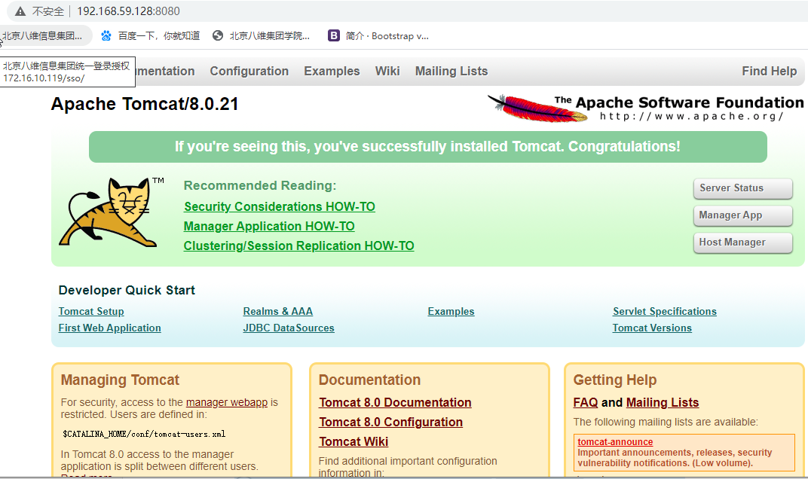

# 第四单元 Linux软件安装

# 【授课重点】

1. 了解Linux应用程序的组成部分
2. 掌握应用程序安装的方法
3. 在Linux中安装JDK
4. 在Linux中安装mysql
5. 在Linux中安装tomcat

# 【考核要求】

1. 掌握应用程序安装方法（tar、rpm、yum）
2. 掌握mysql安装
3. 掌握tomcat安装
4. 掌握本地WEB项目发布到Linux中

# 【教学内容】

## 4.1 课程导入

以后我们开发的项目都需要部署到Linux系统下，都是基于java的，那么就必须安装JDK等相关的软件，配置相关的环境。我们一起来学习下，如何在Linux系统中安装软件。

## 4.2 在Linux中安装JDK

在linux 下安装JDK，可正常使用java和javac等命令

#### **4.2.1 准备工作**

将资料文件夹中的软件目录下的jdk文件上传到Linux系统的用户主目录ee

   

#### **4.2.2 相关知识点：rpm命令**

rpm（英文全拼：redhat package manager） 原本是 Red Hat Linux 发行版专门用来管理 Linux 各项套件的程序，由于它遵循 GPL 规则且功能强大方便，因而广受欢迎。逐渐受到其他发行版的采用。RPM 套件管理方式的出现，让 Linux 易于安装，升级，间接提升了 Linux 的适用度

l 格式：rpm [参数] [软件]

​		-v 　显示指令执行过程。

​		-h或--hash 　套件安装时列出标记。

​		-q 　使用询问模式，当遇到任何问题时，rpm指令会先询问用户。 

​		-a 　查询所有套件。

​		-i<套件档>或--install<套件档> 　安装指定的套件档。

​		-U<套件档>或--upgrade<套件档>   升级指定的套件档。 

​		-e<套件档>或--erase<套件档> 　删除指定的套件。

​		--nodeps 　不验证套件档的相互关联性

​		常用

​			安装：rpm -ivh rpm文件【安装】 

​			升级：rpm -Uvh rpm文件【更新】

​			删除：rpm -e --nodeps 软件名  【卸载软件命令】

​			查看：rpm –qa(配置管道使用)

#### **4.2.3 JDK安装步骤**

l 第一步：查看现有安装的JDK版本

```
rpm -qa | grep -i java 
```

 

openJDK它是Linux系统安装时自带的JDK，我们是不需要的，直接卸载即可！

 

l 第二步：卸载已有的软件

```
rpm -e --nodeps java-1.7.0-openjdk-1.7.0.79-2.5.5.4.el6.x86_64

rpm -e --nodeps java-1.6.0-openjdk-1.6.0.35-1.13.7.1.el6_6.x86_64
```


 

l 第三步：将之前上传好的JDK解压

```
需要先创建目录 mkdir /opt/java

tar –zxvf jdk1.8.0_65.tar.gz
```

 

l 第四步：将加压好的JDK移动到java目录中

mv jdk1.8.0_65 /opt/java

 


l 第五步：配置系统环境变量

vim /etc/profile   #进入根目录

在这个配置文件的末尾(先i，可以移动光标，通过上下左右箭头)，添加如下2行代码(建议复制)

```
export JAVA_HOME=/opt/jdk1.8.0_65

export PATH=$JAVA_HOME/bin:$PATH
```

然后使用Esc  :wq保存退出

 

l 第六步：使配置文件生效并测试

先进入JDK的bin目录，然后复制以下2行代码即可：

```
source /etc/profile
```

java –version  #测试是否安装成功


 

如果配置成功，只需要在bin目录下面运行 java –version,在任意目录均可！(上图是bin目录，下图是根目录)

 

## 4.3 在Linux中安装mysql（在线安装）

### 4.3.1 安装MySQL

l 第一步：卸载系统自带的Mariadb

mariadb是mysql 的一个分支

```
   rpm -qa|grep mariadb
```


l 第二步：卸载之前的版本

```
rpm -e --nodeps     mariadb-libs-5.5.56-2.el7.x86_64                    [查询出来的文件名]
```


l 第三步：从网上下载文件的wget命令

```
 yum -y install wget
```


l 第四步：下载mysql的repo源

```
wget http://repo.mysql.com/mysql-community-release-el7-5.noarch.rpm
```


l 第五步：安装mysql-community-release-el7-5.noarch.rpm包

```
 rpm -ivh mysql-community-release-el7-5.noarch.rpm
```

l 第六步：检查是否有两个	repo源

```
 ls -1 /etc/yum.repos.d/mysql-community*
```



l 第七步：安装mysql

```
yum -y install mysql-server
```


l 第八步：启动mysql

```
systemctl start mysqld.service
```

### 4.3.2 配置MySQL

第一步：以root账户登录mysql,默认是没有密码的

```
mysql -uroot -p
```

要输入密码的时候直接回车即可

l 第二步：设置root账户密码为root（也可以修改成你要的密码）

```
mysql> use mysql
mysql> update user set password=password('root') where user='root' and host='localhost';
mysql> flush privileges;
```


l 第三步：设置远程主机登录，注意下面的your username 和 your password改成你需要设置的用户和密码

```
mysql> GRANT ALL PRIVILEGES ON *.* TO 'root'@'%' IDENTIFIED BY 'root' WITH
GRANT OPTION;
```


## 4.4 在Linux中安装tomcat

l 第一步：上传Tomcat

rz 上传

 

l 第二步：解压Tomcat

```
tar -zxvf apache-tomcat-8.0.21.tar.gz
```

 

l 第三步：移动到指定目录/opt/

```
mv apache-tomcat-8.0.21 /opt/tomcat8
```


l 第四步：配置防火墙(所有的配置都在etc目录下面,指定windows系统访问的端口号,如果防火墙关闭，则跳过此步骤)

```
firewall-cmd --zone=public --add-port=8080/tcp --permanent   

firewall -cmd –reload   #重新载入
```


l 第五步：启动并访问Tomcat

**进入tomcat所在的bin目录**

```
cd /opt/tomcat8/bin
```

启动

```
./startup.sh
```

第六步：测试访问，浏览器访问：



第六步：关闭Tomcat结束测试

 

依旧需要先进入tomcat的bin目录，然后执行 ./shutdown.sh命令

 

# 课堂练习

## 1.采用课堂教案完成java环境的搭建（10分钟)

要求:

​	1.jdk是1.8以上的版本

​	2.采用源码安装并配置环境变量

​	3.使用javac命令编译一个java文件

​	4.查看java版本号

## 2.采用课堂教案完成mysql的安装(20分钟)

要求:

​	1.mysql是5.6版本

​	2.采用rpm安装

​	3.开放3306端口号

​	4.采用windows电脑上的sqlyog或者是Navicat连接linux的mysql

​	5.导入cms项目数据库并且测试通过

​	6.通过ps命令查看mysql进程

## 3.采用课堂教案完成tomcat的安装（15分钟)

要求:

​	1.采用wget下载tomcat

​	2.要求tomcat版本是8.0以上

​	3.开放防火墙端口号8080

​	4.启动tomcat查看启动日志

​	5.测试tomcat首页

​	6.查看tomcat进程

​	7.关闭tomcat

## 4.综合案例（10分钟)

要求:

​	1.把windows上的cms系统部署到linux环境中

​	2.使用linux版mysql作为数据源

​	3.成功访问到首页