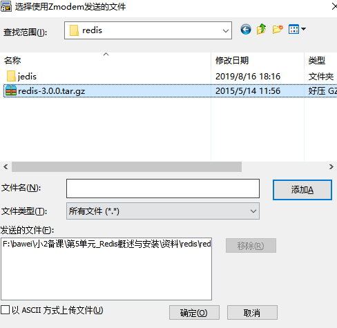
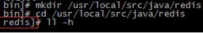
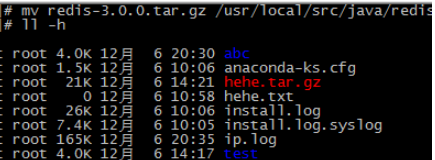
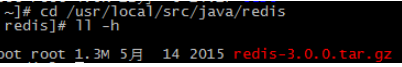
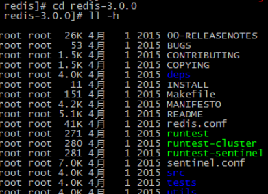
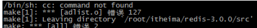
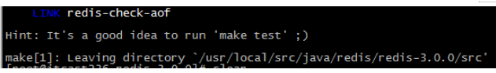
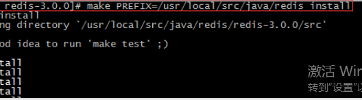
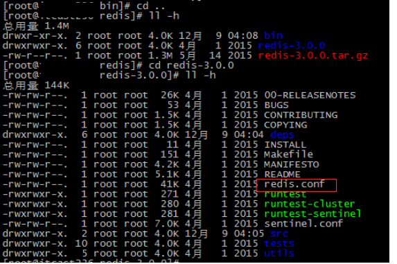
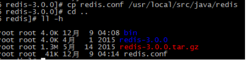

# 第5单元 Redis概述与安装

# 【授课重点】

​	1.了解Redis发展历史信息

​	2.掌握Redis的特点

​	3.掌握Redis环境搭建知识

# 【考核要求】

​	1.熟练掌握redis的安装启动

​	2.掌握redis的缓存机制

​	3.掌握redis的数据结构

# 【教学内容】

## 5.1 课程导入

### 5.1.1 什么是NoSQL

NoSQL(NoSQL = Not Only SQL)，意即“不仅仅是SQL”，是一项全新的数据库理念，泛指非关系型的数据库。

(关系型数据库<MySQL、Oracle、DB2、SQLServer>：有标，而且表与表直接存在关系<主外键>)

NoSQL与关系型数据库SQL是互相弥补的……

 

### 5.1.2 为什么需要NoSQL

随着互联网web2.0网站的兴起，非关系型的数据库现在成了一个极其热门的新领域，非关系数据库产品的发展非常迅速。而传统的关系数据库在应付web2.0网站，特别是超大规模和高并发的SNS类型的web2.0纯动态网站已经显得力不从心，暴露了很多难以克服的问题，例如：

 

 1、High performance - 对数据库高并发读写的需求 

web2.0网站要根据用户个性化信息来实时生成动态页面和提供动态信息，所以基本上无法使用动态页面静态化技术，因此数据库并发负载非常高，往往要达到每秒上万次读写请求。关系数据库应付上万次SQL查询还勉强顶得住，但是应付上万次SQL写数据请求，硬盘IO就已经无法承受了。其实对于普通的BBS网站，往往也存在对高并发写请求的需求，例如网站的实时统计在线用户状态，记录热门帖子的点击次数，投票计数等，因此这是一个相当普遍的需求。

 2、Huge Storage - 对海量数据的高效率存储和访问的需求 

类似Facebook，twitter，Friendfeed这样的SNS网站，每天用户产生海量的用户动态，以Friendfeed为例，一个月就达到了2.5亿条用户动态，对于关系数据库来说，在一张2.5亿条记录的表里面进行SQL查询，效率是极其低下乃至不可忍受的。再例如大型web网站的用户登录系统，例如腾讯，盛大，动辄数以亿计的帐号，关系数据库也很难应付。 

 3、High Scalability && High Availability- 对数据库的高可扩展性和高可用性的需求 

在基于web的架构当中，数据库是最难进行横向扩展的，当一个应用系统的用户量和访问量与日俱增的时候，你的数据库却没有办法像web server和app server那样简单的通过添加更多的硬件和服务节点来扩展性能和负载能力。对于很多需要提供24小时不间断服务的网站来说，对数据库系统进行升级和扩展是非常痛苦的事情，往往需要停机维护和数据迁移，为什么数据库不能通过不断的添加服务器节点来实现扩展呢？

​	NoSQL数据库的产生就是为了解决大规模数据集合多重数据种类带来的挑战，尤其是大数据应用难题。

 

### 5.1.3 主流NoSQL产品

 

l NoSQL数据库的四大分类如下：

n 键值(Key-Value)存储数据库   redis到时候设置值： set key value  、、get key

相关产品： Tokyo Cabinet/Tyrant、Redis、Voldemort、Berkeley DB

典型应用： **内容缓存**，主要用于处理大量数据的高访问负载。 **缓存****、****分布式****集群**

数据模型： 一系列键值对

优势： 快速查询(由它的存储结构决定的)

劣势： 存储的数据缺少结构化

n 列存储数据库

相关产品：Cassandra, HBase, Riak  (大数据)

典型应用：分布式的文件系统

数据模型：以列簇式存储，将同一列数据存在一起

优势：查找速度快，可扩展性强，**更容易进行分布式扩展**

劣势：功能相对局限

n 文档型数据库

相关产品：CouchDB、MongoDB   类似html

典型应用：Web应用（与Key-Value类似，Value是结构化的）

数据模型： 一系列键值对

优势：数据结构要求不严格

劣势： 查询性能不高，而且缺乏统一的查询语法

n 图形(Graph)数据库(腾讯)  A  **B**  C D E

相关数据库：Neo4J、InfoGrid、Infinite Graph

典型应用：社交网络

数据模型：图结构

优势：利用图结构相关算法。

劣势：需要对整个图做计算才能得出结果，不容易做分布式的集群方案。

 

### 5.1.4 NoSQL特点

在大数据存取上具备关系型数据库无法比拟的**性能优势**，例如：

1. 易扩展

 NoSQL数据库种类繁多，但是一个共同的特点都是去掉关系数据库的关系型特性。数据之间无关系，这样就非常容易扩展。也无形之间，在架构的层面上带来了可扩展的能力。

2. 大数据量，高性能

 NoSQL数据库都具有非常高的读写性能，尤其在大数据量下，同样表现优秀。这得益于它的无关系性，数据库的结构简单。

3. 灵活的数据模型

 NoSQL无需事先为要存储的数据建立字段，随时可以存储自定义的数据格式。而在关系数据库里，增删字段是一件非常麻烦的事情。如果是非常大数据量的表，增加字段简直就是一个噩梦。这点在大数据量的Web2.0时代尤其明显。

4. 高可用

 NoSQL在不太影响性能的情况，就可以方便的实现高可用的架构。比如Cassandra，HBase模型，通过复制模型也能实现高可用。

综上所述，NoSQL的非关系特性使其成为了后Web2.0时代的宠儿，助力大型Web2.0网站的再次起飞，是一项全新的数据库革命性运动。

### 5.1.5 Redis由来

2008年，意大利的一家创业公司Merzia推出了一款基于MySQL的网站实时统计系统LLOOGG，然而没过多久该公司的创始人 Salvatore Sanfilippo便 对MySQL的性能感到失望，于是他决定亲自为LLOOGG量身定做一个数据库，并于2009年开发完成，这个数据库就是Redis。 不过Salvatore Sanfilippo并不满足只将Redis用于LLOOGG这一款产品，而是希望更多的人使用它，于是在同一年Salvatore Sanfilippo将Redis开源发布，并开始和Redis的另一名主要的代码贡献者Pieter Noordhuis一起继续着Redis的开发，直到今天。

​	Salvatore Sanfilippo自己也没有想到，短短的几年时间，Redis就拥有了庞大的用户群体。Hacker News在2012年发布了一份数据库的使用情况调查，结果显示有近12%的公司在使用Redis。国内如新浪微博、街旁网、知乎网，国外如GitHub、Stack Overflow、Flickr等都是Redis的用户。

​	VMware公司从2010年开始赞助Redis的开发， Salvatore Sanfilippo和Pieter Noordhuis也分别在3月和5月加入VMware，全职开发Redis。

### 5.1.6 什么是Redis

Redis是用C语言开发的一个开源的高性能键值对（key-value）数据库。它通过提供多种键值数据类型来适应不同场景下的存储需求，目前为止Redis支持的键值数据类型如下：

1、 字符串类型

2、 散列类型			hash被(string和json)取代了

3、 列表类型

4、 集合类型

5、 有序集合类型。

 

官方提供测试数据：50个并发执行100000个请求,读的速度是110000次/s,写的速度是81000次/s 。数据仅供参考，根据服务器配置会有不同结果。

 

### 5.1.7  redis的应用场景

 缓存（数据查询、短连接、新闻内容、商品内容等等）。（最多使用，变化不大）

 聊天室的在线好友列表。

 任务队列。（秒杀、抢购、12306等等）

 应用排行榜。

 网站访问统计。

 数据过期处理（可以精确到毫秒）

 分布式集群架构中的session分离。【第二个大型电商项目中使用】

 

## 5.2 Redis安装和使用

redis建议安装在linux服务器上运行测试，本教程使用 linux虚拟机及ssh客户端进行功能测试。

 

### 5.2.1 搭建环境

 	我们选择在CentOS安装Redis

**1. 安装环境**

redis是C语言开发，安装redis需要先将官网下载的源码进行编译，编译依赖gcc环境。如果没有gcc环境，需要安装gcc：

```
yum install gcc-c++
```

 

如果提示是否下载，输入y。

 

如果提示是否安装，输入y

 

**2. Redis安装**

 步骤1：将Windows下下载的压缩文件上传到Linux下。通过secureCRT进行上传，步骤如下：

rz 命令上传redis安装包

  

 步骤2：创建一个目录

```
mkdir /usr/local/src/java/redis
```

 

 步骤3.将redis这个文件移动到创建好的这个目录里面去

```
mv redis-3.0.0.tar.gz /usr/local/src/java/redis
```

 

 步骤4：解压这个文件

先进入这个目录

 

然后使用解压命令：

```
tar –zxvf redis-3.0.0.tar.gz
```

图省略！

 步骤5：编译redis (编译，将.c文件编译为.o文件)【Redis是由C语言开发的】

进入解压文件夹，

```
cd redis-3.0.0
```

 

执行make进行编译

 

1）如果没有安装gcc，编译将出现错误提示。（如果安装失败，必须删除文件夹，重写解压）

 

2）安装成功

 

 步骤6：	安装   (**此时,在这里安装的目的就是为了生成redis的bin目录**)

```
make PREFIX=/usr/local/src/java/redis install
```

 

安装完后，在/usr/local/redis/bin下有几个可执行文件

 

```
redis-benchmark		----性能测试工具

redis-check-aof		----AOF文件修复工具

redis-check-dump	----RDB文件检查工具（快照持久化文件）

redis-cli			----命令行客户端

redis-server		----redis服务器启动命令
```

 步骤7：copy文件 

redis启动需要一个配置文件，可以修改端口号等信息。

先进入你安装的这个redis目录，然后查看相关的文件是否存在！

 

然后执行复制操作（进入复制的文件目录中查看）

```
cp redis.conf /usr/local/src/java/redis
```

 

reids.conf  配置的具体信息如下:

| 序号 |                            配置项                            | 说明                                                         |
| :--- | :----------------------------------------------------------: | :----------------------------------------------------------- |
| 1    |                        `daemonize no`                        | Redis 默认不是以守护进程的方式运行，可以通过该配置项修改，使用 yes 启用守护进程（Windows 不支持守护线程的配置为 no ） |
| 2    |                 `pidfile /var/run/redis.pid`                 | 当 Redis 以守护进程方式运行时，Redis 默认会把 pid 写入 /var/run/redis.pid 文件，可以通过 pidfile 指定 |
| 3    |                         `port 6379`                          | 指定 Redis 监听端口，默认端口为 6379，作者在自己的一篇博文中解释了为什么选用 6379 作为默认端口，因为 6379 在手机按键上 MERZ 对应的号码，而 MERZ 取自意大利歌女 Alessia Merz 的名字 |
| 4    |                       `bind 127.0.0.1`                       | 绑定的主机地址                                               |
| 5    |                        `timeout 300`                         | 当客户端闲置多长时间后关闭连接，如果指定为 0，表示关闭该功能 |
| 6    |                      `loglevel notice`                       | 指定日志记录级别，Redis 总共支持四个级别：debug、verbose、notice、warning，默认为 notice |
| 7    |                       `logfile stdout`                       | 日志记录方式，默认为标准输出，如果配置 Redis 为守护进程方式运行，而这里又配置为日志记录方式为标准输出，则日志将会发送给 /dev/null |
| 8    |                        `databases 16`                        | 设置数据库的数量，默认数据库为0，可以使用SELECT 命令在连接上指定数据库id |
| 9    | `save <seconds> <changes>`Redis 默认配置文件中提供了三个条件：**save 900 1****save 300 10****save 60 10000**分别表示 900 秒（15 分钟）内有 1 个更改，300 秒（5 分钟）内有 10 个更改以及 60 秒内有 10000 个更改。 | 指定在多长时间内，有多少次更新操作，就将数据同步到数据文件，可以多个条件配合 |
| 10   |                     `rdbcompression yes`                     | 指定存储至本地数据库时是否压缩数据，默认为 yes，Redis 采用 LZF 压缩，如果为了节省 CPU 时间，可以关闭该选项，但会导致数据库文件变的巨大 |
| 11   |                    `dbfilename dump.rdb`                     | 指定本地数据库文件名，默认值为 dump.rdb                      |
| 12   |                           `dir ./`                           | 指定本地数据库存放目录                                       |
| 13   |              `slaveof <masterip> <masterport>`               | 设置当本机为 slav 服务时，设置 master 服务的 IP 地址及端口，在 Redis 启动时，它会自动从 master 进行数据同步 |
| 14   |                `masterauth <master-password>`                | 当 master 服务设置了密码保护时，slav 服务连接 master 的密码  |
| 15   |                    `requirepass foobared`                    | 设置 Redis 连接密码，如果配置了连接密码，客户端在连接 Redis 时需要通过 AUTH <password> 命令提供密码，默认关闭 |
| 16   |                      ` maxclients 128`                       | 设置同一时间最大客户端连接数，默认无限制，Redis 可以同时打开的客户端连接数为 Redis 进程可以打开的最大文件描述符数，如果设置 maxclients 0，表示不作限制。当客户端连接数到达限制时，Redis 会关闭新的连接并向客户端返回 max number of clients reached 错误信息 |
| 17   |                     `maxmemory <bytes>`                      | 指定 Redis 最大内存限制，Redis 在启动时会把数据加载到内存中，达到最大内存后，Redis 会先尝试清除已到期或即将到期的 Key，当此方法处理 后，仍然到达最大内存设置，将无法再进行写入操作，但仍然可以进行读取操作。Redis 新的 vm 机制，会把 Key 存放内存，Value 会存放在 swap 区 |
| 18   |                       `appendonly no`                        | 指定是否在每次更新操作后进行日志记录，Redis 在默认情况下是异步的把数据写入磁盘，如果不开启，可能会在断电时导致一段时间内的数据丢失。因为 redis 本身同步数据文件是按上面 save 条件来同步的，所以有的数据会在一段时间内只存在于内存中。默认为 no |
| 19   |               `appendfilename appendonly.aof`                | 指定更新日志文件名，默认为 appendonly.aof                    |
| 20   |                    `appendfsync everysec`                    | 指定更新日志条件，共有 3 个可选值：**no**：表示等操作系统进行数据缓存同步到磁盘（快）**always**：表示每次更新操作后手动调用 fsync() 将数据写到磁盘（慢，安全）**everysec**：表示每秒同步一次（折中，默认值） |
| 21   |                       `vm-enabled no`                        | 指定是否启用虚拟内存机制，默认值为 no，简单的介绍一下，VM 机制将数据分页存放，由 Redis 将访问量较少的页即冷数据 swap 到磁盘上，访问多的页面由磁盘自动换出到内存中（在后面的文章我会仔细分析 Redis 的 VM 机制） |
| 22   |                `vm-swap-file /tmp/redis.swap`                | 虚拟内存文件路径，默认值为 /tmp/redis.swap，不可多个 Redis 实例共享 |
| 23   |                      `vm-max-memory 0`                       | 将所有大于 vm-max-memory 的数据存入虚拟内存，无论 vm-max-memory 设置多小，所有索引数据都是内存存储的(Redis 的索引数据 就是 keys)，也就是说，当 vm-max-memory 设置为 0 的时候，其实是所有 value 都存在于磁盘。默认值为 0 |
| 24   |                      `vm-page-size 32`                       | Redis swap 文件分成了很多的 page，一个对象可以保存在多个 page 上面，但一个 page 上不能被多个对象共享，vm-page-size 是要根据存储的 数据大小来设定的，作者建议如果存储很多小对象，page 大小最好设置为 32 或者 64bytes；如果存储很大大对象，则可以使用更大的 page，如果不确定，就使用默认值 |
| 25   |                     `vm-pages 134217728`                     | 设置 swap 文件中的 page 数量，由于页表（一种表示页面空闲或使用的 bitmap）是在放在内存中的，，在磁盘上每 8 个 pages 将消耗 1byte 的内存。 |
| 26   |                      `vm-max-threads 4`                      | 设置访问swap文件的线程数,最好不要超过机器的核数,如果设置为0,那么所有对swap文件的操作都是串行的，可能会造成比较长时间的延迟。默认值为4 |
| 27   |                     `glueoutputbuf yes`                      | 设置在向客户端应答时，是否把较小的包合并为一个包发送，默认为开启 |
| 28   |    `hash-max-zipmap-entries 64 hash-max-zipmap-value 512`    | 指定在超过一定的数量或者最大的元素超过某一临界值时，采用一种特殊的哈希算法 |
| 29   |                    `activerehashing yes`                     | 指定是否激活重置哈希，默认为开启（后面在介绍 Redis 的哈希算法时具体介绍） |
| 30   |                `include /path/to/local.conf`                 | 指定包含其它的配置文件，可以在同一主机上多个Redis实例之间使用同一份配置文件，而同时各个实例又拥有自己的特定配置文件 |

### 5.2.3 Redis的启动

**1. 前端模式启动(不推荐，丢失数据更严重！)**

直接运行bin/redis-server将以前端模式启动，前端模式启动的缺点是启动完成后，不能再进行其他操作，如果要操作必须使用ctrl+c，同时redis-server程序结束，不推荐使用此方法。【用户主目录运行！】

**课堂案例:** 前端模式启动redis服务

```
/usr/local/src/java/redis/bin/redis-server 
```

​       

 

**课堂案例:** 使用CTRL+ C 停止前端模式

 

**2. 后端模式**

**课堂案例:** 

 修改redis.conf配置文件， daemonize yes 以后端模式启动。

```
vim /usr/local/src/java/redis/redis.conf
```

在文件的最后加入 daemonize yes

 

 

 启动时，指定配置文件

**课堂案例:**

先进入redis目录：

 

**课堂案例:**

执行启动命令：【必须要有./】

```
./bin/redis-server ./redis.conf
```

 

**课堂案例:**

 Redis默认端口6379，通过当前服务进行查看

```
ps –ef | grep –i redis
```

 

### 5.2.4 Redis停止

 强制结束程序。强行终止Redis进程可能会导致redis持久化数据丢失。(不要使用这个)

```
kill -9 31475		#pid需要通过“ps aux | grep -i redis”进行查询
```

 正确停止Redis的方式应该是向Redis发送SHUTDOWN命令，方法为：（关闭默认端口）

先进入redis的bin目录(cd /usr/local/src/java/redis/bin)

在执行./redis-cli shutdown  (重新连接可以检验是否停止成功！)

 

### 5.2.5 Redis使用

**1. 连接客户端**

**课堂案例:** 

在redis的安装目录中有redis的客户端，即redis-cli（Redis Command Line Interface），它是Redis自带的基于命令行的Redis客户端。

需要先进入到bin目录,然后执行下面的命令

```
./redis–cli –h 192.168.59.132 –p 6379 (建议手敲)
```

 

默认ip和端口(可以不指定ip和端口)

 

**2. 向Redis服务器发送命令(通用操作)**

**课堂案例:** 

redis-cli连上redis服务后，可以在命令行发送命令。

```
 ping，测试客户端与Redis的连接是否正常，如果连接正常会收到回复PONG
```

 

**课堂案例:**

```
set/get，使用set和get可以向redis设置数据、获取数据。
```

 

**课堂案例:**

```
del，删除指定key的内容。
```

 

**课堂案例:**

```
keys * ，查看当前库中所有的key值
```

 

**课堂案例:**

```
 EXISTS key的名字,若 key 存在返回 1 ，否则返回 0 
```

 

**课堂案例:**

查找所有以字母开头的键值

```
keys 字母*
```

 

**课堂案例:**

检测一下key的类型

```
type 键名
```

 

**课堂案例:**

设置过期时间:

```
expire key名字 timeout(单位为秒)
```

 

**课堂案例:**

把key移动到指定数据库

```
MOVE key名字 数据库索引号
```

 

**课堂案例:**

清空当前数据库

```
flushdb
```

 


# 课堂练习

## 1.redis的特点

要求:

​	1.说出redis和mysql的区别

​	2.描述redis的应用场景

​	3.描述redis优缺点

## 2.安装redis

要求:

​	1.根据课堂案例安装redis

​	2.以前端模式启动

​	3.以后端模式启动

​	4.启动客户端测试是否和服务端联通

​	5.创建一个string数据类型,并设置过期时间为60s

​	6.把5的数据移动到索引为6的数据库

 