# 第5单元 Redis概述与安装

# 【授课重点】

​	1.了解Redis发展历史信息

​	2.掌握Redis的特点

​	3.掌握Redis环境搭建知识

# 【考核要求】

​	1.熟练掌握redis的安装启动

​	2.掌握redis的缓存机制

​	3.掌握redis的数据结构

# 【教学内容】

## 5.1 课程导入

### 5.1.1 什么是NoSQL

NoSQL(NoSQL = Not Only SQL)，意即“不仅仅是SQL”，是一项全新的数据库理念，泛指非关系型的数据库。

(关系型数据库<MySQL、Oracle、DB2、SQLServer>：有表，而且表与表直接存在关系<主外键>)

NoSQL与关系型数据库SQL是互相弥补的……

 

### 5.1.2 Nosql的特性

Ø Schemaless (弱结构)

Ø In-Memory (基于内存)

Ø 弱化事务

Ø 适用于Cluster(集群)环境

Ø 没有复杂的连接查询操作

Ø  持久化

### 5.1.3 主流NoSQL产品


Ø Cassandra:  基于图片存储

Ø Hbase:基于列存储

Ø mongoDB：基于文档存储

Ø CouchDB:基于文档存储

Ø Riak:基于键值存储

Ø Redis：基于键值存储

 

### 5.1.6 什么是Redis

 **Redis是用C 语言开发的、一个开源、支持网络、基于内存、键值对型的NOSQL数据库。**

Ø Redis是一个高性能的Key/VaIue数据库

Ø 基于内存

Ø 数据类型丰富（string\list\set\sortset\hash）

Ø 持久化

Ø 单线程

Ø 订阅/发布模型

 

### 5.1.7  redis的应用场景

#### 5.1.7.1 传统的架构

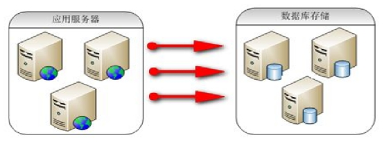 

#### 5.1.7.2 Redis 存储非关系型数据架构

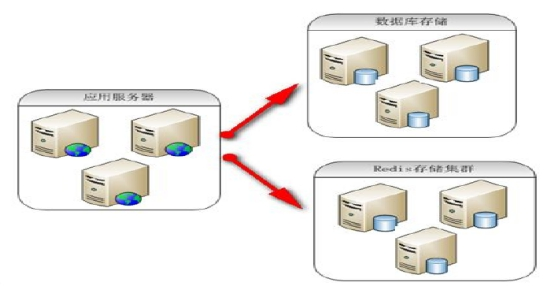 

#### 5.1.7.3 Redis 充当缓存服务器架构

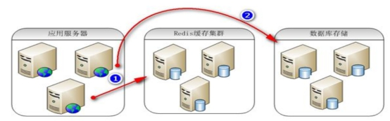

 

## 5.2 Redis安装和使用

redis建议安装在linux服务器上运行测试，本教程使用 linux虚拟机及ssh客户端进行功能测试。

 

### 5.2.1 搭建环境

 	我们选择在CentOS安装Redis

**1. 安装环境**

redis是C语言开发，安装redis需要先将官网下载的源码进行编译，编译依赖gcc环境。如果没有gcc环境，需要安装gcc：

```
yum install gcc-c++
```

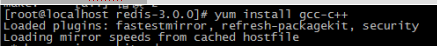 

如果提示是否下载，输入y。

 

如果提示是否安装，输入y

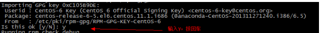 

**2. Redis安装**

 步骤1：将Windows下下载的压缩文件上传到Linux下，步骤如下：

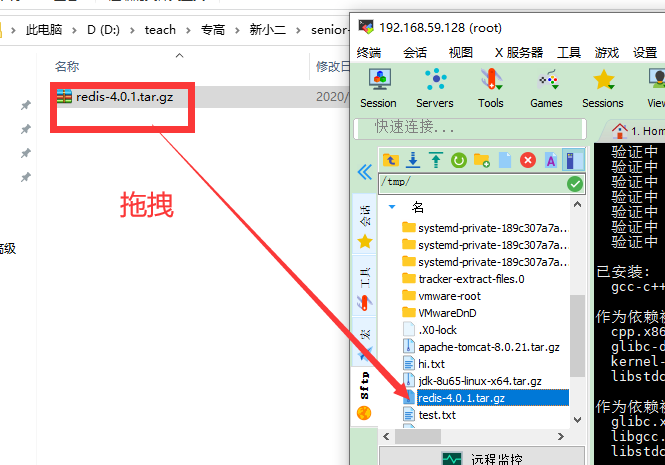


 步骤2.将redis这个文件解压到opt目下

```
tar -zxvf  redis-4.0.1.tar.gz  -C /opt/
```


 步骤3：编译redis (编译，将.c文件编译为.o文件)【Redis是由C语言开发的】

进入解压文件夹，

```
cd redis-4.0.1
```


执行make进行编译

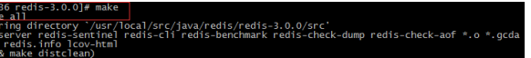 


 步骤4：	安装   (**此时,在这里安装的目的就是为了生成redis的bin目录**)

```
make PREFIX=/opt/redis install
```


安装完后，在/opt/redis/bin下有几个可执行文件

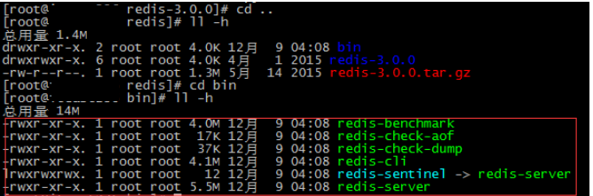 

```
redis-benchmark		----性能测试工具

redis-check-aof		----AOF文件修复工具

redis-check-dump	----RDB文件检查工具（快照持久化文件）

redis-cli			----命令行客户端

redis-server		----redis服务器启动命令
```

 步骤7：copy文件 

redis启动需要一个配置文件，可以修改端口号等信息。

先进入你安装的这个redis4-0.0.1目录，然后查看相关的文件是否存在！

```
cd /opt/redis-4.0.1
```


然后执行复制操作（进入复制的文件目录中查看）

```
cp redis.conf /opt/redis/bin
```


需要改变三个地方：

```
#bind 127.0.0.1             // 注释掉  69行

protected-mode no               // yes--->no  89行

daemonize yes                    # no----> yes 在138行
```


已配置方式启动redis

```
/opt/redis/bin/redis-server  /opt/redis/bin/redis.conf
```

使用客户端连接测试

```
/opt/redis/bin/redis-cli 

```

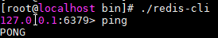

reids.conf  配置的具体信息如下:

| 序号 |                            配置项                            | 说明                                                         |
| :--- | :----------------------------------------------------------: | :----------------------------------------------------------- |
| 1    |                        `daemonize no`                        | Redis 默认不是以守护进程的方式运行，可以通过该配置项修改，使用 yes 启用守护进程（Windows 不支持守护线程的配置为 no ） |
| 2    |                 `pidfile /var/run/redis.pid`                 | 当 Redis 以守护进程方式运行时，Redis 默认会把 pid 写入 /var/run/redis.pid 文件，可以通过 pidfile 指定 |
| 3    |                         `port 6379`                          | 指定 Redis 监听端口，默认端口为 6379，作者在自己的一篇博文中解释了为什么选用 6379 作为默认端口，因为 6379 在手机按键上 MERZ 对应的号码，而 MERZ 取自意大利歌女 Alessia Merz 的名字 |
| 4    |                       `bind 127.0.0.1`                       | 绑定的主机地址                                               |
| 5    |                        `timeout 300`                         | 当客户端闲置多长时间后关闭连接，如果指定为 0，表示关闭该功能 |
| 6    |                      `loglevel notice`                       | 指定日志记录级别，Redis 总共支持四个级别：debug、verbose、notice、warning，默认为 notice |
| 7    |                       `logfile stdout`                       | 日志记录方式，默认为标准输出，如果配置 Redis 为守护进程方式运行，而这里又配置为日志记录方式为标准输出，则日志将会发送给 /dev/null |
| 8    |                        `databases 16`                        | 设置数据库的数量，默认数据库为0，可以使用SELECT 命令在连接上指定数据库id |
| 9    | `save <seconds> <changes>`Redis 默认配置文件中提供了三个条件：**save 900 1****save 300 10****save 60 10000**分别表示 900 秒（15 分钟）内有 1 个更改，300 秒（5 分钟）内有 10 个更改以及 60 秒内有 10000 个更改。 | 指定在多长时间内，有多少次更新操作，就将数据同步到数据文件，可以多个条件配合 |
| 10   |                     `rdbcompression yes`                     | 指定存储至本地数据库时是否压缩数据，默认为 yes，Redis 采用 LZF 压缩，如果为了节省 CPU 时间，可以关闭该选项，但会导致数据库文件变的巨大 |
| 11   |                    `dbfilename dump.rdb`                     | 指定本地数据库文件名，默认值为 dump.rdb                      |
| 12   |                           `dir ./`                           | 指定本地数据库存放目录                                       |
| 13   |              `slaveof <masterip> <masterport>`               | 设置当本机为 slav 服务时，设置 master 服务的 IP 地址及端口，在 Redis 启动时，它会自动从 master 进行数据同步 |
| 14   |                `masterauth <master-password>`                | 当 master 服务设置了密码保护时，slav 服务连接 master 的密码  |
| 15   |                    `requirepass foobared`                    | 设置 Redis 连接密码，如果配置了连接密码，客户端在连接 Redis 时需要通过 AUTH <password> 命令提供密码，默认关闭 |
| 16   |                      ` maxclients 128`                       | 设置同一时间最大客户端连接数，默认无限制，Redis 可以同时打开的客户端连接数为 Redis 进程可以打开的最大文件描述符数，如果设置 maxclients 0，表示不作限制。当客户端连接数到达限制时，Redis 会关闭新的连接并向客户端返回 max number of clients reached 错误信息 |
| 17   |                     `maxmemory <bytes>`                      | 指定 Redis 最大内存限制，Redis 在启动时会把数据加载到内存中，达到最大内存后，Redis 会先尝试清除已到期或即将到期的 Key，当此方法处理 后，仍然到达最大内存设置，将无法再进行写入操作，但仍然可以进行读取操作。Redis 新的 vm 机制，会把 Key 存放内存，Value 会存放在 swap 区 |
| 18   |                       `appendonly no`                        | 指定是否在每次更新操作后进行日志记录，Redis 在默认情况下是异步的把数据写入磁盘，如果不开启，可能会在断电时导致一段时间内的数据丢失。因为 redis 本身同步数据文件是按上面 save 条件来同步的，所以有的数据会在一段时间内只存在于内存中。默认为 no |
| 19   |               `appendfilename appendonly.aof`                | 指定更新日志文件名，默认为 appendonly.aof                    |
| 20   |                    `appendfsync everysec`                    | 指定更新日志条件，共有 3 个可选值：**no**：表示等操作系统进行数据缓存同步到磁盘（快）**always**：表示每次更新操作后手动调用 fsync() 将数据写到磁盘（慢，安全）**everysec**：表示每秒同步一次（折中，默认值） |
| 21   |                       `vm-enabled no`                        | 指定是否启用虚拟内存机制，默认值为 no，简单的介绍一下，VM 机制将数据分页存放，由 Redis 将访问量较少的页即冷数据 swap 到磁盘上，访问多的页面由磁盘自动换出到内存中（在后面的文章我会仔细分析 Redis 的 VM 机制） |
| 22   |                `vm-swap-file /tmp/redis.swap`                | 虚拟内存文件路径，默认值为 /tmp/redis.swap，不可多个 Redis 实例共享 |
| 23   |                      `vm-max-memory 0`                       | 将所有大于 vm-max-memory 的数据存入虚拟内存，无论 vm-max-memory 设置多小，所有索引数据都是内存存储的(Redis 的索引数据 就是 keys)，也就是说，当 vm-max-memory 设置为 0 的时候，其实是所有 value 都存在于磁盘。默认值为 0 |
| 24   |                      `vm-page-size 32`                       | Redis swap 文件分成了很多的 page，一个对象可以保存在多个 page 上面，但一个 page 上不能被多个对象共享，vm-page-size 是要根据存储的 数据大小来设定的，作者建议如果存储很多小对象，page 大小最好设置为 32 或者 64bytes；如果存储很大大对象，则可以使用更大的 page，如果不确定，就使用默认值 |
| 25   |                     `vm-pages 134217728`                     | 设置 swap 文件中的 page 数量，由于页表（一种表示页面空闲或使用的 bitmap）是在放在内存中的，，在磁盘上每 8 个 pages 将消耗 1byte 的内存。 |
| 26   |                      `vm-max-threads 4`                      | 设置访问swap文件的线程数,最好不要超过机器的核数,如果设置为0,那么所有对swap文件的操作都是串行的，可能会造成比较长时间的延迟。默认值为4 |
| 27   |                     `glueoutputbuf yes`                      | 设置在向客户端应答时，是否把较小的包合并为一个包发送，默认为开启 |
| 28   |    `hash-max-zipmap-entries 64 hash-max-zipmap-value 512`    | 指定在超过一定的数量或者最大的元素超过某一临界值时，采用一种特殊的哈希算法 |
| 29   |                    `activerehashing yes`                     | 指定是否激活重置哈希，默认为开启（后面在介绍 Redis 的哈希算法时具体介绍） |
| 30   |                `include /path/to/local.conf`                 | 指定包含其它的配置文件，可以在同一主机上多个Redis实例之间使用同一份配置文件，而同时各个实例又拥有自己的特定配置文件 |

### 5.2.3 Redis的启动

**1. 前端模式启动(不推荐，丢失数据更严重！)**

直接运行bin/redis-server将以前端模式启动，前端模式启动的缺点是启动完成后，不能再进行其他操作，如果要操作必须使用ctrl+c，同时redis-server程序结束，不推荐使用此方法。【用户主目录运行！】

**课堂案例:** 前端模式启动redis服务

```
/opt/redis/bin/redis-server 
```

​       

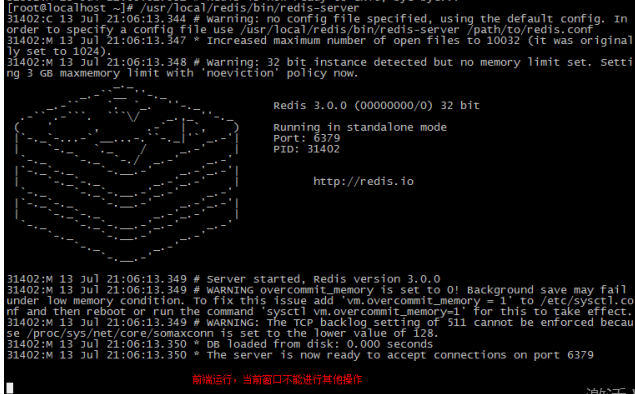 

**课堂案例:** 使用CTRL+ C 停止前端模式

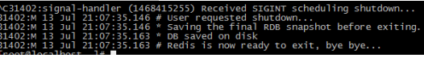 

**2. 后端模式**

**课堂案例:** 

 修改redis.conf配置文件， daemonize yes 以后端模式启动。

```
vim /opt/redis/bin/redis.conf
```

在文件的最后加入 daemonize yes

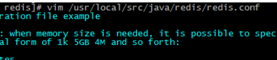 

 

 启动时，指定配置文件

**课堂案例:**

先进入redis目录：

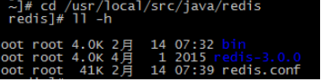 

**课堂案例:**

执行启动命令：【必须要有./】

```
./bin/redis-server ./redis.conf
```

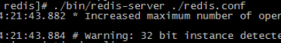 

**课堂案例:**

 Redis默认端口6379，通过当前服务进行查看

```
ps –ef | grep –i redis
```

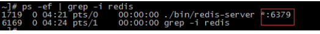 

### 5.2.4 Redis停止

**方式一：**

 强制结束程序。强行终止Redis进程可能会导致redis持久化数据丢失。(不要使用这个)

```
kill -9 31475		#pid需要通过“ps aux | grep -i redis”进行查询
```

 正确停止Redis的方式应该是向Redis发送SHUTDOWN命令，方法为：（关闭默认端口）

先进入redis的bin目录(cd /usr/local/src/java/redis/bin)

**方式二：**

在执行./redis-cli shutdown  (重新连接可以检验是否停止成功！)

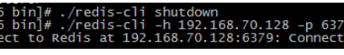 

### 5.2.5 Redis使用

**1. 连接客户端**

**课堂案例:** 

在redis的安装目录中有redis的客户端，即redis-cli（Redis Command Line Interface），它是Redis自带的基于命令行的Redis客户端。

需要先进入到bin目录,然后执行下面的命令

```
./redis–cli –h 192.168.59.132 –p 6379 (建议手敲)
```

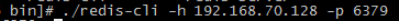 

默认ip和端口(可以不指定ip和端口)

 

**2. 向Redis服务器发送命令(通用操作)**

**课堂案例:** 

redis-cli连上redis服务后，可以在命令行发送命令。

```
 ping，测试客户端与Redis的连接是否正常，如果连接正常会收到回复PONG
```

 

**课堂案例:**

```
set/get，使用set和get可以向redis设置数据、获取数据。
```

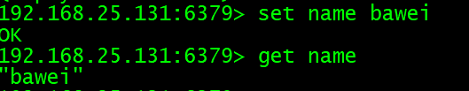 

**课堂案例:**

```
del，删除指定key的内容。
```

 

**课堂案例:**

```
keys * ，查看当前库中所有的key值
```

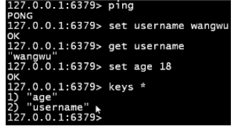 

**课堂案例:**

```
 EXISTS key的名字,若 key 存在返回 1 ，否则返回 0 
```

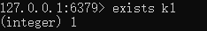 

**课堂案例:**

查找所有以字母开头的键值

```
keys 字母*
```

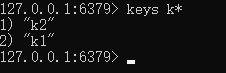 

**课堂案例:**

检测一下key的类型

```
type 键名
```

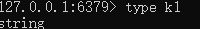 

**课堂案例:**

设置过期时间:

```
expire key名字 timeout(单位为秒)
```

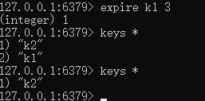 

**课堂案例:**

把key移动到指定数据库

```
MOVE key名字 数据库索引号
```

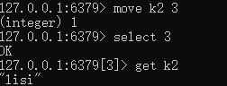 

**课堂案例:**

清空当前数据库

```
flushdb
```

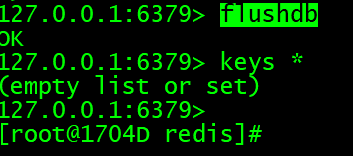 


# 课堂练习

## 1.redis的特点

要求:

​	1.说出redis和mysql的区别

​	2.描述redis的应用场景

​	3.描述redis优缺点

## 2.安装redis

要求:

​	1.根据课堂案例安装redis

​	2.以前端模式启动

​	3.以后端模式启动

​	4.启动客户端测试是否和服务端联通

​	5.创建一个string数据类型,并设置过期时间为60s

​	6.把5的数据移动到索引为6的数据库

 