# 第六单元 Redis常用命令

# 【授课重点】

1. 掌握Redis中connect和server命令（TIME、FLUSHALL、FLUSHDB、SHUTDOWN）
2. 了解redis中的数据类型
3. 掌握基本命令用法（get、set）
4. 掌握数据类型的使用方法 (String、list、hash、set、zset)

# 【考核要求】

1. Redis中connect和server命令（TIME、FLUSHALL、FLUSHDB、SHUTDOWN）
2. 掌握数据类型的使用方法 (String、list、hash、set、zset)

# 【教学内容】

### 6.1 Connection连接

1. **ping** 使用客户端向 Redis 服务器发送一个 PING ，如果服务器运作正常的话，会返回一个 PONG

   **课堂案例**: 测试ping

   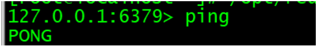 

2. **quit** 请求服务器关闭与当前客户端的连接。

   **课堂案例**: 关闭连接

   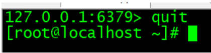 

3. **select index** 切换到指定的数据库，数据库索引号 index 用数字值指定，以 0 作为起始索引值

   **课堂案例**: 切换到15数据库

   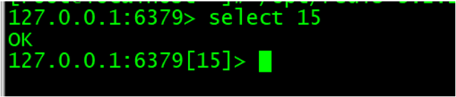 

   默认是第一个库 0 默认有16个库 下标从0 -15

   **课堂案例**: 切换到0数据库

   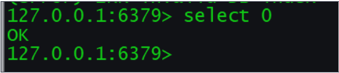 

4. **echo** 打印一个特定的信息 message ，测试时使用

   **课堂案例**: 打印hello world

   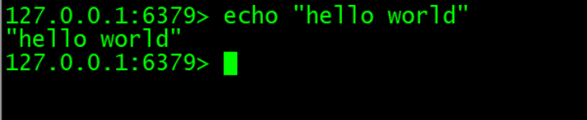 

5. **auth** 通过设置配置文件中 requirepass 项的值

### 6.2 Server命令

1. **bgsave** 在后台异步(Asynchronously)保存当前数据库的数据到磁盘

2. **CLIENT GETNAME** 获取客户端名称

   **课堂案例**: 获取名称

    

3. **CLIENT SETNAME connection-name** 设置客户端连接的名称

   **课堂案例**: 设置名称为chjx

   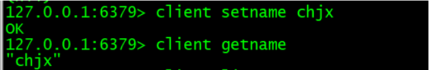 

4. **client list** 

   **课堂案例**: 返回所有连接到服务器的客户端信息和统计数据 

   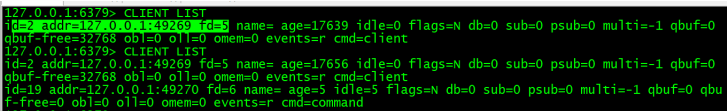 

5. **confifig set** 命令可以动态地调整 Redis 服务器的配置(confifiguration)而无须重启。

   **课堂案例**: 修改配置

    

6. **confifig get** 命令用于取得运行中的 Redis 服务器的配置参数

   **课堂案例**: 获得绑定ip的参数

    

7. **save**命令 

   SAVE 命令执行一个同步保存操作，将当前 Redis 实例的所有数据快照(snapshot)以 RDB 文件的 

   形式保存到硬盘。 

   **课堂案例**: 执行命令：

   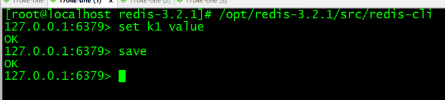 

   **课堂案例**: 结果：

   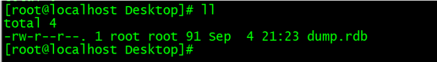 

8. **shutdown**

   SHUTDOWN 命令执行以下操作： 

   停止所有客户端 

   如果有至少一个保存点在等待，执行 *SAVE* 命令 

   如果 AOF 选项被打开，更新 AOF 文件 

   关闭 redis 服务器(server) 

   **SAVE** **和** **NOSAVE** **修饰符** 

   通过使用可选的修饰符，可以修改 SHUTDOWN 命令的表现。比如说： 

   执行 SHUTDOWN SAVE 会强制让数据库执行保存操作，即使没有设定(confifigure)保存点 

   执行 SHUTDOWN NOSAVE 会阻止数据库执行保存操作，即使已经设定有一个或多个保存点(你 

   可以将这一用法看作是强制停止服务器的一个假想的 ABORT 命令)

9. **DBSIZE** 

   **课堂案例**: 返回当前数据库的 key 的数量

   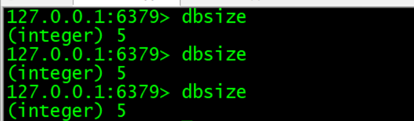  

10. **FLUSHDB** 

    清空当前数据库中的所有 key。

11. **FLUSHALL** 

    **课堂案例**: 清空整个 Redis 服务器的数据(删除所有数据库的所有 key )。 

    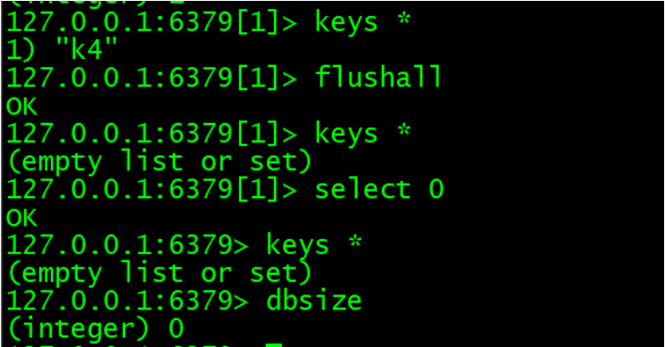 

    

### 6.3 key命令

1. **help**来查看key相关的命令：

   **课堂案例**: help @generic 

    

2. **type**

   返回 key 所储存的值的类型 

   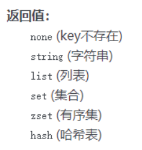 

   **课堂案例**: 查看值类型

   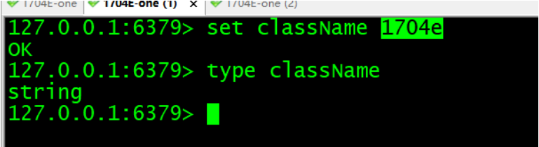 

3. **KEYS pattern**

   查找所有符合给定模式 pattern 的 key 。 

   KEYS * 匹配数据库中所有 key 。 

   KEYS h?llo 匹配 hello ， hallo 和 hxllo 等。 

   KEYS h*llo 匹配 hllo 和 heeeeello 等。 

   KEYS h[ae]llo` 匹配 `hello` 和 `hallo` ，但不匹配 `hillo 

   **课堂案例**: keys查询key值

   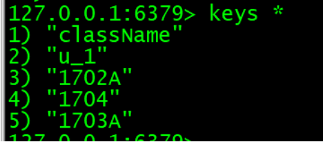 

   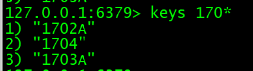  

4. **dump**序列化给定 key ，并返回被序列化的值

   **课堂案例**: 返回序列化后的值

   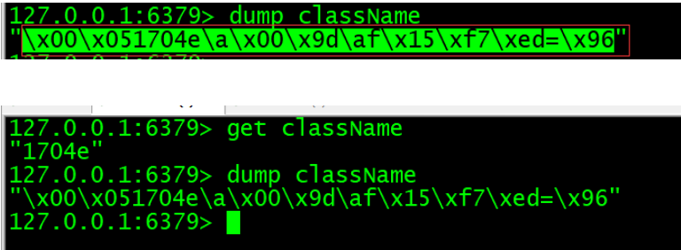 

5. **EXISTS key**

   **课堂案例**: 检查给定 key 是否存在 

   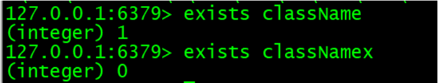 

6. **DEL key [key ...]**

   **课堂案例**: 删除给定的一个或多个 key

   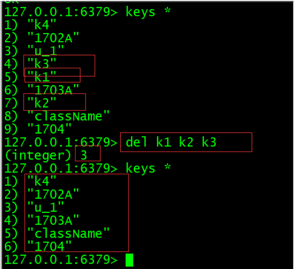 

7. **MOVE key db**

   **课堂案例**: 将当前数据库的 key 移动到给定的数据库 db 当中

   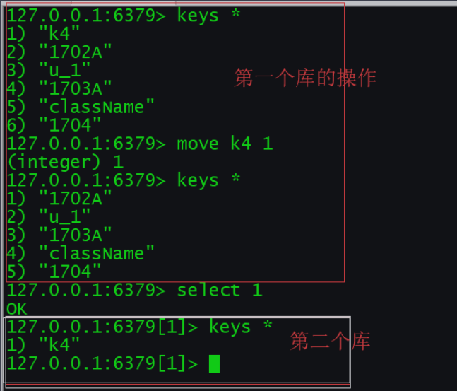 

8. **RANDOMKEY**

   **课堂案例**: 从当前数据库中随机返回(不删除)一个 key 

   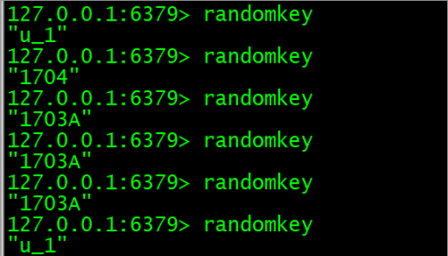 

9. **ttl**命令 

   以秒为单位，返回给定 key 的剩余生存时间(TTL, time to live) 

   返回值：当 key 不存在时，返回 -2 。

   当 key 存在但没有设置剩余生存时间时，返回 -1 。 

   否则，以秒为单位，返回 key 的剩余生存时间。 

   **课堂案例**: 查询给定key的剩余生存时间

   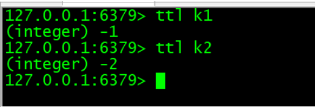 

10. **pttl**命令 

    这个命令类似于 **TTL** 命令，但它以毫秒为单位返回 key 的剩余生存时间 

11. **EXPIRE key seconds** 

    **课堂案例**: 为给定 key 设置生存时间，当 key 过期时(生存时间为 0 )，它会被自动删除

    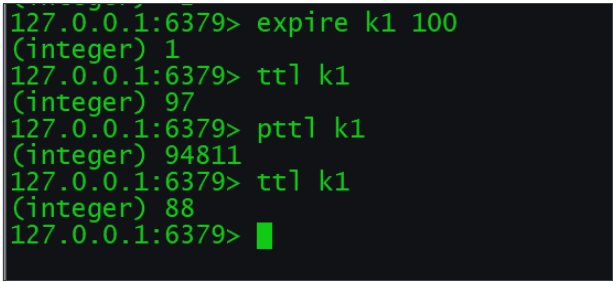 

12. **PEXPIRE key milliseconds** 

    **课堂案例**: 这个命令和 **EXPIRE** 命令的作用类似，但是它以毫秒为单位设置 key 的生存时间

    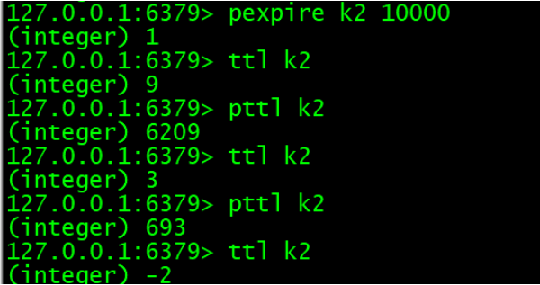 

13. **PERSIST key** 

    **课堂案例**: 移除给定 key 的生存时间，将这个 key 从『易失的』(带生存时间 key )转换成『持久的』 

    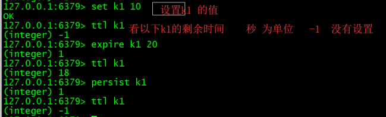 

14. **RENAME key newkey** 

    将 key 改名为 newkey

    

### 6.4 string命令

1. **help @string**

   **课堂案例**: **help** 来查看string相关的命令

   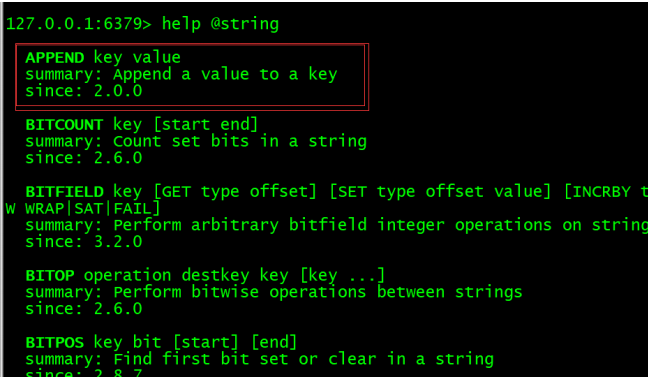 

2.  **SET key value [EX seconds] [PX milliseconds] [NX|XX]** 

   **课堂案例**: 将字符串值 value 关联到 key 。如果 key 已经持有其他值， SET 就覆写旧值，无视类型

   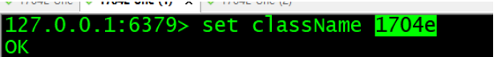 

     

3. **get key** 

   **课堂案例**: 返回 key 所关联的字符串值。如果 key 不存在那么返回特殊值 nil 。

     

4.  **APPEND key value** 

   如果 key 已经存在并且是一个字符串， APPEND 命令将 value 追加到 key 原来的值的末尾。如果 key 不存在， APPEND 就简单地将给定 key 设为 value ，就像执行 SET key value 一 

   样。

   **课堂案例**: 为已存在的key添加元素

   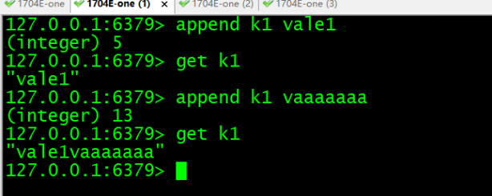 

5. **DECR** 

   将 key 中储存的数字值减一。 

   如果 key 不存在，那么 key 的值会先被初始化为 0 ，然后再执行 DECR 操作

   **课堂案例**: 将key中的数字值减一。

   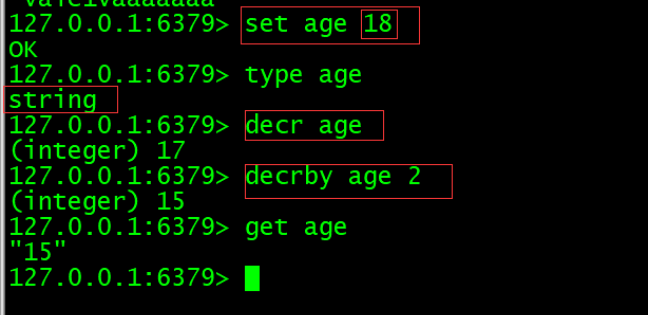 

6.  **decrby key decrement **

   将 key 所储存的值减去减量 decrement 。 

   如果 key 不存在，那么 key 的值会先被初始化为 0 ，然后再执行 DECRBY 操作

   **课堂案例**: 将key已经存放的数字值减去指定值。

   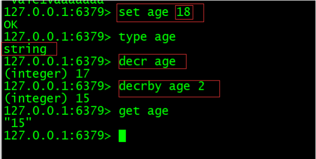 

7.  **INCR key** 

   将 key 中储存的数字值增一。 

   如果 key 不存在，那么 key 的值会先被初始化为 0 ，然后再执行 INCR 操作。 

   **课堂案例**: 将 key 中储存的数字值增一。

   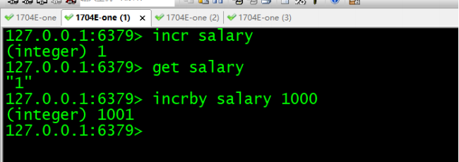 

8.  **INCRBY key increment** 

   将 key 所储存的值加上增量 increment 。 

   如果 key 不存在，那么 key 的值会先被初始化为 0 ，然后再执行 INCRBY 命令。

   **课堂案例**: 将 key 所储存的值加上增量 increment 。

   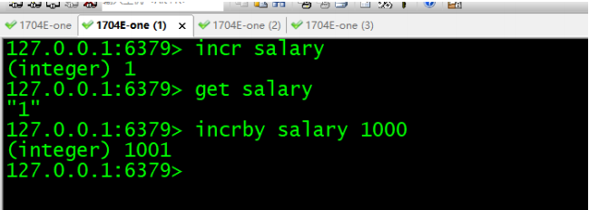 

9.  **MSET key value [key value ...]** 

   **课堂案例**: 同时设置一个或多个 key-value 对。

   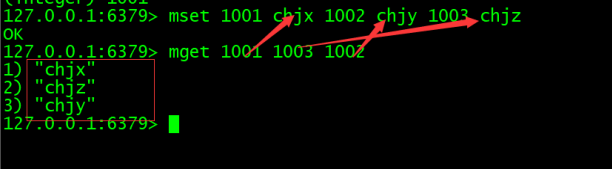 

10.  **MGET key [key ...]** 

    **课堂案例**: 返回所有(一个或多个)给定 key 的值 

     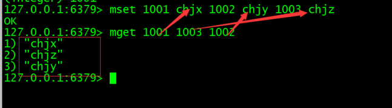

11.  **STRLEN key** 

    **课堂案例**: 返回 key 所储存的字符串值的长度。 

     

12.  **SETRANGE key offffset value**

    **课堂案例**: 用 `value` 参数覆写(overwrite)给定 `key` 所储存的字符串值，从偏移量 `offset` 开始。

    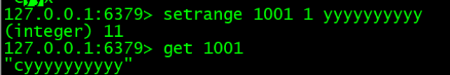 

### 6.5 list命令

 1. **help @list**

    **课堂案例**: help命令查看list相关的命令

    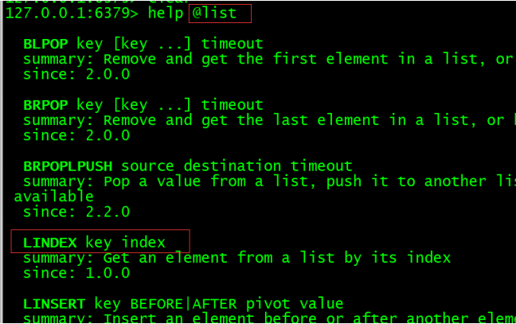 

 2.  **LPUSH key value [value ...]** 

    将一个或多个值 value 插入到列表 key 的表头 

    如果有多个 value 值，那么各个 value 值按从左到右的顺序依次插入到表头： 比如说，对空列 

    表 mylist 执行命令 LPUSH mylist a b c ，列表的值将是 c b a

    **课堂案例**: 将chjx chjy chjz插入到列表1704的表头

    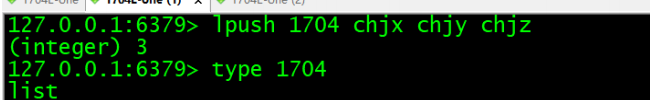 

 3.  **lrange** 

    返回列表 key 中指定区间内的元素，区间以偏移量 start 和 stop 指定。 

    下标(index)参数 start 和 stop 都以 0 为底，也就是说，以 0 表示列表的第一个元素，以 1 表示 

    列表的第二个元素，以此类推。 

    你也可以使用负数下标，以 -1 表示列表的最后一个元素， -2 表示列表的倒数第二个元素，以此类 

    推。

    **课堂案例**: 获取1704中的数据

    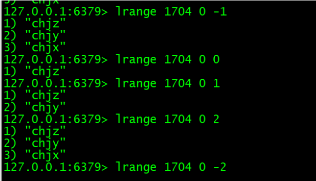 

 4.  **LINDEX key index** 

    返回列表 key 中，下标为 index 的元素。 

    下标(index)参数 start 和 stop 都以 0 为底，也就是说，以 0 表示列表的第一个元素，以 1 表示 

    列表的第二个元素，以此类推。 

    你也可以使用负数下标，以 -1 表示列表的最后一个元素， -2 表示列表的倒数第二个元素，以此类 

    推。

    **课堂案例**: 获取names中数据

    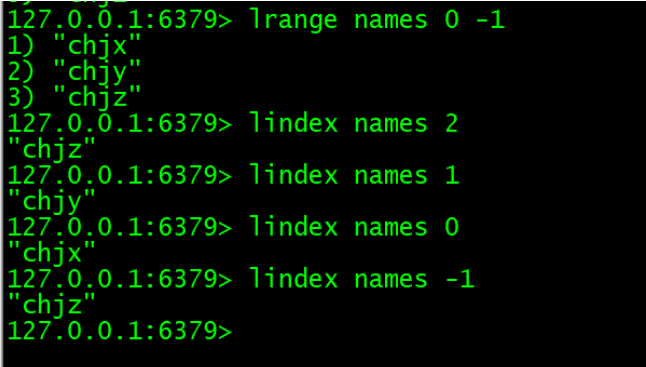 

 5.  **LLEN key** 

    返回列表 key 的长度。 

    如果 key 不存在，则 key 被解释为一个空列表，返回 0 . 

    如果 key 不是列表类型，返回一个错误。 

    **课堂案例**: 获取names的长度

     

 6.  **LREM key count value** 

    根据参数 count 的值，移除列表中与参数 value 相等的元素。 

    count 的值可以是以下几种： 

    count > 0 : 从表头开始向表尾搜索，移除与 value 相等的元素，数量为 count 。 

    count < 0 : 从表尾开始向表头搜索，移除与 value 相等的元素，数量为 count 的绝对值。 

    count = 0 : 移除表中所有与 value 相等的值。 

    从表头删除 count >0

    **课堂案例**: 移除names中数据

     

    从表尾 删除 count <0

    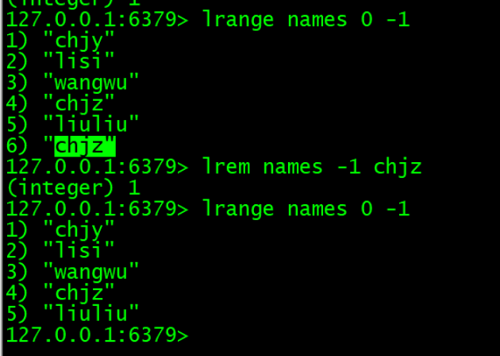 

    全部删除 count =0

     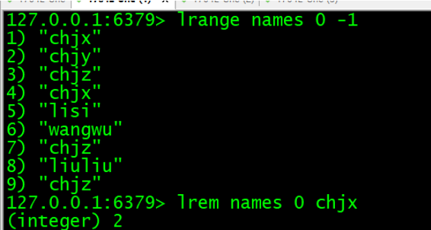 

 7.  **LPOP key** 

    移除并返回列表 key 的头元素。 

    **课堂案例**: 移除names的头元素

    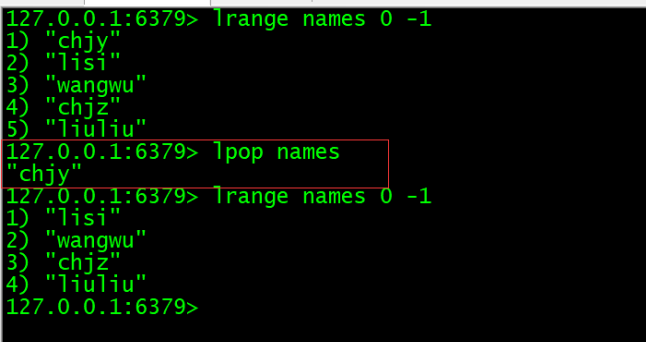 

### 6.6 set命令

 1. **SADD key member [member ...]** 

    将一个或多个 member 元素加入到集 

    合 key 当中，已经存在于集合的 member 元素将被忽略。 

    假如 key 不存在，则创建一个只包含 member 元素作成员的集合

    **课堂案例**: 为1703A添加数据

    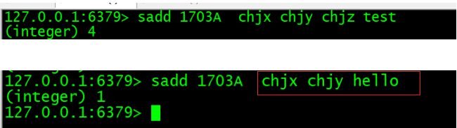 

 2.  **SMEMBERS key** 

    返回集合 key 中的所有成员 

    **课堂案例**: 获取1703A中所有成员

    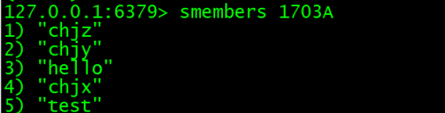 

 3.  **SDIFF key [key ...]** 

    返回一个集合的全部成员，该集合是所有给定集合之间的差集。 

    不存在的 key 被视为空集。 

    **课堂案例**: 查看1702A和1703A的差集

    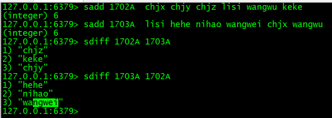 

 4.  **SINTER key [key ...]** 

    返回一个集合的全部成员，该集合是所有给定集合的交集。 

    不存在的 key 被视为空集。 

    当给定集合当中有一个空集时，结果也为空集(根据集合运算定律)

    **课堂案例**: 查看1702A和1703A的交集

    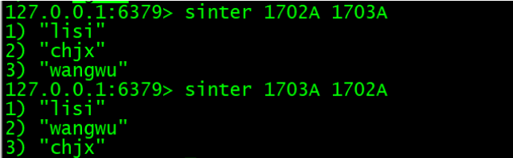 

 5.  **SUNION key [key ...]** 

    返回一个集合的全部成员，该集合是所有给定集合的并集。 

    不存在的 key 被视为空集。

    **课堂案例**: 查看1702A和1703A的并集

    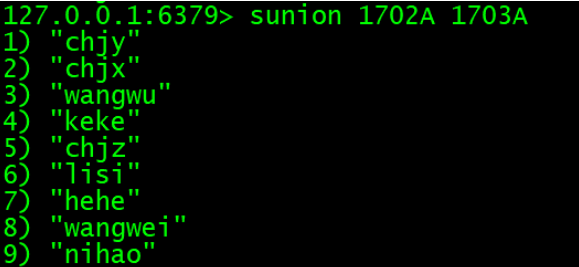 

### 6.7 hash命令

 1. **HSET key fifield value** 

    将哈希表 key 中的域 field 的值设为 value 。 

    如果 key 不存在，一个新的哈希表被创建并进行 HSET 操作。 

    如果域 field 已经存在于哈希表中，旧值将被覆盖。 

    购物车案例： 

    存入数据

    **课堂案例**: 为u_1添加数据

    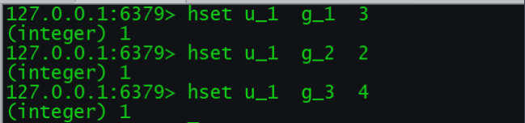 

     取出指定的字段的value值

     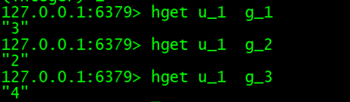

 2.  **HKEYS key** 

    返回哈希表 key 中的所有域。

    **课堂案例**: 获取u_1中所有域

    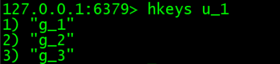 

 3.  **HVALS key** 

    返回哈希表 key 中所有域的值 

    **课堂案例**: 获取u_1中所有域的值

    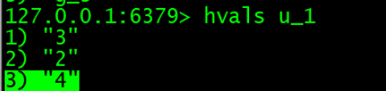 

 4.  **HGETALL** 

    **HGETALL key**返回哈希表 key 中，所有的域和值。 

    **课堂案例**: 获取u_1所有的域和值

     

 5.  **HINCRBY** 

    **HINCRBY key fifield increment** 

    为哈希表 key 中的域 field 的值加上增量 increment

    **课堂案例**: 为u_1 g_1的值增加2

     

 6.  **HLEN key** 

    返回哈希表 key 中域的数量。

    **课堂案例**: 获取u_1的域的数量

     

 7.  **HEXISTS** 

    **HEXISTS key fifield** 

    查看哈希表 key 中，给定域 field 是否存在。

    **课堂案例**: 查看u_1某些域是否存在

     

 8.  **HDEL key fifield [fifield ...]** 

    删除哈希表 key 中的一个或多个指定域，不存在的域将被忽略。

### 6.8 zset命令

 1. **ZADD key score member** 

    **[[score member] [score member] ...]** 

    将一个或多个 member 元素及其 score 值加入到有序集 key 当中。 

    如果某个 member 已经是有序集的成员，那么更新这个 member 的 score 值，并通过重新插入这个 

    member 元素，来保证该 member 在正确的位置上。 

    score 值可以是整数值或双精度浮点数。 

    如果 key 不存在，则创建一个空的有序集并执行 ZADD 操作。 

    当 key 存在但不是有序集类型时，返回一个错误。

    **课堂案例**: 为1702A添加数据

     

 2.  **ZRANGE key start stop [WITHSCORES]** 

    返回有序集 key 中，指定区间内的成员。 

    其中成员的位置按 score 值递增(从小到大)来排序。

    **课堂案例**: 获取1702A中的数据

     

 3.  **ZCARD key** 

    返回有序集 key 的基数。

    **课堂案例**: 获取1702a中个数

     

 4.  **ZCOUNT key min max** 

    返回有序集 key 中， score 值在 min 和 max 之间(默认包括 score 值等于 min 或 max )的成员的 

    数量。

    **课堂案例**: 获取1702a中分数在78到90之间的数据

     

 5.  **ZINCRBY key increment member** 

    为有序集 key 的成员 member 的 score 值加上增量 increment

    **课堂案例**: 为1702a中的chjy增加8

     

 6.  **ZRANGEBYSCORE key min max [WITHSCORES] [LIMIT offffset** 

    **count]** 

    返回有序集 key 中，所有 score 值介于 min 和 max 之间(包括等于 min 或 max )的成员。有序集 

    成员按 score 值递增(从小到大)次序排列 

    **课堂案例**: 获取1702a中分数在86到90之间的数据，并从小到大排序

     

 7.  **ZRANK key member** 

    返回有序集 key 中成员 member 的排名。其中有序集成员按 score 值递增(从小到大)顺序排列。 

    排名以 0 为底，也就是说， score 值最小的成员排名为 0 。

    **课堂案例**: 1702a中某些成员的分数排名

     

 8.  **ZREM key member [member ...]** 

    移除有序集 key 中的一个或多个成员，不存在的成员将被忽略。

 9.  **ZREMRANGEBYRANK key start stop** 

    移除有序集 key 中，指定排名(rank)区间内的所有成员。

    **课堂案例**: 移除1702a中的指定区间的成员

     

 10.  **ZREMRANGEBYSCORE key min max** 

     移除有序集 key 中，所有 score 值介于 min 和 max 之间(包括等于 min 或 max )的成员。

     **课堂案例**: 移除1702a中指定分数区间的成员

      

 11.  **ZREVRANGE key start stop [WITHSCORES]** 

     返回有序集 key 中，指定区间内的成员。 

     其中成员的位置按 score 值递减(从大到小)来排列。

     **课堂案例**: 将数据从大到小排序输出

      

 12.  **ZREVRANGEBYSCORE key max min [WITHSCORES] [LIMIT** 

     **offffset count]** 

     返回有序集 key 中， score 值介于 max 和 min 之间(默认包括等于 max 或 min )的所有的成员。 

     有序集成员按 score 值递减(从大到小)的次序排列。

     **课堂案例**: 将1702a中的数据根据分数区间从大到小排序

      

 13.  **ZREVRANK key member** 

     返回有序集 key 中成员 member 的排名。其中有序集成员按 score 值递减(从大到小)排序。

 14.  **ZSCORE key member** 

     返回有序集 key 中，成员 member 的 score 值。