# 第六单元 Redis常用命令

# 【授课重点】

1. 掌握Redis中connect和server命令（TIME、FLUSHALL、FLUSHDB、SHUTDOWN）
2. 了解redis中的数据类型
3. 掌握基本命令用法（get、set）
4. 掌握数据类型的使用方法 (String、list、hash、set、zset)

# 【考核要求】

1. Redis中connect和server命令（TIME、FLUSHALL、FLUSHDB、SHUTDOWN）
2. 掌握数据类型的使用方法 (String、list、hash、set、zset)

# 【教学内容】

### 6.1 Connection连接

1. **ping** 使用客户端向 Redis 服务器发送一个 PING ，如果服务器运作正常的话，会返回一个 PONG

   **课堂案例**: 测试ping

    

2. **quit** 请求服务器关闭与当前客户端的连接。

   **课堂案例**: 关闭连接

    

3. **select index** 切换到指定的数据库，数据库索引号 index 用数字值指定，以 0 作为起始索引值

   **课堂案例**: 切换到15数据库

    

   默认是第一个库 0 默认有16个库 下标从0 -15

   **课堂案例**: 切换到0数据库

    

4. **echo** 打印一个特定的信息 message ，测试时使用

   **课堂案例**: 打印hello world

    

5. **auth** 通过设置配置文件中 requirepass 项的值

   ```java 
   
   redis> CONFIG SET requirepass secret_password   # 将密码设置为 secret_password
   OK
   
   redis> QUIT                                     # 退出再连接，让新密码对客户端生效
   
   [huangz@mypad]$ redis
   
   redis> PING                                     # 未验证密码，操作被拒绝
   (error) ERR operation not permitted
   
   redis> AUTH wrong_password_testing              # 尝试输入错误的密码
   (error) ERR invalid password
   
   redis> AUTH secret_password                     # 输入正确的密码
   OK
   
   redis> PING                                     # 密码验证成功，可以正常操作命令了
   PONG
   
   
   # 清空密码
   
   redis> CONFIG SET requirepass ""   # 通过将密码设为空字符来清空密码
   OK
   
   redis> QUIT
   
   $ redis                            # 重新进入客户端
   
   redis> PING                        # 执行命令不再需要密码，清空密码操作成功
   PONG
   ```

   

   

### 6.2 Server命令

1. **bgsave** 在后台异步(Asynchronously)保存当前数据库的数据到磁盘

2. **CLIENT GETNAME** 获取客户端名称

   **课堂案例**: 获取名称

    

3. **CLIENT SETNAME connection-name** 设置客户端连接的名称

   **课堂案例**: 设置名称为chjx

    

4. **client list** 

   **课堂案例**: 返回所有连接到服务器的客户端信息和统计数据 

    

5. **config set** 命令可以动态地调整 Redis 服务器的配置(configuration)而无须重启。

   **课堂案例**: 修改配置

    

6. **config get** 命令用于取得运行中的 Redis 服务器的配置参数

   **课堂案例**: 获得绑定ip的参数

    

7. **save**命令 

   SAVE 命令执行一个同步保存操作，将当前 Redis 实例的所有数据快照(snapshot)以 RDB 文件的 

   形式保存到硬盘。 

   **课堂案例**: 执行命令：

    

   **课堂案例**: 结果：

    

8. **shutdown**

   SHUTDOWN 命令执行以下操作： 

   停止所有客户端 

   如果有至少一个保存点在等待，执行 *SAVE* 命令 

   如果 AOF 选项被打开，更新 AOF 文件 

   关闭 redis 服务器(server) 

   **SAVE** **和** **NOSAVE** **修饰符** 

   通过使用可选的修饰符，可以修改 SHUTDOWN 命令的表现。比如说： 

   执行 SHUTDOWN SAVE 会强制让数据库执行保存操作，即使没有设定(confifigure)保存点 

   执行 SHUTDOWN NOSAVE 会阻止数据库执行保存操作，即使已经设定有一个或多个保存点(你 

   可以将这一用法看作是强制停止服务器的一个假想的 ABORT 命令)

9. **DBSIZE** 

   **课堂案例**: 返回当前数据库的 key 的数量

     

10. **FLUSHDB** 

    清空当前数据库中的所有 key。

11. **FLUSHALL** 

    **课堂案例**: 清空整个 Redis 服务器的数据(删除所有数据库的所有 key )。 

     

    

### 6.3 key命令

1. **help**来查看key相关的命令：

   **课堂案例**: help @generic 

    

2. **type**

   返回 key 所储存的值的类型 

    

   **课堂案例**: 查看值类型

    

3. **KEYS pattern**

   查找所有符合给定模式 pattern 的 key 。 

   KEYS * 匹配数据库中所有 key 。 

   KEYS h?llo 匹配 hello ， hallo 和 hxllo 等。 

   KEYS h*llo 匹配 hllo 和 heeeeello 等。 

   KEYS h[ae]llo` 匹配 `hello` 和 `hallo` ，但不匹配 `hillo 

   **课堂案例**: keys查询key值

    

     

4. **dump**序列化给定 key ，并返回被序列化的值

   **课堂案例**: 返回序列化后的值

    

5. **EXISTS key**

   **课堂案例**: 检查给定 key 是否存在 

    

6. **DEL key [key ...]**

   **课堂案例**: 删除给定的一个或多个 key

    

7. **MOVE key db**

   **课堂案例**: 将当前数据库的 key 移动到给定的数据库 db 当中

    

8. **RANDOMKEY**

   **课堂案例**: 从当前数据库中随机返回(不删除)一个 key 

    

9. **ttl**命令 

   以秒为单位，返回给定 key 的剩余生存时间(TTL, time to live) 

   返回值：当 key 不存在时，返回 -2 。

   当 key 存在但没有设置剩余生存时间时，返回 -1 。 

   否则，以秒为单位，返回 key 的剩余生存时间。 

   **课堂案例**: 查询给定key的剩余生存时间

    

10. **pttl**命令 

    这个命令类似于 **TTL** 命令，但它以毫秒为单位返回 key 的剩余生存时间 

11. **EXPIRE key seconds** 

    **课堂案例**: 为给定 key 设置生存时间，当 key 过期时(生存时间为 0 )，它会被自动删除

     

12. **PEXPIRE key milliseconds** 

    **课堂案例**: 这个命令和 **EXPIRE** 命令的作用类似，但是它以毫秒为单位设置 key 的生存时间

     

13. **PERSIST key** 

    **课堂案例**: 移除给定 key 的生存时间，将这个 key 从『易失的』(带生存时间 key )转换成『持久的』 

     

14. **RENAME key newkey** 

    将 key 改名为 newkey

    ## 6.3前提知识

redis是一种高级的key-value的存储系统

其中的key是字符串类型，尽可能满足如下几点：

1）key不要太长，最好不要超过1024个字节，否则这不仅会消耗内存还会降低查找效率

2）key不要太短，如果太短会降低key的可读性

3）在项目中，key最好有一个统一的命名规范（根据企业的需求）

其中value	支持五种数据类型：

1）字符串型 string

2）字符串列表 list

3）字符串集合 set

4）有序字符串集合 sorted set

5）哈希类型 hash

### 6.4 string命令

help  @String 查看所有的String的相关命令


| 命令        | 说明                           | 示例                   |
| ----------- | ------------------------------ | ---------------------- |
| set         | 设置一个key/value              | set  name lucy         |
| get         | 根据key获取对应的 value        | get name               |
| mset        | 一次设置多个key value          | met name lucy age 12   |
| mget        | 一次获取多个key 的value        | mget name age          |
| getset      | 获取原始 key的值，同时设置新值 | getset name john       |
| strlen      | 获取key 的value的长度          | Strlen name            |
| append      | 为对应key的value 追加内容      | Append name love       |
| getrange    | 截取value的内容                | Getrange name 0 3      |
| setex       | 设置key存活的时间(秒)          | Setex name 3 lucy      |
| psetex      | 设置key存活的时间（毫秒）      | psetex  name 5000 jack |
| setnx       | 只有当key不存在时再等效set     |                        |
| msetnx      | 同时设置多个key                |                        |
| decr        | 进行数值类型的-1 操作          | decr age               |
| decrby      | 根据提供的数据继续减法操作     |                        |
| lncr        | 进行数值类型的+1 操作          |                        |
| lncrby      | 根据提供的数据继续加法操作     |                        |
| lncrbyfloat | 根据提供的数据加入浮点数       | incrbyfloat  age 1.5   |


### 6.5 list命令

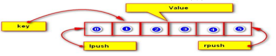

在Redis中，List类型是按照插入顺序排序的字符串链表。和数据结构中的普通链表一样，我们可以在其头部(Ieft)和尾部(right)添加新的元素。在插入时，如果该键并不存在，Redis将为该键创建

一个新的链表。如果链表中所有的元素均被移除，那么该键也将会被从数据库中删除。

List中可以包含的最大元素数量是42949672950，    从元素插入和删除的效率来看，如果我们是在链表的两头插入或删除元素，这将会是非常高效的操作，即使链表中己经存储了百万条记录，该操作也可以在常量时间内完成。然而需要说明的是，如果元素插入或删除操作是作用于链表中间，那将会是非常低效的。

 1. help @list**

    **课堂案例**: help命令查看list相关的命令

     

    

 2. | 命令      | 说明                                                     | 示例                                     |
    | --------- | -------------------------------------------------------- | ---------------------------------------- |
    | lpush     | 从左侧加入值到key列表                                    | Lpush list a                             |
    | lpushx    | 同lpush但必须保证key存在                                 | Lpushx list a                            |
    | rpush     | 从右侧加入值到key列表                                    |                                          |
    | rpushx    | 同rpush但必须保证key存在                                 |                                          |
    | lpop      | 从左侧返回和移除第一个元素                               | Lpop list                                |
    | rpop      | 从右侧返回和移除第一个元素                               |                                          |
    | lrang     | 获取某一个下标区间的元素                                 | Lrange 0 2       lrang 0 -1 表示全部显示 |
    | llen      | 获取列表元素个数                                         |                                          |
    | lset      | 设置某一个下标的元素(覆盖原有元素)                       |                                          |
    | lrem      | 删除重复的元素                                           | Lrem list 2 m表示删除2个list中重复元素 m |
    | ltrim     | 只保留指定区间内的元素，不在指定区间之内的元素都将被删除 | Ltrim list 2 5                           |
    | linsert   | 在列表的元素前或者后插入元素                             | Linsert list before  b  a                |
    | rpoplpush | 将链表中的尾部元素弹出并添加到头部                       | Rpoplpush list                           |

### 6.6 set命令

 1. **help @set**

    **课堂案例**: help  @set 命令查看set相关的命令

    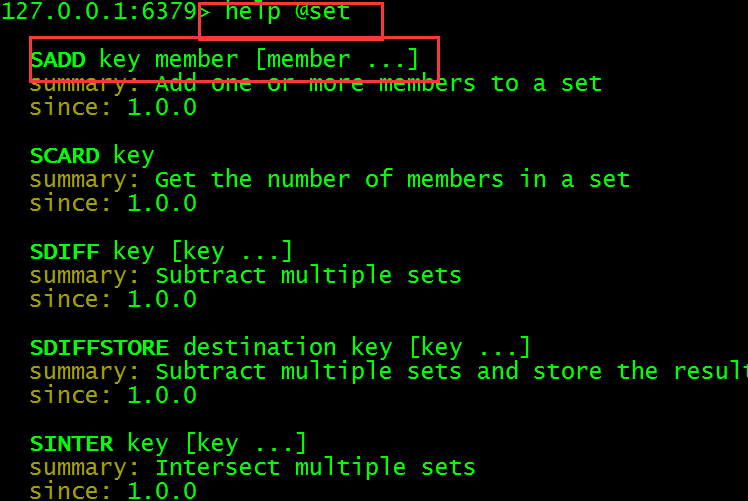  

 2. 在Redis中，我们可以将Set类型看作为没有排序的字符集合，和List类型一样，我们也可以在该类型的数据值上执行添加、删除或判断某一元素是否存在等操作。和List类型不同的是，Set集介中不允许重复。换句话说，如果多次添加相同元素，Set中将仅保留该元素的一份拷贝。和List类型相比，Set类型在功能上还存在着一个非常重要的特性，即在服务器端完成多个Sets之间的聚合计算操作，如。Unions(并集),  intersection（交集）和differences(差集)。由于这些操作均在服务端完成，因此效率极高，而且也节省了大量的网络10开销。

     sadd key values[valuel, value2...]:向set中添加数据，如果该key的值己有则不会重复添加

     srem key members[memberl,  member2...]:删除:指定的成员

     获得集合中的元素

    n smembers key:获取set中所有的成员

    n sismember key member:判断参数中指定的成员是否在该s et中，1表示存在，0表示不存在或者该key本身就不存在。(无论集合中有多少元素都可以极速的返回结果)

     集合的差集运算A-B

    sdiff keyl key2..:返回keyl与key2中相差的成员,与key的顺序有关。即返回差集

    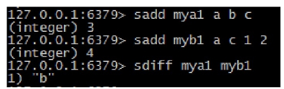 

     集合的交集运算A n B

    sinter keyl key2 key3...:返A和B交集。

    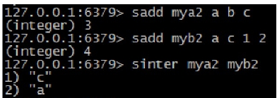 

     集合的并集运算 A U B

    sunion keyl key2 key3… 返回并集

    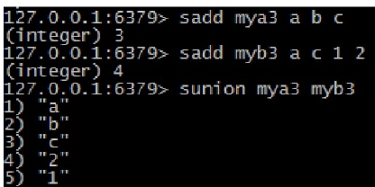 

     scard key:获取set中成员的数量

     [SRANDMEMBER](http://redisdoc.com/set/srandmember.html)  key:随机返回set中的一个成员

     sdiffstore destination keyl key2..:将key1, key2相差的成员存储在destination上

    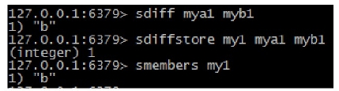 

     sinterstore destination key1 key2…:将返回的交集存储在destination上

    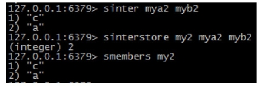 

     sunionstore destination key[key二」:将返回的并集存储在destination上

    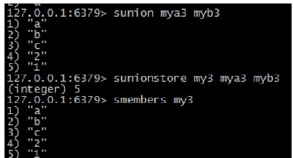 

 3. ## **1.1** **存储sortedset**

    ​    Sorted-Set和Set类型极为相似，它们都是字符串的集合，都不允许重复的成员出现在一个Set中。它们主要差别是Sorted-Set中的每一个成员都会有一个分数(score)与之关联，Redis正是通过分数来为集合中的成员进行从小到大的排序。然而需要额外指出的是，尽管Sorted-Set中的成员必须是唯一的，但是分数(score)却是可以重复的

    ​    在Sorted-Set中添加、删除或更新一个成员都是非常快速的操作，其时间复杂度为集合中成员数量的对数。由于Sorted-Set中的成员在集合中的位置是有序的，因此，即便是访问位于集合中部的成员也仍然是非常高效的。事实上，Redis所具有的这一特征在很多其它类型的数据库中是很难实现的，换句话说，在该点上要想达到和Red is同样的高效，在其它数据库中进行建模是非常困难的。

    例如:游戏排名、微博热点话题等使用场景。

     添加元素

    zadd key score member score2 member2 ...:将所有成员以及该成员的分数存放到sorted-set中。

    如果该元素已经存在则会用新的分数替换原有的分数。返回值是新加入到集合中的元素个数，不包含之前己经存在的元素。

     获得元素

    zscore key member:返回指定成员的分数

    zcard key:获取集合中的成员数量

     删除成员

    zrem key member[member...]:移除集合中指定的成员，可以指定多个成员口

     范围查找

    zrange key start end [withscores]:

    获取集合中脚标为start-e n d的成员，[withscores]参数表明返回

    的成员包含其分数。

    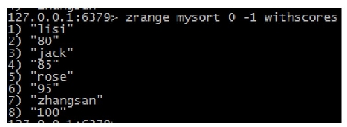 

    zrevrange key start stop [withscores]:按照元素分数从大到小的顺序返回索引从start到stop之间的所有元素(包含两端的元素)

     

     zremrangebyrank key start stop:按照排名范围删除元素

    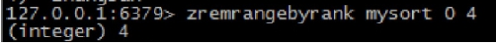 

     zremrangebyscore key min max:按照分数范围删除元素

    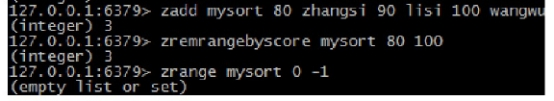  

 4. 

### 6.7 hash命令

 1. **help @hash**

    **课堂案例**: help命令查看hash相关的命令

     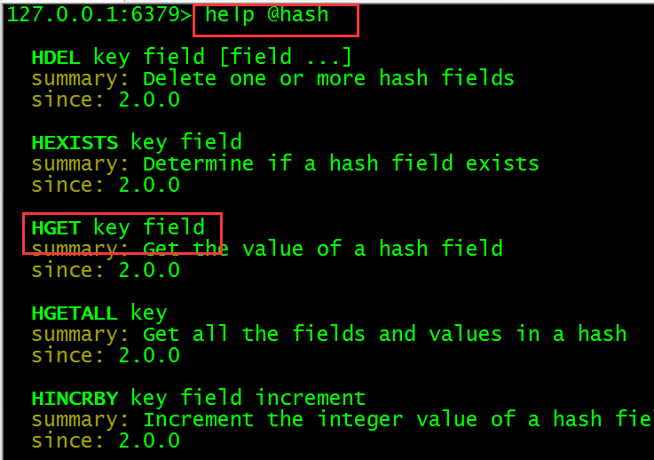

 2. Redis中的Hash类型可以看成具有String Key和String Value的map容器。所以该类型非常适合于存储值对象的信息。

     hset key field value:为指定的key设定field/value对(键值对)。

    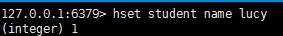 

     hmset key fieid value [field2 value2 ...]:设置key中的多个filed/value

     

     hget key field:返回指定的key中的field的值

    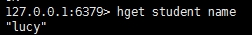 

     hmget key fileds:获取key中的多个filed的值

     

     hgetall key:获取key中的所有filed vaule

    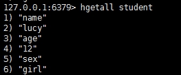 

     hdel key field [field ... ]:可以删除一个或多个字段，返回值是被删除的字段个数

     del key:删除整个list

     hincrby key field increment:设置key中filed的值增加i ncrement

    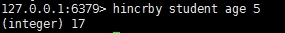 

     hexists key field:判断指定的key中的filed是否存在

     hlen key:获取key所包含的field的数量

     hkeys key:获得所有的key

     hvals key:获得所有的value

### 6.8 zset命令

 1. **help @sorted_set**

    **课堂案例**: help命令查看zset相关的命令

    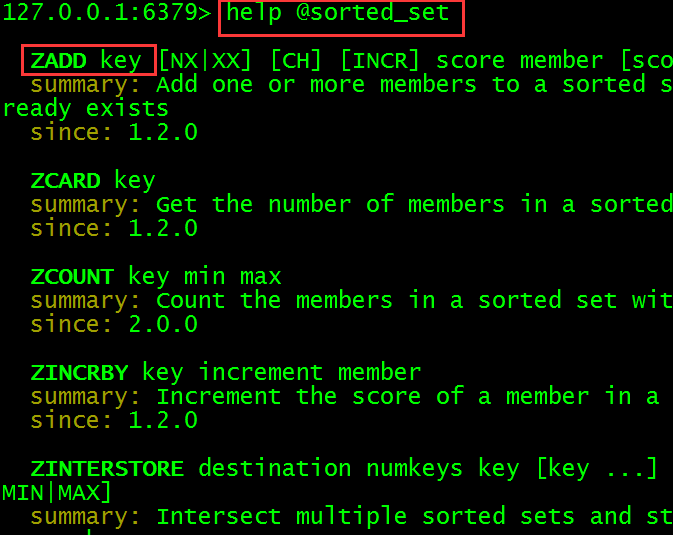 

 2. ## **1.1** **存储sorted_set**

    ```
     help @sorted_set            帮助命令
    ```

    ​    Sorted_Set和Set类型极为相似，它们都是字符串的集合，都不允许重复的成员出现在一个Set中。它们主要差别是Sorted-Set中的每一个成员都会有一个分数(score)与之关联，Redis正是通过分数来为集合中的成员进行从小到大的排序。然而需要额外指出的是，尽管Sorted-Set中的成员必须是唯一的，但是分数(score)却是可以重复的

    ​    在Sorted-Set中添加、删除或更新一个成员都是非常快速的操作，其时间复杂度为集合中成员数量的对数。由于Sorted-Set中的成员在集合中的位置是有序的，因此，即便是访问位于集合中部的成员也仍然是非常高效的。事实上，Redis所具有的这一特征在很多其它类型的数据库中是很难实现的，换句话说，在该点上要想达到和Red is同样的高效，在其它数据库中进行建模是非常困难的。

    例如:游戏排名、微博热点话题等使用场景。

     添加元素

    zadd key score member score2 member2 ...:将所有成员以及该成员的分数存放到sorted-set中。

    如果该元素已经存在则会用新的分数替换原有的分数。返回值是新加入到集合中的元素个数，不包含之前己经存在的元素。

     获得元素

    zscore key member:返回指定成员的分数

    zcard key:获取集合中的成员数量

     删除成员

    zrem key member[member...]:移除集合中指定的成员，可以指定多个成员口

     范围查找

    zrange key start end [withscores]:

    获取集合中脚标为start-e n d的成员，[withscores]参数表明返回

    的成员包含其分数。

     

    zrevrange key start stop [withscores]:按照元素分数从大到小的顺序返回索引从start到stop之间的所有元素(包含两端的元素)

    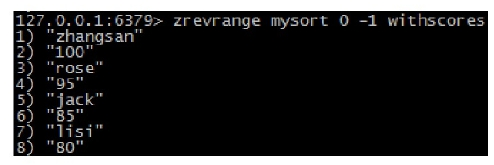 

     zremrangebyrank key start stop:按照排名范围删除元素

     

     zremrangebyscore key min max:按照分数范围删除元素

     

  11. 

# 课堂练习

### 1. 完成课堂案例(60分钟)

### 2. 完成以下练习(20分钟)

​	 将以下商品存入list数据类型中，然后每次模拟分页功能，每次查询3条，将数据全部取出。 

​				"电视机"

​				"电冰箱"

​				"笔记本电脑"

​				"空调"

​				"饮水机"

​				"手机"

​				"打印机"

​		