第7单元 Redis事务与持久化

# 【授课重点】

1. 了解事务的概念
2. 掌握redis的持久化

# 【考核要求】

1. 了解事务的概念
2. 掌握redis的持久化

# 【教学内容】

# 7.1 课程导入

## 7.1.1 概念

MySQL事务：

​	开启事务：start transaction

​	提交事务：commit

​	回滚事务：rollback

和众多其它数据库一样，Redis作为NoSQL数据库也同样提供了事务机制。在Redis中，MULTI/EXEC/DISCARD/这三个命令是我们实现事务的基石。

## 7.1.2 redis事务特征

​	1、 在事务中的所有命令都将会被串行化的顺序执行，**事务执行期间，Redis不会再为其它客户端的请求提供任何服务**，从而保证了事物中的所有命令被原子的执行 

​	2、 和关系型数据库中的事务相比，**在Redis事务中如果有某一条命令执行失败，其后的命令仍然会被继续执行**。

​	3、 我们可以通过MULTI命令开启一个事务，有关系型数据库开发经验的人可以将其理解为"BEGIN TRANSACTION"语句。在该语句之后执行的命令都将被视为事务之内的操作，最后我们可以通过执行EXEC/DISCARD命令来提交/回滚该事务内的所有操作。这两个Redis命令可被视为等同于关系型数据库中的COMMIT/ROLLBACK语句。

​	4、 在事务开启之前，如果客户端与服务器之间出现通讯故障并导致网络断开，其后所有待执行的语句都将不会被服务器执行。然而如果网络中断事件是发生在客户端执行EXEC命令之后，那么该事务中的所有命令都会被服务器执行。

​	5、 当使用Append-Only模式时，Redis会通过调用系统函数write将该事务内的所有写操作在本次调用中全部写入磁盘。然而如果在写入的过程中出现系统崩溃，如电源故障导致的宕机，那么此时也许只有部分数据被写入到磁盘，而另外一部分数据却已经丢失。Redis服务器会在重新启动时执行一系列必要的一致性检测，一旦发现类似问题，就会立即退出并给出相应的错误提示。此时，我们就要充分利用Redis工具包中提供的redis-check-aof工具，该工具可以帮助我们定位到数据不一致的错误，并将已经写入的部分数据进行回滚。修复之后我们就可以再次重新启动Redis服务器了。

## 7.1.3 redis事务命令解释

 multi：开启事务用于标记事务的开始，**其后执行的命令都将被存入命令队列**，直到执行EXEC时，这些命令才会被原子的执行，类似与关系型数据库中的：begin transaction  **相当于**MySQL的 **start transaction**

 exec：提交事务，类似与关系型数据库中的：**commit**

 discard：事务回滚，类似与关系型数据库中的：**rollback**

| 序号 | 命令及描述                                                   |
| :--- | :----------------------------------------------------------- |
| 1    | [DISCARD](https://www.runoob.com/redis/transactions-discard.html) 取消事务，放弃执行事务块内的所有命令。 |
| 2    | [EXEC](https://www.runoob.com/redis/transactions-exec.html) 执行所有事务块内的命令。 |
| 3    | [MULTI](https://www.runoob.com/redis/transactions-multi.html) 标记一个事务块的开始。 |
| 4    | [UNWATCH](https://www.runoob.com/redis/transactions-unwatch.html) 取消 WATCH 命令对所有 key 的监视。 |
| 5    | [WATCH key [key ...\]](https://www.runoob.com/redis/transactions-watch.html) 监视一个(或多个) key ，如果在事务执行之前这个(或这些) key 被其他命令所改动，那么事务将被打断。 |

## 7.1.4 测试

**正常执行事务**

**课堂案例:**

步骤1：在窗口1，设置num，并获得数据

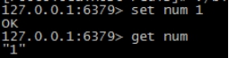 

**课堂案例:**

步骤2：在窗口2，num累加1，并获得数据

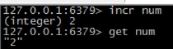 

**课堂案例:**

步骤3：在窗口1，获得数据

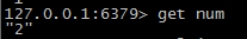 

 **课堂案例:**

步骤4：在窗口1，开启事务，多次累加数据。

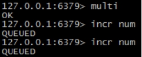 

 **课堂案例:**

步骤5：在窗口2，获得数据

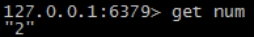 

**课堂案例:** 

步骤6：提交事务

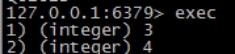 

 

```
127.0.0.1:6379> set num 1

OK

127.0.0.1:6379> get num

"1"

127.0.0.1:6379> get num

"2"

127.0.0.1:6379> multi

OK

127.0.0.1:6379> incr num

QUEUED

127.0.0.1:6379> incr num

QUEUED

127.0.0.1:6379> exec

1) (integer) 3

2) (integer) 4

127.0.0.1:6379>
```

 **到此,我们redis事务的正常执行已经演示完毕!**

接下来,我看下reids事务的回滚操作:

 **课堂案例:**

**回滚**

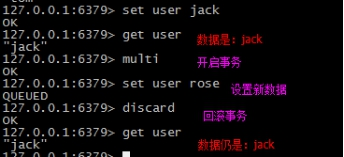 

 **课堂案例:**

**失败命令**

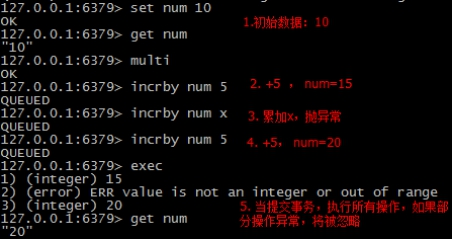 

# 7.2 持久化(RDB，AOF)

## 7.2.1 为什么要持久化

​	Redis是内存数据库。他将自己的数据库存储状态存储在内存中，如果不想方法把数据库状态保存到磁盘中，一旦服务进程退出，服务器中的数据库状态也将消失不见。

​	解决方法：redis提供了RDB持久化功能，这个功能将redis内存中的数据库状态保存到磁盘中，避免数据意外丢失。

## 7.2.2 RDB持久化

 

 

 

RDB持久化功能产生一个RDB文件（经过压缩的二进制文件）可还原成数据库状态。

保存在硬盘里，存在即可还原。

RDB文件的创建与载入：

两个redis命令用于生成RDB文件：SAVE ，BGSAVE。

Save命令：会阻塞redis服务进程，直到RDB文件创建完成。服务器阻塞期间，服务器不能处理任何命令请求。

**课堂案例:**

```
redis> SAVE  //等待生成RDB文件

ok
```

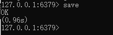 

生成的rdb文件如图:

 

BGSAVE命令会派生一个子进程，然后由子进程负责创建RDB文件，服务父进程继续处理命令。

```
redis> bgsave
```

 

另外,当我们执行shutdown命令的时候,redis在关闭的时候,也会执行save

保存条件:

```
[redis]$ more /usr/local/redis/conf/redis.conf 

save 900 1             #服务器900秒内，对数据库至少修改一次

save 300 10            #服务器300秒内，对数据库至少10次修改

save 60 10000          #服务器60秒内，对数据库至少10000次修改

dbfilename "dump.rdb"          #持久化文件名称

dir "/data/dbs/redis/    #持久化数据文件存放的路径

满足任意三个条件之一，bgsave就会执行。
```


## 7.2.3 AOF持久化

RDB持久化是通过保存数据库中的键值对来记录数据的状态不同，AOF持久化是通过保存redis服务器所执行的写命令来记录数据库状态的。


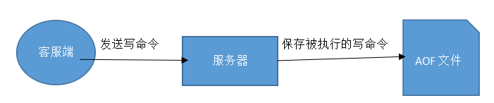 

 

 

**课堂案例：**

```
redis> set msg “hello”

ok

redis> sadd fruits “apple” “banana” “cherry”

(integer) 3

redis>rpush numbers 128 256 512

(interger) 3
```

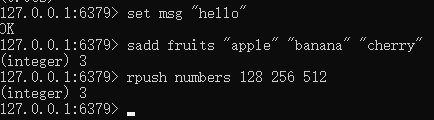  

AOF持久化的方法是将服务器执行的set ，sadd，rpush三个命令保存到AOF文件中

而,RDB持久化是将msg，fruits，numbers三个键的键值对保存到RDB文件。

AOF载入：

服务器启动时通过载入和执行AOF文件中的命令还原数据库状态。

AOF持久化的实现：

  1.命令追加 2.文件写入3.文件同步 三个步骤

命令追加：

当AOF持久化功能处于打开状态时，服务器在执行一个写命令之后，会以协议格式将被执行的写命令追加到服务器的aof_buf缓存区的末尾：

**课堂案例:**

```
redis>set key value

ok
```

 

服务器在执行完整个set命令之后会将以下协议内容追加到aof_buf缓冲区末尾：

```
*3\e\n$3\..\..\..\...\r\n
```

然后执行：

```
redis>rpush numbers one two three

(integer ) 3
```

那么服务器在执行rpush命令之后将以下协议内容追加到aof_buf缓冲区末尾：

```
*5\r\n$3\..\..\..\..\...\r\n
```

 

文件写入与同步：

Redis的服务器进程就是一个事件循环（loop），这个循环中的文件事件负责接收客户端的命令请求，以及向客户端发送命令回复，而时间事件是负责执行定时运行函数(serverContron)。

因为服务器处理文件事件会执行写命令，使一些内容追加到aof_buf缓冲区里，所以服务器每次在结束一个事件循环之前，都会调用flushAppendOnlyFile函数，考虑是否将aof_buf缓冲区的内容写入和保存到Aof文件里。


AOF文件的载入与数据还原：

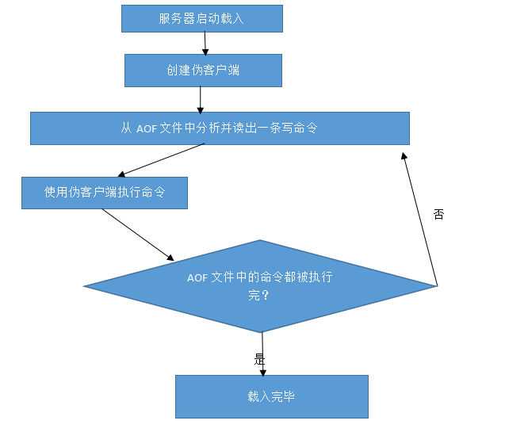 

## 7.2.4 面试题:简单介绍AOF持久化和AOF文件与RDB持久化的区别

aof，rdb是两种 redis持久化的机制。用于crash后，redis的恢复。

**rdb的特性如下：**

fork一个进程，遍历hash table，利用copy on write，把整个db dump保存下来。
save, shutdown, slave 命令会触发这个操作。
粒度比较大，如果save, shutdown, slave 之前crash了，则中间的操作没办法恢复。

**aof有如下特性：**

把写操作指令，持续的写到一个类似日志文件里。（类似于从postgresql等数据库导出sql一样，只记录写操作）
粒度较小，crash之后，只有crash之前没有来得及做日志的操作没办法恢复。

两种区别就是，一个是持续的用日志记录写操作，crash后利用日志恢复；一个是平时写操作的时候不触发写，只有手动提交save命令，或者是关闭命令时，才触发备份操作。

选择的标准，就是看系统是愿意牺牲一些性能，换取更高的缓存一致性（aof），还是愿意写操作频繁的时候，不启用备份来换取更高的性能，待手动运行save的时候，再做备份（rdb）。rdb这个就更有些 eventually consistent的意思了。


因为AOF文件的更新频率比RDB文件的更新频率高，所以：

1如果服务器开启了AOF持久化功能，那么服务器会优先使用AOF文件来还原数据库状态。

2只有在AOF持久化功能处于关闭状态的时候，服务器才会使用RDB文件来还原数据库状态。

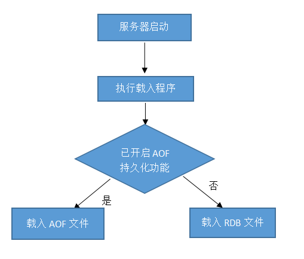 

#  课堂练习

## 1.完成课堂案例(40分钟)

## 2.描述redis 的两种持久化方式(20分钟)

要求:

​	1.描述redis RDB持久化方式的优缺点

​	2.描述redis AOF持久化方式的优缺点

​	3.百度查找redis的缓存击穿,穿透,雪崩问题造成的原因以及解决方案


 