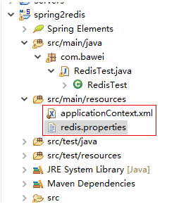
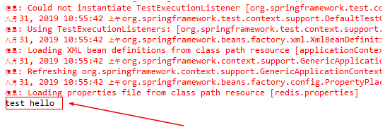
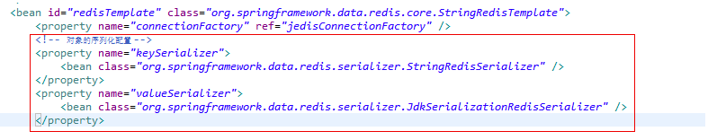
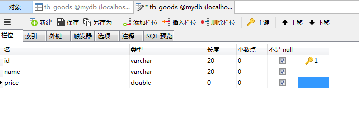
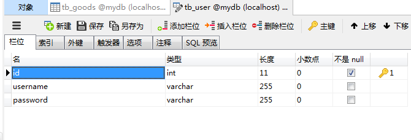
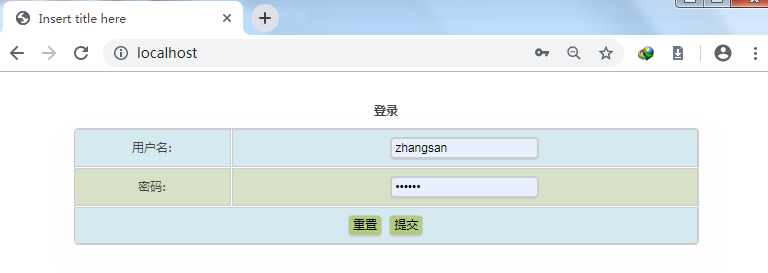
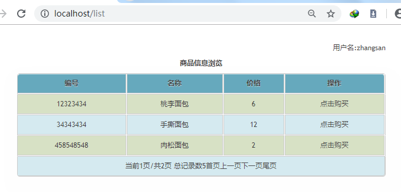
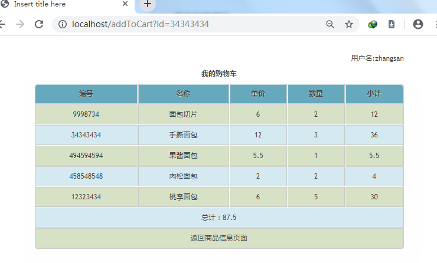
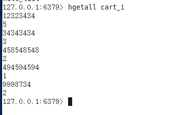

# 第八单元 Redis与购物车

# 【授课重点】

1. 掌Spring整合Redis的相关知识
2. 掌握利用Redis实现购物车

# 【考核要求】

1. 掌握Redis和Spring整合的步骤
2. 掌握Redis在购物车中的使用

# 【教学内容】

## 8.1 课程导入

Redis因其性能比较高，所以经常在项目中用于缓存数据，本章节注意学习如果将Redis和Spring以及项目进行整合。

## 8.2 Redis和Spring的整合

#### 8.2.1 创建maven工程,再pom.xml中导入依赖

```xml
    	<dependency>
            <groupId>org.apache.commons</groupId>
            <artifactId>commons-pool2</artifactId>
            <version>2.0</version>
        </dependency>
        <dependency>
            <groupId>redis.clients</groupId>
            <artifactId>jedis</artifactId>
            <version>2.6.2</version>
        </dependency>
        <dependency>
            <groupId>commons-io</groupId>
            <artifactId>commons-io</artifactId>
            <version>2.4</version>
        </dependency>
        <dependency>
            <groupId>junit</groupId>
            <artifactId>junit</artifactId>
            <version>4.12</version>
        </dependency>
        <dependency>
            <groupId>org.springframework</groupId>
            <artifactId>spring-context</artifactId>
            <version>4.2.4.RELEASE</version>
        </dependency>
        <dependency>
            <groupId>com.fasterxml.jackson.core</groupId>
            <artifactId>jackson-databind</artifactId>
            <version>2.4.2</version>
        </dependency>
        <dependency>
            <groupId>com.alibaba</groupId>
            <artifactId>fastjson</artifactId>
            <version>1.2.7</version>
        </dependency>
        <dependency>
            <groupId>org.springframework</groupId>
            <artifactId>spring-test</artifactId>
            <version>4.2.4.RELEASE</version>
        </dependency>
        <dependency>
            <groupId>org.springframework.data</groupId>
            <artifactId>spring-data-redis</artifactId>
            <version>1.4.1.RELEASE</version>
        </dependency>
```


#### 8.2.2 创建spring配置文件applicationContext.xml,和redis.properties配置文件

 

applicationContext.xml配置如下:

```xml
<?xml version="1.0" encoding="UTF-8"?>
<beans xmlns="http://www.springframework.org/schema/beans"
	xmlns:xsi="http://www.w3.org/2001/XMLSchema-instance" xmlns:util="http://www.springframework.org/schema/util"
	xmlns:jee="http://www.springframework.org/schema/jee" xmlns:lang="http://www.springframework.org/schema/lang"
	xmlns:jms="http://www.springframework.org/schema/jms" xmlns:aop="http://www.springframework.org/schema/aop"
	xmlns:tx="http://www.springframework.org/schema/tx" xmlns:context="http://www.springframework.org/schema/context"
	xmlns:jdbc="http://www.springframework.org/schema/jdbc" xmlns:cache="http://www.springframework.org/schema/cache"
	xmlns:mvc="http://www.springframework.org/schema/mvc" xmlns:oxm="http://www.springframework.org/schema/oxm"
	xmlns:task="http://www.springframework.org/schema/task" xmlns:tool="http://www.springframework.org/schema/tool"
	xmlns:websocket="http://www.springframework.org/schema/websocket"
	xsi:schemaLocation="
        http://www.springframework.org/schema/beans http://www.springframework.org/schema/beans/spring-beans.xsd
        http://www.springframework.org/schema/util http://www.springframework.org/schema/util/spring-util.xsd
        http://www.springframework.org/schema/jee http://www.springframework.org/schema/jee/spring-jee.xsd
        http://www.springframework.org/schema/lang http://www.springframework.org/schema/lang/spring-lang.xsd
        http://www.springframework.org/schema/jms http://www.springframework.org/schema/jms/spring-jms.xsd
        http://www.springframework.org/schema/aop http://www.springframework.org/schema/aop/spring-aop.xsd
        http://www.springframework.org/schema/tx http://www.springframework.org/schema/tx/spring-tx.xsd
        http://www.springframework.org/schema/context http://www.springframework.org/schema/context/spring-context.xsd
        http://www.springframework.org/schema/jdbc http://www.springframework.org/schema/jdbc/spring-jdbc.xsd
        http://www.springframework.org/schema/cache http://www.springframework.org/schema/cache/spring-cache.xsd
        http://www.springframework.org/schema/mvc http://www.springframework.org/schema/mvc/spring-mvc.xsd
        http://www.springframework.org/schema/oxm http://www.springframework.org/schema/oxm/spring-oxm.xsd
        http://www.springframework.org/schema/task http://www.springframework.org/schema/task/spring-task.xsd
        http://www.springframework.org/schema/tool http://www.springframework.org/schema/tool/spring-tool.xsd
        http://www.springframework.org/schema/websocket http://www.springframework.org/schema/websocket/spring-websocket.xsd">

	
	<bean id="jedisConnectionFactory"
		class="org.springframework.data.redis.connection.jedis.JedisConnectionFactory">
		<property name="hostName" value="192.168.25.133" />
		<property name="port" value="6379" />
		
	</bean>
	<bean id="redisTemplate" class="org.springframework.data.redis.core.StringRedisTemplate">
		<property name="connectionFactory" ref="jedisConnectionFactory" />
	</bean>
</beans>
```

 

#### 8.2.3 创建测试类RedisTest

    

代码如下:

```java
@RunWith(SpringJUnit4ClassRunner.class)
@ContextConfiguration("/applicationContext.xml")
public class RedisTest {

	@Autowired
	RedisTemplate redisTemplate;

	@Test
	public void test01() {
		redisTemplate.opsForValue().set("a","test");
        String q = redisTemplate.opsForValue().get("a")+" hello";
        System.out.println(q);
	}

}

```

**运行前确保redis服务是开启的**

运行结果:

    

说明spring整合redis成功!!


#### 8.2.4 测试String

```java
		redisTemplate.opsForValue().append("clazz", "1702A");
		String string = (String) redisTemplate.opsForValue().get("clazz");
		System.out.println(string);
```

测试存取对象.  **注意:在对象存取时一定要加上对象序列化配置**

配置:

```xml
		<!-- 对象的序列化配置 -->
		<property name="keySerializer">
			<bean class="org.springframework.data.redis.serializer.StringRedisSerializer" />
		</property>
		<property name="valueSerializer">
			<bean class="org.springframework.data.redis.serializer.JdkSerializationRedisSerializer" />
		</property>
```

如图:

  

代码测试:

```java
		Types types = new Types();
		types.setId(1);
		types.setName("电器");
		types.setAbstracts("描述信息");
		redisTemplate.opsForValue().set("types_1", types);
		Types types1 = (Types)redisTemplate.opsForValue().get("types_1");
		System.out.println(types1);
```


#### 8.2.5 测试list

```java
        List<Types> types = new ArrayList<Types>();

		Types types1 = new Types();
		types1.setId(1);
		types1.setName("电器");

		Types types2 = new Types();
		types2.setId(2);
		types2.setName("图书");

		Types types3 = new Types();
		types3.setId(5);
		types3.setName("水果");

		types.add(types1);
		types.add(types2);
		types.add(types3);

		redisTemplate.opsForList().leftPush("sysgoods_types", types);
		
		List<Types> list = (List<Types>) redisTemplate.opsForList().rightPop("sysgoods_types");
		for (Types types4 : list) {
			System.out.println(types4);
		}
```


#### 8.2.6 测试hash

测试前:加上hash序列化配置:

```xml
		<property name="hashKeySerializer">
			<bean class="org.springframework.data.redis.serializer.StringRedisSerializer"></bean>
		</property>
		<property name="hashValueSerializer">
			<bean class="org.springframework.data.redis.serializer.JdkSerializationRedisSerializer"></bean>
		</property>
```

代码:

```java
		Map<String, Types> map = new HashMap<>();

		Types types1 = new Types();
		types1.setId(1);
		types1.setName("电器");

		Types types2 = new Types();
		types2.setId(2);
		types2.setName("图书");

		Types types3 = new Types();
		types3.setId(5);
		types3.setName("水果");

		map.put(1 + "", types1);
		map.put(2 + "", types2);
		map.put(3 + "", types3);

		redisTemplate.opsForHash().putAll("sysgoods_types_map", map);
//		// 获取单个 KEY key的value值
//		Types object = (Types) redisTemplate.opsForHash().get("sysgoods_types_map", 1 + "");
//		System.out.println(object);

		// 获取所有值

		Map<Object, Object> entries = redisTemplate.opsForHash().entries("sysgoods_types_map");

		Set<Entry<Object, Object>> set = entries.entrySet();

		Iterator<Entry<Object, Object>> iterator = set.iterator();

		while (iterator.hasNext()) {
			Entry<Object, Object> next = iterator.next();
			System.out.println(next.getKey() + "@" + next.getValue());
		}
```

#### 8.2.7 测试set

```java
		@Test
		public void test01() {
            List<Types> types = new ArrayList<>();
            Types types1 = new Types();
            types1.setId(1);
            types1.setName("电器");

            Types types2 = new Types();
            types2.setId(2);
            types2.setName("图书");

            Types types3 = new Types();
            types3.setId(5);
            types3.setName("水果");

            types.add(types1);
            types.add(types2);
            types.add(types3);

            Types array[] = new Types[types.size()];

            redisTemplate.opsForSet().add("types_1", types.toArray(array));
	}


		@Test
		public void test02() {
		
		
		
            Types types1 = new Types();
            types1.setId(6);
            types1.setName("服装");

            Types types2 = new Types();
            types2.setId(2);
            types2.setName("图书");

            Types types3 = new Types();
            types3.setId(7);
            types3.setName("蔬菜");

            redisTemplate.opsForSet().add("types_2", types1, types2, types3);

    //		查询出所有的set集合
            Set<Types> members = redisTemplate.opsForSet().members("types_2");
            members.forEach(System.out::println);

	}

	@Test
	public void test03() {
		//差集
		Set<Types> set = redisTemplate.opsForSet().difference("types_1", "types_2");
		for (Types types : set) {
			System.out.println(types);
		}
        //交集
        Set<Types> set = redisTemplate.opsForSet().intersect("types_1", "types_2");
		set.forEach(System.out::println);
        //并集
        Set<Types> set = redisTemplate.opsForSet().union("types_1", "types_2");
		set.forEach(System.out::println);
        //删除
        Types types3 = new Types();
		types3.setId(5);
		types3.setName("水果");

		Long remove = redisTemplate.opsForSet().remove("types_1", types3);
	}
```

#### 8.2.8 测试zset

```java
	@Test
	public void testZSet() {
		ZSetOperations<String, String> opsForZSet = redisTemplate.opsForZSet();
		
		opsForZSet.add("student", "张三", 80);
		opsForZSet.add("student", "李四", 90);
		opsForZSet.add("student", "王五", 85);
		
		Set<TypedTuple<String>> scores = opsForZSet.rangeWithScores("student", 0, -1);

		for (TypedTuple<String> typedTuple : scores) {
			System.out.println(typedTuple.getValue() + ":"+typedTuple.getScore());
		}
		
		
		opsForZSet.remove("student", "张三");
		
		Set<TypedTuple<String>> scores2 = opsForZSet.rangeWithScores("student", 0, -1);

		for (TypedTuple<String> typedTuple : scores2) {
			System.out.println(typedTuple.getValue() + ":"+typedTuple.getScore());
		}
		
	}
```


## 8.3 Redis在购物车中的使用

#### 8.3.1 创建数据库和表

商品表：

  

用户表：

  

#### 8.3.2 创建maven项目，导入依赖

pom.xml如下：

```xml
<project xmlns="http://maven.apache.org/POM/4.0.0" xmlns:xsi="http://www.w3.org/2001/XMLSchema-instance" xsi:schemaLocation="http://maven.apache.org/POM/4.0.0 http://maven.apache.org/xsd/maven-4.0.0.xsd">
  <modelVersion>4.0.0</modelVersion>
  <groupId>com</groupId>
  <artifactId>1705d_redis</artifactId>
  <version>0.0.1-SNAPSHOT</version>
  <packaging>war</packaging>
	<!-- 定义主要版本号 -->
	<properties>
		<spring.version>4.3.13.RELEASE</spring.version>
		<mybatis.version>3.4.2</mybatis.version>
		<log4j.version>1.2.17</log4j.version>
		<druid.version>1.0.9</druid.version>
		<mysql.version>5.1.6</mysql.version>
		<mybatis.spring.version>1.3.0</mybatis.spring.version>
		<jackson.version>2.8.1</jackson.version>
		<poi.version>3.9</poi.version>
		<jstl.version>1.2</jstl.version>
		<servlet-api.version>2.5</servlet-api.version>
		<jsp-api.version>2.0</jsp-api.version>
		<commons-lang3.version>3.3.2</commons-lang3.version>
		<commons-io.version>1.3.1</commons-io.version>
		<commons-net.version>3.3</commons-net.version>
		<commons-fileupload.version>1.3.1</commons-fileupload.version>
		<junit-version>4.12</junit-version>
		<!-- aop使用 -->
		<aspectj-version>1.8.0</aspectj-version>
		<!-- 分页助手 -->
		<pagehelper-version>5.1.2</pagehelper-version>

	</properties>

	<!-- 依赖管理，版本锁定 -->
	<dependencies>

		<dependency>
			<groupId>com.mmcro.common</groupId>
			<artifactId>cms-utils</artifactId>
			<version>0.0.1-SNAPSHOT</version>
		</dependency>

		<!-- https://mvnrepository.com/artifact/com.google.code.gson/gson -->
		<dependency>
			<groupId>com.google.code.gson</groupId>
			<artifactId>gson</artifactId>
			<version>2.8.5</version>
		</dependency>

		<dependency>
			<groupId>org.slf4j</groupId>
			<artifactId>slf4j-log4j12</artifactId>
			<version>1.7.2</version>
		</dependency>

		<dependency>
			<groupId>org.hibernate</groupId>
			<artifactId>hibernate-validator</artifactId>
			<version>5.1.3.Final</version>
		</dependency>

		<!-- spring 及springMVC -->
		<dependency>
			<groupId>org.springframework</groupId>
			<artifactId>spring-core</artifactId>
			<!-- 引用版本 -->
			<version>${spring.version}</version>
		</dependency>
		<dependency>
			<groupId>org.springframework</groupId>
			<artifactId>spring-context</artifactId>
			<version>${spring.version}</version>
		</dependency>
		<dependency>
			<groupId>org.springframework</groupId>
			<artifactId>spring-beans</artifactId>
			<version>${spring.version}</version>
		</dependency>
		<dependency>
			<groupId>org.springframework</groupId>
			<artifactId>spring-web</artifactId>
			<version>${spring.version}</version>
		</dependency>
		<dependency>
			<groupId>org.springframework</groupId>
			<artifactId>spring-webmvc</artifactId>
			<version>${spring.version}</version>
		</dependency>
		<dependency>
			<groupId>org.springframework</groupId>
			<artifactId>spring-jdbc</artifactId>
			<version>${spring.version}</version>
		</dependency>
		<dependency>
			<groupId>org.springframework</groupId>
			<artifactId>spring-tx</artifactId>
			<version>${spring.version}</version>
		</dependency>
		<dependency>
			<groupId>org.springframework</groupId>
			<artifactId>spring-context-support</artifactId>
			<version>${spring.version}</version>
		</dependency>
		<!-- mybatis核心包 -->
		<dependency>
			<groupId>org.mybatis</groupId>
			<artifactId>mybatis</artifactId>
			<version>${mybatis.version}</version>
		</dependency>

		<!-- mybatis-spring 整合jar -->
		<dependency>
			<groupId>org.mybatis</groupId>
			<artifactId>mybatis-spring</artifactId>
			<version>${mybatis.spring.version}</version>
		</dependency>

		<!-- druid数据源 -->
		<dependency>
			<groupId>com.alibaba</groupId>
			<artifactId>druid</artifactId>
			<version>${druid.version}</version>
		</dependency>
		<!-- Mysql数据库驱动包 -->
		<dependency>
			<groupId>mysql</groupId>
			<artifactId>mysql-connector-java</artifactId>
			<version>${mysql.version}</version>
		</dependency>
		<!-- 日志文件管理包 -->
		<!-- log start -->
		<dependency>
			<groupId>log4j</groupId>
			<artifactId>log4j</artifactId>
			<version>${log4j.version}</version>

		</dependency>


		<!-- 单元测试 -->
		<dependency>
			<groupId>junit</groupId>
			<artifactId>junit</artifactId>
			<version>${junit-version}</version>
			<scope>test</scope>
		</dependency>
		<!-- 上传组件包 -->
		<dependency>
			<groupId>commons-fileupload</groupId>
			<artifactId>commons-fileupload</artifactId>
			<version>${commons-fileupload.version}</version>
		</dependency>
		<dependency>
			<groupId>commons-io</groupId>
			<artifactId>commons-io</artifactId>
			<version>${commons-io.version}</version>
		</dependency>
		<dependency>
			<groupId>org.apache.poi</groupId>
			<artifactId>poi</artifactId>
			<version>${poi.version}</version>
		</dependency>
		<!-- JSP相关 -->
		<dependency>
			<groupId>jstl</groupId>
			<artifactId>jstl</artifactId>
			<version>${jstl.version}</version>
		</dependency>
		<dependency>
			<groupId>javax.servlet.jsp</groupId>
			<artifactId>jsp-api</artifactId>
			<version>2.2</version>
			<scope>provided</scope>
		</dependency>
		<dependency>
			<groupId>javax.servlet</groupId>
			<artifactId>servlet-api</artifactId>
			<version>${servlet-api.version}</version>
			<scope>provided</scope>
		</dependency>

		<dependency>
			<groupId>com.fasterxml.jackson.core</groupId>
			<artifactId>jackson-databind</artifactId>
			<version>${jackson.version}</version>
		</dependency>

		<!-- 依赖的公共包 -->
		<dependency>
			<groupId>org.apache.commons</groupId>
			<artifactId>commons-lang3</artifactId>
			<version>${commons-lang3.version}</version>
		</dependency>

		<dependency>
			<groupId>org.aspectj</groupId>
			<artifactId>aspectjweaver</artifactId>
			<version>${aspectj-version}</version>
		</dependency>
		<dependency>
			<groupId>org.aspectj</groupId>
			<artifactId>aspectjrt</artifactId>
			<version>${aspectj-version}</version>
		</dependency>

		<!-- mybaits pagehelper 分页助手 -->

		<dependency>
			<groupId>com.github.pagehelper</groupId>
			<artifactId>pagehelper</artifactId>
			<version>${pagehelper-version}</version>
		</dependency>

		<dependency>
			<groupId>org.springframework</groupId>
			<artifactId>spring-test</artifactId>
			<version>${spring.version}</version>
		</dependency>
		<!-- 富文本编辑器使用该文件上传 -->
		<dependency>
			<groupId>com.googlecode.json-simple</groupId>
			<artifactId>json-simple</artifactId>
			<version>1.1.1</version>
		</dependency>
		<!-- redis和spring整合包 -->
		<dependency>
			<groupId>org.springframework.data</groupId>
			<artifactId>spring-data-redis</artifactId>
			<version>1.8.7.RELEASE</version>
		</dependency>
		<!-- 连接redis -->
		<dependency>
			<groupId>redis.clients</groupId>
			<artifactId>jedis</artifactId>
			<version>2.9.0</version>
		</dependency>
		
				<!-- kafka和spring的整合包 -->
		<dependency>
			<groupId>org.springframework.kafka</groupId>
			<artifactId>spring-kafka</artifactId>
			<version>2.2.0.RELEASE</version>
		</dependency>

		<!-- kafka的依赖包 -->
		<dependency>
			<groupId>org.apache.kafka</groupId>
			<artifactId>kafka_2.10</artifactId>
			<version>0.8.2.1</version>
			<exclusions>
				<exclusion>
					<artifactId>jmxri</artifactId>
					<groupId>com.sun.jmx</groupId>
				</exclusion>
				<exclusion>
					<artifactId>jms</artifactId>
					<groupId>javax.jms</groupId>
				</exclusion>
				<exclusion>
					<artifactId>jmxtools</artifactId>
					<groupId>com.sun.jdmk</groupId>
				</exclusion>
			</exclusions>
		</dependency>

		<!-- 依赖公共工具包 -->
		<!-- 工具包 -->
		<!-- <dependency> <groupId>com.bawei</groupId> <artifactId>lisi_cmmon</artifactId> 
			<version>0.0.1-SNAPSHOT</version> </dependency> -->
	</dependencies>


	<build>
		<finalName>FirstWeb</finalName>

		<plugins>
			<plugin>
				<groupId>org.apache.maven.plugins</groupId>
				<artifactId>maven-compiler-plugin</artifactId>
				<version>3.5.1</version>
				<configuration>
					<source>1.8</source>
					<target>1.8</target>
					<encoding>UTF-8</encoding>
				</configuration>
			</plugin>


			<!-- Tomcat插件：非官方插件，第三方插件，用于启动Web服务。运行命令：tomcat7:run -->
			<plugin>
				<groupId>org.apache.tomcat.maven</groupId>
				<artifactId>tomcat7-maven-plugin</artifactId>
				<version>2.2</version>
				<configuration>
					<!-- 项目端口号 -->
					<port>80</port>
					<!-- 项目的访问路径 -->
					<path>/</path>
					<!-- get请求中文乱码 -->
					<uriEncoding>utf-8</uriEncoding>
					<!-- 配置tomcat虚拟路径 -->
					<!-- <staticContextPath>/pic</staticContextPath> -->
					<!-- 配置tomcat物理路径 -->
					<!-- <staticContextDocbase>d:/pic</staticContextDocbase> -->
				</configuration>
			</plugin>

			<!--jetty插件:jetty:run -->
			<plugin>
				<groupId>org.eclipse.jetty</groupId>
				<artifactId>jetty-maven-plugin</artifactId>
				<version>9.3.7.v20160115</version>
				<configuration>
					<httpConnector>
						<port>8081</port>
						<host>localhost</host>
					</httpConnector>
					<contextHandlers>
						<!-- <contextHandler implementation="org.eclipse.jetty.webapp.WebAppContext"> 
							<contextPath>/pic</contextPath> <baseResource>d:/pic/</baseResource> </contextHandler> -->
						<jettyWebAppContext>
							<!-- 虚拟路径 -->
							<contextPath>/pic</contextPath>
							<!-- 物理路径 -->
							<resourceBase>d:/pic/</resourceBase>
						</jettyWebAppContext>
					</contextHandlers>
					<scanIntervalSeconds>1</scanIntervalSeconds>
				</configuration>
			</plugin>


		</plugins>

	</build>
  
</project>
```

8.3.3 创建Spring配置文件，以及修改web.xml文件

applicationContext.xml如下：

```xml
<?xml version="1.0" encoding="UTF-8"?>
<beans xmlns="http://www.springframework.org/schema/beans"
	xmlns:xsi="http://www.w3.org/2001/XMLSchema-instance"
	xmlns:aop="http://www.springframework.org/schema/aop"
	xmlns:context="http://www.springframework.org/schema/context"
	xmlns:tx="http://www.springframework.org/schema/tx"
	xmlns:p="http://www.springframework.org/schema/p"
	xsi:schemaLocation="http://www.springframework.org/schema/beans http://www.springframework.org/schema/beans/spring-beans.xsd
		http://www.springframework.org/schema/context http://www.springframework.org/schema/context/spring-context-4.3.xsd
		http://www.springframework.org/schema/aop http://www.springframework.org/schema/aop/spring-aop-4.3.xsd
		http://www.springframework.org/schema/tx http://www.springframework.org/schema/tx/spring-tx-4.3.xsd">

	<!-- 组件扫描 -->
	<context:component-scan base-package="com.bawei.service,com.bawei.mapper"></context:component-scan>
	
	
	<!--2、 指定外部属性文件的位置 -->
	<context:property-placeholder
		location="classpath:db.properties" />

	<!-- 3.使用druid数据源 连接池 -->
	<bean id="dataSource" 
		class="com.alibaba.druid.pool.DruidDataSource">
		<property name="driverClassName" value="${jdbc.driver}">
		</property>
		<property name="url" value="${jdbc.url}">
		</property>
		<property name="username" value="${jdbc.username}">
		</property>
		<property name="password" value="${jdbc.password}">
		</property>
	</bean>


	<!--4、 配置mybatis SqlSessionFactory -->
	<bean id="sqlSessionFactory"
		class="org.mybatis.spring.SqlSessionFactoryBean" scope="singleton">
		<!-- 注入数据源 -->
		<property name="dataSource" ref="dataSource"></property>
		<!-- 关联mybatis配置文件 -->
		<property name="configLocation" value="classpath:mybatis.xml"></property>
	</bean>

	<!--5、 配置jdbc事务管理器 -->
	<bean id="transactionManager"
		class="org.springframework.jdbc.datasource.DataSourceTransactionManager">
		<property name="dataSource" ref="dataSource"></property>
	</bean>


	<!--6、 配置事务 transaction-manager:表示关联的事务管理器是谁 -->
	<tx:advice transaction-manager="transactionManager"
		id="txAdvice">
		<!-- 事务属性配置 -->
		<tx:attributes>
			<!-- 以find.select get开头的方法为只读事务，用来提高数据库的性能 -->
			<tx:method name="find*" read-only="true" />
			<tx:method name="select*" read-only="true" />
			<tx:method name="get*" read-only="true" />
			<tx:method name="load*" read-only="true" />
			<tx:method name="list*" read-only="true" />
			<!-- 其他的方法为默认事务 -->
			<tx:method name="*" propagation="REQUIRED" />
		</tx:attributes>
	</tx:advice>
	<!-- 7、配置aop -->
	<aop:config>
		<!-- 配置切点表达式   todo -->
		<aop:pointcut
			expression="execution(* com.bawei.service.impl.*.*(..))" id="pointcut" />
		<!-- 关联事务 -->
		<aop:advisor advice-ref="txAdvice" pointcut-ref="pointcut" />

	</aop:config>

	<!--8 扫描mapper -->

	<bean class="org.mybatis.spring.mapper.MapperScannerConfigurer">
		<!-- basePackage :mapper接口所在的包  todo -->
		<property name="basePackage" value="com.bawei.mapper"></property>

	</bean>
	
	
	
	<!-- 配置redis的配置 -->
	<bean id="jedisConnectionFactory"
		class="org.springframework.data.redis.connection.jedis.JedisConnectionFactory"
		p:use-pool="true" p:port="6379" p:hostName="192.168.79.130" />


	<!-- 声明bean对象 redis string的序列化 -->
	<bean id="stringRedisSerializer"
		class="org.springframework.data.redis.serializer.StringRedisSerializer" />

	<!-- 声明bean对象 json序列化方式 -->
	<bean id="genericJackson2JsonRedisSerializer"
		class="org.springframework.data.redis.serializer.GenericJackson2JsonRedisSerializer" />


	<!-- 声明bean对象 jdk 序列化方式 -->
	<bean id="jdkSerializationRedisSerializer"
		class="org.springframework.data.redis.serializer.JdkSerializationRedisSerializer" />


	<!-- 配置一个redis模板对象 -->
	<bean id="redisTemplate"
		class="org.springframework.data.redis.core.RedisTemplate"
		p:connection-factory-ref="jedisConnectionFactory">
		<property name="keySerializer" ref="stringRedisSerializer" />
		<!-- 只修改value -->
		<property name="valueSerializer"
			ref="genericJackson2JsonRedisSerializer" />

		<!-- 配置hash的key与value的序列化方式 -->
		<property name="hashKeySerializer"
			ref="stringRedisSerializer" />
		<property name="hashValueSerializer"
			ref="stringRedisSerializer" />
	</bean>

</beans>

```

springmvc.xml文件如下：

```xml
<?xml version="1.0" encoding="UTF-8"?>
<beans xmlns="http://www.springframework.org/schema/beans"
	xmlns:xsi="http://www.w3.org/2001/XMLSchema-instance"
	xmlns:context="http://www.springframework.org/schema/context"
	xmlns:mvc="http://www.springframework.org/schema/mvc"
	xsi:schemaLocation="http://www.springframework.org/schema/beans 
		http://www.springframework.org/schema/beans/spring-beans-4.3.xsd
		http://www.springframework.org/schema/context 
		http://www.springframework.org/schema/context/spring-context-4.3.xsd
		http://www.springframework.org/schema/mvc 
		http://www.springframework.org/schema/mvc/spring-mvc-4.3.xsd">
	<!-- 扫描器  -->
	<context:component-scan
		base-package="com.bawei.controller"></context:component-scan>
		
	<!-- 视图解析图 -->
	<bean
		class="org.springframework.web.servlet.view.InternalResourceViewResolver">
		<!-- 配置前缀 -->
		<property name="prefix" value="/WEB-INF/jsp/"></property>
		<!-- 配置后缀 -->
		<property name="suffix" value=".jsp"></property>
	</bean>

	<!-- 不拦截静态资源 -->
	<mvc:default-servlet-handler />
	
	<!-- mvc注解驱动 -->
	<mvc:annotation-driven></mvc:annotation-driven>


	<!-- 登录检查的拦截器 -->
<!-- 	<mvc:interceptors>
		<mvc:interceptor>
			<mvc:mapping path="/**" />
			需要排除的请求
			<mvc:exclude-mapping path="/user/login.action" />
			<bean class="com.neu.controller.LoginCheckInterceptor"></bean>
		</mvc:interceptor>
	</mvc:interceptors> -->
</beans>

```

mybatis.xml如下：

```xml
<?xml version="1.0" encoding="UTF-8" ?>
<!DOCTYPE configuration
PUBLIC "-//mybatis.org//DTD Config 3.0//EN"
"http://mybatis.org/dtd/mybatis-3-config.dtd">
<configuration>

<!-- 别名配置 -->
 <typeAliases>
   <package name="com.bawei.entity"/>
 </typeAliases>
 
 
 <!-- 配置分页助手拦截器 -->
<plugins>
 <plugin interceptor="com.github.pagehelper.PageInterceptor"></plugin>
 
 </plugins>
</configuration>
```

db.properties如下：

```java
jdbc.driver=com.mysql.jdbc.Driver
jdbc.url=jdbc\:mysql\:///mydb?characterEncoding=UTF-8
jdbc.username=root
jdbc.password=123456
```

web.xml如下：

```xml
<?xml version="1.0" encoding="UTF-8"?>
<web-app xmlns:xsi="http://www.w3.org/2001/XMLSchema-instance" xmlns="http://java.sun.com/xml/ns/javaee" xsi:schemaLocation="http://java.sun.com/xml/ns/javaee http://java.sun.com/xml/ns/javaee/web-app_2_5.xsd" version="2.5">
  <display-name>1705d_redis</display-name>
  <welcome-file-list>
    <welcome-file>index.html</welcome-file>
    <welcome-file>index.htm</welcome-file>
    <welcome-file>index.jsp</welcome-file>
    <welcome-file>default.html</welcome-file>
    <welcome-file>default.htm</welcome-file>
    <welcome-file>default.jsp</welcome-file>
  </welcome-file-list>
  
    <!-- 
  	启动两个容器，
  	父容器：业务逻辑层和数据访问层组件 ，通过监听器，在启动web容器的同时，启动
  	子容器：控制器组件，通过前端控制器（Servlet），启动
  	子容器组件可以访问父容器组件
  -->
  <context-param>
    <param-name>contextConfigLocation</param-name>
    <param-value>classpath:applicationContext.xml</param-value>
  </context-param>
  <listener>
    <listener-class>
  		org.springframework.web.context.ContextLoaderListener
  	</listener-class>
  </listener>
  <servlet>
  	<servlet-name>DispatcherServlet</servlet-name>
  	<servlet-class>org.springframework.web.servlet.DispatcherServlet</servlet-class>
  	<init-param>
  		<param-name>contextConfigLocation</param-name>
  		<param-value>classpath:springmvc.xml</param-value>
  	</init-param>
  	<load-on-startup>1</load-on-startup>
  </servlet>
  
  <servlet-mapping>
  	<servlet-name>DispatcherServlet</servlet-name>
  	<url-pattern>/</url-pattern>
  </servlet-mapping>
  
  <filter>
  	<filter-name>CharacterEncodingFilter</filter-name>
  	<filter-class>org.springframework.web.filter.CharacterEncodingFilter</filter-class>
  	<init-param>
  		<param-name>encoding</param-name>
  		<param-value>utf-8</param-value>
  	</init-param>
  </filter>
  <filter-mapping>
  	<filter-name>CharacterEncodingFilter</filter-name>
  	<url-pattern>/*</url-pattern>
  </filter-mapping>
</web-app>

```

#### 8.3.3 创建实体类对象

创建商品类对象：

```java
package com.bawei.entity;

import java.math.BigDecimal;

public class Good {
	private String id;
	private String name;
	private BigDecimal price;

	public String getId() {
		return id;
	}

	public void setId(String id) {
		this.id = id;
	}

	public String getName() {
		return name;
	}

	public void setName(String name) {
		this.name = name;
	}

	public BigDecimal getPrice() {
		return price;
	}

	public void setPrice(BigDecimal price) {
		this.price = price;
	}

	@Override
	public String toString() {
		return "Good [id=" + id + ", name=" + name + ", price=" + price + "]";
	}

	public Good(String id, String name, BigDecimal price) {
		super();
		this.id = id;
		this.name = name;
		this.price = price;
	}

	public Good() {
		super();
	}

}

```

创建用户类对象：

```java
package com.bawei.entity;

public class User {
	
	private Integer id;
	private String userName;
	private String password;
	public Integer getId() {
		return id;
	}
	public void setId(Integer id) {
		this.id = id;
	}
	public String getUserName() {
		return userName;
	}
	public void setUserName(String userName) {
		this.userName = userName;
	}
	public String getPassword() {
		return password;
	}
	public void setPassword(String password) {
		this.password = password;
	}
	@Override
	public String toString() {
		return "User [id=" + id + ", userName=" + userName + ", password=" + password + "]";
	}
	public User(Integer id, String userName, String password) {
		super();
		this.id = id;
		this.userName = userName;
		this.password = password;
	}
	public User() {
		super();
		// TODO Auto-generated constructor stub
	}

	
}

```


#### 8.3.4 实现用户登录功能

**跳转到登录页面**

1. 创建UserController类

```java
	/**
	 * 跳转到登录页面
	 */
	@RequestMapping("/")
	public String toLogin() {
		
		return "login";
	}
```

2. 创建login.jsp页面

```jsp
<%@ page language="java" contentType="text/html; charset=UTF-8"
	pageEncoding="UTF-8"%>
<%@ taglib uri="http://java.sun.com/jsp/jstl/core" prefix="c"%>
<%@ taglib uri="http://java.sun.com/jsp/jstl/fmt" prefix="fmt"%>
<!DOCTYPE html PUBLIC "-//W3C//DTD HTML 4.01 Transitional//EN" "http://www.w3.org/TR/html4/loose.dtd">
<html>
<head>
<meta http-equiv="Content-Type" content="text/html; charset=UTF-8">
<link rel="stylesheet" type="text/css" href="${pageContext.request.contextPath }/css/index_love.css">
<script type="text/javascript" src="<%=request.getContextPath() %>/js/jquery-1.8.2.js"></script>
<title>Insert title here</title>
</head>
<body>
	<div style="text-align: center">
		<form action="/login" method="post">
			<h1>登录</h1>
			<table border="1" width="800" align="center">
				<tr>
					<td>用户名:</td>
					<td><input type="text" name="userName"></td>
				</tr>
				<tr>
					<td>密码:</td>
					<td><input type="password" name="password"></td>
				</tr>
				<tr>
					<td colspan="2"><input type="reset" value="重置">  <input type="submit" value="提交"></td>
				</tr>
			</table>
		</form>
	</div>
</body>
</html>

```


**登录操作**

1. 在UserController中创建对应的登录方法

```java
package com.bawei.controller;

import javax.servlet.http.HttpSession;

import org.springframework.beans.factory.annotation.Autowired;
import org.springframework.stereotype.Controller;
import org.springframework.web.bind.annotation.RequestMapping;

import com.bawei.entity.User;
import com.bawei.service.UserService;

@Controller
public class UserController {

	@Autowired
	private UserService userService;
	
	/**
	 * 跳转到登录页面
	 */
	@RequestMapping("/")
	public String toLogin() {
		
		return "login";
	}
	
	/**
	 * 登录
	 * @param user
	 * @param session
	 */
	@RequestMapping("/login")
	public String login(User user,HttpSession session) {
		
		//校验用户名和密码
		user = userService.login(user);
		
		//存入session中
		if(user != null) {
			session.setAttribute("user", user);
		}
		
		//重定向到列表
		return "redirect:list";
	}
}
```

2. 编写Service层代码

Service接口

```java
package com.bawei.service;

import com.bawei.entity.User;

public interface UserService {

	User login(User user);

}

```

ServiceImpl实现类

```java
package com.bawei.service;

import org.springframework.beans.factory.annotation.Autowired;
import org.springframework.stereotype.Service;

import com.bawei.entity.User;
import com.bawei.mapper.UserMapper;

@Service
public class UserServiceImpl implements UserService{

	@Autowired
	private UserMapper userMapper;
	
	
	@Override
	public User login(User user) {
		
		return userMapper.login(user);
	}

}

```


3. 编写Dao层代码

Mapper接口

```java
package com.bawei.mapper;

import com.bawei.entity.User;

public interface UserMapper {

	User login(User user);

}

```

Mapper.xml文件

```xml
<?xml version="1.0" encoding="UTF-8"?>
<!DOCTYPE mapper PUBLIC "-//mybatis.org//DTD Mapper 3.0//EN" "http://mybatis.org/dtd/mybatis-3-mapper.dtd">
<mapper namespace="com.bawei.mapper.UserMapper">
	<select id="login" resultType="com.bawei.entity.User">
		select * from tb_user where username=#{userName} and password=#{password}
	</select>
	
</mapper>

```


#### 8.3.5 实现商品列表功能

1. 编写getall.jsp页面

```jsp
<%@ page language="java" contentType="text/html; charset=UTF-8"
    pageEncoding="UTF-8"%>
<%@ taglib uri="http://java.sun.com/jsp/jstl/core" prefix="c" %>
<%@ taglib uri="http://java.sun.com/jsp/jstl/fmt" prefix="fmt" %>
<!DOCTYPE html PUBLIC "-//W3C//DTD HTML 4.01 Transitional//EN" "http://www.w3.org/TR/html4/loose.dtd">
<html>
<head>
<meta http-equiv="Content-Type" content="text/html; charset=UTF-8">
<link rel="stylesheet" type="text/css" href="${pageContext.request.contextPath }/css/index_love.css">
<script type="text/javascript" src="<%=request.getContextPath() %>/js/jquery-1.8.2.js"></script>
<title>Insert title here</title>
</head>
<body>
	<div style="text-align:center">
	<div style="text-align: right">用户名:${user.userName }</div>
		<h1>商品信息浏览</h1>
		<table border="1" width="800" align="center">
			<tr>
				<th>编号</th><th>名称</th><th>价格</th><th>操作</th>
			</tr>
			<c:forEach items="${ page.list }" var="good">
				<tr>
					<td>${ good.id }</td>
					<td>${ good.name }</td>
					<td>${ good.price }</td>
					<td>
						<a href="${ pageContext.request.contextPath }/addToCart?id=${ good.id }">点击购买</a>
					</td>
				</tr>				
			</c:forEach>
			
			<tr>
				<td colspan="10">${fenye }</td>
			</tr>
		</table>
	</div>
</body>
</html>

```

2. 创建GoodsController类，编写list方法

```java
@Controller
public class GoodController {
	@Autowired
	private GoodService goodService;

	/**
	 * 查询商品列表
	 * @param request
	 * @param pageNum
	 * @param pageSize
	 * @return
	 */
	@RequestMapping("/list")
	public String getAll(HttpServletRequest request, @RequestParam(defaultValue = "1") Integer pageNum,
			@RequestParam(defaultValue = "3") Integer pageSize) {
		//设置分页
		Page<Object> startPage = PageHelper.startPage(pageNum, pageSize);

		//查询所有数据
		List<Good> list = goodService.getAll();
		
		//调用分页工具类
		PageUtil page = new PageUtil(pageNum, startPage.getTotal(), pageSize, request);

		//封装数据
		page.setList(list);
		page.setUrl("/list");

		//存入request域中
		request.setAttribute("page", page);

		return "getall";
	}
}
```

3. 编写Service层代码

   Service接口代码

```java
public interface GoodService {
	public List<Good> getAll();
	
	public Good getById(String id);
}
```

​		Service实现类代码

```java
@Service
public class GoodServiceImpl implements GoodService {
	@Autowired
	private GoodMapper goodMapper;


	@Override
	public List<Good> getAll() {
		
		return goodMapper.getAll();
	}


	@Override
	public Good getById(String id) {
		
		return goodMapper.getById(id);
	}
}
```


4. 编写Dao层代码

   Mapper接口代码

```java
package com.bawei.mapper;

import java.util.List;

import com.bawei.entity.Good;

public interface GoodMapper {
	public List<Good> getAll();
	
	public Good getById(String id);
}


```

​		Mapper.xml代码

```xml
<?xml version="1.0" encoding="UTF-8"?>
<!DOCTYPE mapper PUBLIC "-//mybatis.org//DTD Mapper 3.0//EN" "http://mybatis.org/dtd/mybatis-3-mapper.dtd">
<mapper namespace="com.bawei.mapper.GoodMapper">
	<select id="getAll" resultType="com.bawei.entity.Good">
		select id,name,price from
		tb_goods
	</select>

	<select id="getById" resultType="com.bawei.entity.Good">
		select id,name,price
		from tb_goods
		where id = #{id}
	</select>
</mapper>

```


#### 8.3.6 实现添加购物车功能

1. 编写cart.jsp页面

```jsp
<%@ page language="java" contentType="text/html; charset=UTF-8"
    pageEncoding="UTF-8"%>
<%@ taglib uri="http://java.sun.com/jsp/jstl/core" prefix="c" %>
<!DOCTYPE html PUBLIC "-//W3C//DTD HTML 4.01 Transitional//EN" "http://www.w3.org/TR/html4/loose.dtd">
<html>
<head>
<link rel="stylesheet" type="text/css" href="${pageContext.request.contextPath }/css/index_love.css">
<script type="text/javascript" src="<%=request.getContextPath() %>/js/jquery-1.8.2.js"></script>
<meta http-equiv="Content-Type" content="text/html; charset=UTF-8">
<title>Insert title here</title>
</head>
<body>
	<div style="text-align:center;">
	<div style="text-align: right">用户名:${user.userName }</div>
		<h1>我的购物车</h1>
		<table border="1" width="700" align="center">
			<tr>
				<th>编号</th>
				<th>名称</th>
				<th>单价</th>
				<th>数量</th>
				<th>小计</th>
			</tr>			
			<c:forEach items="${ goods }" var="entry">
				<tr>
					<td>${ entry.key.id }</td>
					<td>${ entry.key.name }</td>
					<td>${ entry.key.price }</td>
					<td>${ entry.value }</td>
					<td>${ entry.key.price*entry.value }</td>
				</tr>
			</c:forEach>
				<tr>
					<td colspan="5">
						总计：${ sum }
					</td>
				</tr>
				<tr>
					<td colspan="5">
						<a href="javascript:history.go(-1)">返回商品信息页面</a>
					</td>
				</tr>
		</table>
	</div>
</body>
</html>

```


2. 编写添加购物车的Controller层代码

```java
package com.bawei.controller;

import java.math.BigDecimal;
import java.util.HashMap;
import java.util.Iterator;
import java.util.List;
import java.util.Map;
import java.util.Map.Entry;
import java.util.Set;

import javax.servlet.http.HttpServletRequest;
import javax.servlet.http.HttpSession;

import org.springframework.beans.factory.annotation.Autowired;
import org.springframework.stereotype.Controller;
import org.springframework.ui.Model;
import org.springframework.web.bind.annotation.RequestMapping;
import org.springframework.web.bind.annotation.RequestParam;

import com.bawei.entity.Good;
import com.bawei.entity.User;
import com.bawei.service.GoodService;
import com.bawei.utils.PageUtil;
import com.github.pagehelper.Page;
import com.github.pagehelper.PageHelper;

@Controller
public class GoodController {
	@Autowired
	private GoodService goodService;

	/**
	 * 查询商品列表
	 * @param request
	 * @param pageNum
	 * @param pageSize
	 * @return
	 */
	@RequestMapping("/list")
	public String getAll(HttpServletRequest request, @RequestParam(defaultValue = "1") Integer pageNum,
			@RequestParam(defaultValue = "3") Integer pageSize) {
		//设置分页
		Page<Object> startPage = PageHelper.startPage(pageNum, pageSize);

		//查询所有数据
		List<Good> list = goodService.getAll();
		
		//调用分页工具类
		PageUtil page = new PageUtil(pageNum, startPage.getTotal(), pageSize, request);

		//封装数据
		page.setList(list);
		page.setUrl("/list");

		//存入request域中
		request.setAttribute("page", page);

		return "getall";
	}


	/**
	 * 添加到购物车
	 * @param good
	 * @param session
	 * @param model
	 * @return
	 */
	@RequestMapping("addToCart")
	public String addToCart(Good good, HttpSession session, Model model) {

		//获取当前用户
		Object object = session.getAttribute("user");
		
		//如果没有用户，则跳转到登录页面
		if(object == null) {
			return "/";
			
		}else {
			
			//将数据存放到购物车
			Map<String, String> cart = goodService.addToCart(good,(User)object);
			
			//存放购物车信息
			Map<Good,Integer> goods = new HashMap<Good,Integer>();
			
			//存放总价格
			BigDecimal sum = new BigDecimal(0);
			
			//遍历购物车信息
			Set<Entry<String, String>> entrySet = cart.entrySet();
			Iterator<Entry<String, String>> iterator = entrySet.iterator();
			
			//计算商品总价格
			while(iterator.hasNext()) {
				Entry<String, String> next = iterator.next();
				
				//商品id
				String good_id = next.getKey();
				//商品数量
				Integer good_count = Integer.parseInt(next.getValue());
				
				//根据商品id获取商品信息
				Good g = goodService.getById(good_id);
				
				//将商品存放到list中
				goods.put(g, good_count);
				
				sum = sum.add(g.getPrice().multiply(new BigDecimal(good_count)));
			}
			
			
			model.addAttribute("goods", goods);
			model.addAttribute("sum", sum);
		}
		
		return "cart";
	}
	
	
}

```


3. 编写Service层代码

   ​	Service接口代码

```java
package com.bawei.service;

import java.util.List;
import java.util.Map;

import com.bawei.entity.Good;
import com.bawei.entity.User;

public interface GoodService {
	public List<Good> getAll();
	
	public Good getById(String id);

	public Map<String, String> addToCart(Good good, User object);
}

```

​			Service实现类代码

```java
package com.bawei.service;

import java.util.List;
import java.util.Map;

import org.springframework.beans.factory.annotation.Autowired;
import org.springframework.data.redis.core.HashOperations;
import org.springframework.data.redis.core.RedisTemplate;
import org.springframework.stereotype.Service;

import com.bawei.entity.Good;
import com.bawei.entity.User;
import com.bawei.mapper.GoodMapper;

@Service
public class GoodServiceImpl implements GoodService {
	@Autowired
	private GoodMapper goodMapper;
	
	@Autowired
	private RedisTemplate<String, Integer> redisTemplate;

	@Override
	public List<Good> getAll() {
		
		return goodMapper.getAll();
	}


	@Override
	public Good getById(String id) {
		
		return goodMapper.getById(id);
	}

	@Override
	public Map<String, String> addToCart(Good good, User user) {
		
		//获取hash类型操作对象
		HashOperations<String, String, String> opsForHash = redisTemplate.opsForHash();
		
		//获取redis中存放的商品数量
		String str_count = opsForHash.get("cart_"+user.getId(), good.getId());
		
		//如果count没有值，则获取设置为1
		//如果有值，则将其加1
		Integer count = str_count == null? 1 : (Integer.parseInt(str_count) + 1);
		
		//将其存入redis中
		opsForHash.put("cart_"+user.getId(), good.getId(), count+"");
		
		//获取该用户的购物车信息
		Map<String, String> cart = opsForHash.entries("cart_"+user.getId());

		return cart;
	}

}


```


#### 8.3.7 效果展示

登录

  

商品列表展示

   

添加到购物车

   

Redis中数据

   


# 课堂练习

## 1.完成Spring与Redis的整合测试(40分钟)

## 2.完成使用Redis的购物车功能(60分钟)

