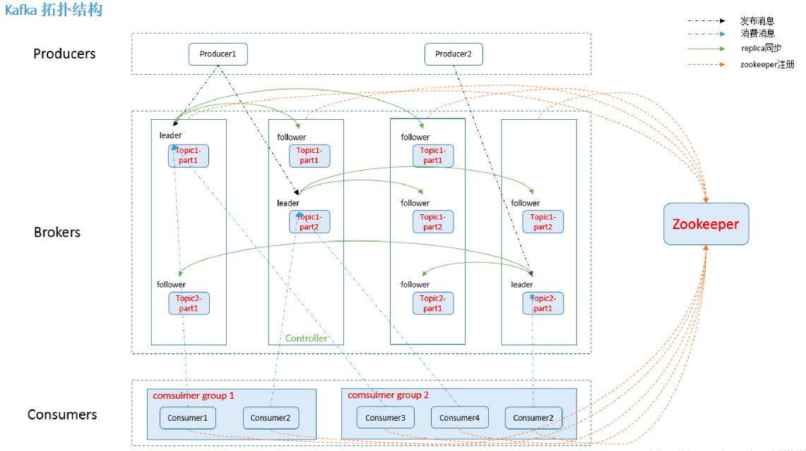

# 第9单元 kafka概述

# 【授课重点】

1. Kafka是什么

2. 消息队列内部的实现原理

3. 为什么需要消息队列

4. Kafka架构

5. 分布式模型

6. Kafka的环境搭建

# 【考核要求】

1. Kafka是什么

2. 消息队列内部的实现原理

3. 为什么需要消息队列

4. Kafka架构

5. 分布式模型

6. Kafka的环境搭建

# 【教学内容】

## 9.1 课程导入

**Kafka是什么?**

 


**Kafka是一款分布式消息发布和订阅系统，它的特点是高性能、高吞吐量**。最早设计的目的是作为LinkedIn的活动流和运营数据的处理管道。这些数据主要是用来对用户做用户画像分析以及服务器性能数据的一些监控。所以kafka一开始设计的目标就是作为一个分布式、高吞吐量的消息系统，所以适合运用在大数据传输场景。kafka的简单定义：分布式的基于发布订阅的消息系统，它的特性如下：

- 以时间复杂度为O(1)的方式提供消息持久化能力，即使对TB级以上数据也能保证常数时间复杂度的访问性能。
- 高吞吐率。即使在非常廉价的商用机器上也能做到单机支持每秒100K条以上消息的传输。
- 支持Kafka Server间的消息分区，及分布式消费，同时保证每个Partition内的消息顺序传输。
- 同时支持离线数据处理和实时数据处理。
- Scale out：支持在线水平扩展。

 Kafka对消息保存时根据Topic进行归类，发送消息者称为Producer,消息接受者称为Consumer,此外kafka集群有多个kafka实例组成，每个实例(server)成为broker。

 无论是kafka集群，还是producer和consumer都依赖于**zookeeper**集群保存一些meta信息，来保证系统可用性


## 9.2 kafka的应用场景

 由于kafka具有更好的吞吐量、内置分区、冗余及容错性的优点(kafka每秒可以处理几十万消息)，让kafka成为了一个很好的大规模消息处理应用的解决方案。所以在企业级应用上，主要会应用于如下几个方面：

- **行为跟踪：**kafka可以用于跟踪用户浏览页面、搜索及其他行为。通过发布-订阅模式实时记录到对应的topic中，通过后端大数据平台接入处理分析，并做更进一步的实时处理和监控。
- **日志收集：**日志收集方面，有很多比较优秀的产品，比如Apache Flume，很多公司使用kafka代理日志聚合。日志聚合表示从服务器上收集日志文件，然后放到一个集中的平台（文件服务器）进行处理。在实际应用开发中，我们应用程序的log都会输出到本地的磁盘上，排查问题的话通过linux命令来搞定，如果应用程序组成了负载均衡集群，并且集群的机器有几十台以上，那么想通过日志快速定位到问题，就是很麻烦的事情了。所以一般都会做一个日志统一收集平台管理log日志用来快速查询重要应用的问题。所以很多公司的套路都是把应用日志集中到kafka上，然后分别导入到es和hdfs上，用来做实时检索分析和离线统计数据备份等。而另一方面，kafka本身又提供了很好的api来集成日志并且做日志收集。

## 9.3 为什么使用kafka？使用kafka会帮助解决哪些问题？

- **解耦：**在项目启动之初来预测将来项目会碰到什么需求，是极其困难的。消息系统在处理过程中间插入了一个隐含的、基于数据的接口层，两边的处理过程都要实现这一接口。这允许你独立的扩展或修改两边的处理过程，只要确保它们遵守同样的接口约束。

- **冗余：**有些情况下，处理数据的过程会失败。除非数据被持久化，否则将造成丢失。消息队列把数据进行持久化直到它们已经被完全处理，通过这一方式规避了数据丢失风险。许多消息队列所采用的”插入-获取-删除”范式中，在把一个消息从队列中删除之前，需要你的处理系统明确的指出该消息已经被处理完毕，从而确保你的数据被安全的保存直到你使用完毕。

- **扩展性：**因为消息队列解耦了你的处理过程，所以增大消息入队和处理的频率是很容易的，只要另外增加处理过程即可。不需要改变代码、不需要调节参数。扩展就像调大电力按钮一样简单。

- **灵活性 & 峰值处理能力：**在访问量剧增的情况下，应用仍然需要继续发挥作用，但是这样的突发流量并不常见；如果为以能处理这类峰值访问为标准来投入资源随时待命无疑是巨大的浪费。使用消息队列能够使关键组件顶住突发的访问压力，而不会因为突发的超负荷的请求而完全崩溃。

- **可恢复性：**系统的一部分组件失效时，不会影响到整个系统。消息队列降低了进程间的耦合度，所以即使一个处理消息的进程挂掉，加入队列中的消息仍然可以在系统恢复后被处理。

- **顺序保证：**在大多使用场景下，数据处理的顺序都很重要。大部分消息队列本来就是排序的，并且能保证数据会按照特定的顺序来处理。Kafka保证一个Partition内的消息的有序性。

- **缓冲：**在任何重要的系统中，都会有需要不同的处理时间的元素。例如，加载一张图片比应用过滤器花费更少的时间。消息队列通过一个缓冲层来帮助任务最高效率的执行———写入队列的处理会尽可能的快速。该缓冲有助于控制和优化数据流经过系统的速度。

- **异步通信：**很多时候，用户不想也不需要立即处理消息。消息队列提供了异步处理机制，允许用户把一个消息放入队列，但并不立即处理它。想向队列中放入多少消息就放多少，然后在需要的时候再去处理它们。

  ## 9.5 各种Message Queue的对比

  - **RabbitMQ：**RabbitMQ是使用Erlang编写的一个开源的消息队列，本身支持很多的协议：AMQP，XMPP, SMTP, STOMP，也正因如此，它非常重量级，更适合于企业级的开发。同时实现了Broker构架，这意味着消息在发送给客户端时先在中心队列排队。对路由，负载均衡或者数据持久化都有很好的支持。
  - **Redis：**Redis是一个基于Key-Value对的NoSQL数据库，开发维护很活跃。虽然它是一个Key-Value数据库存储系统，但它本身支持MQ功能，所以完全可以当做一个轻量级的队列服务来使用。对于RabbitMQ和Redis的入队和出队操作，各执行100万次，每10万次记录一次执行时间。测试数据分为128Bytes、512Bytes、1K和10K四个不同大小的数据。实验表明：入队时，当数据比较小时Redis的性能要高于RabbitMQ，而如果数据大小超过了10K，Redis则慢的无法忍受；出队时，无论数据大小，Redis都表现出非常好的性能，而RabbitMQ的出队性能则远低于Redis。
  - **ZeroMQ：**ZeroMQ号称最快的消息队列系统，尤其针对大吞吐量的需求场景。ZMQ能够实现RabbitMQ不擅长的高级/复杂的队列，但是开发人员需要自己组合多种技术框架，技术上的复杂度是对这MQ能够应用成功的挑战。ZeroMQ具有一个独特的非中间件的模式，你不需要安装和运行一个消息服务器或中间件，因为你的应用程序将扮演这个服务器角色。你只需要简单的引用ZeroMQ程序库，可以使用NuGet安装，然后你就可以愉快的在应用程序之间发送消息了。但是ZeroMQ仅提供非持久性的队列，也就是说如果宕机，数据将会丢失。其中，Twitter的Storm 0.9.0以前的版本中默认使用ZeroMQ作为数据流的传输（Storm从0.9版本开始同时支持ZeroMQ和Netty作为传输模块）。
  - **ActiveMQ：**ActiveMQ是Apache下的一个子项目。 类似于ZeroMQ，它能够以代理人和点对点的技术实现队列。同时类似于RabbitMQ，它少量代码就可以高效地实现高级应用场景。
  - **Kafka：**Kafka是Apache下的一个子项目，是一个高性能跨语言分布式发布/订阅消息队列系统，而Jafka是在Kafka之上孵化而来的，即Kafka的一个升级版。具有以下特性：快速持久化，可以在O(1)的系统开销下进行消息持久化；高吞吐，在一台普通的服务器上既可以达到10W/s的吞吐速率；完全的分布式系统，Broker、Producer、Consumer都原生自动支持分布式，自动实现负载均衡；支持Hadoop数据并行加载，对于像Hadoop的一样的日志数据和离线分析系统，但又要求实时处理的限制，这是一个可行的解决方案。Kafka通过Hadoop的并行加载机制统一了在线和离线的消息处理。Apache Kafka相对于ActiveMQ是一个非常轻量级的消息系统，除了性能非常好之外，还是一个工作良好的分布式系统。

## 9.4**kafka的相关概念**

- **Broker**
  　　Kafka集群包含一个或多个服务器，这种服务器被称为broker。
- **Topic**
  　　**可以简单理解为消息的归类即消息的类别**，Topic在逻辑上可以被认为是一个queue，每条消费都必须指定它的Topic，可以简单理解为必须指明把这条消息放进哪个queue里。为了使得Kafka的吞吐率可以线性提高，物理上把Topic分成一个或多个Partition，每个Partition在物理上对应一个文件夹，该文件夹下存储这个Partition的所有消息和索引文件。若创建topic1和topic2两个topic，且分别有13个和19个分区，则整个集群上会相应会生成共32个文件夹（本文所用集群共8个节点，此处topic1和topic2 replication-factor均为1）。
- **Partition**
  　　Parition是物理上的概念，每个Topic包含一个或多个Partition。
- **Producer**
  　　生产者负责发布消息到Kafka broker。
- **Consumer**
  　　消息消费者，向Kafka broker读取消息的客户端。
- **Consumer Group**
  　　每个Consumer属于一个特定的Consumer Group（可为每个Consumer指定group name，若不指定group name则属于默认的group）。

 




 一个典型的kafka集群包含若干Producer（可以是应用节点产生的消息，也可以是通过Flume收集日志产生的事件），若干个Broker（kafka支持水平扩展）、若干个Consumer Group，以及一个zookeeper集群。kafka通过zookeeper管理集群配置及服务协同。Producer使用push模式将消息发布到broker，consumer通过监听使用pull模式从broker订阅并消费消息。多个broker协同工作，producer和consumer部署在各个业务逻辑中。三者通过zookeeper管理协调请求和转发。这样就组成了一个高性能的分布式消息发布和订阅系统。Kafka有一个细节是和其他mq中间件不同的点，producer 发送消息到broker的过程是push，而consumer从broker消费消息的过程是pull，主动去拉数据。而不是broker把数据主动发送给consumer。

​        Producer发送消息到broker时，会根据Paritition机制选择将其存储到哪一个Partition。如果Partition机制设置合理，所有消息可以均匀分布到不同的Partition里，这样就实现了负载均衡。如果一个Topic对应一个文件，那这个文件所在的机器I/O将会成为这个Topic的性能瓶颈，而有了Partition后，不同的消息可以并行写入不同broker的不同Partition里，极大的提高了吞吐率。可以在`$KAFKA_HOME/config/server.properties`中通过配置项`num.partitions`来指定新建Topic的默认Partition数量，也可在创建Topic时通过参数指定，同时也可以在Topic创建之后通过Kafka提供的工具修改。

## 9.5 Kafka的环境搭建

### 9.5.1 **基础环境准备**

安装前的准备工作（zk已经部署完毕）

 关闭防火墙 

```
chkconfig iptables off  && setenforce 0
```


### 9.5.2 kafka单机版安装采用自带的zookeeper处理	

**1.校验一下java是否安装**

​       

```
  java -version
  
​	 java version "1.8.0_171"
​	 Java(TM) SE Runtime Environment (build 1.8.0_171-b11)
​	 Java HotSpot(TM) 64-Bit Server VM (build 25.171-b11, mixed mode)
```

如果没有安装，请先安装java环境 参考JDK安装方法  〜/ .bashrc文件(环境变量配置文件方式二)

**2.上传kafka文件到虚拟机中kafka_2.12-2.2.0**

**课堂案例:**

```
rz 命令调出上传窗口
```

 

**课堂案例:**

```
ll命令查看上传的kafka文件
```

 

**3.解压安装kafka到/usr/local中**

```
tar -zxvf kafka_2.11-1.0.0.tgz -C /opt/

重命名kafka的文件 ：
mv kafka_2.11-1.0.0 /opt/kafka
```

**4.切换到kafka的配置文件目录**

```
pwd

cd /opt/kafka/config
```

**课堂案例:**

 

**5.kafka安装目录下的config文件夹为其配置文件，我们需要修改的有 server.properties和zookeeper.properties。**

```
  mkdir kafka-logs-0

  server.properties：   kafka的配置文件
​  log.dirs=/tmp/kafka-logs
​ 修改为:
​  log.dirs=/opt/kafka1/kafka-logs-0

  zookeeper.properties   kafka自带的zookeeper的配置
​  dataDir=/tmp/zookeeper
​ 修改为:
​  dataDir=/opt/kafka1/my_zookeeper
```

如下图:

 

 

 

 

**6.启动zookeeper**

```
/opt/kafka/bin/zookeeper-server-start.sh  /opt/kafka/config/zookeeper.properties 
```

**7.启动kafka**

```
/opt/kafka/bin/kafka-server-start.sh /opt/kafka/config/server.properties 
```

**8.创建主题 (让我们创建一个名为“test”的主题，它只包含一个分区，只有一个副本)**
        

```
/opt/kafka/bin/kafka-topics.sh --create --zookeeper localhost:2181 --replication-factor 1 --partitions 1 --topic 1704D

​            备注： 或者，您可以将代理配置为在发布不存在的主题时自动创建主题，而不是手动创建主题。
```

**9.查看主题:   如果我们运行list topic命令，我们现在可以看到该主题**

​         

```
/opt/kafka/bin/kafka-topics.sh --list --zookeeper localhost:2181
```

​       

**10.发送一些消息**
          Kafka附带一个命令行客户端，它将从文件或标准输入中获取输入，并将其作为消息发送到Kafka集群。默认情况下，每行将作为单独的消息发送。运行生产者，然后在控制台中键入一些消息以发送到服务器。

​        

```
 /opt/kafka/bin/kafka-console-producer.sh --broker-list localhost:9092 --topic 1704D

​        >等待输入发送的消息
```

**11.启动消费者**

```
/opt/kafka/bin/kafka-console-consumer.sh --bootstrap-server 192.168.25.133:9092 --topic 1704D --from-beginning  从第一条开始接受
/opt/kafka/bin/kafka-console-consumer.sh --bootstrap-server 192.168.25.133:9092 --topic 1704D从现在生产者发送开始接受。
```


```

```

# 课堂练习

**1.完成课堂案例kafka的安装(40分钟)**

